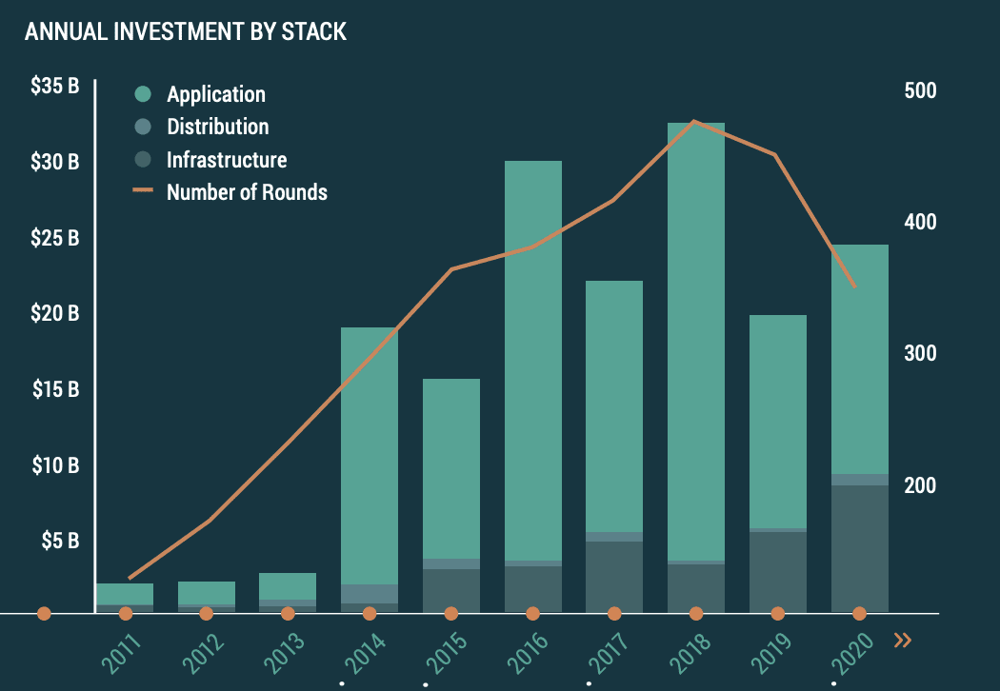

The exploration of outer space has undergone a significant transformation, evolving from a domain dominated exclusively by governmental space agencies such as NASA and Roscosmos to an arena bustling with private enterprises. This shift has opened up a vibrant sector, replete with dynamic investment opportunities as the private sector leverages technological advancements and economies of scale to venture into space-related activities. The transition has not only broadened the scope of space exploration but also redefined its economic potential, collectively termed as the space economy.

The space economy encompasses a wide spectrum of activities beyond traditional exploration, including satellite telecommunications, Earth observation, space tourism, and mining of extraterrestrial resources. These sectors collectively contribute to a burgeoning economic frontier that is rich with investment potential. The interplay between space exploration and financial markets is further enriched by the integration of algorithmic trading—an advanced approach that uses computer algorithms to rapidly analyze and execute trades in financial markets. This convergence is redefining how investors engage with opportunities in the space economy, presenting new avenues for substantial returns.

Algorithmic trading in the context of the space economy offers a unique advantage, reducing the margin for human error while enabling high-speed analysis of large datasets to inform investment decisions. Investors are increasingly keen on leveraging these technologies to capitalize on the opportunities that arise from the innovations and advancements within the space sector. As private companies like SpaceX and Blue Origin spearhead new initiatives in space travel and infrastructure, the possibilities for lucrative investments continue to expand.

This article aims to explore this intersection of space exploration, space economy, and algorithmic trading, shedding light on the diverse opportunities available for investors. By examining these interconnected themes, we aim to provide insights into how modern financial tools and technologies can unlock the potential of the space economy, offering a comprehensive overview of the opportunities that lie beyond our planet.

## Table of Contents

## The Space Economy: A New Frontier for Investment

The space economy has experienced unprecedented growth, establishing itself as a lucrative frontier for investment. This sector encompasses a wide array of industries ranging from satellite communications to burgeoning areas like space tourism. According to a report by the Space Foundation, the global space economy reached $469 billion in 2021, demonstrating a 9% increase from the previous year (Space Foundation, 2022).

**Key Players and Sectors in the Space Economy**

Satellite communications remain a cornerstone of the space economy, offering invaluable services for global communications, weather forecasting, and navigation systems. Companies such as Iridium Communications and SES S.A. lead in this domain, providing satellite solutions crucial for both civilian and defense applications. Their services enable multifaceted applications, including internet access in remote regions and real-time data transfer for various industries.

Space tourism represents a burgeoning sector within the space economy, catalyzing significant investment interest. Pioneered by companies like SpaceX, Blue Origin, and Virgin Galactic, space tourism is transitioning from a futuristic concept to a tangible reality. Virgin Galactic's successful suborbital flights and SpaceX's crewed missions to the International Space Station epitomize the strides made in making space travel accessible.

Space mining and resource utilization also offer promising prospects, with private entities exploring technologies to exploit extraterrestrial resources. Companies like Planetary Resources are researching asteroid mining, which entails extracting valuable minerals from near-Earth objects, presenting a transformative potential for resource scarcity challenges on Earth.

**Technological Advancements Driving Growth**

Advancements in technology play a crucial role in propelling the space economy forward. Innovations in reusable rocket technology, spearheaded by SpaceX's Falcon 9 and Blue Origin's New Shepard, have drastically reduced the costs associated with launching payloads into space. This reduction in launch costs, facilitated by reusability, enhances the economic feasibility of numerous space enterprises.

Moreover, breakthroughs in small satellite technology, such as CubeSats, have democratized access to space. These miniaturized satellites are more cost-effective to produce and launch, enabling startups and smaller nations to partake in space activities previously dominated by established spacefaring countries.

The integration of [artificial intelligence](/wiki/ai-artificial-intelligence) and [machine learning](/wiki/machine-learning) further accelerates the space economy's growth by optimizing satellite data processing and automating complex space operations. These technologies enhance autonomous navigation, predictive maintenance of spacecraft, and data analysis, thereby increasing efficiency and reducing operational costs.

In summary, the space economy's expansion is underpinned by a diverse array of industries and pioneering technological advancements. As new players and innovative technologies continue to emerge, the sector promises to offer a spectrum of investment opportunities poised for future growth.

## Investment Opportunities in Space Exploration

Private companies have profoundly redefined space exploration, heralding a new era marked by innovation and investment opportunities. Among the most notable entities are SpaceX and Blue Origin, which have played pivotal roles in advancing technologies and reducing costs associated with space travel and exploration.

SpaceX, founded by Elon Musk, has achieved several significant milestones, such as the successful deployment of the Falcon 9 rocket and the Dragon spacecraft, designed for NASA's cargo resupply missions. Its Starship project aims to facilitate interplanetary travel, opening potential for commercial missions to the Moon and Mars [1]. Blue Origin, established by Jeff Bezos, focuses on developing reusable launch vehicles, a crucial element for cost-effective space travel. Its New Shepard rocket has been designed to enable suborbital tourism and potentially support infrastructure for lunar expeditions.

Investing in companies like SpaceX and Blue Origin presents both current and future opportunities. Currently, these companies are heavily involved in satellite deployment, driven by a surge in demand for global broadband coverage through mega-constellations, such as SpaceX's Starlink project. Additionally, the nascent space tourism industry offers opportunities, with flights conducted by companies like Virgin Galactic and Blue Origin gaining traction.

Future opportunities lie in the development of space infrastructure, which includes habitats, refueling stations, and mining operations on celestial bodies. The increasing focus on deep space exploration, such as NASA's Artemis program, also spells potential collaboration and contracts for private companies involved in spacecraft development and lunar infrastructure support.

However, investing in space-related ventures is not without its risks. The unique challenges of space exploration—such as high capital requirements, technological uncertainties, and evolving regulatory landscapes—contribute to a complex risk-reward equation. High initial investment costs can deter immediate returns, and technological failures or delays can impact project timelines and financial performance.

Despite these risks, the potential rewards of investing in space exploration are considerable. The sector promises to revolutionize telecommunications, transport, and resource utilization, potentially offering exponential growth prospects. As such, investors are advised to carefully assess the companies' technological capabilities, strategic partnerships, and market positioning. Diversification across different segments of the space economy can also mitigate risks, ensuring a balanced exposure to this rapidly evolving domain.

In summary, while investing in space exploration presents significant challenges, the ongoing advancements and future potential of companies like SpaceX and Blue Origin offer compelling opportunities for those prepared to navigate the complexities of the space economy.

[1] SpaceX official website: https://www.spacex.com/

## The Role of Algo Trading in Space Economy Investments

Algorithmic trading, or algo trading, represents a significant shift in the way investments are managed across various sectors, including the burgeoning space economy. By employing computer algorithms to execute trades at high speed and with precision, investors can navigate complex financial landscapes with greater efficiency. This approach to trading has surged in popularity due to its ability to process large datasets quickly and minimize human error.

In the context of the space economy, algo trading is proving to be a transformative force. The space economy, characterized by rapid technological advancements and diverse investment opportunities, generates substantial volumes of data. From satellite data analytics to space exploration-related stock market fluctuations, investors require sophisticated tools to analyze and react to this information effectively. Algorithmic trading systems, equipped with machine learning capabilities, are adept at identifying patterns and executing trades that capitalize on market movements and emerging trends.

The benefits of algo trading in this sector are manifold. One primary advantage is the reduction of human error. Traditional trading methods are susceptible to mistakes stemming from emotional decision-making or misinterpretations of data. Algorithms, devoid of emotion, consistently execute strategies based on predefined criteria, thereby reducing the likelihood of costly errors. Furthermore, the ability of algorithms to operate continuously without fatigue ensures that investment opportunities are not missed, even across different time zones.

Moreover, algo trading facilitates the swift analysis of vast datasets. In a sector as dynamic as the space economy, quick decision-making is crucial. Algorithms can process and extract valuable insights from a wide range of data sources, including financial reports, market trends, and real-time news, enabling investors to make informed decisions promptly. This capacity for rapid data processing positions algo trading as an essential tool for investors seeking to exploit the complex and fast-evolving opportunities within the space economy.

Overall, the integration of algo trading into space economy investments not only enhances efficiency and accuracy but also empowers investors to engage with this new frontier in a more sophisticated and strategic manner. As the space economy continues to grow, the role of [algorithmic trading](/wiki/algorithmic-trading) is likely to expand, offering innovative ways to harness its potential and navigate its complexities.

## Challenges and Risks in Space Economy Investments

Space economy investments present a unique set of challenges and risks, primarily due to their high costs and the long-term commitment required. Developing technologies such as satellites or spacecraft involves substantial initial investment, with costs extending over several years or even decades. This makes space-related projects susceptible to changing economic conditions, potentially affecting funding and overall feasibility. The uncertain return on investment, driven by the nascent nature of some space market segments, adds another layer of complexity for investors considering these capital-intensive ventures.

Regulatory challenges and geopolitical issues further complicate space economy investments. Space is a domain governed by international laws, like the Outer Space Treaty of 1967, which all countries must adhere to, creating a multifaceted legal landscape. National regulations can vary significantly, affecting the operational latitude of companies involved in space activities. Geopolitical tensions can also influence collaborative international projects, resulting in delays or increased costs. For instance, export controls and restrictions on the transfer of space-related technology across borders can limit collaboration between companies from different nations, impacting timelines and budget considerations.

Technological risks are another critical facet of space economy investments. Space debris and satellite collisions constitute major threats. The proliferation of satellites, particularly in low Earth orbit (LEO), has increased the likelihood of collisions, which could potentially cause damage to functioning space assets. Such incidents can lead to the loss of valuable equipment and service disruptions. The Kessler Syndrome further exacerbates this risk, describing a scenario where the density of objects in LEO is high enough that collisions could trigger a cascade of subsequent collisions, exponentially increasing space debris.

Moreover, the rapid technological advancements required to maintain a competitive edge in space technology present ongoing challenges. Companies must continually innovate while managing the risks associated with deploying untested technologies. Given these challenges, investing in the space economy necessitates a comprehensive understanding of not only financial and operational risks but also a strategic approach to regulatory and technological hurdles. Recognizing these challenges can aid investors in making informed decisions, balancing potential rewards with the inherent risks.

## Conclusion

The space economy presents a compelling landscape of both opportunities and risks for investors. As this sector evolves, it offers diverse investment avenues, ranging from satellite communications and space tourism to deep space exploration and satellite-based data services. The potential for exponential growth is significant, as technological advancements continue to drive innovation and bring down costs, making space more accessible to private entities and new market entrants.

However, this burgeoning sector is accompanied by considerable risks. The high costs of entry, uncertain regulatory environments, and geopolitical tensions create a complex landscape for investments. Investors must also consider technological risks, such as the proliferation of space debris and the potential for satellite collisions, which could have significant repercussive effects on the entire industry.

To navigate these challenges and harness the potential of the space economy, investors are encouraged to diversify their portfolios. Diversification not only spreads risk across different ventures and sectors but also allows investors to capitalize on a broader array of growth opportunities. Additionally, the integration of modern financial technologies, such as algorithmic trading, can be instrumental in managing risk and optimizing investment strategies. These technologies enable investors to process vast amounts of data quickly, reducing human error and identifying underlying patterns and trends that may not be immediately apparent through traditional analysis.

Looking ahead, the future of space exploration holds promise for untapped markets and innovations. As the field continues to mature, investors who remain informed about technological advancements and regulatory changes will be better positioned to seize emerging opportunities. Preparing for these developments involves constant evaluation of both the market and the technologies driving it. By leveraging modern financial tools and maintaining a diversified approach, investors can potentially mitigate risks and maximize returns in this exciting frontier.

## References & Further Reading

[1]: Space Foundation (2022). ["The Space Report 2022"](https://www.spacefoundation.org/wp-content/uploads/2023/06/SpaceFoundation_2022-Annual-Report_Final_web.pdf).

[2]: ["Advances in Financial Machine Learning"](https://www.amazon.com/Advances-Financial-Machine-Learning-Marcos/dp/1119482089) by Marcos Lopez de Prado

[3]: ["The Space Barons: Elon Musk, Jeff Bezos, and the Quest to Colonize the Cosmos"](https://www.amazon.com/Space-Barons-Bezos-Colonize-Cosmos/dp/1610398297) by Christian Davenport

[4]: Kessler, Donald J., and Burton G. Cour-Palais. (1978). ["Collision Frequency of Artificial Satellites: The Creation of a Debris Belt."](https://archive.org/details/kesslercollisionfrequency1978) Journal of Geophysical Research.

[5]: "Outer Space Treaty." United Nations Office for Outer Space Affairs (UNOOSA). [Link to Treaty](https://www.unoosa.org/oosa/en/ourwork/spacelaw/treaties/introouterspacetreaty.html).

[6]: "Reusable Launch Vehicle Technology." NASA. [Link to NASA Article](https://ntrs.nasa.gov/api/citations/20220002635/downloads/NASA_LV_Reuse_final_1.pdf).

[7]: Wood, Matt. (2013). ["Algorithmic Trading and DMA"](https://www.goodreads.com/book/show/7346602-algorithmic-trading-and-dma) by Barry Johnson

[8]: Davenport, Christian. (2018). ["The Space Barons: Elon Musk, Jeff Bezos, and the Quest to Colonize the Cosmos"](https://www.amazon.com/Space-Barons-Bezos-Colonize-Cosmos/dp/1610398297).

[9]: "SpaceX official website." [SpaceX](https://www.spacex.com/).