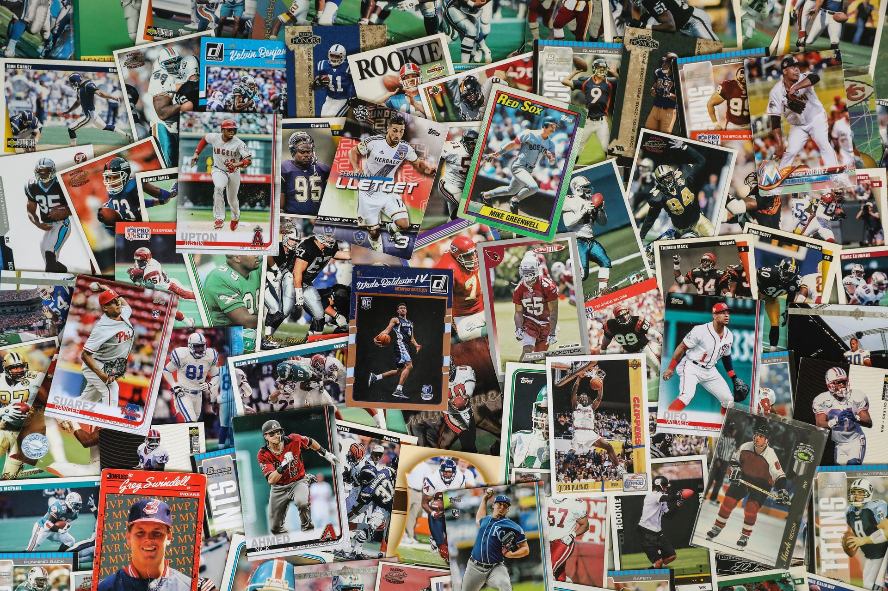

## Table of Contents

## What are sports trading cards and why are they considered an investment?

Sports trading cards are small pieces of cardboard or other materials that feature pictures of athletes, usually from sports like baseball, basketball, football, or hockey. These cards often include information about the player, like their stats and achievements. People collect these cards because they enjoy the sport or the specific players. Some cards are rare or feature special designs, which makes them more valuable.

People consider sports trading cards as an investment because their value can increase over time. If a player becomes very famous or wins important awards, their cards can become more valuable. Also, if a card is rare or in perfect condition, it can be worth a lot of money. Some people buy and sell these cards hoping to make a profit, similar to investing in stocks or other items that might grow in value.

## How does the value of sports trading cards appreciate over time?

The value of sports trading cards can go up over time because of a few reasons. One big reason is how famous or successful the player on the card becomes. If a player wins awards, breaks records, or becomes a legend in their sport, more people want their cards. This demand makes the cards more valuable. Also, if a card is really old or hard to find, it can be worth more money. People who collect cards like having rare ones, so they are willing to pay more for them.

Another reason the value of sports trading cards can increase is because of the condition of the card. Cards that are in perfect shape, with no bends, scratches, or marks, are worth more than cards that are damaged. Collectors pay a lot of money for cards that look brand new, even if they are old. Over time, as fewer and fewer cards stay in perfect condition, the ones that do can become very valuable. This is why people who invest in sports trading cards take good care of them and sometimes even get them graded by experts to prove how good their condition is.

## What are the key factors to consider when starting to invest in sports trading cards?

When you start investing in sports trading cards, it's important to know about the players and the sport. Pick players who are doing well or might become big stars. This can make their cards more valuable later. Also, think about how rare the card is. Cards that are hard to find can be worth a lot more money. Look for special editions or cards that were only made for a short time.

Another thing to think about is the condition of the card. Cards that look new and have no damage are worth more than ones that are bent or scratched. You might want to get your cards graded by experts. They will check the card and give it a score. A high score can make your card worth more money. It's also good to keep learning about the market. Prices can change, so stay updated on what cards are popular and what they are selling for.

Lastly, think about how much money you want to spend. Sports trading cards can be a fun hobby, but they can also be a big investment. Decide how much you can afford to spend and stick to that. It's also a good idea to buy cards you like, not just ones you think will make money. That way, even if the card doesn't go up in value, you still enjoy having it.

## How can beginners identify valuable sports trading cards?

To identify valuable sports trading cards, beginners should first look at the player on the card. Cards of players who are famous, have won awards, or have broken records are often worth more. For example, cards of legends like Michael Jordan or Babe Ruth can be very valuable. Also, pay attention to rookie cards, which are the first cards made of a player. These can be especially valuable if the player goes on to have a great career.

Another important thing to check is how rare the card is. Some cards are made in limited numbers or have special designs that make them harder to find. These rare cards can be worth a lot more money. You can find out if a card is rare by looking at the card's details or by doing some research online. Also, the condition of the card matters a lot. Cards that look new and have no damage are worth more than ones that are bent or scratched. You might want to get your cards graded by experts to see how good their condition is. A high grade can make your card worth even more.

## What are the most popular sports for trading card investments?

The most popular sports for trading card investments are baseball, basketball, and football. Baseball cards have been around for a long time and are very popular. People love collecting cards of famous players like Babe Ruth or modern stars like Mike Trout. Basketball cards are also very popular, especially cards of players like Michael Jordan or LeBron James. These players are legends, and their cards can be worth a lot of money. Football cards are another big hit, with cards of players like Tom Brady or Patrick Mahomes being very valuable.

These sports are popular for trading card investments because they have a lot of fans and a long history. People who love these sports enjoy collecting cards of their favorite players. Also, the value of these cards can go up if the players do well or become famous. This makes them a good choice for people who want to invest in trading cards.

## How do grading and authentication impact the value of sports trading cards?

Grading and authentication are really important for the value of sports trading cards. When a card is graded, experts look at it closely and give it a score based on how good its condition is. A high grade means the card looks almost new, with no bends or scratches. This makes the card worth more money because collectors want cards that are in perfect shape. Authentication is when experts check if the card is real. Fake cards can be a big problem, so knowing a card is real can make it more valuable.

Getting a card graded and authenticated can make a big difference in its price. For example, if two cards are the same but one has a high grade and is authenticated, it will be worth a lot more than the other one. This is because collectors trust that the card is in great condition and is not a fake. So, if you want to invest in sports trading cards, it's a good idea to get them graded and authenticated to help their value go up.

## What are some common strategies for building a sports trading card investment portfolio?

When building a sports trading card investment portfolio, one common strategy is to focus on rookie cards of promising athletes. Rookie cards are the first cards made of a player, and if that player goes on to have a great career, the card can become very valuable. It's important to do research and pick players who are likely to do well in their sport. Another strategy is to look for rare or limited edition cards. These cards are harder to find, so they can be worth more money. You can find out about rare cards by checking the card's details or by looking up information online.

Another approach is to diversify your portfolio by investing in cards from different sports and eras. This can help spread out the risk because if one type of card goes down in value, others might go up. It's also a good idea to keep an eye on the condition of your cards. Cards that are in perfect condition are worth more, so you might want to get them graded by experts. Grading can show how good the condition of a card is, and a high grade can make the card worth more money. By using these strategies, you can build a strong sports trading card investment portfolio.

## How can investors stay updated on market trends and new releases in the sports trading card industry?

To stay updated on market trends and new releases in the sports trading card industry, investors should regularly check sports card websites and forums. Websites like Beckett, PSA, and Cardboard Connection often have news about new card releases, player updates, and market trends. Forums and social media groups can also be great places to learn from other collectors and investors. People share their thoughts and what they are seeing in the market, which can help you understand what is happening.

Another way to stay informed is by subscribing to newsletters and following industry experts on social media. Many companies and experts send out regular updates about new cards, upcoming events, and changes in the market. Following them can give you quick and easy information. Also, attending card shows and events can be helpful. At these events, you can see new cards in person, talk to other collectors, and learn about what is popular and valuable right now. By using these methods, you can stay on top of the sports trading card market.

## What are the risks associated with investing in sports trading cards?

Investing in sports trading cards can be risky because their value can go up and down a lot. The value of a card depends on how well the player does in their sport. If a player gets injured or doesn't play well, their card can lose value. Also, the market for sports trading cards can change quickly. What is popular one year might not be popular the next year. This means you might buy a card thinking it will go up in value, but it could go down instead.

Another risk is that some cards can be fake. If you buy a card that turns out to be a fake, it won't be worth anything. This is why it's important to get cards graded and authenticated by experts, but even that can cost money. Plus, taking care of cards to keep them in good condition can be hard work. If a card gets damaged, its value can drop a lot. So, while sports trading cards can be a fun and exciting investment, there are a lot of things that can go wrong.

## How do advanced collectors leverage technology and data analytics in their investment strategies?

Advanced collectors use technology and data analytics to make smarter choices about which sports trading cards to buy. They use apps and websites to track the prices of cards over time. This helps them see trends and figure out which cards are going up in value. They also use data to look at how well players are doing in their sports. If a player is playing great, their card might go up in value, so collectors use this information to pick the best cards to invest in. By using technology, collectors can make better decisions and hopefully make more money.

Another way advanced collectors use technology is by getting their cards graded and authenticated online. They can send their cards to grading companies and get a report back on the card's condition and if it's real. This can be done quickly and easily with technology. Also, collectors use social media and online forums to talk to other collectors and share information. They can learn about new card releases and what other people are buying. This helps them stay up-to-date and make the best choices for their investment portfolios.

## What role do auctions and online marketplaces play in the sports trading card investment market?

Auctions and online marketplaces are really important for people who invest in sports trading cards. They are places where people can buy and sell cards easily. Auctions let people bid on cards, and the highest bidder gets the card. This can make cards more valuable because people are willing to pay a lot to win the auction. Online marketplaces, like eBay, let people list their cards for sale and set a price. This makes it easy for collectors to find and buy the cards they want. Both auctions and online marketplaces help set the prices of cards because they show what people are willing to pay.

These platforms also help people learn about the market. By looking at what cards are selling for on auctions and online marketplaces, collectors can see which cards are popular and going up in value. This information helps them decide which cards to buy and sell. Also, these places bring together collectors from all over the world, so there are more people buying and selling cards. This can make the market more active and help card values grow. So, auctions and online marketplaces are key parts of the sports trading card investment world.

## How can expert investors diversify their sports trading card investments to mitigate risk?

Expert investors can diversify their sports trading card investments by buying cards from different sports, like baseball, basketball, and football. This way, if one sport's cards go down in value, the cards from other sports might still be worth a lot. They also look at cards from different times, like old cards from the past and new cards of current players. This helps spread out the risk because different kinds of cards can be popular at different times.

Another way to diversify is by investing in cards of different players, not just the most famous ones. This means buying cards of up-and-coming players who might become stars, as well as cards of players who are already well-known. By having a mix of cards, investors can protect themselves if one player's value drops. It's also smart to keep some money in other types of investments, like stocks or real estate, so that all their money isn't tied up in sports trading cards.

## References & Further Reading

[1]: [Bergstra, J., Bardenet, R., Bengio, Y., & Kégl, B. (2011). "Algorithms for Hyper-Parameter Optimization."](https://dl.acm.org/doi/10.5555/2986459.2986743) Advances in Neural Information Processing Systems 24.

[2]: ["Advances in Financial Machine Learning"](https://www.amazon.com/Advances-Financial-Machine-Learning-Marcos/dp/1119482089) by Marcos Lopez de Prado

[3]: ["Evidence-Based Technical Analysis: Applying the Scientific Method and Statistical Inference to Trading Signals"](https://www.amazon.com/Evidence-Based-Technical-Analysis-Scientific-Statistical/dp/0470008741) by David Aronson

[4]: ["Machine Learning for Algorithmic Trading"](https://github.com/stefan-jansen/machine-learning-for-trading) by Stefan Jansen

[5]: ["Quantitative Trading: How to Build Your Own Algorithmic Trading Business"](https://www.amazon.com/Quantitative-Trading-Build-Algorithmic-Business/dp/1119800064) by Ernest P. Chan