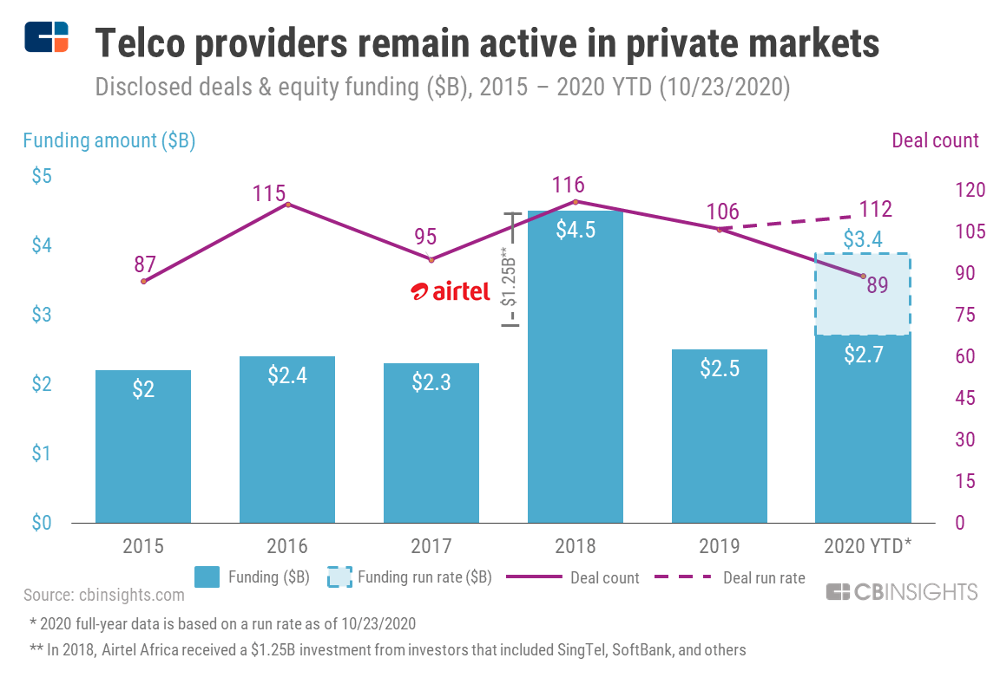

## Table of Contents

## What is the telecommunications industry?

The telecommunications industry is all about sending information from one place to another. It includes things like phone calls, text messages, and internet services. Companies in this industry build and manage networks that help people communicate with each other, no matter where they are. These networks can use wires, like fiber optic cables, or wireless signals, like those used by cell phones.

This industry is very important because it helps people stay connected. Whether you're calling your family, sending an email at work, or watching a video online, you're using telecommunications. The industry is always changing and improving, with new technologies making it easier and faster to share information. This means that companies need to keep up with these changes to provide the best services to their customers.

## Why is investing in telecommunications important?

Investing in telecommunications is important because it helps keep people connected. As more people use phones, the internet, and other ways to communicate, the need for good telecommunications services grows. When you invest in this industry, you help build and improve the networks that make all this communication possible. This means better phone calls, faster internet, and new ways to share information, which can make life easier and more enjoyable for everyone.

Also, the telecommunications industry is always changing and growing. New technologies, like 5G and better internet services, are always being developed. By investing in telecommunications, you support these new ideas and help them become a reality. This can lead to new jobs and more economic growth, which is good for everyone. Plus, as the industry grows, the value of your investment can grow too, making it a smart choice for the future.

## What are the major segments of the telecommunications industry?

The telecommunications industry has several big parts. One part is the network providers. These are the companies that build and run the networks that [carry](/wiki/carry-trading) phone calls, texts, and internet data. They use things like cell towers, fiber optic cables, and satellite systems to make sure people can communicate with each other. Some big network providers are companies like AT&T, Verizon, and T-Mobile.

Another important part of the industry is the service providers. These companies use the networks built by the network providers to offer services to customers. This can include phone plans, internet packages, and TV services. Companies like Comcast and Charter Communications are examples of service providers. They focus on making sure customers get the services they need and are happy with what they're paying for.

There are also equipment manufacturers, which are companies that make the technology used in telecommunications. This includes smartphones, routers, and other devices that help people use the networks. Companies like Apple, Samsung, and Cisco are part of this segment. They are always working on new gadgets and technologies to make communication easier and better.

## How has the telecommunications industry evolved over the past decade?

Over the past ten years, the telecommunications industry has changed a lot. One big change is the move to faster and better internet. This started with 4G and now we have 5G, which makes the internet even faster. This means people can use their phones and other devices to do more things online, like watching videos or playing games. Another change is that more people are using their phones for everything, not just calls and texts. This has made companies focus on giving customers more data and better internet services.

Another big change is how companies are working together more. Instead of just building their own networks, some companies are sharing them with others. This helps them save money and reach more people. Also, the way people pay for services has changed. Now, there are more choices, like paying for just the data you use or getting a plan that includes everything. This makes it easier for people to find a plan that fits their needs. Overall, the industry is always trying to find new ways to make communication better and easier for everyone.

## What are the key drivers of growth in the telecommunications sector?

The main thing pushing the telecommunications sector to grow is the need for faster and better internet. More people are using their phones and other devices to do things online, like watching videos, playing games, and working from home. This means companies need to keep improving their networks to handle all this data. The move to 5G is a big part of this, as it makes the internet much faster and can handle more devices at once. This helps people do more online and makes their lives easier.

Another big driver of growth is new technology. Companies are always working on new gadgets and ways to communicate. This includes things like better smartphones, smart home devices, and even self-driving cars that need to stay connected. As these new technologies become popular, they create more demand for good telecommunications services. This pushes companies to keep investing in their networks and services, which helps the whole industry grow.

## What are the risks associated with investing in telecommunications?

Investing in telecommunications can be risky because the industry changes a lot. New technologies come out all the time, and if a company doesn't keep up, it can lose customers. For example, if a company is slow to switch to 5G, people might choose another company that offers faster internet. Also, the cost of building and maintaining networks is very high. If a company spends too much money on this and doesn't make enough back from customers, it can lose money. This makes it harder for the company to grow and could affect the value of your investment.

Another risk is that the rules and laws about telecommunications can change. Governments might decide to put new rules in place that make it harder for companies to operate or raise their costs. For instance, if a new law makes it more expensive to use certain parts of the network, a company's profits could go down. This can make the stock price go down too, which is bad for investors. So, while there are good reasons to invest in telecommunications, it's important to know about these risks before you decide to put your money in.

## How do government regulations impact the telecommunications industry?

Government rules can have a big effect on the telecommunications industry. These rules can change how companies do business and how much it costs them. For example, if the government makes new rules about how companies can use certain parts of the network, it might cost more money to follow these rules. This can make it harder for companies to make a profit. Also, rules about competition can change how companies work together or how they can charge for their services. If the rules make it harder for companies to work together, it might slow down the growth of new technologies.

Another way government rules impact the industry is by deciding who can use certain parts of the airwaves. The airwaves, or spectrum, are important for wireless communication. If the government gives more spectrum to one company, it can help that company grow faster. But if the government makes it hard to get more spectrum, it can slow down the whole industry. Rules about privacy and security can also affect how companies handle customer data. If these rules are strict, companies might have to spend more money to keep data safe, which can affect their profits and how much they can invest in new technology.

## What are the latest technological advancements affecting telecommunications investments?

The latest big thing in telecommunications is 5G technology. 5G makes the internet much faster and can handle a lot more devices at the same time. This means people can do more things online, like watching high-quality videos or playing games without waiting. Companies are spending a lot of money to build 5G networks because they know it will make their customers happy. But it's also a big risk because it costs a lot, and if they don't do it right, they might lose money. Investors need to think about how well a company is doing with 5G before they put their money in.

Another important advancement is the use of [artificial intelligence](/wiki/ai-artificial-intelligence) (AI) and [machine learning](/wiki/machine-learning) in telecommunications. These technologies help companies understand what their customers want and need. For example, AI can help a company figure out the best times to send out new offers or how to fix problems with the network faster. This can make customers happier and help the company save money. But like with 5G, using AI and machine learning costs money, so investors need to see if the company is using these technologies in a smart way that will help them grow.

## How can one analyze the financial health of a telecommunications company?

To figure out how healthy a telecommunications company is, you need to look at its financial statements. The first thing to check is the company's revenue, which is how much money it makes from selling its services. If the revenue is growing, that's a good sign because it means more people are using the company's services. But you also need to look at the company's expenses, like the cost of building and maintaining networks. If these costs are going up faster than revenue, the company might not be doing well. Another important thing to check is the company's profit, which is what's left after all the costs are paid. If the profit is growing, it means the company is doing a good job of making money.

Another way to analyze the financial health is by looking at the company's debt. Telecommunications companies often need to borrow money to build big networks, so it's normal for them to have some debt. But you need to see if the company can pay back this debt. One way to check this is by looking at the company's cash flow, which is the money coming in and going out. If the company has enough cash coming in to pay its bills and debt, that's a good sign. You can also look at the company's balance sheet to see its assets and liabilities. If the company has more assets than liabilities, it's in a good financial position. By looking at these things, you can get a good idea of how healthy a telecommunications company is.

## What are the competitive dynamics within the telecommunications industry?

The telecommunications industry is very competitive because there are many companies trying to get customers to use their services. Big companies like AT&T, Verizon, and T-Mobile are always trying to offer the best phone and internet plans to attract more people. They do this by building better networks, like 5G, and offering deals that give customers more data or faster internet for less money. Smaller companies also try to compete by focusing on certain areas or types of customers, like businesses or people in rural areas. This competition makes companies work hard to keep their customers happy and to find new ways to grow.

Another part of the competition is how companies work together. Sometimes, big companies share their networks with smaller ones to reach more people. This can help the smaller companies grow, but it can also make it harder for them to stand out. At the same time, companies are always trying to come up with new technologies and services to stay ahead. For example, a company might start offering TV services along with phone and internet to give customers a better deal. All of this competition pushes companies to keep improving and finding new ways to serve their customers.

## How do global economic conditions influence telecommunications investments?

Global economic conditions can have a big impact on investments in telecommunications. When the economy is doing well, people and businesses have more money to spend on things like phone plans and internet services. This means more customers for telecommunications companies, which can lead to more profits. When companies make more money, they can invest in building better networks and coming up with new technologies. Investors see this and might want to put their money into these growing companies because they think it will be a good investment.

On the other hand, when the economy is not doing well, people might not have as much money to spend on telecommunications services. This can make it harder for companies to grow and make profits. If companies are making less money, they might not be able to invest as much in new technology or expanding their networks. This can make investors worried about putting their money into these companies because they might not see as much growth or profit. So, the health of the global economy plays a big role in how much and where people choose to invest in telecommunications.

## What strategies should be considered for long-term investment in telecommunications?

When thinking about long-term investment in telecommunications, it's important to focus on companies that are good at keeping up with new technology. Companies that are working on 5G and other new ways to make the internet faster and better are a good choice. These companies are likely to grow as more people want to use their services. Also, look for companies that are smart about how they spend their money. If a company is good at building networks without spending too much, it can make more profit and be a better investment. It's also a good idea to invest in companies that have a lot of customers and are known for giving good service. These companies are more likely to keep their customers happy and keep growing.

Another strategy is to think about how the company is doing in different parts of the world. Some companies might be doing well in one country but not as well in another. If a company is growing in many places, it can be a safer investment because it's not just relying on one market. Also, pay attention to what the government is doing. If the government is helping the telecommunications industry grow by making good rules, it can be a good time to invest. But if the government is making it hard for companies to grow, it might be riskier. By looking at these things, you can make smarter choices about where to put your money for the long term.

## References & Further Reading

[1]: Bergstra, J., Bardenet, R., Bengio, Y., & Kégl, B. (2011). ["Algorithms for Hyper-Parameter Optimization."](https://papers.nips.cc/paper/4443-algorithms-for-hyper-parameter-optimization) Advances in Neural Information Processing Systems 24.

[2]: ["Advances in Financial Machine Learning"](https://www.amazon.com/Advances-Financial-Machine-Learning-Marcos/dp/1119482089) by Marcos Lopez de Prado

[3]: ["Evidence-Based Technical Analysis: Applying the Scientific Method and Statistical Inference to Trading Signals"](https://www.amazon.com/Evidence-Based-Technical-Analysis-Scientific-Statistical/dp/0470008741) by David Aronson

[4]: ["Machine Learning for Algorithmic Trading"](https://github.com/stefan-jansen/machine-learning-for-trading) by Stefan Jansen

[5]: ["Quantitative Trading: How to Build Your Own Algorithmic Trading Business"](https://www.amazon.com/Quantitative-Trading-Build-Algorithmic-Business/dp/1119800064) by Ernest P. Chan