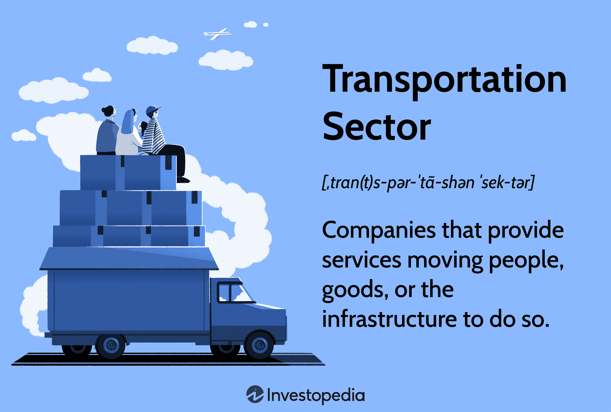

## Table of Contents

## What is the transportation industry?

The transportation industry is all about moving people and goods from one place to another. It includes different ways of traveling like cars, buses, trains, airplanes, and ships. This industry is very important because it helps connect different parts of the world, making it easier for people to visit family, go on vacations, or get to work. It also helps businesses by moving products from where they are made to where they are sold.

There are many jobs in the transportation industry, like drivers, pilots, and ship captains. These workers make sure that everyone and everything gets to their destinations safely and on time. The industry also includes companies that build and maintain vehicles and infrastructure like roads, railways, and airports. Without the transportation industry, our daily lives would be much harder because we rely on it for so many things.

## Why is investing in the transportation industry important?

Investing in the transportation industry is important because it helps the economy grow. When we put money into transportation, we make it easier for businesses to move their goods and for people to travel. This can create new jobs and help businesses sell more products. For example, if a company can ship its products faster and cheaper, it can make more money and maybe even hire more workers. This is good for everyone because it means more people have jobs and more money to spend.

Another reason to invest in transportation is to keep up with new technology and changes. The world is always changing, and new inventions like electric cars and high-speed trains are becoming more popular. By investing in these new technologies, we can make transportation cleaner and more efficient. This is important for the environment because it can help reduce pollution. Plus, it can make traveling more enjoyable and convenient for everyone. So, investing in transportation is not just good for the economy, but also for our planet and our daily lives.

## What are the different sectors within the transportation industry that one can invest in?

There are several different sectors within the transportation industry that people can invest in. One sector is automotive, which includes companies that make cars, trucks, and motorcycles. These companies can range from big names that everyone knows to smaller ones that focus on electric or self-driving vehicles. Another sector is airlines, which includes companies that operate airplanes for passengers and cargo. Investing in airlines can be exciting because it's all about helping people travel around the world.

Another sector is rail transportation, which includes companies that run trains for passengers and freight. This can be a good investment because trains are often a reliable way to move lots of people and goods at once. There's also the maritime sector, which includes shipping companies that use boats and ships to transport goods across oceans. This is important for international trade because many things we use every day come from other countries.

Lastly, there's the logistics and freight sector, which includes companies that plan and manage the movement of goods. These companies make sure that products get from the factory to the store on time. Investing in logistics can be a smart move because it's all about making sure the supply chain works smoothly. Each of these sectors offers different opportunities for investors, depending on what they're interested in and what they think will grow in the future.

## What are the current trends affecting investment in the transportation industry?

One big trend affecting investment in the transportation industry is the move toward sustainability. More and more people want to use transportation that is good for the environment. This means that companies making electric cars, like Tesla, are getting a lot of attention from investors. Also, airlines and shipping companies are trying to use less fuel and find cleaner ways to move people and goods. This trend is important because it's not just about making money, but also about helping the planet.

Another trend is the growth of technology in transportation. Self-driving cars, drones, and smart logistics systems are becoming more common. Investors are interested in companies that are using these new technologies because they can make transportation safer and more efficient. For example, a company that uses drones to deliver packages might be a good investment because it can save time and money. This trend shows how the transportation industry is always changing and trying to find new ways to do things better.

Lastly, there's a trend toward better connectivity and global trade. With more people and businesses wanting to connect with others around the world, there's a bigger need for transportation. This means that companies involved in international shipping or building new airports and railways can be good investments. This trend is important because it shows how transportation helps bring people and economies closer together.

## How does government policy impact investment in transportation?

Government policy can really change how people invest in transportation. When governments make rules or give money to support certain types of transportation, it can make those areas more attractive to investors. For example, if the government gives tax breaks for companies that make electric cars, more people might want to invest in those companies because they can save money. Also, if the government builds new roads or railways, it can make it easier for transportation companies to do their jobs, which can be good for investors too.

On the other hand, government policies can also make investing in transportation harder. If the government puts strict rules on how much pollution vehicles can make, it might cost companies more money to follow those rules. This can scare some investors away because they might not want to take the risk. Also, if the government doesn't spend enough money on things like roads and airports, it can make it harder for transportation companies to grow, which can make investors less interested in putting their money into those companies. So, government policy can have a big effect on where and how people choose to invest in transportation.

## What are the risks associated with investing in the transportation sector?

Investing in the transportation sector can be risky because it depends a lot on things like the economy and fuel prices. If the economy is doing well, people might travel more and buy more cars, which is good for transportation companies. But if the economy is not doing well, people might not have enough money to travel or buy new vehicles, which can hurt these companies. Also, if the price of fuel goes up a lot, it can make it more expensive for airlines and shipping companies to move people and goods. This can make their profits go down, which is bad for investors.

Another risk is that the transportation industry is always changing with new technology. Companies that don't keep up with new inventions like electric cars or self-driving vehicles might lose customers to companies that do. This can make their stock prices go down. Also, there are risks from things like accidents or bad weather that can stop transportation and hurt a company's profits. So, investors need to think about these risks and decide if they are okay with them before putting their money into the transportation sector.

## How can one start investing in transportation stocks or funds?

To start investing in transportation stocks or funds, you first need to open a brokerage account. This is like a special bank account where you can buy and sell stocks. You can find many online brokers that let you open an account easily. Once your account is set up, you can start looking for transportation companies or funds to invest in. You might want to look at big car makers, airlines, or shipping companies. You can also find mutual funds or exchange-traded funds (ETFs) that focus on transportation. These funds let you invest in a bunch of transportation companies at once, which can be a good way to spread out your risk.

After you've picked some stocks or funds, you need to decide how much money to invest. It's important to only invest money you can afford to lose, because investing always has some risk. You can buy stocks or funds through your brokerage account, usually with just a few clicks. It's a good idea to keep an eye on your investments and see how they're doing. You might want to read news about the companies you've invested in or check the performance of your funds. This way, you can make smart choices about whether to keep your money in those investments or try something different.

## What are some successful case studies of investments in the transportation industry?

One successful investment in the transportation industry is Tesla. A few years ago, people started investing in Tesla because they believed in electric cars and the company's leader, Elon Musk. Tesla made cars that were not only good for the environment but also fun to drive. As more people wanted electric cars, Tesla's stock price went up a lot. People who invested early made a lot of money. Tesla showed that investing in new technology and companies that care about the planet can be a good idea.

Another good example is the investment in Amazon's logistics and delivery system. Amazon started as an online store, but it grew by building its own way to ship things quickly to customers. They used planes, trucks, and even drones to make sure packages got to people fast. Investors who saw how important fast shipping was for Amazon made a lot of money. Amazon's focus on logistics helped it become one of the biggest companies in the world. This shows that investing in how companies move their products can be very successful.

## What role does technology play in the future of transportation investments?

Technology is going to be a big part of the future of transportation investments. New inventions like electric cars, self-driving vehicles, and drones are changing how we move people and things. Investors are excited about companies that work on these new technologies because they can make transportation cleaner and more efficient. For example, if a company makes a better battery for electric cars, it could help the environment and make more money for investors. This shows that technology can help the planet and make good investments at the same time.

Another way technology will change transportation investments is through smart systems that help plan and manage how goods are moved. Companies that use technology to make their supply chains work better can save time and money. This can be a good investment because it helps businesses run smoothly. Also, technology like high-speed trains and new ways to travel in cities can make life easier for people. Investors who see these changes coming and put their money into the right companies can do well in the future.

## How do global economic factors influence transportation investment opportunities?

Global economic factors can really change how people invest in transportation. When the world economy is doing well, people and businesses have more money to spend on travel and buying new cars. This can make transportation companies like airlines, car makers, and shipping companies do better. More people traveling means more tickets sold for airlines, and more goods being bought means more trucks and ships needed to move them. So, when the economy is good, it can be a great time to invest in transportation because these companies can make more money.

But when the world economy is not doing well, it can be harder for transportation companies. If people don't have as much money, they might not travel as much or buy new cars. This can hurt airlines and car makers because they sell fewer tickets and cars. Also, if the price of oil goes up, it can make it more expensive for airlines and shipping companies to move people and goods. This can make their profits go down, which might make investors less interested in putting their money into transportation. So, global economic factors can make a big difference in whether investing in transportation is a good idea or not.

## What are the advanced financial instruments available for sophisticated investors in the transportation sector?

Sophisticated investors in the transportation sector can use advanced financial instruments like futures and options to manage their investments. Futures contracts let investors agree to buy or sell something, like oil or airline stocks, at a set price in the future. This can help them protect against big changes in prices. Options give investors the right, but not the obligation, to buy or sell an asset at a certain price before a certain date. This can be useful for making money if they think the price of a transportation stock will go up or down.

Another advanced instrument is the use of exchange-traded funds (ETFs) that focus on specific parts of the transportation industry. These ETFs can track the performance of a group of transportation companies, like airlines or shipping firms. This lets investors spread their risk across many companies instead of betting on just one. Also, sophisticated investors might use leveraged ETFs, which can increase both gains and losses, making them riskier but potentially more rewarding. By using these advanced tools, investors can try to make the most of their money in the transportation sector.

## How can investors assess the sustainability and long-term viability of transportation investments?

Investors can assess the sustainability and long-term viability of transportation investments by looking at how companies are doing with the environment. They should check if the company is working on things like electric cars or other ways to make less pollution. Companies that care about the planet and are trying to use less fuel or cleaner energy are usually good for the long run. Also, investors should see if the company is keeping up with new technology. If a company is making self-driving cars or using drones to deliver things, it might be a good investment because these new ideas can help the company grow and stay strong in the future.

Another way to check the long-term viability is to look at the company's money situation. Investors should see if the company is making good profits and if it has enough money to keep going even if things get tough. It's also important to think about how the economy is doing around the world. If the economy is strong, people will travel more and buy more cars, which is good for transportation companies. But if the economy is weak, it might be harder for these companies to do well. By looking at these things, investors can get a better idea of whether a transportation investment will last a long time and be good for the environment.

## What are the challenges and considerations?

Algorithmic trading in the transportation sector offers numerous benefits, yet it presents several challenges that investors need to consider. A deep understanding of technical indicators is crucial for successful [algorithmic trading](/wiki/algorithmic-trading). These indicators, such as moving averages, relative strength index (RSI), and Bollinger Bands, help identify market trends and inform trading decisions. Mastering these indicators requires substantial knowledge and experience, which can be a barrier for novice traders.

Constant monitoring is another critical requirement. The dynamic nature of algorithmic trading means that market conditions can change swiftly, necessitating real-time adjustments to trading strategies. This constant vigilance ensures that algorithms remain effective and aligned with current market dynamics. However, maintaining this level of oversight can be resource-intensive and demands significant technological infrastructure.

External factors also play a significant role in influencing the transportation sector and its stock prices. Geopolitical events, such as trade tensions, conflicts, or changes in international policies, can lead to market [volatility](/wiki/volatility-trading-strategies). For instance, a sudden increase in oil prices due to geopolitical instability can impact transportation costs, thereby affecting company profits and stock valuations. Investors must stay informed about global events and adjust their strategies accordingly.

Thorough research and effective risk management are essential components of algorithmic trading. Investors should conduct comprehensive analyses of historical data, company performance, and prevailing market conditions before deploying algorithms. Risk management strategies, such as stop-loss orders and diversification, help mitigate potential losses. Diversification, for example, involves spreading investments across different sectors or asset classes, thereby reducing overall risk.

In the context of risk management, a basic approach is to employ the Value at Risk (VaR) model, which quantifies potential losses over a given timeframe with a certain confidence level. The formula for VaR is given by:

$$
\text{VaR} = \mu \cdot W - Z \cdot \sigma \cdot W
$$

where:
- $\mu$ is the expected return,
- $W$ is the value of the portfolio,
- $Z$ is the Z-score corresponding to the confidence level,
- $\sigma$ is the standard deviation of the portfolio returns.

Implementing effective risk management techniques like the VaR model helps investors safeguard their capital while enabling more strategic decision-making in the volatile transportation sector.

In summary, while algorithmic trading offers enhanced efficiency and potential profitability, it demands a high level of expertise, constant vigilance, and comprehensive risk management strategies. Investors must remain cognizant of external market influencers and commit to continuous learning and adaptation to maximize success in algorithmic trading within the transportation sector.

## References & Further Reading

[1]: Bergstra, J., Bardenet, R., Bengio, Y., & Kégl, B. (2011). ["Algorithms for Hyper-Parameter Optimization."](https://dl.acm.org/doi/10.5555/2986459.2986743) Advances in Neural Information Processing Systems 24.

[2]: ["Advances in Financial Machine Learning"](https://www.amazon.com/Advances-Financial-Machine-Learning-Marcos/dp/1119482089) by Marcos Lopez de Prado

[3]: ["Evidence-Based Technical Analysis: Applying the Scientific Method and Statistical Inference to Trading Signals"](https://www.amazon.com/Evidence-Based-Technical-Analysis-Scientific-Statistical/dp/0470008741) by David Aronson

[4]: ["Machine Learning for Algorithmic Trading"](https://github.com/stefan-jansen/machine-learning-for-trading) by Stefan Jansen

[5]: ["Quantitative Trading: How to Build Your Own Algorithmic Trading Business"](https://www.amazon.com/Quantitative-Trading-Build-Algorithmic-Business/dp/1119800064) by Ernest P. Chan