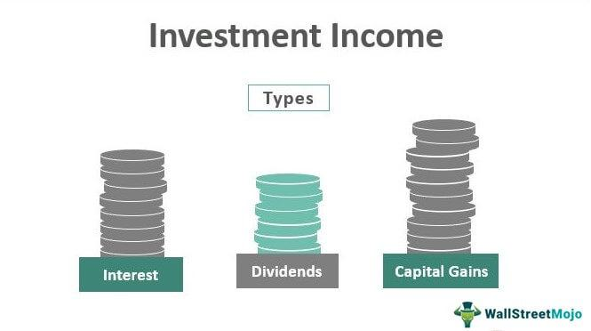

Understanding the different forms of income is crucial for effective financial planning and strategic tax management. Investment income, in particular, plays a pivotal role in shaping an individual’s or institution’s fiscal landscape. It encompasses gains from assets such as stocks, bonds, and real estate, and is subject to a unique set of tax rules that distinguish it from regular income. This article provides an analysis of various types of investment income, focusing on how they are taxed differently.

Key examples of investment income include dividends from stockholdings, interest earned from savings or bonds, and capital gains realized from the sale of assets. Each of these income streams is subject to specific tax treatments, influencing the overall return on investment. For instance, capital gains may be taxed at different rates depending on how long the asset was held, distinguishing between short-term and long-term gains. Similarly, dividends can be classified as qualified or non-qualified, affecting their tax rate.



Algorithmic trading, involving sophisticated computer algorithms to automate trading processes, adds an additional layer of complexity to the taxation of investment income. The high frequency and volume of trades can alter the nature of income generated, potentially impacting its tax liability. Understanding these nuances is essential for investors using algorithmic trading strategies to ensure compliance and enhance profitability.

By the conclusion of this guide, readers will gain a comprehensive understanding of the facets that constitute investment income, including the unique considerations that algorithmic trading brings to the table. This knowledge is vital for not only preserving wealth but also maximizing returns within the regulatory framework.

## Table of Contents

## What is Investment Income?

Investment income arises from the profits earned on various investments. It serves as a critical component in financial planning and tax management, representing the returns generated from deploying capital in different assets. These returns can be categorized into several key sources that each have distinct characteristics and tax implications, necessitating a nuanced understanding for effective planning and growth.

Interest income is one of the primary forms of investment income. It is earned when funds are deposited in savings accounts, certificates of deposit, or bonds. The interest paid by the institution (e.g., banks or government entities) to the investor can be seen as a reward for the use of their money over a specified period. For instance, an individual might have a savings account with a 2% annual [interest rate](/wiki/interest-rate-trading-strategies). If the account balance is $10,000, the annual interest income generated would be: 

$$
\text{Interest Income} = \text{Principal} \times \text{Rate} = \$10,000 \times 0.02 = \$200
$$

Dividends represent another significant source of investment income. These are payments distributed to shareholders out of a corporation’s profits or reserves. Dividends are typically issued by established companies with a history of stable earnings. The income generated from dividends can provide investors with a consistent revenue stream, adding to their overall financial returns.

Capital gains are realized when an asset, such as stocks or real estate, is sold for a higher price than the purchase cost. Capital gains can be classified into short-term or long-term, depending on the holding period of the asset before sale. Real estate transactions, stock sales, and mutual fund distributions are common instances where capital gains occur, necessitating specific strategies to optimize profitability and tax efficiency. For example, if an individual buys shares for $5,000 and sells them three years later for $8,000, the capital gain is:

$$
\text{Capital Gain} = \text{Selling Price} - \text{Purchase Price} = \$8,000 - \$5,000 = \$3,000
$$

Understanding interest, dividends, and capital gains is crucial for effective tax planning. Properly managing these sources of income can lead to substantial financial growth while minimizing tax liabilities, thus enhancing the overall investment strategy's efficiency and effectiveness.

## Types of Investment Income

Investment income involves earnings derived from various sources where funds have been invested, rather than from employment or business operational profits. Here are the principal types of investment income:

1. **Interest Income:** This type of income is generated from savings accounts, certificates of deposit (CDs), or bonds. Financial institutions pay interest income for the use of deposited funds. For instance, bonds are loans from investors to corporations or governments, and in return, these entities pay interest over time. Interest can be calculated using the simple interest formula:
$$
   \text{Simple Interest} = P \times r \times t

$$
   where $P$ is the principal amount, $r$ is the rate of interest, and $t$ is time in years.

2. **Dividends:** These are distributions of a portion of a company's earnings to its shareholders and can be in the form of cash payments or additional shares. Dividends are typically paid out by well-established companies, and their frequency (monthly, quarterly, annually) often depends on the company's policies and profitability. Investments in dividend-paying stocks or mutual funds are common sources of dividend income.

3. **Rental Income:** This is income earned by property owners who lease real estate to tenants. Rental income is influenced by factors such as location, property type, and market demand. This type of income can provide a steady cash flow and often includes payments for leasing residential or commercial spaces.

4. **Capital Gains:** These gains occur when assets such as stocks, bonds, or real estate are sold for more than their purchase price. Capital gains can be classified as short-term or long-term, depending on the holding period of the asset. The formula for capital gains is:
$$
   \text{Capital Gain} = \text{Selling Price} - \text{Purchase Price}

$$
   Long-term capital gains typically benefit from lower tax rates compared to short-term gains which are taxed as regular income.

5. **Royalties:** Income in this category comes from intellectual property, such as patents, trademarks, or copyrights. Royalties are paid to owners by those who wish to use or sell the intellectual property and are typically based on a percentage of revenue generated from such use.

Understanding these types of investment income is crucial for individual and corporate financial management, influencing decisions in portfolio diversification, tax planning, and investment strategies.

## Tax Treatment of Investment Income

Investment income often stands out in financial planning due to its preferential tax treatment compared to regular earnings. This distinct treatment can significantly influence the net returns from various investments, making it crucial for investors to understand these nuances. 

### Long-Term vs. Short-Term Capital Gains

A core aspect of investment income taxation is the differentiation between long-term and short-term capital gains. Long-term capital gains, defined as profits from the sale of an asset held for more than one year, benefit from lower tax rates. In the United States, for example, long-term capital gains tax rates are generally 0%, 15%, or 20%, depending on the taxpayer's income level and filing status. This contrasts sharply with short-term capital gains, which apply to assets held for a year or less and are taxed at ordinary income tax rates, which can be substantially higher.

### Dividend Income Taxation

Dividend income presents another layer of complexity in investment taxation. Dividends are often categorized into qualified and non-qualified dividends, each with distinct tax implications. Qualified dividends, which meet specific criteria such as being paid by a U.S. corporation or a qualifying foreign entity and held for a certain period, are taxed at the same favorable rates as long-term capital gains. Non-qualified dividends, on the other hand, do not meet these criteria and are taxed at ordinary income tax rates.

The preferential treatment of investment income arises from a policy perspective aimed at encouraging investment and saving, acknowledging the economic risks investors take and facilitating wealth accumulation over time. Understanding these distinctions and their implications is essential for investors seeking to optimize their tax liabilities and enhance their investment returns. Knowing how different types of investment income are taxed can significantly affect financial decisions and long-term financial planning strategies.

## Algorithmic Trading and Tax Implications

Algorithmic trading employs computerized systems to execute trades at high speeds, utilizing complex algorithms that are designed to analyze market conditions, identify profitable opportunities, and complete transactions instantaneously. This method of trading can significantly enhance efficiency and returns, but it also introduces unique tax implications due to the frequency and [volume](/wiki/volume-trading-strategy) of trades performed.

The classification of income generated through [algorithmic trading](/wiki/algorithmic-trading) is pivotal in determining tax treatment. Income may be categorized as ordinary income or capital gains, each subject to different tax rates. The primary distinction lies in the holding period of the securities involved. In algorithmic trading, the holding period is often shorter, leading to income being classified as short-term capital gains, which are taxed at ordinary income rates, often higher than long-term capital gains.

For instance, the U.S. Internal Revenue Service (IRS) taxes short-term capital gains at the same rate as regular income, which can range from 10% to 37%, depending on the total taxable income. In contrast, long-term capital gains are taxed at reduced rates, which are typically 0%, 15%, or 20%. This differential underscores the importance of understanding how frequent trading can impact tax liabilities.

Moreover, the mark-to-market rule can apply to traders who qualify as professional traders or elect the Section 475(f) mark-to-market accounting. This rule requires traders to treat all positions as if they were sold at fair market value at the end of the tax year, which can simplify tax reporting but may also increase taxable income as unrealized gains are recognized each year.

To illustrate the potential tax effects in algorithmic trading, consider a scenario in which a trader executes 1,000 trades within a year, each resulting in modest profits. These trades, if held for less than a year, are subject to short-term capital gains tax. Suppose each trade generates an average gain of $100. The total gain for the year would be $100,000, which, if taxed at the highest marginal rate of 37%, results in a tax liability of $37,000.

```
# Example of a simple python function to calculate short-term tax
def calculate_short_term_tax(total_gain, tax_rate):
    return total_gain * tax_rate

# Example usage
total_gain = 1000 * 100  # 1000 trades each with $100 gain
tax_rate = 0.37  # 37% tax rate for short-term capital gains
tax_liability = calculate_short_term_tax(total_gain, tax_rate)
print(f'Tax Liability: ${tax_liability}')
```

Effective record-keeping and strategic tax planning are vital in algorithmic trading. Utilizing software to meticulously track each transaction and considering entities like trading LLCs can offer advantages in managing tax burdens. Additionally, staying informed of changing tax regulations and their implications on trading strategies aids in maintaining compliance and optimizing profitability in the fast-paced world of algorithmic trading.

## Examples of Tax Treatment

When assessing the tax treatment of investment income, understanding the distinctions among capital gains, dividends, and trading scenarios becomes crucial for investors aiming to optimize their tax liabilities.

**Capital Gains Tax Rates: Short-Term vs. Long-Term**

Capital gains occur when an asset is sold for more than its purchase price. The duration for which an asset is held before being sold determines whether the gain is characterized as short-term or long-term, which directly affects its tax rate. Short-term capital gains are typically realized on assets held for one year or less and are taxed at the individual's ordinary income tax rate, which can be as high as 37% in the United States. Conversely, long-term capital gains benefit from reduced tax rates, ranging from 0% to 20%, depending on the taxpayer's income level. This preferential treatment incentivizes longer holding periods for investments.

**Dividend Income Taxation**

Dividend income is divided into qualified and non-qualified dividends, impacting how they are taxed. Qualified dividends, which generally come from domestic corporations and certain qualified foreign entities, benefit from the same tax rates as long-term capital gains. Non-qualified dividends, however, are taxed at the ordinary income tax rates. For dividends to be classified as qualified, an investor must meet specific criteria, including a minimum holding period. For instance, stock must be held for more than 60 days during the 121-day period that begins 60 days before the ex-dividend date.

**Real-Life Tax Treatment Scenarios**

1. *Traditional Trading Example*: An individual holding a stock for over a year sells it, realizing a gain. This gain is taxed at the long-term capital gains rate. If the same individual receives a qualified dividend from a different stock investment, this dividend will also be taxed at a favorable rate.

2. *Algorithmic Trading Example*: A trader employs algorithmic strategies, resulting in high trading frequency. Given the short holding periods often associated with algorithmic trading, many of these transactions may result in short-term capital gains, subject to higher tax rates. However, algorithmic trading can involve sophisticated strategies to offset gains with losses, potentially reducing overall taxable income. Employing loss harvesting strategies could be a mechanism for reducing the tax impact in such high-frequency trading contexts.

Investors utilizing both traditional and algorithmic trading strategies must navigate these tax implications carefully. Recognizing whether gains or dividends qualify for lower tax treatment can significantly enhance post-tax returns. Strategically planning asset sales and understanding eligibility for qualified dividends are crucial for improving tax efficiency and compliance.

## FAQs on Investment Income Taxation

### Common Myths about Tax-Free Investment Income

A common misconception is that certain types of investment incomes, such as municipal bond interest, are completely tax-free. While it's true that interest from municipal bonds is typically exempt from federal income tax, it may still be subject to state and local taxes, unless the bond was issued in the state of the investor's residence. Additionally, some may believe that reinvested dividends are not taxable. However, dividends are generally taxable in the year they are received, even if they are automatically reinvested in buying more shares.

### Clarifications about What Qualifies as Investment Income

Investment income is primarily comprised of interest, dividends, and capital gains. Interest income includes returns from savings accounts, certificates of deposit (CDs), and bonds. Dividends are distributions of a company's earnings to shareholders and can be taxed at a lower rate if they are qualified. Capital gains arise when you sell an investment for more than its purchase price. It's important to note that capital gains are categorized as short-term or long-term, with different tax treatments.

Rental income from real estate properties and royalties from intellectual property also qualify as investment income. Both are subject to taxation, though certain deductions may apply, such as property taxes and maintenance costs for rental income.

### Steps to Optimize Tax Savings While Maximizing Investment Returns

Achieving optimal tax savings while maximizing returns involves several strategies. First, consider holding investments such as stocks or mutual funds for longer than a year to benefit from lower long-term capital gains tax rates. Diversification across different asset classes can also minimize risk and optimize returns.

Utilizing tax-advantaged accounts like Roth IRAs or 401(k)s can greatly aid in savings. Contributions to these accounts may be tax-deductible, and the investments can grow tax-free or tax-deferred until withdrawal. Furthermore, tax-loss harvesting is a valuable strategy where investors sell underperforming financial assets to offset capital gains in other investments, thereby reducing total taxable gains.

Lastly, consulting a tax advisor can provide tailored strategies specific to individual investment profiles, ensuring compliance and maximizing tax efficiency.

## Conclusion

Effective management of investment income requires a keen understanding of its various forms and associated tax treatments. Investors must differentiate between types of income such as interest, dividends, capital gains, and royalties to effectively plan for taxes. Each type carries distinct tax implications that can impact overall financial strategy.

Algorithmic trading introduces unique complexities and opportunities in tax planning. This method, which leverages advanced algorithms to execute high-frequency, high-volume trades, requires careful attention to its tax effects. Traders must consider the classification of income as either ordinary or capital gains, as well as the regulatory landscape that can influence reporting and compliance requirements.

Proper tax planning and compliance not only uphold legal obligations but also optimize investment returns. Strategies may include timing asset sales to align with favorable tax rates, harnessing tax-advantaged accounts, and using available deductions and credits. By diligently navigating the tax treatment of investment income, investors can enhance their financial outcomes while minimizing liabilities.

## References & Further Reading

[1]: ["Investment Taxation Explained"](https://www.kiplinger.com/taxes/what-is-net-investment-income-tax) — A comprehensive guide on different types of investment income and their tax implications, available on Investopedia.

[2]: Hull, J. C. (2012). ["Options, Futures, and Other Derivatives"](https://www.semanticscholar.org/paper/Options%2C-Futures%2C-and-Other-Derivatives-Hull/89bdee500c8623864fc9eb7a471546aa713acc44) — A textbook covering various aspects of financial derivatives and trading strategies, including algorithmic trading considerations.

[3]: Poterba, J. M., & Samwick, A. A. (2003). ["Taxation and Household Portfolio Composition: US Evidence from the 1980s and 1990s."](https://economics.mit.edu/sites/default/files/publications/1-s2.0-S0047272701001682-main.pdf) — Published by the National Bureau of Economic Research, this paper explores the impact of taxation on investment choices.

[4]: ["Algorithmic Trading and DMA: An Introduction to Direct Access Trading Strategies"](https://archive.org/details/algorithmictradi0000john) by Barry Johnson — A foundational book on algorithmic trading strategies and their implications. 

[5]: Graham, J. R. (2003). ["Taxes and Corporate Finance: A Review"](https://www.jstor.org/stable/1262738) — A research paper from The Review of Financial Studies discussing the influence of taxes on corporate financial strategies.