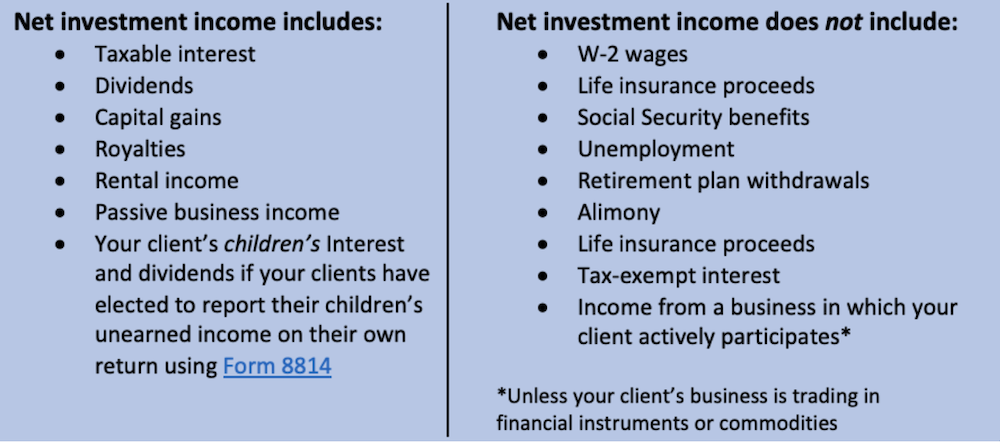

## Table of Contents

## What is investment income?

Investment income is the money you earn from your investments. This can include things like interest from savings accounts, dividends from stocks, and rental income from properties. When you put your money into different types of investments, they can grow and give you extra money over time.

There are different types of investment income, and each one works a bit differently. For example, if you have money in a savings account, the bank pays you interest. If you own stocks, you might get dividends, which are payments companies make to their shareholders. If you own a rental property, the rent you collect from tenants is also a type of investment income. Understanding these different sources can help you make smarter choices about where to put your money.

## What are the common types of investment income?

Investment income can come from many places. One common type is interest, which you earn from money in savings accounts or bonds. When you keep money in a bank, they pay you interest for using your money. Bonds work a bit like loans to companies or the government, and they pay you interest over time. Another type is dividends, which are payments you get from owning stocks. When a company makes a profit, it might share some of that profit with its shareholders by paying dividends.

Another type of investment income is rental income. If you own a property and rent it out, the money you get from tenants is your rental income. This can be a steady source of money if you have good tenants. Capital gains are also a type of investment income. This is the profit you make when you sell an investment for more than you paid for it. For example, if you buy a stock for $100 and later sell it for $150, the $50 difference is your capital gain.

Understanding these different types of investment income can help you plan better. Some types, like interest and dividends, can give you regular payments. Others, like capital gains, might give you a big payout when you decide to sell. Knowing how each type works can help you choose the best investments for your goals.

## How is interest income generated and taxed?

Interest income is the money you earn from keeping your money in places like savings accounts, certificates of deposit (CDs), or bonds. When you put money into these types of accounts or investments, the bank or the issuer of the bond pays you interest. This is their way of saying thank you for letting them use your money. The amount of interest you earn depends on the interest rate and how much money you have invested. For example, if you have $1,000 in a savings account with a 1% annual interest rate, you'll earn $10 in interest over a year.

When it comes to taxes, interest income is usually considered taxable income. This means you have to report it on your tax return and pay taxes on it. The tax rate you pay on interest income can depend on your total income and the tax laws in your country. In the United States, for example, interest income is taxed as ordinary income, which means it's added to your other income and taxed at your regular income tax rate. Some types of interest, like from certain municipal bonds, might be tax-free, but most interest you earn will be taxed. It's a good idea to keep track of your interest income and understand how it affects your taxes.

## What is dividend income and how is it taxed?

Dividend income is money you get from owning stocks in a company. When a company makes a profit, it might decide to share some of that profit with its shareholders. This sharing of profit is called a dividend. If you own shares in the company, you'll get a part of the dividend based on how many shares you own. Dividends can be paid out regularly, like every three months, or they might be paid out less often.

When it comes to taxes, dividend income is usually taxable. In the United States, how much tax you pay on dividends depends on whether they are qualified or non-qualified dividends. Qualified dividends are taxed at a lower rate, similar to the tax rates for long-term capital gains. Non-qualified dividends, on the other hand, are taxed as ordinary income, which means they are added to your other income and taxed at your regular income tax rate. It's important to know the difference because it can affect how much tax you owe on your dividend income.

## Can you explain capital gains and their tax implications?

Capital gains are the profits you make when you sell something for more than what you paid for it. This can happen with many types of investments, like stocks, real estate, or even collectibles. For example, if you bought a stock for $50 and later sold it for $75, the $25 difference is your capital gain. Capital gains can be short-term or long-term. Short-term capital gains are for investments you held for one year or less, while long-term capital gains are for investments you held for more than a year.

When it comes to taxes, capital gains are treated differently based on how long you held the investment. Short-term capital gains are taxed as ordinary income, which means they are added to your other income and taxed at your regular income tax rate. This can be higher than the rate for long-term capital gains. Long-term capital gains, on the other hand, have lower tax rates. In the United States, these rates can be 0%, 15%, or 20%, depending on your total income. Understanding these differences can help you plan when to sell your investments to minimize your tax bill.

## What are the tax treatments for rental income?

Rental income is the money you get from renting out a property. When you own a house or an apartment and someone pays you to live there, that money is your rental income. But, you also have to pay taxes on it. The government sees this money as part of your income, so you need to report it on your tax return. The amount of tax you pay on rental income depends on your total income and the tax laws where you live.

You can also take some expenses off your rental income to lower your taxes. These expenses include things like repairs, property taxes, insurance, and even the cost of traveling to check on your property. If these expenses are more than your rental income, you might even be able to use the extra to lower your taxes on other income. It's important to keep good records of all your rental income and expenses, so you can report them correctly and maybe save some money on taxes.

## How does tax on royalties work?

Royalties are payments you get when someone uses your work, like a book, a song, or an invention. If you earn royalties, you need to pay taxes on them. The government sees royalties as income, so you have to report them on your tax return. The amount of tax you pay on royalties depends on your total income and the tax laws where you live.

You can also take some expenses off your royalty income to lower your taxes. These expenses might include things like the cost of creating your work or any legal fees to protect it. If your expenses are more than your royalties, you might even be able to use the extra to lower your taxes on other income. It's a good idea to keep good records of all your royalties and expenses, so you can report them correctly and maybe save some money on taxes.

## What are the differences between short-term and long-term capital gains tax rates?

Capital gains are the profits you make when you sell something for more than you paid for it. There are two types of capital gains: short-term and long-term. Short-term capital gains are for things you owned for one year or less. These are taxed as ordinary income, which means they get added to your other income and are taxed at your regular income tax rate. This can be a higher tax rate, depending on how much money you make overall.

Long-term capital gains are for things you owned for more than a year. These have lower tax rates than short-term gains. In the United States, the tax rates for long-term capital gains can be 0%, 15%, or 20%, depending on your total income. This means if you hold onto your investments for longer than a year, you might pay less in taxes when you sell them. Knowing the difference between these two types of gains can help you plan when to sell your investments to save on taxes.

## How can tax-advantaged accounts like IRAs and 401(k)s affect investment income taxation?

Tax-advantaged accounts like IRAs and 401(k)s can help you save on taxes when you invest your money. When you put money into these accounts, you might get a tax break right away. For example, with a traditional IRA or 401(k), you can deduct the money you put in from your income, which means you pay less in taxes that year. The money in these accounts can grow without being taxed until you take it out, which can help your investments grow faster.

When you take money out of these accounts, the tax rules change. With a traditional IRA or 401(k), you pay taxes on the money when you withdraw it, usually when you're retired. But with a Roth IRA or 401(k), you pay taxes on the money you put in, but you don't pay taxes when you take it out. This can be a big advantage if you think you'll be in a higher tax bracket when you retire. Understanding how these accounts work can help you plan your investments and save on taxes.

## What are the tax implications of reinvesting dividends and capital gains?

When you reinvest dividends and capital gains, you're using the money you earn from your investments to buy more of the same investment. Even though you're not getting the money in your pocket right away, the tax rules still apply. If you get dividends, you have to pay taxes on them in the year you receive them, whether you reinvest them or not. The same goes for capital gains. If you sell an investment and make a profit, you have to pay taxes on that profit in the year you sell it, even if you use that profit to buy more investments.

Reinvesting can be a smart way to grow your investments over time because it lets you buy more without adding extra money. But remember, you still have to report the dividends and capital gains on your taxes every year. This means you need to keep good records of all your reinvestments so you can report them correctly. Knowing how reinvesting affects your taxes can help you plan better and maybe save some money in the long run.

## How do international investments affect your tax situation?

When you invest in other countries, it can change how you pay taxes. If you earn money from investments outside your home country, you might have to pay taxes in both places. This is called double taxation. But many countries have agreements called tax treaties that help prevent this. These treaties can lower the taxes you pay or let you claim a credit for the taxes you paid in the other country. It's important to know the tax rules of both countries where you have investments to make sure you're not paying more taxes than you need to.

Keeping track of your international investments can be tricky because of the different tax laws. You need to report any income from these investments on your tax return in your home country. This includes things like interest, dividends, and capital gains from foreign stocks, bonds, or real estate. Sometimes, you might also have to fill out special forms to report your foreign assets. Talking to a tax professional who knows about international taxes can help you understand how to handle your taxes correctly and maybe save some money.

## What advanced strategies can be used to minimize taxes on investment income?

One way to lower your taxes on investment income is to use tax-advantaged accounts like IRAs and 401(k)s. When you put money into these accounts, you can get a tax break right away. For example, with a traditional IRA or 401(k), you can deduct the money you put in from your income, which means you pay less in taxes that year. The money in these accounts can grow without being taxed until you take it out, which can help your investments grow faster. When you retire and start taking money out, you'll pay taxes on it then. But if you use a Roth IRA or 401(k), you pay taxes on the money you put in, but you don't pay taxes when you take it out. This can be a big advantage if you think you'll be in a higher tax bracket when you retire.

Another strategy is to pay attention to how long you hold onto your investments. If you hold onto them for more than a year, you'll pay the lower long-term capital gains tax rate when you sell them. This can save you a lot of money compared to selling them after holding them for less than a year, which would be taxed at your regular income tax rate. You can also use a strategy called tax-loss harvesting. This means selling investments that have gone down in value to offset the taxes on your gains. By selling these losing investments, you can reduce your taxable income, which can lower your taxes. Keeping good records and understanding the tax rules can help you use these strategies to save on taxes and keep more of your investment income.

## What is Investment Income?

Investment income arises from the profits earned on various investments. It serves as a critical component in financial planning and tax management, representing the returns generated from deploying capital in different assets. These returns can be categorized into several key sources that each have distinct characteristics and tax implications, necessitating a nuanced understanding for effective planning and growth.

Interest income is one of the primary forms of investment income. It is earned when funds are deposited in savings accounts, certificates of deposit, or bonds. The interest paid by the institution (e.g., banks or government entities) to the investor can be seen as a reward for the use of their money over a specified period. For instance, an individual might have a savings account with a 2% annual [interest rate](/wiki/interest-rate-trading-strategies). If the account balance is $10,000, the annual interest income generated would be: 

$$
\text{Interest Income} = \text{Principal} \times \text{Rate} = \$10,000 \times 0.02 = \$200
$$

Dividends represent another significant source of investment income. These are payments distributed to shareholders out of a corporation’s profits or reserves. Dividends are typically issued by established companies with a history of stable earnings. The income generated from dividends can provide investors with a consistent revenue stream, adding to their overall financial returns.

Capital gains are realized when an asset, such as stocks or real estate, is sold for a higher price than the purchase cost. Capital gains can be classified into short-term or long-term, depending on the holding period of the asset before sale. Real estate transactions, stock sales, and mutual fund distributions are common instances where capital gains occur, necessitating specific strategies to optimize profitability and tax efficiency. For example, if an individual buys shares for $5,000 and sells them three years later for $8,000, the capital gain is:

$$
\text{Capital Gain} = \text{Selling Price} - \text{Purchase Price} = \$8,000 - \$5,000 = \$3,000
$$

Understanding interest, dividends, and capital gains is crucial for effective tax planning. Properly managing these sources of income can lead to substantial financial growth while minimizing tax liabilities, thus enhancing the overall investment strategy's efficiency and effectiveness.

## What are the types of investment income?

Investment income involves earnings derived from various sources where funds have been invested, rather than from employment or business operational profits. Here are the principal types of investment income:

1. **Interest Income:** This type of income is generated from savings accounts, certificates of deposit (CDs), or bonds. Financial institutions pay interest income for the use of deposited funds. For instance, bonds are loans from investors to corporations or governments, and in return, these entities pay interest over time. Interest can be calculated using the simple interest formula:
$$
   \text{Simple Interest} = P \times r \times t

$$
   where $P$ is the principal amount, $r$ is the rate of interest, and $t$ is time in years.

2. **Dividends:** These are distributions of a portion of a company's earnings to its shareholders and can be in the form of cash payments or additional shares. Dividends are typically paid out by well-established companies, and their frequency (monthly, quarterly, annually) often depends on the company's policies and profitability. Investments in dividend-paying stocks or mutual funds are common sources of dividend income.

3. **Rental Income:** This is income earned by property owners who lease real estate to tenants. Rental income is influenced by factors such as location, property type, and market demand. This type of income can provide a steady cash flow and often includes payments for leasing residential or commercial spaces.

4. **Capital Gains:** These gains occur when assets such as stocks, bonds, or real estate are sold for more than their purchase price. Capital gains can be classified as short-term or long-term, depending on the holding period of the asset. The formula for capital gains is:
$$
   \text{Capital Gain} = \text{Selling Price} - \text{Purchase Price}

$$
   Long-term capital gains typically benefit from lower tax rates compared to short-term gains which are taxed as regular income.

5. **Royalties:** Income in this category comes from intellectual property, such as patents, trademarks, or copyrights. Royalties are paid to owners by those who wish to use or sell the intellectual property and are typically based on a percentage of revenue generated from such use.

Understanding these types of investment income is crucial for individual and corporate financial management, influencing decisions in portfolio diversification, tax planning, and investment strategies.

## References & Further Reading

[1]: ["Investment Taxation Explained"](https://www.kiplinger.com/taxes/what-is-net-investment-income-tax) — A comprehensive guide on different types of investment income and their tax implications, available on Investopedia.

[2]: Hull, J. C. (2012). ["Options, Futures, and Other Derivatives"](https://www.semanticscholar.org/paper/Options%2C-Futures%2C-and-Other-Derivatives-Hull/89bdee500c8623864fc9eb7a471546aa713acc44) — A textbook covering various aspects of financial derivatives and trading strategies, including algorithmic trading considerations.

[3]: Poterba, J. M., & Samwick, A. A. (2003). ["Taxation and Household Portfolio Composition: US Evidence from the 1980s and 1990s."](https://economics.mit.edu/sites/default/files/publications/1-s2.0-S0047272701001682-main.pdf) — Published by the National Bureau of Economic Research, this paper explores the impact of taxation on investment choices.

[4]: ["Algorithmic Trading and DMA: An Introduction to Direct Access Trading Strategies"](https://archive.org/details/algorithmictradi0000john) by Barry Johnson — A foundational book on algorithmic trading strategies and their implications. 

[5]: Graham, J. R. (2003). ["Taxes and Corporate Finance: A Review"](https://www.jstor.org/stable/1262738) — A research paper from The Review of Financial Studies discussing the influence of taxes on corporate financial strategies.