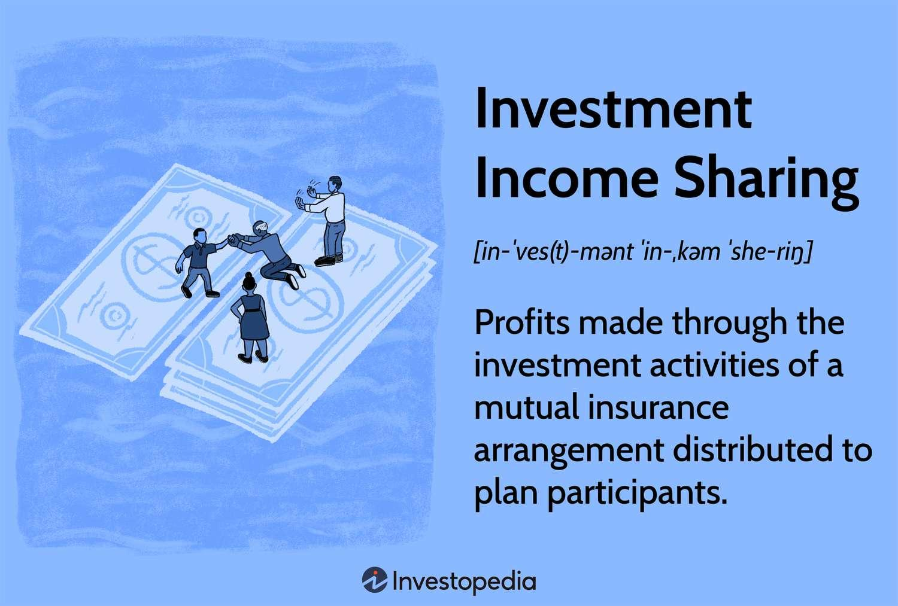

## Table of Contents

## What is investment income sharing?

Investment income sharing is when a group of people or a company shares the money they earn from their investments. This can happen in different ways, like when a company gives some of its profits to its employees or when a group of friends decide to invest together and split the earnings.

This idea can be helpful because it lets more people enjoy the benefits of investing without having to do all the work themselves. It can also make people feel more connected to the company or group they are part of, because they all share in the success. However, it's important to have clear rules about how the money will be shared to avoid any disagreements.

## How does investment income sharing work?

Investment income sharing happens when a group of people or a company decides to split the money they make from their investments. For example, if a company makes money from stocks or real estate, they might decide to share some of that money with their employees. This can make employees feel more connected to the company because they get a piece of the success. It's like a team effort where everyone gets to enjoy the rewards.

To make investment income sharing work well, it's important to have clear rules about how the money will be divided. Everyone needs to agree on these rules from the start to avoid any confusion or disagreements later on. For instance, friends who invest together might decide to split the earnings equally, or they might decide to give a bigger share to the person who put in more money. Clear rules help keep things fair and make sure everyone knows what to expect.

## What are the benefits of participating in an investment income sharing plan?

Participating in an investment income sharing plan can help you earn extra money without having to do all the work of investing by yourself. When a company or a group of people invest together and share the earnings, you get a part of the profits. This can be a good way to grow your money, especially if you don't know much about investing or if you don't have a lot of money to start with.

Another benefit is that it can make you feel more connected to the group or company you're part of. When everyone shares in the success, it feels like a team effort. This can make you feel more valued and motivated, whether you're working at a company that shares its profits with employees or investing with friends. It's a way to build stronger relationships and work together towards common goals.

## What are the potential risks associated with investment income sharing?

One risk of investment income sharing is that there might be disagreements about how to split the money. Even if everyone agrees on the rules at the start, people can change their minds later or feel that the rules are unfair. This can cause arguments and hurt feelings, especially if the investments do really well or really badly. It's important to have clear rules and talk openly about them to try and avoid these problems.

Another risk is that the investments might not do well. If the investments lose money, everyone who is sharing the income will lose money too. This can be hard, especially if people were counting on that money for something important. It's good to remember that all investments have risks, and sharing income doesn't change that. It's wise to only invest money you can afford to lose and to understand the risks before you start.

Lastly, there can be legal and tax issues to think about. Depending on where you live, there might be special rules about how to report and pay taxes on shared investment income. If these rules are not followed, it could lead to problems with the law. It's a good idea to talk to a lawyer or a tax expert to make sure everything is done right and to avoid any surprises.

## Who can participate in investment income sharing?

Investment income sharing is open to anyone who agrees to the rules of the plan. This can include employees of a company that shares its profits, friends or family members who decide to invest together, or even members of a community group. As long as everyone understands and agrees to how the money will be shared, almost anyone can take part.

However, there are some things to think about before joining an investment income sharing plan. For example, if you are part of a company's profit-sharing plan, you usually need to be an employee of that company. If you're investing with friends or family, you'll need to agree on the rules and make sure everyone is comfortable with the plan. It's also important to know the laws and tax rules in your area, as these can affect who can participate and how the income is shared.

## How is income distributed in an investment income sharing scheme?

In an investment income sharing scheme, the money earned from investments is split among the people who are part of the plan. This can be done in different ways depending on what everyone agrees to. For example, a company might decide to give a part of its profits to its employees. The company could choose to divide the money equally among all employees, or they might give more to people who have been with the company longer or who have higher positions. Friends or family members who invest together might decide to split the earnings based on how much money each person put in, or they might choose to share it equally no matter what.

It's important to have clear rules about how the income will be shared so everyone knows what to expect. These rules should be agreed on by everyone at the start to avoid any confusion or disagreements later on. For instance, if a group decides to share the income equally, they need to make sure everyone understands that this means everyone gets the same amount, no matter how much they invested. If the rules are not clear, it can lead to arguments and hurt feelings, especially if the investments do really well or really badly. Having open conversations and written agreements can help keep things fair and smooth.

## What are the legal and regulatory considerations for investment income sharing?

When you take part in investment income sharing, you need to think about the laws and rules that might affect it. Different places have different rules about how to share money from investments. For example, if you are part of a company's profit-sharing plan, there might be special laws about how to report that money for taxes. You might need to fill out certain forms or follow specific rules to make sure you are doing everything right. It's a good idea to talk to a lawyer or a tax expert to understand these rules and make sure you don't get into trouble.

Also, if you are investing with friends or family, you should know about any legal agreements you might need. For example, you might need a written contract that explains how the money will be shared. This can help prevent disagreements later on. Some places also have rules about how many people can be part of an investment group and how much money each person can invest. Knowing these rules can help you stay on the right side of the law and keep your investment income sharing plan running smoothly.

## How do taxes affect investment income sharing?

When you share income from investments, taxes can play a big role. The money you earn from investments is usually considered taxable income. This means you have to report it on your tax return and pay taxes on it. Depending on where you live, there might be special rules about how to report and pay taxes on shared investment income. For example, if you are part of a company's profit-sharing plan, the company might have to withhold some money for taxes before they give you your share. It's important to understand these rules so you don't get any surprises when it's time to pay your taxes.

Talking to a tax expert can help you figure out how taxes will affect your investment income sharing plan. They can tell you how much money you might have to pay in taxes and help you fill out the right forms. If you are investing with friends or family, you might need to agree on who will be responsible for handling the taxes. Clear communication and planning can help make sure everyone knows what to expect and that you are all following the tax laws correctly.

## What are the differences between investment income sharing and traditional investment?

Investment income sharing and traditional investment are different in how people earn and share money. In traditional investment, a person or a company puts money into things like stocks, real estate, or bonds, hoping to make a profit. The investor keeps all the earnings or losses themselves. It's like playing a game where you bet your own money and keep whatever you win or lose. Traditional investment requires the investor to do all the research and make all the decisions on their own.

On the other hand, investment income sharing involves a group of people or a company pooling their money together to invest. The earnings from these investments are then split among everyone in the group according to rules they all agree on. This can make investing feel more like a team effort, where everyone shares the risks and rewards. It can be a good way for people to invest without having to do all the work themselves, but it also means they might have to share the profits with others.

## How can one evaluate the performance of an investment income sharing plan?

To evaluate the performance of an investment income sharing plan, you need to look at how much money the plan is making and how it's being shared. Start by checking the total amount of money earned from the investments. This could be from stocks, real estate, or other types of investments. Then, see how this money is being split among everyone in the plan. Are the earnings being shared fairly according to the rules everyone agreed on? It's important to make sure that the plan is following its own rules and that everyone is getting what they were promised.

You can also compare the performance of the investment income sharing plan to other types of investments. Look at how much money the plan is making compared to what you might earn from a traditional investment like a savings account or a stock portfolio. This can help you see if the plan is a good way to grow your money. Talking to everyone in the plan and getting their feedback can also be helpful. Are they happy with how the plan is working? Do they feel that the income sharing is fair? Their thoughts can give you a better idea of how well the plan is doing overall.

## What advanced strategies can be used to maximize returns in investment income sharing?

To maximize returns in investment income sharing, one strategy is to diversify the investments. This means spreading the money across different types of investments, like stocks, real estate, and bonds. By doing this, you lower the risk because if one investment does badly, the others might do well and balance things out. It's also a good idea to regularly check and change the investments to make sure they are still the best choices. This can help keep the plan strong and growing over time.

Another strategy is to use a performance-based sharing model. In this model, people who contribute more to the plan or who have better investment ideas might get a bigger share of the earnings. This can motivate everyone to do their best and bring in good investment opportunities. It's important to have clear rules about how this works so everyone knows what to expect and feels that things are fair. By using these strategies, you can help make the most out of an investment income sharing plan and keep everyone happy and motivated.

## How does investment income sharing integrate with broader financial planning and portfolio management?

Investment income sharing can be a helpful part of your overall financial plan. It's like adding another piece to your money puzzle. When you share investment income, you are working with others to grow your money. This can be a good way to spread out the risk and maybe earn more than you could on your own. You can think of it as a team effort where everyone helps each other reach their financial goals. By including investment income sharing in your financial plan, you can make your money work harder and help you save for things like buying a house, paying for school, or retiring.

In terms of portfolio management, investment income sharing can fit well with other types of investments you might have. For example, if you have a mix of stocks, bonds, and real estate in your portfolio, adding an investment income sharing plan can help balance things out. It's important to keep an eye on how all your investments are doing and make changes if needed. This way, you can make sure your whole portfolio is working together to meet your financial goals. By thinking about how investment income sharing fits with your other investments, you can create a strong plan that helps you grow your money over time.

## What is the Rise of Algorithmic Trading?

Algorithmic trading, often referred to as algo trading, has transformed financial markets by utilizing sophisticated algorithms to execute trades at optimal prices. These computer programs determine the timing, pricing, and quantity of trades, thereby minimizing manual intervention and human error. Initially prominent in short-term trading, algo trading has expanded into long-term investment strategies, enhancing decision-making and risk management. This shift has allowed for the analysis of large datasets to identify market trends and generate superior returns.

Algo trading's benefits lie in its ability to automate and optimize investment strategies across various asset classes, such as equities, commodities, and foreign exchange markets. These automated systems are capable of processing real-time market data and executing trades within milliseconds, a feat unattainable by human traders. This speed and precision enable investors to capitalize on fleeting market opportunities and inefficiencies, thus achieving trades at the most favorable moments.

A typical [algorithmic trading](/wiki/algorithmic-trading) strategy might involve the following components:

1. **Market Timing**: Algorithms may utilize technical indicators such as moving averages or relative strength index (RSI) to determine optimal entry and exit points.

2. **Arbitrage Opportunities**: Algorithms can exploit price differentials across markets or instruments, executing simultaneous buy and sell orders to capture risk-free profits.

3. **Trend-Following Strategies**: By following market trends, algorithms can identify and execute trades aligned with long-term price movements.

4. **Mean Reversion Strategies**: Assuming that asset prices will revert to their historical averages, these strategies involve taking positions when prices deviate significantly from these levels.

Investors deploying algorithmic trading often rely on key performance ratios like the Sharpe Ratio, which measures the risk-adjusted return of an investment:

$$
\text{Sharpe Ratio} = \frac{R - R_f}{\sigma}
$$

where $R$ is the expected portfolio return, $R_f$ is the risk-free rate, and $\sigma$ is the portfolio's standard deviation. A higher Sharpe Ratio suggests that the algorithm is achieving returns at a low risk level.

Algorithmic trading also utilizes [backtesting](/wiki/backtesting), a method where trading strategies are tested using past market data to evaluate their potential effectiveness. This practice helps refine strategies before applying them in live trading environments.

With advancements in [machine learning](/wiki/machine-learning) and [artificial intelligence](/wiki/ai-artificial-intelligence), algorithmic trading systems can handle more complex strategies, incorporating sentiment analysis and predictive analytics to anticipate market movements. Integrating such technologies increases the adaptability and robustness of trading algorithms, further optimizing their performance.

Furthermore, algo trading isn't limited to institutions; retail investors can participate using platforms that offer algorithmic trading frameworks. This democratization has broadened access to sophisticated investment tools previously available only to professional traders.

In conclusion, algorithmic trading has fundamentally altered how trades are conducted in financial markets, providing tools that enhance efficiency, reduce risk, and improve returns. As technology continues to evolve, the adoption and refinement of algorithmic trading strategies are likely to expand, offering promising opportunities for investors of all types.

## References & Further Reading

[1]: Bergstra, J., Bardenet, R., Bengio, Y., & Kégl, B. (2011). ["Algorithms for Hyper-Parameter Optimization."](https://dl.acm.org/doi/10.5555/2986459.2986743) Advances in Neural Information Processing Systems 24.

[2]: ["Advances in Financial Machine Learning"](https://www.amazon.com/Advances-Financial-Machine-Learning-Marcos/dp/1119482089) by Marcos Lopez de Prado

[3]: ["Evidence-Based Technical Analysis: Applying the Scientific Method and Statistical Inference to Trading Signals"](https://www.amazon.com/Evidence-Based-Technical-Analysis-Scientific-Statistical/dp/0470008741) by David Aronson

[4]: ["Machine Learning for Algorithmic Trading"](https://github.com/stefan-jansen/machine-learning-for-trading) by Stefan Jansen

[5]: ["Quantitative Trading: How to Build Your Own Algorithmic Trading Business"](https://github.com/LucindaYa/quant-resources/blob/master/Quantitative%20Trading%20How%20to%20Build%20Your%20Own%20Algorithmic%20Trading%20Business.pdf) by Ernest P. Chan