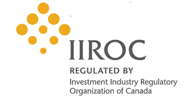

## Table of Contents

## What is the Investment Industry Regulatory Organization of Canada (IIROC)?

The Investment Industry Regulatory Organization of Canada (IIROC) is a self-regulatory organization that oversees investment dealers and trading activity on Canada's debt and equity marketplaces. Its main job is to make sure that everyone in the investment industry follows the rules and acts fairly. IIROC does this by setting standards, checking that these standards are met, and taking action if they are not.

IIROC also helps protect investors by making sure they have the information they need to make good choices. This includes keeping markets fair and transparent. If someone breaks the rules, IIROC can investigate and punish them. This helps keep the investment industry trustworthy and safe for everyone involved.

## What are the main functions of IIROC?

IIROC's main job is to make sure that investment dealers and trading on Canadian markets follow the rules. They do this by setting standards that everyone in the industry must follow. These standards help keep the markets fair and safe. IIROC checks to make sure these standards are being met. If someone breaks the rules, IIROC can investigate and take action against them.

Another big part of IIROC's work is to protect investors. They do this by making sure that investors have the right information to make good choices. This includes making sure that the markets are open and honest. By doing these things, IIROC helps keep the investment industry trustworthy. This makes it safer for people to invest their money.

## How does IIROC protect investors?

IIROC protects investors by making sure they have the right information to make good choices. They do this by setting rules that investment dealers and trading platforms must follow. These rules help make sure that the information given to investors is clear and honest. This way, investors can trust that they are making decisions based on accurate information.

Another way IIROC protects investors is by keeping an eye on the markets to make sure they are fair. If someone breaks the rules, IIROC can investigate and take action. This helps stop people from cheating or doing things that could harm investors. By doing these things, IIROC helps keep the investment industry safe and trustworthy for everyone.

## What types of firms does IIROC regulate?

IIROC regulates investment dealers in Canada. These are firms that help people buy and sell stocks, bonds, and other investments. They make sure these firms follow the rules so that they treat their clients fairly and honestly.

IIROC also keeps an eye on the trading that happens on Canada's debt and equity markets. This means they watch over the buying and selling of stocks and bonds to make sure everything is done correctly. By doing this, IIROC helps keep the markets safe and fair for everyone.

## How is IIROC structured and governed?

IIROC is run by a board of directors. This board makes the big decisions for the organization. The board has people from different parts of the investment industry, like dealers and investors. They also have some people who are not from the industry to make sure things stay fair. The board picks a president and CEO to run IIROC day-to-day. This person makes sure that IIROC does its job well and follows the rules set by the board.

IIROC also has different groups inside it that do specific jobs. There is a group that makes the rules, another group that checks if the rules are being followed, and a group that looks into problems and decides what to do if rules are broken. All these groups work together to make sure that the investment industry in Canada is fair and safe for everyone.

## What are the key regulations enforced by IIROC?

IIROC has many rules that investment dealers and trading platforms must follow. One big rule is about how dealers must act fairly and honestly with their clients. This means they have to give clear and correct information about investments. They also have to make sure that the advice they give is good for the client, not just good for making money for the dealer. Another important rule is about keeping client money and investments safe. Dealers have to keep client money separate from their own money and make sure it is protected.

IIROC also has rules to keep the markets fair. They watch trading to stop people from doing things like insider trading, where someone uses secret information to make money. They also stop market manipulation, where someone tries to trick the market to change prices. If someone breaks these rules, IIROC can investigate and punish them. This helps keep the markets honest and safe for everyone.

## How does IIROC handle complaints and disputes?

When someone has a problem with an investment dealer or how the markets are working, they can tell IIROC. IIROC has a special team that looks into these complaints. They check if the rules were broken and if the person complaining was treated unfairly. If they find a problem, they can make the dealer fix it or they can punish the dealer. This helps make sure that people's complaints are taken seriously and that the markets stay fair.

If the complaint is about money, like if someone thinks they lost money because of something a dealer did wrong, IIROC can help with that too. They have a way to solve these money problems without going to court. It's called arbitration or mediation. In arbitration, a person who is not involved in the problem listens to both sides and decides what should happen. In mediation, someone helps both sides talk and try to agree on a solution. This helps people solve their problems faster and easier than going to court.

## What is the process for becoming a member of IIROC?

To become a member of IIROC, a firm must first apply and show that it meets all the rules. This means they need to have enough money, good people working for them, and systems in place to keep clients safe. IIROC will check everything carefully. They will look at the firm's money, how it is run, and the people who work there. If everything looks good, IIROC will let the firm know what else they need to do to finish joining.

After the first check, the firm has to do some more things. They need to sign an agreement saying they will follow IIROC's rules. They also have to pay some fees. Once all this is done, IIROC will officially make the firm a member. This means the firm can start working as an investment dealer under IIROC's watch. It's important for the firm to keep following the rules even after they become a member, or they could get in trouble.

## How does IIROC monitor and enforce compliance among its members?

IIROC keeps an eye on its members to make sure they follow the rules. They do this by checking the firms regularly. IIROC looks at how the firms handle money, how they treat their clients, and how they trade. They also use special computer systems to watch the markets and see if anyone is doing anything wrong. If IIROC finds something that doesn't look right, they will look into it more closely.

If a member breaks the rules, IIROC can take action. They might make the firm fix the problem or pay a fine. Sometimes, IIROC can stop a firm from doing business for a while or even take away their membership. This helps make sure that everyone in the investment industry follows the rules and treats clients fairly. By doing this, IIROC helps keep the markets safe and honest for everyone.

## What role does IIROC play in market surveillance and integrity?

IIROC helps keep the markets safe by watching over them all the time. They use special computer systems to look at how people are buying and selling stocks and bonds. If they see something that looks wrong, like someone trying to cheat or use secret information, they start looking into it more. This helps stop people from doing bad things that could hurt the market or other investors.

By keeping a close eye on the markets, IIROC makes sure that everyone follows the rules. If someone breaks the rules, IIROC can take action to fix the problem. They might make the person or firm pay a fine, stop them from trading for a while, or even take away their right to be in the market. This helps keep the markets fair and honest, so people can trust that their investments are safe.

## How does IIROC contribute to the development of financial industry standards?

IIROC helps make the rules that everyone in the investment industry has to follow. They work with other groups and the government to make sure these rules are good for everyone. By setting these standards, IIROC makes sure that investment dealers treat their clients fairly and honestly. They also make sure that the markets are safe and that people can trust them. This helps keep the whole financial industry working well.

IIROC also keeps an eye on how well these rules are working. They check to see if the rules need to change to keep up with new things happening in the markets. If they find something that needs to be better, they can change the rules to make them stronger. This way, IIROC helps the financial industry keep getting better and safer for everyone.

## What are some recent initiatives or changes implemented by IIROC to adapt to the evolving financial markets?

IIROC has been working hard to keep up with changes in the financial world. One big thing they did was start using new technology to watch the markets better. This helps them catch problems faster and keep the markets fair. They also made rules about how dealers should use social media and other new ways of talking to clients. This makes sure that dealers are still honest and clear when they use these new tools.

Another thing IIROC did was change some rules to make it easier for new kinds of investment products to be used. This helps the market grow and gives investors more choices. They also started working more with other groups around the world to make sure that everyone is following similar rules. This helps keep the markets safe no matter where you are investing.

## References & Further Reading

[1]: ["Universal Market Integrity Rules (UMIR)."](https://www.ciro.ca/rules-and-enforcement/universal-market-integrity-rules) Investment Industry Regulatory Organization of Canada (IIROC).

[2]: Mackintosh, I. (2020). ["Understanding Market Integrity: A Focus on Regulatory Bodies."](https://zarataylor.blogspot.com/2020/05/millie-mackintosh-wearing-my-jewellery.html) The Globe and Mail.

[3]: Andersen, T. G., & Benzoni, L. (2012). ["Handbook of Financial Econometrics and Statistics."](https://papers.ssrn.com/sol3/papers.cfm?abstract_id=1076672) Springer Reference.

[4]: Lin, A. (2018). ["Algorithmic Trading and Regulation in Canada."](https://academic.oup.com/book/27407/chapter/197229790) CFA Institute.

[5]: ["The Role of Self-Regulatory Organizations in the Canadian Securities Market."](https://www.osc.ca/en/industry/market-regulation/self-regulatory-organizations-sro/new-self-regulatory-organization-canada-new-sro/recognition-new-self-regulatory-organization-canada) Ontario Securities Commission.