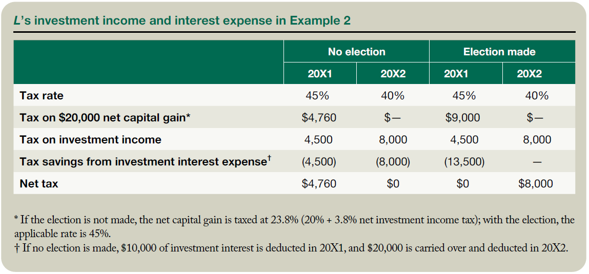

The financial landscape is multifaceted, encompassing a wide array of concepts that require an in-depth understanding to navigate effectively. This article aims to explore several critical topics within this domain: financial interest, investment expense, interest expense, and algorithmic trading. Each of these components plays a significant role in shaping financial strategies and their outcomes.

Financial interest refers to the earnings generated from investments or the cost incurred when capital is borrowed. Understanding how financial interest operates is crucial for managing and optimizing returns on investments, as well as for making prudent borrowing decisions. Concurrently, investment expenses, such as management fees and interest on investment-related loans, represent the costs associated with investing. These expenses must be carefully calculated and managed to maximize profitability.



Interest expense, a pivotal element in financial analysis, emerges from the funds borrowed for investment or operational purposes. Proper management of interest expenses is essential to ensure that financial leverage generates positive returns without leading to excessive costs. Thus, these financial concepts are interconnected and vital for effective financial planning and management.

In recent years, the convergence of finance and technology has been exemplified through the emergence of algorithmic trading. This sophisticated form of trading automates decision-making using predefined algorithms, significantly enhancing the efficiency of financial markets by enabling rapid and precise trade executions. Algorithmic trading not only reduces transaction costs and human error but also leverages advancements in technology such as artificial intelligence and machine learning to develop more refined trading strategies.

As the financial markets continue to evolve, a comprehensive understanding of these elements provides insight into their broader impact. Algorithmic trading is reshaping market operations, creating a dynamic environment where financial and technological expertise is essential for success. By examining these concepts, investors and finance professionals can adopt strategies that capitalize on technological advancements while maintaining robust financial management practices.

## Table of Contents

## Understanding Financial Interest and Investment Expense

Financial interest plays a pivotal role in the world of finance, encapsulating the interest earned from investments and the interest paid on borrowed capital. It is a crucial [factor](/wiki/factor-investing) in determining the viability and attractiveness of investment opportunities. Understanding these aspects helps in formulating strategies that optimize returns and minimize costs.

Investment expenses are defined as the costs incurred during the investment process. These can include management fees, advisory charges, and interest on loans taken out to finance investment activities. These expenses can significantly impact the net returns from an investment; hence, their careful calculation and management are paramount. 

The mathematical expression for the net investment return accounting for expenses is:

$$
\text{Net Return} = (\text{Gross Return} - \text{Investment Expenses}) \times 100\%
$$

Where:
- $\text{Gross Return}$ is the total profit earned before expenses.
- $\text{Investment Expenses}$ includes all costs related to the investment.

Understanding and calculating these expenses can significantly influence efficient investment planning. For instance, let's consider a scenario in which an investor earns a gross return of $10,000 from an investment, but incurs $2,000 in management fees and $500 interest on investment loans. The net return would be calculated as:

$$
\text{Net Return} = (10,000 - (2,000 + 500)) \times 100\% = 7,500
$$

Investment interest expenses are often tax-deductible, a condition that can enhance overall returns under certain tax jurisdictions. For tax deduction qualification, the expenses must meet specific criteria outlined by the tax authorities, which generally regard the purpose and nature of the finance. This deduction effectively reduces taxable income and allows investors to retain a larger share of their returns.

Proper allocation and accounting of these expenses are vital. This involves setting a budget for investment activities, regularly reviewing and adjusting the expenses, and ensuring they align with the overall financial strategy. Advanced software can aid in tracking and optimizing investment expenses, contributing to maximal profitability. 

In summary, understanding financial interest and investment expenses is essential for any investor or finance professional aiming to optimize their financial strategies. By considering the direct and indirect costs associated with investments, maintaining accurate records, and leveraging tax benefits, investors are better positioned to enhance their investment outcomes.

## Interest Expense: A Closer Look

Interest expense occurs when an entity borrows funds and is obligated to pay interest on the borrowed amount. This financial obligation is important for businesses and individual investors who utilize leverage, as it directly influences the overall cost structure and profitability of investments.

When evaluating the cost-effectiveness and potential returns of leveraging investments, interest expense plays a significant role. Effective interest expense management is key to maintaining a healthy financial leverage ratio, which ensures that businesses do not incur excessive borrowing costs that can diminish profitability. Financial leverage involves using borrowed capital for investment, enhancing the potential return on equity. However, excessive leverage increases financial risk, making efficient interest expense management crucial.

Interest expenses can profoundly affect a company's bottom line. It requires strategic financial planning to ensure that interest obligations do not outweigh the operational or investment returns. Companies must balance borrowing and repayment schedules to optimize financial resources effectively.

Various forms of interest expenses exist, reflecting different borrowing scenarios. Margin loans are commonly used by investors where they borrow funds from brokerage firms to purchase additional securities. The interest on these loans is an expense that must be managed to prevent erosion of investment returns. Another example includes interest on loans taken for investment properties, a critical consideration for real estate investors. This interest can significantly impact cash flows and profitability, necessitating careful financial planning.

Understanding these aspects of interest expense helps investors assess the potential returns on leveraged investments and guides them in making informed financial decisions.

## Algorithmic Trading: An Overview

Algorithmic trading employs sophisticated computer algorithms to automate trading decisions, relying on predefined criteria and real-time market data. This approach has fundamentally transformed the financial markets by enabling high-speed and precise executions of trades. The implementation of [algorithmic trading](/wiki/algorithmic-trading) can be traced back to the late 20th century, but its proliferation has increased significantly with advancements in technology and access to market data.

One of the primary advantages of algorithmic trading is the reduction in transaction costs. By automating trades, algorithmic systems minimize the need for manual supervision and intervention, which reduces the cost associated with human labor. Furthermore, algorithms can execute trades at optimal times to take advantage of favorable market conditions, thereby further reducing costs.

Another key benefit is the enhancement of accuracy and the minimization of human error. Algorithms operate on exact logic and quantitative criteria, eliminating the subjective biases and emotional decisions that can occur during manual trading. This precision ensures that trades are executed according to the trader's predefined strategy without deviations due to emotional influences.

The rapid progress in [artificial intelligence](/wiki/ai-artificial-intelligence) (AI) and [machine learning](/wiki/machine-learning) has further enhanced algorithmic trading strategies. These technologies allow traders to devise complex models that can recognize patterns and predict market trends with a high level of accuracy. For instance, machine learning algorithms can process vast amounts of historical data to identify statistical [arbitrage](/wiki/arbitrage) opportunities or predict price movements based on economic indicators.

Understanding the integration of financial calculations is essential for the effective development and deployment of algorithmic trading systems. Financial calculations such as price averages, moving averages, and various indicators (like the Relative Strength Index or Bollinger Bands) are often incorporated into algorithms to inform trading decisions. Accurate integration ensures that the trading strategy remains aligned with market dynamics and investor goals.

In conclusion, the continuous advancement in computing technology, AI, and data analytics is expected to further refine and expand the capabilities of algorithmic trading, making it a vital component of modern financial markets.

## Integrating Financial Calculations in Algorithmic Trading

Financial calculations, including those related to accrued interest and expenses, are indispensable in crafting effective algorithmic trading systems. The precision of these calculations is critical for ensuring the operational reliability of trading strategies, facilitating informed decision-making, and achieving desirable financial outcomes.

Accurate financial data is fundamental in this context. It increases the trustworthiness of algorithms by providing them with a solid foundation from which to operate. These calculations often encompass determining accrued interest, which is the interest that has accumulated on an investment but has not yet been paid. This calculation is vital in strategies involving fixed-income securities, where timing discrepancies in cash flows can impact the financial strategy.

To integrate these calculations into trading systems, algorithms need to be capable of processing complex financial data and making real-time adjustments to trading positions. A typical approach is to use Python, given its versatility and the availability of numerous financial libraries.

For instance, consider a simple illustration of calculating accrued interest using Python:

```python
def calculate_accrued_interest(principal, annual_rate, days_accrued):
    daily_rate = annual_rate / 365  # Assuming a standardized 365-day year
    accrued_interest = principal * daily_rate * days_accrued
    return accrued_interest

# Example usage
principal_amount = 10000  # Principal amount in dollars
annual_interest_rate = 0.05  # Annual interest rate of 5%
days = 30  # Number of days the interest has accrued

accrued = calculate_accrued_interest(principal_amount, annual_interest_rate, days)
print(f"Accrued Interest: ${accrued:.2f}")
```

This snippet calculates the interest accrued over a specified period and can be integrated into broader trading algorithms to inform buy, sell, or hold decisions. The continued advancement in AI and data processing capabilities is pivotal for refining these integrations. Enhanced computational power and more sophisticated machine learning models allow for more nuanced financial predictions and strategy adjustments based on extensive datasets.

Algorithms that incorporate financial calculations intelligently can offer a competitive edge by accurately anticipating market movements and executing trades at optimal times. As data processing technologies continue to evolve, the depth and accuracy of these calculations are expected to improve further, leading to even more robust and effective trading algorithms. This ongoing evolution not only facilitates better trading outcomes but also ensures that strategies remain compliant with dynamic market conditions and regulatory standards.

## Challenges and Opportunities

Merging financial accounting data with algorithmic trading brings about several challenges and opportunities. One primary challenge is ensuring data accuracy. Discrepancies in financial data can lead to flawed trading decisions, as algorithmic trading relies on precise inputs to execute trades efficiently. For instance, errors in calculating accrued interest or investment expenses can skew trading algorithms, resulting in suboptimal transactions and financial losses.

Regulatory compliance is another significant challenge. Different jurisdictions impose varying legal frameworks and standards, requiring traders to navigate complex regulatory environments. Adherence to these regulations is crucial, as non-compliance can result in penalties and legal complications. Traders must stay informed about changes in regulatory requirements and adjust their algorithms accordingly to ensure compliance.

On the opportunity side, advancements in technology and data analysis present significant potential for enhancing trading strategies. With the integration of machine learning and artificial intelligence, algorithmic trading systems can process vast amounts of data with greater accuracy and speed. This enables the development of sophisticated models that can predict market trends more effectively and optimize trading decisions.

The ongoing evolution of financial technologies also offers the potential for innovations in trading practices. Enhanced data processing capabilities can improve the accuracy of financial calculations used in algorithmic trading, such as interest expenses and investment returns. This, in turn, can lead to more accurate predictions and successful trading outcomes. For example, traders can leverage real-time data analytics to identify market movements and adjust their strategies promptly, gaining a competitive edge.

Overall, while merging financial accounting data with algorithmic trading presents certain challenges, the potential opportunities for innovation and improved trading strategies make it a promising area for development. Financial professionals who effectively address these challenges and capitalize on emerging technologies can enhance trading performance and achieve better market results.

## Conclusion

Understanding financial interest, investment, and interest expenses is essential for achieving effective financial management. These concepts form the bedrock upon which investors can strategically plan and optimize their activities. Mastery of these financial elements enables individuals and organizations to allocate resources efficiently, plan for future growth, and anticipate the ramifications of financial decisions.

Algorithmic trading has profoundly transformed market strategies, granting investors the ability to execute trades with unprecedented speed and precision. By employing algorithmic approaches, market participants can exploit tactical advantages that manual trading simply cannot match. These advantages stem not only from the speed at which trades are executed but also from the ability of algorithms to process vast amounts of market data and make decisions based on pre-defined criteria.

The integration of comprehensive financial data into algorithmic trading systems is now more crucial than ever. Accurate financial data is paramount for calibrating trading algorithms that can predict market movements and respond decisively. Such integration ensures that trading strategies are not only robust but also adaptive to the ever-changing market conditions.

Professionals operating in the financial markets must remain acutely aware of emerging technologies and ever-evolving regulatory landscapes. Staying informed about technological advancements—such as improvements in artificial intelligence, machine learning, and data analytics—is necessary for maintaining competitive trading strategies. Moreover, understanding regulatory changes helps market participants ensure compliance and mitigate legal risks associated with trading activities.

By embracing advancements in technology and continuously adapting their trading practices, professionals can enhance their market outcomes. An openness to innovation, combined with a solid understanding of foundational financial principles, positions investors to capitalize on new opportunities and navigate challenges effectively.

## References & Further Reading

FASB: Standards & Guidance

The Financial Accounting Standards Board (FASB) provides guidelines crucial for accounting practices related to financial interest and investment expenses. Understanding these standards is essential for maintaining transparency and consistency in financial reporting, which is vital for the integration of financial calculations into algorithmic trading strategies. More information on FASB's standards can be accessed at their official website: [FASB Standards](https://www.fasb.org/).

Lopez de Prado, M. Advances in Financial Machine Learning

Marcos Lopez de Prado's book, "Advances in Financial Machine Learning," is a pivotal resource for understanding how machine learning technologies can transform the financial markets. It delves into the use of algorithms for optimal trading strategies, elucidating the integration of sophisticated financial calculations within trading algorithms. The book is a fundamental reference for professionals aiming to enhance their algorithmic trading skills with advanced machine learning techniques.

Aronson, D. R. Evidence-Based Technical Analysis

David R. Aronson's "Evidence-Based Technical Analysis" offers a scientific approach to technical analysis, emphasizing the need for objective and evidence-backed methodologies in developing trading strategies. This work complements the financial calculations used in algorithmic trading by ensuring that decisions are made on statistically validated data rather than typical heuristics. Aronson's analysis is instrumental for those seeking to understand the empirical basis for algorithmic trading strategies.

Jansen, S. Machine Learning for Algorithmic Trading

In "Machine Learning for Algorithmic Trading," Stefan Jansen provides an in-depth guide on applying machine learning techniques to boost trading performance. The book covers a comprehensive range of topics from data processing techniques to developing and testing machine learning models pertinent to financial markets. Jansen's work serves as a critical resource for traders and financial engineers looking to integrate financial data and predictive analytics into their trading operations.

Chan, E. P. Quantitative Trading: How to Build Your Own Algorithmic Trading Business

Ernest P. Chan's "Quantitative Trading: How to Build Your Own Algorithmic Trading Business" is a practical resource for individuals interested in starting their own trading enterprise. The book guides readers through the process of developing, [backtesting](/wiki/backtesting), and deploying [quantitative trading](/wiki/quantitative-trading) strategies. It highlights the importance of precise financial calculations and data management in achieving success in algorithmic trading environments. Chan's insights are invaluable for practitioners who aim to combine financial theory with real-world trading applications.

