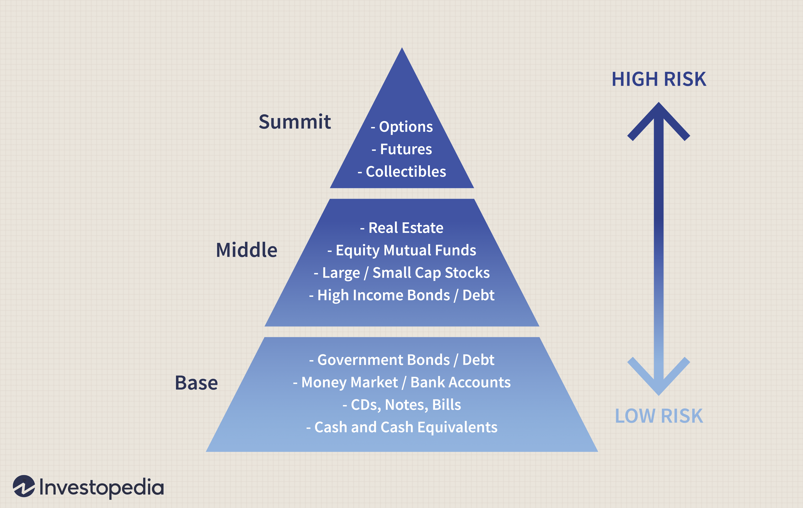

## Table of Contents

## What is investment management beyond just stock transactions?

Investment management is more than just buying and selling stocks. It's about looking after someone's money and helping it grow over time. This involves making a plan that fits the person's goals, how much risk they're okay with, and how long they want to invest. A good investment manager will look at many different types of investments, like bonds, real estate, and even things like art or gold, to build a mix that can help reach those goals.

Another big part of investment management is keeping an eye on how the investments are doing and making changes when needed. This means checking in regularly to see if the investments are still a good fit or if something in the world has changed that might affect them. It's also about understanding what's happening in the economy and how that might impact the investments. By doing all this, an investment manager helps make sure the money is working hard to meet the person's financial goals, whether that's saving for retirement, buying a house, or something else.

## How can diversification benefit an investment portfolio?

Diversification means spreading your money across different types of investments. It's like not putting all your eggs in one basket. By doing this, you can lower the risk that comes with investing. If one investment doesn't do well, others might do better and help balance things out. This can make your overall portfolio more stable and less likely to lose a lot of money all at once.

Another benefit of diversification is that it can help you take advantage of different opportunities in the market. Different investments do well at different times. For example, when stocks are not doing great, bonds might be doing better. By having a mix of investments, you can potentially earn more money over time because you're not relying on just one type of investment to grow your wealth. This way, you can keep your money working hard for you in various parts of the economy.

## What are alternative investments and how do they fit into a broader investment strategy?

Alternative investments are things you can invest in that aren't stocks, bonds, or cash. They can include things like real estate, art, gold, or even putting money into a startup company. These types of investments often have different risks and rewards compared to traditional investments. They might not be as easy to buy or sell, and they can be more complex, but they can also offer the chance to make more money or protect your money in different ways.

When you add alternative investments to your overall investment plan, it's like adding more colors to a painting. They can help you spread out your risk even more than just having stocks and bonds. For example, if the stock market goes down, your real estate or gold might still be doing okay. This can make your whole investment portfolio more stable and potentially grow your wealth in different ways. But, because they can be trickier to understand and manage, it's important to think carefully about how much of your money you want to put into them and to maybe get advice from someone who knows a lot about them.

## How does asset allocation impact long-term investment performance?

Asset allocation is all about deciding how to split your money between different types of investments, like stocks, bonds, and other things. It's a big deal because it can really affect how well your investments do over a long time. If you put too much money into one type of investment and it doesn't do well, you could lose a lot. But if you spread your money out wisely, you can lower the risk and still have a good chance to make money. It's like balancing a seesaw; you want to make sure it doesn't tip too far one way or the other.

The right mix of investments depends on things like how much risk you're okay with, how long you plan to invest, and what you want to achieve with your money. For example, if you're young and saving for retirement that's far away, you might put more money into stocks because they can grow a lot over time, even though they're riskier. But if you're closer to needing the money, you might want more in bonds because they're usually safer. Getting the asset allocation right can help your money grow steadily over the years and reach your goals without too many scary ups and downs.

## What role do bonds play in investment management?

Bonds are like loans you give to a government or a company. When you buy a bond, you're lending them money, and they promise to pay you back with interest over time. This makes bonds a bit safer than stocks because you know you'll get your money back if everything goes well. They can be a good choice if you want to keep your money safe and still earn a little bit of interest.

In investment management, bonds can help balance out the riskier parts of your portfolio, like stocks. If the stock market goes down, the bonds might still be paying you interest, which can help keep your overall investments more stable. By having some bonds in your mix, you can protect your money and make sure you have a steady income coming in, which is really helpful if you're planning for things like retirement or saving for a big purchase.

## How can real estate be used as part of an investment strategy?

Real estate can be a smart part of your investment strategy because it can help your money grow and give you a regular income. When you buy property, like a house or an apartment building, you can rent it out to people. The rent money you get each month can be a steady income. Plus, over time, the value of the property might go up, which means you could sell it later for more money than you paid for it. This is called appreciation, and it's like your investment getting bigger without you having to do much.

Another way real estate fits into an investment plan is by spreading out your risk. If you only invest in stocks and they go down, you could lose a lot of money. But if you also own some real estate, it might not go down at the same time as the stock market. This can make your whole investment plan more stable. Also, real estate can be a good way to protect your money from inflation, which is when prices go up over time. If you have a rental property, you can usually raise the rent as prices go up, which helps keep your money's value strong.

## What are the benefits and risks of investing in commodities?

Commodities are things like gold, oil, or wheat that you can buy and sell. One big benefit of investing in commodities is that they can help protect your money from inflation. When prices go up, the value of commodities often goes up too. This means your investment might keep its value better than money in a bank. Another good thing about commodities is that they can help spread out your risk. If you only invest in stocks and they go down, commodities might not go down at the same time. This can make your whole investment plan more stable.

But there are also risks when you invest in commodities. One big risk is that their prices can be very up and down. Things like weather, politics, or big changes in the world can make commodity prices jump around a lot. This means you could lose money if you buy at a high price and then the price drops. Also, commodities can be hard to understand and manage. They're not as easy to buy and sell as stocks, and you might need to know a lot about the market to do well. So, while commodities can be a good part of your investment plan, you need to be careful and maybe get advice from someone who knows a lot about them.

## How can hedge funds and private equity enhance a portfolio?

Hedge funds and private equity can be good additions to your investment portfolio because they can help your money grow in different ways. Hedge funds try to make money no matter what the market is doing. They use special strategies that can make money even when the stock market is going down. This can help balance out the riskier parts of your portfolio, like stocks, and make your overall investments more stable. Private equity, on the other hand, is about investing in companies that aren't listed on the stock market. These companies might grow a lot, and if they do well, you could make a lot of money when they get sold or go public.

But, there are also some risks to think about. Hedge funds and private equity can be hard to understand and manage. They often need a lot of money to get started, and you might not be able to get your money out quickly if you need it. Also, they can be riskier than other types of investments. If the strategies don't work out, or if the companies you invest in don't do well, you could lose a lot of money. So, while hedge funds and private equity can help your portfolio grow and be more stable, it's important to think carefully about how much of your money you want to put into them and maybe get advice from someone who knows a lot about them.

## What is the importance of risk management in investment strategies?

Risk management is super important in investment strategies because it helps keep your money safe. When you invest, there's always a chance you could lose money. By managing risk, you're trying to make sure that if something goes wrong with one investment, it doesn't mess up your whole plan. It's like wearing a seatbelt in a car; it won't stop accidents from happening, but it can help protect you if something bad happens.

One way to manage risk is by spreading your money around in different types of investments. This is called diversification. If you put all your money in one place and it doesn't do well, you could lose a lot. But if you have a mix of investments, like stocks, bonds, and maybe even real estate, you're less likely to lose everything at once. Another part of risk management is knowing how much risk you're okay with. Everyone is different, and what's too risky for one person might be fine for someone else. By understanding your own comfort level with risk, you can build an investment plan that helps you sleep at night while still trying to grow your money.

## How do macroeconomic factors influence investment decisions beyond stocks?

Macroeconomic factors are big things that happen in the economy, like inflation, interest rates, and how fast the economy is growing. These things can affect all kinds of investments, not just stocks. For example, if inflation goes up, the value of money goes down, which can make commodities like gold more attractive because their prices often go up with inflation. Also, if interest rates go up, borrowing money gets more expensive, which can slow down the economy and affect real estate and bonds. Investors need to keep an eye on these big economic changes to make smart choices about where to put their money.

Another way macroeconomic factors influence investment decisions is through the overall health of the economy. If the economy is growing fast, businesses might do well, which can be good for private equity investments in those businesses. But if the economy slows down or goes into a recession, those same investments could lose value. Even things like hedge funds, which try to make money no matter what the market is doing, can be affected by big economic changes. By understanding what's happening in the economy, investors can adjust their plans to try to protect their money and find new opportunities to grow it.

## What advanced strategies can be used to optimize portfolio performance?

One advanced strategy to optimize portfolio performance is called tactical asset allocation. This means changing how much money you have in different types of investments based on what's happening in the economy or the market. If you think stocks are going to do well soon, you might put more money into them. But if you think they're going to go down, you might move some of that money into bonds or other safer investments. This strategy can help you take advantage of short-term opportunities and protect your money from big drops in the market.

Another strategy is using derivatives, like options and futures. These are special kinds of investments that let you bet on whether something will go up or down without actually buying it. For example, you can use options to protect your stocks from losing too much value if the market goes down. This is called hedging. Or, you can use futures to make money if you think the price of something like oil or gold is going to change. Derivatives can be tricky and risky, but if you know how to use them, they can help you make more money or protect what you already have.

A third strategy is called rebalancing. This means checking your portfolio regularly and making sure it still matches your plan. Over time, some investments might grow faster than others, which can throw off your balance. For example, if your stocks have done really well, you might have too much money in them and not enough in bonds. By selling some stocks and buying more bonds, you can get back to your original plan. Rebalancing helps keep your risk level where you want it and can stop your portfolio from getting too tilted one way or the other.

## How can behavioral finance principles be applied to improve investment management?

Behavioral finance looks at how people's feelings and habits can affect their money choices. One way to use these ideas in investment management is by understanding and controlling our own money biases. For example, a lot of people feel the pain of losing money more than the joy of making money. This can make them sell their investments too soon when the market goes down. By knowing this, an investor can stick to their plan and not make quick choices based on fear. Another common problem is overconfidence, where people think they know more about the market than they really do. To avoid this, investors can do more research and maybe talk to a financial advisor before making big decisions.

Another way to use behavioral finance is by setting up rules to help make better choices. For example, an investor can decide ahead of time when they will buy or sell investments, instead of trying to guess what the market will do next. This can help stop them from making choices based on what everyone else is doing or what the news says. Also, by spreading their money across different types of investments, investors can feel less worried about losing everything if one investment doesn't do well. This can help them stick to their long-term plan instead of making quick changes based on short-term feelings.

## What is Portfolio Management: A Strategic Approach?

Portfolio management represents a structured framework for managing an individual's or institution's investments, with the ultimate aim of aligning these investments with defined financial objectives while effectively managing associated risks. This complex process incorporates extensive analysis, strategic asset allocation, and ongoing oversight of investment portfolios.

**Active vs. Passive Portfolio Management**

Two primary portfolio management styles include active and passive management. Active management involves regular buying and selling actions, with the aim of outperforming benchmark indices through strategic decisions. It demands skilled portfolio managers who carefully select securities believed to offer superior returns, typically incurring higher fees due to extensive research and trading activities. Notable examples of active management include hedge funds and actively managed mutual funds.

Conversely, passive management relies on a long-term investment strategy with minimal trading activity. This approach seeks to replicate the performance of specific indices by holding a mix of securities in the same proportions as the target index. Investors in passive management strategies benefit from lower costs and reduced complexity, with exchange-traded funds (ETFs) often utilized to achieve this replication.

**Asset Diversification, Sector Rotation, and Risk Management**

Effective risk management is integral to portfolio management. Asset diversification, a key risk mitigation strategy, involves distributing investments across various asset classes, geographies, and industries to reduce exposure to any single risk [factor](/wiki/factor-investing). This can be expressed in simple terms as:

$$
\text{Portfolio Risk} = f(\text{Asset Correlations})
$$

For example, by investing in both equities and bonds, investors can minimize the overall [volatility](/wiki/volatility-trading-strategies) of their portfolio due to the typically inverse correlation between these asset classes.

Sector rotation involves shifting investment allocations between different sectors based on economic cycles or other forecasting models. This strategy enables managers to capitalize on anticipated sector performance and optimize returns. For instance, during periods of economic growth, shifting investments towards technology or financial sectors may prove beneficial.

**Incorporation of ESG Factors**

Increasingly, Environmental, Social, and Governance ([ESG](/wiki/esg-investing)) factors are being integrated into portfolio management to cater to the growing appetite for sustainable investing. ESG criteria help assess potential risks and opportunities that may not be captured through traditional financial analysis. Investing with an ESG lens can enhance long-term value by identifying companies that are well-positioned for the future.

ESG integration involves evaluating a company’s environmental impact, social practices, and governance policies. This can include analyzing a company's carbon footprint, labor practices, and executive compensation structures. By aligning investment practices with ESG principles, portfolio managers cater to investor preferences while potentially identifying companies with lower risks of regulatory penalties or reputational damage.

In conclusion, portfolio management demands a comprehensive approach involving strategic planning, risk assessment, and adaptability to market trends. By effectively employing active or passive strategies, diversifying assets, considering sector rotation, and integrating ESG factors, portfolio managers can enhance investment outcomes and align with investors' goals.

## References & Further Reading

[1]: Bergstra, J., Bardenet, R., Bengio, Y., & Kégl, B. (2011). ["Algorithms for Hyper-Parameter Optimization."](https://papers.nips.cc/paper/4443-algorithms-for-hyper-parameter-optimization) Advances in Neural Information Processing Systems 24.

[2]: ["Advances in Financial Machine Learning"](https://www.amazon.com/Advances-Financial-Machine-Learning-Marcos/dp/1119482089) by Marcos Lopez de Prado

[3]: ["Evidence-Based Technical Analysis: Applying the Scientific Method and Statistical Inference to Trading Signals"](https://www.amazon.com/Evidence-Based-Technical-Analysis-Scientific-Statistical/dp/0470008741) by David Aronson

[4]: ["Machine Learning for Algorithmic Trading"](https://github.com/stefan-jansen/machine-learning-for-trading) by Stefan Jansen

[5]: ["Quantitative Trading: How to Build Your Own Algorithmic Trading Business"](https://www.amazon.com/Quantitative-Trading-Build-Algorithmic-Business/dp/1119800064) by Ernest P. Chan