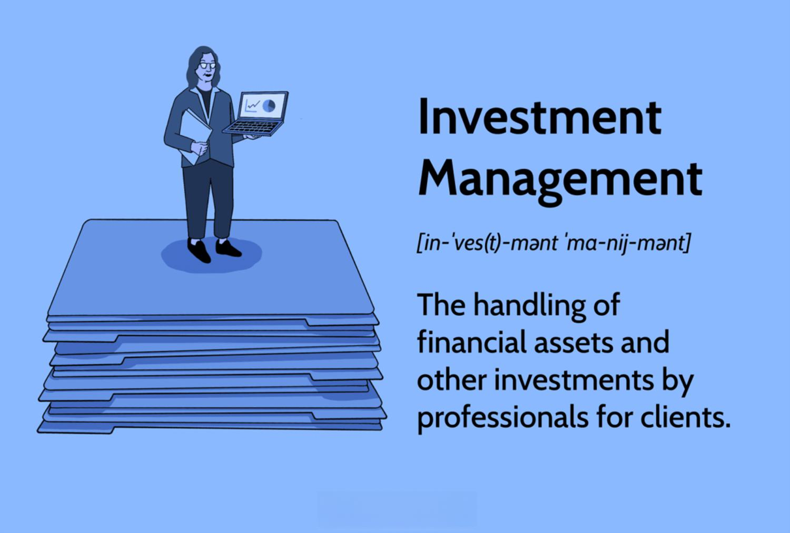

The financial world is an ever-evolving landscape, driven significantly by technological advancements. Among the notable areas undergoing substantial transformation are asset management and investment management. These sectors have seen a paradigm shift with the introduction and growth of algorithmic trading, which has revolutionized operations and investment strategies.

Asset management refers to the systematic management of investments on behalf of clients. This involves strategically balancing risk and return to achieve specific investment goals. Professionals in this field leverage a variety of strategies, including portfolio management services, to analyze market conditions, forecast potential gains, and mitigate risks.



The investment management division plays a critical role in overseeing financial assets for clients. It operates under stringent regulatory frameworks, such as those established by the U.S. Securities and Exchange Commission's Division of Investment Management. These regulations are designed to protect investors while ensuring compliance with investment strategies.

Algorithmic trading, or algo trading, utilizes a set of predefined rules, known as algorithms, to execute trades. Its popularity spans several financial markets, including stocks, forex, and cryptocurrency. The capability of these algorithms to rapidly analyze vast datasets enables traders to implement complex strategies swiftly, often resulting in increased efficiency and reduced operational costs.

As these sectors continue to adapt to technological innovations, understanding the impact of algorithmic trading becomes crucial. The integration of such technology in asset and investment management not only enhances operational efficiency but also introduces new strategies and opportunities within the financial markets.

## Table of Contents

## Understanding Asset Management

Asset management is the structured process of managing and overseeing a client's investments to achieve specific financial objectives. Professionals in this field, often referred to as asset managers, engage in portfolio management services, where they carefully balance risk and return to optimize client outcomes. 

A core component of asset management is the analysis of market conditions. This involves examining various economic indicators, financial reports, and market trends to make informed investment decisions. By understanding these conditions, asset managers can forecast potential gains, aiding in strategic asset allocation and timing of market entry and [exit](/wiki/exit-strategy) points.

Forecasting potential gains requires a deep understanding of financial models and predictive analytics. Asset managers may use statistical methods and software tools to project future market performances. For example, they might employ a Monte Carlo simulation to predict the potential returns of an investment under various scenarios, thereby assessing the probability of achieving specific investment goals.

Risk mitigation is another critical facet of asset management. It entails identifying, evaluating, and prioritizing risks followed by coordinated efforts to minimize, monitor, and control the probability or impact of adverse events. Techniques such as diversification—spreading investments across various asset classes to reduce exposure to [volatility](/wiki/volatility-trading-strategies)—or using derivatives like options and futures to hedge against potential losses are standard practices in managing investment risks.

In summary, asset management is a multifaceted discipline that combines market analysis, strategic planning, and risk management to meet the financial aspirations of clients. Through diligent oversight and tactful decision-making, asset managers strive to achieve and maintain the delicate balance between risk and return.

## Role of Investment Management Division

The investment management division is tasked with overseeing and optimizing the financial assets of clients. This involves strategies and operations that align with clients' financial goals, ensuring capital growth, income generation, or a combination of both. The division operates within a structured regulatory framework, where compliance with financial regulations is imperative.

Significantly, the U.S. Securities and Exchange Commission's (SEC) Division of Investment Management provides a foundational regulatory structure. These regulations are designed to protect investors, maintain fair and efficient markets, and facilitate capital formation. The rules ensure that investment management activities adhere to legal standards, promoting transparency and accountability. Compliance with these regulations is essential, as it not only ensures the safeguarding of investors but also maintains the integrity of investment practices.

Investment management divisions implement diverse techniques and practices to fulfill their strategic objectives. These include asset allocation, portfolio management, and performance analysis. Asset allocation involves distributing investments among various financial instruments, industries, and other categories to optimize risk and return. Portfolio management, on the other hand, requires continuous monitoring and rebalancing of investment portfolios to meet specific client objectives.

Moreover, the division employs various methods of performance analysis to evaluate the effectiveness of investment strategies. This involves quantitative metrics such as alpha, beta, and the Sharpe ratio, which measure the excess return on an investment relative to market performance and risk. Here, risk management is crucial, as it involves identifying, assessing, and prioritizing risks followed by coordinated efforts to minimize, control, or eliminate the impact of unfortunate events.

To support these functions, the investment management division often turns to technology-driven solutions. These include advanced analytics, financial modeling, and [algorithmic trading](/wiki/algorithmic-trading) systems, which provide data-driven insights and enable more precise and timely decision-making. The synergy of regulatory compliance and technological advancement ensures robust and agile investment management operations, equipping the division to navigate the complex landscape of global financial markets.

 to Algorithimic Trading

Algorithmic trading, or algo trading, is the use of pre-defined rule sets, or algorithms, to automate the process of executing trades. These algorithms make decisions regarding aspects such as timing, price, or quantity of trades, emulating the work done manually by skilled traders. The primary advantage of algorithmic trading lies in its ability to process and analyze large datasets rapidly. This capability is particularly beneficial in contemporary financial markets where the speed and complexity of transactions require sophisticated and agile solutions.

Algo trading has gained significant traction across various financial markets, including stock, [forex](/wiki/forex-system), and [cryptocurrency](/wiki/cryptocurrency) markets. The ability to quickly analyze vast datasets enables traders to identify patterns and opportunities they might have missed using manual methods. As a result, traders can implement complex strategies at speeds unachievable by human traders, often leading to increased efficiency and profitability.

In stock markets, algorithmic trading streamlines the process of large-[volume](/wiki/volume-trading-strategy) transactions by minimizing the market impact of trades. In the forex market, algorithms can swiftly react to news and economic indicators, executing trades within milliseconds to leverage fleeting opportunities. Similarly, in cryptocurrency markets, which operate 24/7 and exhibit significant volatility, algorithmic trading provides an indispensable tool for maintaining competitive advantage.

Through the use of algorithmic trading, traders are empowered to harness the efficiencies of execution speed, remove cognitive and emotional biases from their trading decisions, and expand the range of opportunities available. As technology continues to advance, the scope and sophistication of algorithmic trading are expected to grow, further cementing its integral role in modern financial markets.

## Mechanics of Algorithmic Trading

Algorithmic trading, often referred to as algo trading, is a method of executing trades using pre-defined instructions or algorithms. It relies on computational power to perform tasks that are cumbersome and time-intensive for human traders. The key components of algorithmic trading include data input, algorithmic analysis, and trade execution.

The process begins with data input, where real-time market data is collected from various sources. This data encompasses price quotes, trade volumes, and other market variables. The algorithms utilize these datasets to find trading opportunities.

Algorithm analysis is the second phase. Algorithms analyze the data to identify potential trades based on pre-set criteria. They can evaluate vast amounts of information quickly, allowing them to respond to market changes almost instantaneously. For example, a typical algorithm may use statistical models to discern patterns and predict price movements. These models often employ techniques such as moving averages, trend analysis, and volatility clustering.

```python
import numpy as np

# Example: Simple moving average crossover strategy
def calculate_moving_average(prices, window_size):
    return np.convolve(prices, np.ones(window_size), 'valid') / window_size

# Sample price data
prices = np.array([110, 115, 120, 125, 130, 135, 140, 145, 150, 155])

# Calculate short-term and long-term moving averages
short_term_ma = calculate_moving_average(prices, window_size=3)
long_term_ma = calculate_moving_average(prices, window_size=5)

# Determine trading signals
signals = short_term_ma > long_term_ma[:-2]  # True indicates a buy, False indicates a sell
```

Trade execution is the final step, where the algorithm generates and sends buy or sell orders based on its analyses. Execution is often automated, ensuring trades are carried out instantaneously, thus capitalizing on identified market opportunities before conditions change. This automation reduces manual errors and ensures consistent execution.

The efficiency of algorithmic trading is highlighted by its speed and volume capabilities. Algorithms can process complex calculations and execute transactions in fractions of a second, which is invaluable in highly volatile markets. This speed enables the exploitation of fleeting opportunities, potentially gaining a competitive edge over traditional trading methods.

Ultimately, the mechanic structure of algorithmic trading, leveraging data input, algorithm analysis, and trade execution, underscores its efficiency and effectiveness in modern markets.

## Types of Algorithmic Trading Strategies

Algorithmic trading strategies are critical in executing trades with precision and speed. These strategies are typically based on mathematical models and statistical analyses, which provide traders with the ability to process large volumes of market data and execute orders much faster than human traders. Here, we discuss three primary types of algorithmic trading strategies: trend-following algorithms, mean reversion strategies, and statistical [arbitrage](/wiki/arbitrage).

Trend-following algorithms utilize [momentum](/wiki/momentum) indicators to monitor and follow market trends. These algorithms are designed to initiate buy orders in an uptrend and sell orders in a downtrend, capitalizing on the persistence of market directions. Common tools used in trend-following strategies include moving averages, relative strength index (RSI), and moving average convergence divergence (MACD). For instance, a simple moving average (SMA) crossover strategy might generate a buy signal when a short-term SMA crosses above a long-term SMA, and a sell signal when it crosses below.

```python
# A simple Python example for SMA Crossover
def sma_crossover(prices, short_window=40, long_window=100):
    signals = pd.DataFrame(index=prices.index)
    signals['short_mavg'] = prices.rolling(window=short_window, min_periods=1, center=False).mean()
    signals['long_mavg'] = prices.rolling(window=long_window, min_periods=1, center=False).mean()
    signals['signal'] = 0.0

    # Generate signals
    signals['signal'][short_window:] = np.where(
        signals['short_mavg'][short_window:] > signals['long_mavg'][short_window:], 1.0, 0.0)

    # Generate trading orders
    signals['positions'] = signals['signal'].diff()
    return signals
```

Mean reversion strategies are predicated on the expectation that asset prices will revert to their historical averages. These strategies hypothesize that if a stock's price diverges significantly from its mean, it is likely to revert back over time. The statistical foundation for mean reversion is often the law of large numbers, which suggests that over time, the average of a random variable will converge to its expected value. Bollinger Bands are frequently applied in this context to identify overbought or oversold conditions.

Statistical arbitrage takes advantage of pricing inefficiencies between related or correlated instruments, aiming to capitalize on expected price convergence. This strategy often involves creating a portfolio of long and short positions with the expectation that the mispricing will correct and thus yield a profit. Cointegration tests and [pair trading](/wiki/pair-trading) are techniques typically applied in [statistical arbitrage](/wiki/statistical-arbitrage), where stocks that have historically moved together are expected to continue doing so in the future.

In essence, the deployment of these algorithmic trading strategies allows traders to efficiently exploit various market phenomena. Understanding and implementing these strategies require a solid grasp of statistical methods and programming skills, both of which can significantly enhance trading performance through rigorous [backtesting](/wiki/backtesting) and optimization.

## Advantages of Algorithmic Trading

Algorithmic trading, often referred to as algo trading, presents several advantages over traditional manual trading methods, particularly in fast-paced market environments. One of the most significant benefits is speed. Algorithms can process vast amounts of data and execute trades in milliseconds, a feat that is impossible for human traders. This rapid execution minimizes slippage, the difference between the expected price of a trade and the actual price, thus reducing transaction costs.

In addition to speed, algo trading enhances precision and minimizes human error. Human traders are susceptible to emotional biases, such as overconfidence or fear, which can lead to irrational decision-making. Algorithms, however, operate based on pre-determined rules and criteria, ensuring consistency in execution. This precision allows for the meticulous implementation of complex trading strategies that might be burdensome for manual execution.

Algo trading also opens up a wider range of market opportunities by enabling traders to explore various instruments and global markets simultaneously. This is particularly beneficial in diversified portfolios where managing multiple assets would be challenging without automated processes.

Backtesting is another crucial advantage provided by algo trading. Prior to deploying a strategy, traders can test their algorithms against historical data to evaluate performance. This proactive approach allows for the identification and rectification of potential weaknesses in the strategy, ensuring optimal performance. Optimization techniques, such as parameter tuning, can fine-tune strategies to specific market conditions, increasing their effectiveness.

A simple implementation in Python for understanding backtesting could involve the use of libraries like pandas and numpy to simulate historical trading data. Below is a basic example of how one might set up a backtesting environment:

```python
import pandas as pd
import numpy as np

# Sample historical price data
data = {'Date': pd.date_range(start='2023-01-01', periods=5),
        'Price': [100, 102, 101, 105, 107]}
df = pd.DataFrame(data)
df.set_index('Date', inplace=True)

# Simple moving average strategy
sma_short = df['Price'].rolling(window=2).mean()
sma_long = df['Price'].rolling(window=4).mean()

# Trading signals based on moving average crossover
df['Signal'] = np.where(sma_short > sma_long, 1, 0)  # Buy signal when short SMA crosses above long SMA

print(df)
```

This code demonstrates how algorithms can analyze historical data to generate signals, which can then be optimized for better performance in live markets. 

In summary, the automation and sophistication of algorithmic trading provide enhanced efficiency, accuracy, and flexibility, making it a critical component of modern trading strategies. These tools not only improve trading outcomes but also facilitate the exploration of innovative strategies that are well-aligned with evolving market dynamics.

## Choosing the Right Algorithmic Trading Platform

Choosing the right algorithmic trading platform is crucial for traders aiming to leverage the efficiency of algorithmic trading. An ideal platform offers robust tools, real-time data, and capabilities for backtesting strategies. Among the notable platforms, MetaTrader and QuantConnect stand out due to their features tailored to different trading needs.

MetaTrader, available as MetaTrader 4 (MT4) and MetaTrader 5 (MT5), is a highly popular platform among retail traders. It is renowned for its user-friendly interface and comprehensive tools that allow traders to develop and implement custom algorithms. MetaTrader supports a variety of trading strategies, accommodating both novice and experienced traders. Its automated trading capabilities, known as Expert Advisors (EAs), enable users to conduct transactions and analyze markets without manual intervention. Furthermore, the platform provides access to historical data, enabling users to backtest their trading strategies to evaluate their effectiveness before deploying them in live markets.

In contrast, QuantConnect is preferred by those engaged in [quantitative trading](/wiki/quantitative-trading). As an open-source algorithmic trading platform, QuantConnect facilitates a collaborative environment where developers can share strategies and learn from one another. It offers extensive libraries and APIs, allowing users to create advanced trading strategies using programming languages like Python and C#. QuantConnect's LEAN Engine, an open-source algorithmic trading engine, supports backtesting across various asset classes, including equities, forex, and cryptocurrencies. This feature is especially useful for quantitative analysts and developers seeking to optimize algorithms through historical data simulations.

For traders interested in developing customized algorithms, the choice of programming language and platform flexibility plays a significant role. MetaTrader primarily uses MQL4 and MQL5, which are specific to the platform, while QuantConnect’s use of Python enhances its appeal to those with existing coding skills looking to implement sophisticated strategies.

```python
# Example of a simple moving average crossover strategy using QuantConnect's Python environment
class MovingAverageCrossAlgorithm(QCAlgorithm):
    def Initialize(self):
        self.SetStartDate(2023, 1, 1)
        self.SetEndDate(2023, 12, 31)
        self.SetCash(100000)

        self.symbol = self.AddEquity("AAPL", Resolution.Daily).Symbol

        self.fast_period = 50
        self.slow_period = 200

        self.fast_sma = self.SMA(self.symbol, self.fast_period, Resolution.Daily)
        self.slow_sma = self.SMA(self.symbol, self.slow_period, Resolution.Daily)

    def OnData(self, data):
        if self.fast_sma.IsReady and self.slow_sma.IsReady:
            if self.fast_sma.Current.Value > self.slow_sma.Current.Value:
                self.SetHoldings(self.symbol, 1)
            elif self.fast_sma.Current.Value < self.slow_sma.Current.Value:
                self.Liquidate(self.symbol)
```

Choosing the right platform is ultimately a decision influenced by individual needs, such as the complexity of the strategies, familiarity with programming languages, and desired asset classes. Both MetaTrader and QuantConnect provide robust solutions for traders, ensuring efficient implementation and testing of algorithmic trading strategies.

## Conclusion

The integration of algorithmic trading into asset and investment management has fundamentally transformed these fields. By leveraging sophisticated algorithms, traders can now execute trades with unprecedented speed and precision, optimizing both time and resources. This transformation provides traders with a competitive edge, enhancing decision-making processes and enabling the execution of complex investment strategies that were previously impractical. 

Moreover, technological advancements and evolving regulatory frameworks underscore the importance of these tools for traders. Algorithmic trading platforms are continually being refined to accommodate these changes, providing more robust features such as real-time data analysis, high-frequency trading capabilities, and advanced risk management techniques. Regulatory bodies, such as the SEC, have been instrumental in ensuring that these technologies function within a compliant environment, balancing innovation with investor protection.

As market dynamics shift, so too must the strategies and technologies employed by traders. The landscape of finance is characterized by constant flux, driven by market trends, economic indicators, and geopolitical events. Algorithmic trading remains at the forefront of this evolution, adaptable to new algorithms, data inputs, and regulatory adjustments. As a result, mastering the use of algorithmic trading systems is vital for any trader looking to stay relevant in a rapidly changing financial ecosystem. This ongoing adaptation guarantees that algorithmic trading will continue to play a pivotal role in shaping the future of asset and investment management.

## References & Further Reading

[1]: ["Algorithms for Hyper-Parameter Optimization"](https://dl.acm.org/doi/10.5555/2986459.2986743) by J. Bergstra, R. Bardenet, Y. Bengio, & B. Kégl. Advances in Neural Information Processing Systems 24.

[2]: ["Advances in Financial Machine Learning"](https://www.amazon.com/Advances-Financial-Machine-Learning-Marcos/dp/1119482089) by Marcos Lopez de Prado. 

[3]: ["Evidence-Based Technical Analysis: Applying the Scientific Method and Statistical Inference to Trading Signals"](https://www.amazon.com/Evidence-Based-Technical-Analysis-Scientific-Statistical/dp/0470008741) by David Aronson.

[4]: ["Machine Learning for Algorithmic Trading"](https://github.com/stefan-jansen/machine-learning-for-trading) by Stefan Jansen. 

[5]: ["Quantitative Trading: How to Build Your Own Algorithmic Trading Business"](https://www.amazon.com/Quantitative-Trading-Build-Algorithmic-Business/dp/1119800064) by Ernest P. Chan.