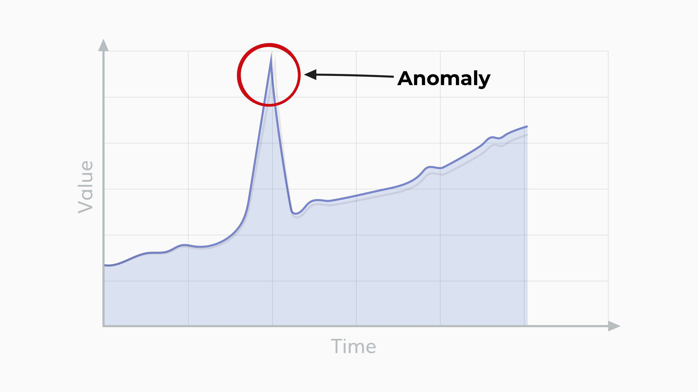

Understanding the stock market involves comprehending a spectrum of strategies and anomalies that influence investment decisions. The landscape of investment has been significantly transformed by the advent of technology, with algorithmic trading standing out as a pivotal innovation. This method of trading has not only revolutionized how transactions are executed, enabling rapid and precise operations, but it has also expanded the analytical horizons available to investors. The automation of trading strategies, driven by complex algorithms, allows market participants to conduct trades with speed and accuracy unattainable through manual means.

The complexity of the stock market is heightened by various strategies and anomalies that continuously shape investment choices. Key investment strategies often leverage mechanisms to navigate market inefficiencies and capitalize on them. Anomalies, characterized by unexpected price movements or patterns, challenge traditional market theories which assume efficient markets. Algorithmic trading systems can identify and exploit these anomalies more effectively due to their enhanced analytical capabilities.



High-frequency trading (HFT), a subset of algorithmic trading, exemplifies the use of algorithms to take advantage of small price discrepancies in milliseconds. This form of trading requires significant computational resources and sophisticated algorithms that can process vast amounts of market data quickly. As a result, HFT plays a crucial role in the liquidity and volatility of financial markets.

Sentiment analysis is another facet where technology impacts trading. By examining unstructured data from news articles and social media, algorithms can gauge market sentiment and predict potential market movements. Understanding the prevailing sentiment helps in forecasting market trends, which is crucial for making informed investment decisions.

This article aims to provide investors with an extensive understanding of how investment strategies, market anomalies, and algorithmic trading are interconnected and influence the stock market. By examining these elements, investors can appreciate the complexities of modern financial markets and develop strategies that accommodate both traditional and technological advancements.

## Table of Contents

## Investment Strategies in the Stock Market

Navigating the stock market necessitates a strategic approach that aligns with an investor's goals and risk tolerance. Key strategies such as diversification, [fundamental analysis](/wiki/fundamental-analysis), and [trend following](/wiki/trend-following) are widely adopted to enhance portfolio performance and mitigate risks.

Diversification involves spreading investments across a variety of assets to reduce exposure to any single asset's [volatility](/wiki/volatility-trading-strategies). This strategy is based on the principle that a diverse portfolio minimizes risk due to the imperfect correlation of individual securities' performances. By investing in different asset classes or sectors, investors can achieve a more stable return, as underperformance in one area might be offset by gains in another.

Fundamental analysis examines a company’s financial statements, management, competitive advantages, and market position to assess its intrinsic value. This approach informs investment decisions by identifying undervalued stocks that hold potential for price appreciation or overvalued stocks that may be prime for selling. Fundamental analysis serves as a foundation for smart investment choices, providing insights into a company’s profitability and long-term viability.

Trend following strategy involves making buy and sell decisions based on the recent direction of market prices. This strategy is rooted in the belief that significant price movements will continue in the same direction due to lasting supply and demand patterns. Trend following often utilizes technical indicators like moving averages to identify entry and [exit](/wiki/exit-strategy) points. 

Algorithmic trading enhances these strategies by enabling rapid data processing and execution. This technology facilitates the implementation of complex trading strategies with precision and speed that surpasses human capabilities. Algorithmic systems can swiftly analyze vast datasets, execute orders at optimal prices, and adjust to market fluctuations instantaneously, leading to more precise and timely trades.

The integration of AI and [machine learning](/wiki/machine-learning) within [algorithmic trading](/wiki/algorithmic-trading) has further revolutionized these strategies. Traders can now optimize investment approaches by leveraging AI's ability to process and learn from extensive data volumes, adapting to various market conditions in real time. Machine learning models are capable of identifying patterns and making predictions without human intervention, efficiently reducing human error and bias.

For instance, a Python code snippet employing machine learning for investment strategy might look like this:

```python
import numpy as np
from sklearn.ensemble import RandomForestRegressor

# Sample data: Features and target stock price movements
X = np.array([[0.01, 0.05], [0.02, 0.1], [0.03, 0.15], [0.04, 0.2]])
y = np.array([0.05, 0.1, 0.15, 0.2])

# Create and train the model
model = RandomForestRegressor(n_estimators=100)
model.fit(X, y)

# Predict future stock price movement
predicted_movement = model.predict(np.array([[0.05, 0.25]]))
print(predicted_movement)
```

This example demonstrates how machine learning can be utilized to predict stock price changes based on historical data, thus aiding in strategic investment decisions.

Ultimately, the integration of AI and machine learning in algorithmic trading signifies a shift towards more informed, faster, and bias-resistant investment strategies. As these technologies continue to evolve, they promise to further enhance the way investors navigate stock market complexities.

## Exploring Market Anomalies

Market anomalies are phenomena observed in financial markets that contradict the efficient market hypothesis, which posits that asset prices fully reflect all available information. These anomalies present both challenges and opportunities as they can offer strategic positioning advantages if successfully identified and understood.

Common anomalies include the January Effect, small firm effect, and weekend effects. The January Effect refers to the tendency for stock prices, particularly small-cap stocks, to increase in January more than in other months. This phenomenon is often attributed to tax-loss harvesting, where investors sell losing positions in December to claim capital losses and repurchase them in January, driving up demand. The small firm effect suggests that smaller companies tend to outperform larger ones, potentially due to their higher growth potential and lower visibility leading to market mispricing. Weekend effects describe patterns where stock returns on Mondays are typically lower than those of the preceding Friday, possibly due to investor behavior and timing of information releases.

Despite their initial appeal, anomalies can be unpredictable and transient. They require careful analysis and cautious application in strategy development due to their potential influences, including psychological biases and institutional factors, such as tax-related activities. Research indicates that behavioral finance components, like overreaction and underreaction to news, play a substantial role in the manifestation of these anomalies. For example, the concept of loss aversion might exacerbate the January Effect as investors are inclined to quickly sell winning stocks for the new year optimism.

Anomalies should guide strategy rather than dictate investment decisions entirely. Overreliance on anomalies for trading could lead to detrimental effects if they dissipate or fail to manifest as expected. This approach requires a balanced perspective, integrating anomalies with broader analysis frameworks that consider market conditions and risk factors.

Investors are encouraged to remain aware of these irregularities while maintaining a diversified portfolio. Understanding the underlying causes of these anomalies can provide valuable insights but should be complemented by robust risk management practices. With the evolving financial landscape, staying informed about ongoing research in market anomalies and advancements in data analysis tools enables an adaptive strategy that benefits from both traditional insights and new technology-driven approaches.

## Algorithmic Trading and Its Impacts

Algorithmic trading employs computer algorithms to automate trade execution based on predefined criteria and complex market models. It operates across multiple asset classes, optimizing trade processes and minimizing manual intervention. By converting intricate strategies into executable algorithms, this approach enhances efficiency in the stock market.

High-frequency trading ([HFT](/wiki/high-frequency-trading-strategies)) represents a specialized form of algorithmic trading. HFT systems are designed to execute a large [volume](/wiki/volume-trading-strategy) of orders at rapid speeds, often within microseconds, to exploit minute price discrepancies. This capability allows traders to secure advantageous market positions before slower market participants can react. The competitive advantage in HFT derives from both speed and the ability to process and respond to real-time data swiftly.

AI-driven algorithmic trading introduces advanced technologies such as pattern recognition, sentiment analysis, and [liquidity](/wiki/liquidity-risk-premium) management into its framework. These technologies enable traders to make informed decisions by interpreting large and complex datasets accurately. By identifying patterns and extracting market sentiment from unstructured data, such as news articles and social media, AI enhances the precision of trade executions and risk assessments.

Algorithmic trading also benefits from real-time data processing capabilities. By analyzing massive datasets, algorithms can detect subtle market shifts and inefficiencies. For example, if $P(t)$ represents the price of an asset at time $t$, an algorithm can monitor the rate of change $\frac{dP}{dt}$ to anticipate market movements and execute trades accordingly. This capability is vital for capturing fleeting opportunities that may not be visible through traditional analysis.

Prominent financial firms like Renaissance Technologies and Two Sigma have successfully utilized algorithmic trading to refine their strategies and bolster market performance. These firms have leveraged sophisticated algorithms and vast computational resources to gain insights into market dynamics and maximize investment returns. Their success underscores the significance of technology and data analysis in modern trading environments.

Overall, algorithmic trading represents a significant shift in how trades are executed in financial markets. By combining speed, data analysis, and automation, it provides a powerful tool for enhancing trading performance, though it also necessitates awareness of associated risks and challenges.

## AI and Machine Learning in Trading

Artificial intelligence (AI) and machine learning have become pivotal in augmenting algorithmic trading, primarily by enhancing prediction accuracy and facilitating real-time strategy adaptation. This evolution is driven by the inherent capabilities of machine learning models to analyze and learn from vast and intricate datasets, continuously refining their predictive capacity without the need for human intervention.

Machine learning's ability to handle complex data structures enables it to recognize patterns and trends that are often imperceptible to traditional trading models. For instance, these models can process large volumes of financial data, price movements, trading volumes, and other pertinent variables to produce more precise forecasts on asset price directions. Algorithms such as random forests, support vector machines (SVM), and neural networks are particularly effective in this domain. Python has become a popular language for implementing such algorithms, with libraries like scikit-learn and TensorFlow offering robust tools for machine learning applications in trading.

Sentiment analysis, a subset of AI applications, is increasingly pivotal in identifying market trends. By analyzing unstructured data from various sources, such as news articles, social media, and financial reports, AI systems can gauge market sentiment towards specific stocks or sectors. This sentiment analysis allows traders to make informed decisions based on the collective mood of the market, which can be indicative of potential price movements. Natural language processing (NLP) techniques, combined with [deep learning](/wiki/deep-learning) models, enable the extraction and interpretation of textual data, further enriching trading strategies.

AI also plays an essential role in risk management within trading environments. By optimizing portfolio distributions, AI systems ensure that assets are allocated in a manner that aligns with the investor's risk tolerance and market conditions. Additionally, AI can craft automated responses to market anomalies, adjusting trading strategies dynamically to mitigate potential losses. Algorithms designed for risk management are often customizable, allowing traders to define risk parameters and adapt to changing market conditions effectively.

The continued integration of AI and machine learning in trading platforms promises significant advancements in trading accuracy, speed, and market insight. With the ability to process and analyze data with unprecedented speed, AI-driven systems can swiftly adapt to market shifts, providing traders with a competitive edge. As these technologies evolve, they are expected to offer even more sophisticated solutions for market analysis and strategy execution, contributing to the ongoing transformation of financial markets.

Overall, the adoption of AI and machine learning in trading presents both opportunities and challenges. While these technologies offer enhanced predictive capabilities and efficient risk management solutions, they also require a deep understanding of machine learning algorithms and market dynamics to harness their full potential. As the financial industry continues to advance, embracing these cutting-edge technologies will be crucial for traders seeking to optimize their strategies and outcomes.

## Challenges and Risks

Algorithmic trading, while offering significant advantages, also presents several challenges and risks that must be carefully managed. One major area of concern is the potential for technology failures. The reliance on complex algorithms and high-speed computing systems means that any technical glitch can lead to significant financial losses. Hardware failures, software bugs, or connectivity issues can disrupt trading operations, resulting in unintended trades or missed opportunities. Given the rapid pace of algorithmic trading, even a short-lived failure can have substantial repercussions.

Market anomalies pose another risk when trading algorithms are utilized without adequate oversight. Anomalies like the flash crash can be exacerbated when algorithms react unexpectedly to market conditions. If traders overly depend on algorithms without sufficient human intervention, anomalous market behavior can trigger unintended responses, amplifying volatility and leading to unforeseen outcomes.

Regulatory challenges also play a critical role in the risks associated with algorithmic trading. Since these trades occur at a rapid pace, they can easily bypass traditional market surveillance and controls. Regulatory bodies frequently update rules to address emerging risks, and traders must ensure compliance to avoid substantial penalties. The challenge lies in maintaining algorithmic strategies that are not only profitable but also adhere to regulatory standards.

For long-term success, ensuring the integrity of trading algorithms is paramount. This includes regular audits, back-testing, and validation protocols designed to ensure that algorithms perform as expected under varying market conditions. Continuous monitoring and adjustment ensure that the algorithm remains aligned with both market dynamics and regulatory requirements.

Traders must also implement a robust risk management framework to mitigate these challenges. This framework should encompass both pre-trade and post-trade risk assessments, including scenario analysis and stress testing, to anticipate potential pitfalls. Balancing innovation with caution is critical, as traders seek to harness cutting-edge strategies without overexposing themselves to unnecessary risks. Effective risk management ensures that while pursuing advanced trading strategies, traders can safeguard their investments against potential disruptions and uncertainties inherent in algorithmic trading.

## Conclusion

Investment strategies, market anomalies, and algorithmic trading collectively shape modern stock market dynamics. Each element brings unique benefits and challenges that influence investors' decisions and market movements. 

Algorithmic trading, enhanced by AI and machine learning, offers significant opportunities by allowing for swift execution of complex strategies with minimal human intervention. These technologies improve precision and facilitate trading in increasingly volatile markets. However, the inherent risks, such as technology failures and regulatory concerns, necessitate careful risk management and oversight. Without understanding these risks, traders may face significant losses, highlighting the critical need for a robust framework to ensure algorithm integrity and compliance.

Market anomalies, such as the January Effect and small firm effect, continue to intrigue investors seeking alpha. While they can provide valuable insights, these anomalies are unpredictable and often short-lived, requiring cautious integration into trading strategies. Understanding these phenomena involves recognizing their potential psychological or tax-related drivers while balancing their expected returns with the associated risks.

Future advancements in AI and trading technologies are set to revolutionize financial markets further. These innovations promise to offer smarter and more efficient solutions, potentially increasing market efficiency and accessibility. As technology continues to evolve, investors must remain informed and adaptive. Leveraging both traditional investment strategies and emerging technologies is essential for optimizing market outcomes. Embracing this blended approach allows for informed decision-making and sustained success in ever-changing market conditions.

## References & Further Reading

[1]: Bergstra, J., Bardenet, R., Bengio, Y., & Kégl, B. (2011). ["Algorithms for Hyper-Parameter Optimization."](https://papers.nips.cc/paper/4443-algorithms-for-hyper-parameter-optimization) Advances in Neural Information Processing Systems 24.

[2]: ["Advances in Financial Machine Learning"](https://www.amazon.com/Advances-Financial-Machine-Learning-Marcos/dp/1119482089) by Marcos Lopez de Prado

[3]: ["Evidence-Based Technical Analysis: Applying the Scientific Method and Statistical Inference to Trading Signals"](https://www.amazon.com/Evidence-Based-Technical-Analysis-Scientific-Statistical/dp/0470008741) by David Aronson

[4]: ["Machine Learning for Algorithmic Trading"](https://github.com/stefan-jansen/machine-learning-for-trading) by Stefan Jansen

[5]: ["Quantitative Trading: How to Build Your Own Algorithmic Trading Business"](https://www.amazon.com/Quantitative-Trading-Build-Algorithmic-Business/dp/1119800064) by Ernest P. Chan