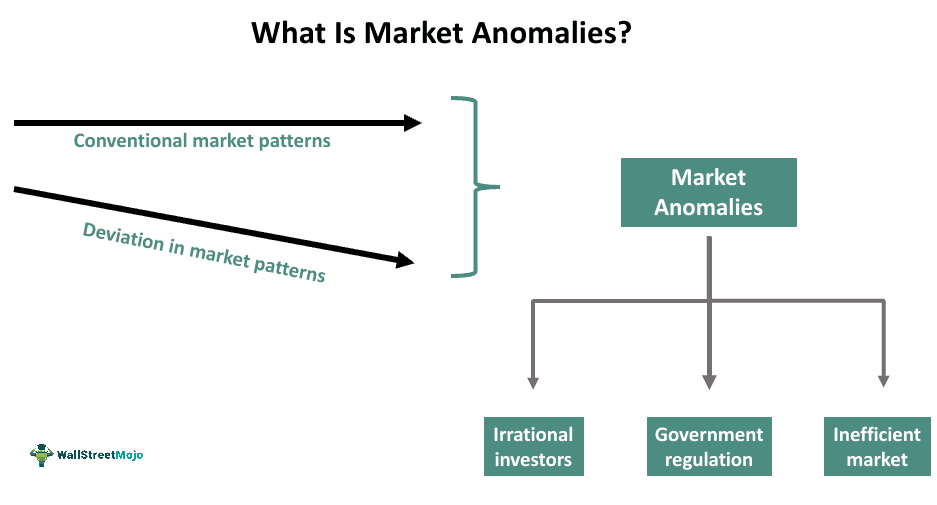

## Table of Contents

## What are investment market anomalies?

Investment market anomalies are unusual patterns or behaviors in financial markets that don't match what we expect from standard financial theories. These anomalies can be things like certain stocks doing better at certain times of the year, or small companies beating big ones more often than they should. They show that markets don't always work the way we think they should, and this can give investors a chance to make money if they can spot these patterns.

One famous example of a market anomaly is the "January effect," where stocks, especially small ones, tend to do better in January than in other months. Another example is the "momentum effect," where stocks that have been going up keep going up, and stocks that have been going down keep going down. These patterns challenge the idea that markets are always efficient and that all available information is already reflected in stock prices. Understanding these anomalies can help investors make smarter choices and possibly earn higher returns.

## How do market anomalies differ from market efficiency?

Market anomalies and market efficiency are two ideas that help us understand how financial markets work. Market efficiency means that all the information out there is already included in the prices of stocks and other investments. This means it's hard to beat the market because all the information everyone knows is already used to set the prices. If markets are efficient, then you can't use past price patterns or other tricks to do better than the market average.

Market anomalies, on the other hand, are patterns or behaviors in the market that don't fit with the idea of market efficiency. These are things like stocks doing better in certain months or small companies beating big ones more often than expected. Anomalies show that sometimes markets don't use all the information perfectly, and there might be ways to use these patterns to make more money. So, while market efficiency says everything is already priced in, market anomalies suggest there are still some surprises and opportunities in the market.

## What are some common types of market anomalies?

Market anomalies are patterns in the stock market that don't match what we expect from standard theories. One common type is the "January effect," where stocks, especially smaller ones, tend to do better in January than in other months. This might happen because people sell stocks at the end of the year to claim tax losses and then buy them back in January. Another type is the "[momentum](/wiki/momentum) effect," where stocks that have been going up keep going up, and stocks that have been going down keep going down. This goes against the idea that past performance doesn't predict future results.

Another common anomaly is the "size effect," where smaller companies often do better than bigger ones, even though bigger companies are usually seen as safer. The "value effect" is also well-known, where stocks that seem underpriced based on their earnings or book value tend to do better than stocks that are seen as overvalued. These patterns show that the market doesn't always work the way we think it should, and investors can sometimes use these patterns to make more money.

## Can you explain the January effect?

The January effect is a pattern where stocks, especially smaller ones, tend to do better in January than in other months. People noticed this a long time ago and it's still something that happens pretty often. One reason this might happen is because people sell their stocks at the end of the year to claim tax losses. When they do this, it can make the stock prices go down. Then, in January, they buy the stocks back, which can push the prices up again.

This pattern challenges the idea that markets are always efficient. If markets were perfect, then all the information about taxes and selling stocks should already be included in the prices. But the January effect shows that sometimes the market doesn't work that way. Investors who know about this pattern might try to buy stocks at the end of December and sell them in January to make some extra money. However, because so many people know about the January effect now, it might not work as well as it used to.

## What is the momentum effect and how does it work?

The momentum effect is when stocks that have been going up keep going up, and stocks that have been going down keep going down. It's like a trend that keeps going for a while. People see that a stock is doing well, so they buy it, which makes the price go up even more. On the other hand, if a stock is doing badly, people might sell it, which makes the price go down even more. This can last for several months, which is why it's called momentum.

This effect goes against the idea that past performance doesn't predict future results. If markets were perfect, then all the information about a stock should already be in its price, and it shouldn't matter if it went up or down before. But the momentum effect shows that sometimes the market doesn't work that way. Investors who know about this might try to buy stocks that are going up and sell stocks that are going down to make money from the trend. However, because so many people know about the momentum effect now, it might not work as well as it used to.

## How does the size effect influence investment decisions?

The size effect means that smaller companies often do better than bigger ones. This is surprising because big companies are usually seen as safer and more stable. But studies have shown that over time, small companies can give you bigger returns on your money. This happens because small companies have more room to grow and can sometimes be overlooked by investors, which means their stock prices might be lower than they should be.

Investors who know about the size effect might choose to put their money into small companies instead of big ones. They hope to get higher returns because these small companies could grow a lot. But it's also riskier because small companies can fail more easily. So, investors need to think carefully about how much risk they want to take and maybe mix small company stocks with bigger, safer ones to balance things out.

## What role do behavioral biases play in creating market anomalies?

Behavioral biases are ways that people's thinking can be off, and these can help create market anomalies. For example, people often follow the crowd and buy stocks that are already going up, which can make the momentum effect happen. They might also be more scared of losing money than excited about making money, so they sell stocks that are going down, which can make those stocks keep going down. These biases mean that people don't always make choices based on all the information they have, which can lead to patterns in the market that don't make sense if you just look at the numbers.

Another way biases create anomalies is through overconfidence. People might think they know more than they do, so they buy or sell stocks based on their gut feeling rather than facts. This can lead to things like the January effect, where people sell stocks at the end of the year to save on taxes and then buy them back in January. These actions, driven by biases, can make stock prices move in ways that don't match what we expect from perfect markets. So, understanding these biases can help explain why market anomalies happen and how investors might use them to make better choices.

## How can investors identify market anomalies?

Investors can identify market anomalies by looking at patterns in stock prices that don't match what we expect from normal market behavior. They might use data and charts to see if stocks do better at certain times of the year, like in January, or if smaller companies do better than bigger ones over time. They can also look at how stocks that have been going up keep going up, which is called the momentum effect. By studying these patterns and comparing them to what should happen if markets were perfect, investors can spot anomalies.

Another way to find market anomalies is by understanding how people's behavior affects the market. People often make decisions based on feelings or habits, not just facts. For example, they might sell stocks at the end of the year to save on taxes, which can make stock prices go down and then up again in January. Or they might follow the crowd and buy stocks that are already going up, which can make the momentum effect stronger. By watching these behaviors and how they lead to unusual patterns, investors can better identify market anomalies and maybe use them to make smarter investment choices.

## What strategies can investors use to exploit market anomalies?

Investors can use market anomalies to their advantage by timing their buys and sells to match these unusual patterns. For example, if they believe in the January effect, they might buy stocks at the end of December when prices are low due to tax selling and then sell them in January when prices tend to go up. Another strategy is to focus on the momentum effect, where they buy stocks that have been going up and sell stocks that have been going down, hoping to ride the trend for a few more months. By understanding these patterns, investors can make decisions that might give them better returns than just following the market.

Another way to exploit market anomalies is by investing in smaller companies, taking advantage of the size effect. Since small companies often do better than big ones over time, investors might choose to put more of their money into these smaller stocks, hoping for higher growth. However, this comes with more risk, so they might mix these with bigger, safer stocks to balance things out. By carefully watching market patterns and understanding how people's behavior can create these anomalies, investors can make smarter choices and possibly earn more money.

## What are the risks associated with investing based on market anomalies?

Investing based on market anomalies can be risky because these patterns don't always happen. Just because a stock did well in January last year doesn't mean it will do well this January. The market can change, and what worked before might not work again. Also, a lot of people know about these anomalies now, so they might not be as strong as they used to be. If too many people try to use the same strategy, it can make the anomaly disappear.

Another risk is that focusing on anomalies can make investors ignore other important things. They might miss out on good investments that don't fit the pattern they're looking for. Plus, trying to time the market based on these anomalies can lead to more trading, which means more fees and taxes. If the anomaly doesn't work out, these extra costs can eat into any profits they might have made. So, while market anomalies can offer chances to make money, they also come with a lot of risks that investors need to think about carefully.

## How have market anomalies been affected by increased market efficiency over time?

Over time, as markets have become more efficient, market anomalies have become less strong. More people know about these patterns now, so they try to use them to make money. When a lot of people do this, it can make the anomaly go away. For example, if everyone knows about the January effect and tries to buy stocks in December and sell them in January, the pattern might not work as well anymore. This is because the market adjusts to what people are doing, and the unusual patterns get smaller or disappear.

Even though market anomalies are not as strong as they used to be, they can still happen sometimes. Markets are not perfect, and people's behavior can still create unusual patterns. But investors need to be careful because these patterns are harder to spot and use now. They might need to look at more data and be ready for the anomaly to not work out. So, while market efficiency has made anomalies less common and less powerful, they can still offer chances to make money if investors are smart and careful.

## What advanced statistical methods are used to detect and analyze market anomalies?

To find and study market anomalies, people use fancy math and computer tools. One common method is called regression analysis. This helps them see if there's a pattern in the stock prices that doesn't match what we expect. They can look at things like how stocks do in different months or how small companies do compared to big ones. Another method is time series analysis, which looks at how stock prices change over time. This can help them spot trends like the momentum effect, where stocks keep going up or down for a while.

Another tool they use is called event study methodology. This helps them see how stock prices react to big news or events, like a company announcing good or bad news. By looking at these reactions, they can find patterns that might be anomalies. They also use [machine learning](/wiki/machine-learning), which is a type of computer program that can learn from data. Machine learning can find very small patterns that might be hard for people to see. All these methods help investors understand market anomalies better and maybe use them to make smarter choices.

## References & Further Reading

[1]: Bergstra, J., Bardenet, R., Bengio, Y., & Kégl, B. (2011). ["Algorithms for Hyper-Parameter Optimization."](https://papers.nips.cc/paper/4443-algorithms-for-hyper-parameter-optimization) Advances in Neural Information Processing Systems 24.

[2]: ["Advances in Financial Machine Learning"](https://www.amazon.com/Advances-Financial-Machine-Learning-Marcos/dp/1119482089) by Marcos Lopez de Prado

[3]: ["Evidence-Based Technical Analysis: Applying the Scientific Method and Statistical Inference to Trading Signals"](https://www.amazon.com/Evidence-Based-Technical-Analysis-Scientific-Statistical/dp/0470008741) by David Aronson

[4]: ["Machine Learning for Algorithmic Trading"](https://github.com/stefan-jansen/machine-learning-for-trading) by Stefan Jansen

[5]: ["Quantitative Trading: How to Build Your Own Algorithmic Trading Business"](https://www.amazon.com/Quantitative-Trading-Build-Algorithmic-Business/dp/1119800064) by Ernest P. Chan