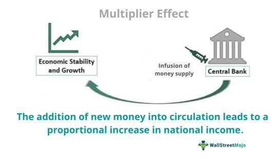

The intersection of investment economics and algorithmic trading introduces a compelling narrative of multiplier effects within financial systems. In this article, we examine how economic theories like the investment multiplier apply to modern finance. The investment multiplier, a fundamental concept within Keynesian economics, reflects how an initial change in spending can lead to a more than proportional change in aggregate income and expenditure. This classical insight gains new relevance when viewed alongside algorithmic trading strategies that drive today's financial markets. Exploring the implications of these concepts, especially when analyzed through the lens of algorithmic trading, provides insightful perspectives for investors and economists alike.

Algorithmic trading, employing sophisticated mathematical models and immense computational power, can influence how quickly and extensively multiplier effects pervade financial markets. By executing high-frequency trades, algorithms can impact prices and liquidity at unprecedented speeds, reshaping how monetary stimuli ripple through the economy. This interaction highlights the need for financial strategies to consider both technical agility and theoretical grounding in economic principles.



We aim to uncover how these financial strategies not only reflect but also reshape economic landscapes. The translation of economic theory into trading algorithms manifests in real-time market reactions, influencing everything from asset prices to the effectiveness of fiscal policies. Thus, understanding the dual impact of multiplier economics and algorithmic trading is essential for navigating modern financial systems.

The intersection of these domains has profound implications for financial markets and policy-making. As algorithmic trading becomes increasingly dominant, its ability to magnify or mitigate multiplier effects must be considered by policymakers. This dual-edged sword can enhance market efficiency but also introduce volatility and systemic risk, necessitating comprehensive strategies that balance innovation with stability. As we explore these interactions, the importance of integrating economic insights with technological advancements becomes clear, enabling better-informed decisions that shape future financial realities.

## Table of Contents

## Understanding the Investment Multiplier

The investment multiplier is a fundamental concept in Keynesian economics, quantifying how initial investments can lead to greater levels of aggregate income. This theoretical framework reflects a chain reaction whereby an investment not only affects the sector it directly finances but also sets off a cascade of economic transactions that amplify its initial impact. The effectiveness of the multiplier is primarily driven by the marginal propensity to consume (MPC) and the marginal propensity to save (MPS). These behavioral propensities dictate the degree to which additional income is spent or saved by consumers, thereby influencing the subsequent rounds of spending.

Mathematically, the investment multiplier ($k$) can be expressed as:

$$
k = \frac{1}{1 - MPC} = \frac{1}{MPS}
$$

where $MPC$ is the marginal propensity to consume. For example, if individuals spend 80% of any increase in income (i.e., $MPC = 0.8$), the multiplier effect is:

$$
k = \frac{1}{1 - 0.8} = 5
$$

This implies that an initial investment would expand the overall economic activity by a [factor](/wiki/factor-investing) of five, as each round of spending feeds into the next.

Consider a practical example: a government injects an additional $1 million into infrastructure projects. If the $MPC$ is 0.8, the multiplier effect would potentially generate an additional $5 million in economic activity. The process unfolds as contractors and suppliers receiving the initial $1 million purchase goods and services, whose providers, in turn, spend their increased earnings.

However, real-world applications of the investment multiplier consider several complexities. Leakage factors such as taxes, imports, and financial savings can reduce the magnitude of the multiplier effect. When calculating potential impacts, economists adjust for these leakages to derive a more accurate representation of economic growth.

The investment multiplier's role in economic stability is significant. By understanding the multiplier effect, policymakers can design fiscal strategies to either stimulate or temper economic activity. During periods of recession, an increased multiplier effect can help resuscitate economic growth through deliberate investment measures. Conversely, it can also flag potential overheating in an economy, advising necessary counter-cyclical policies.

Effective application and management of the investment multiplier involve balancing consumer behavior with appropriate fiscal actions, underscoring its importance in fostering stable economic environments.

## Algorithmic Trading in Modern Finance

Algorithmic trading, often referred to as algo-trading, deploys sophisticated algorithms to execute trading orders at speeds and volumes that surpass human capabilities. These algorithms follow pre-defined criteria, such as timing, price, and [volume](/wiki/volume-trading-strategy), to facilitate trades. The fundamental advantage of [algorithmic trading](/wiki/algorithmic-trading) lies in its ability to enhance market efficiency. By enabling rapid transactions, it contributes to increased market [liquidity](/wiki/liquidity-risk-premium), allowing for narrower bid-ask spreads and thus, reduced transaction costs for participants.

The integration of algorithmic trading into financial markets has been bolstered by technological advancements. Artificial Intelligence (AI) and [machine learning](/wiki/machine-learning) have pushed the frontiers of algorithmic capabilities, allowing algorithms to learn from vast datasets and adapt to market conditions in real-time. This has facilitated the development of predictive models that identify potential trading opportunities with heightened precision.

Although algorithmic trading presents substantial benefits, it is not devoid of challenges and risks. The speed and volume at which transactions occur can sometimes lead to systemic risks, such as market manipulation and flash crashes. For instance, algorithms executing a large number of trades simultaneously may lead to significant [volatility](/wiki/volatility-trading-strategies) within the market, triggering rapid price fluctuations. Flash crashes, like the infamous event on May 6, 2010, highlight the potential for cascading failures within automated trading systems. During this incident, the Dow Jones Industrial Average suffered its largest intraday point drop due to high-frequency trading algorithms amplifying short-term volatility.

Moreover, there are concerns regarding market fairness. High-frequency trading firms investing heavily in advanced technologies can potentially exploit market inefficiencies more effectively than less technologically equipped traders, leading to a disproportionate advantage.

```python
# Example: A simple moving average crossover strategy in Python
import numpy as np
import pandas as pd

def moving_average_crossover(data, short_window, long_window):
    """
    A simple moving average crossover strategy.

    Parameters:
    - data:          Pandas DataFrame with a 'Close' column for closing prices
    - short_window:  Integer, window for the short moving average
    - long_window:   Integer, window for the long moving average

    Returns:
    - signals:       Pandas DataFrame with 'signal' column indicating buy/sell signals
    """
    signals = pd.DataFrame(index=data.index)
    signals['signal'] = 0.0

    # Create the short and long simple moving averages
    signals['short_mavg'] = data['Close'].rolling(window=short_window, min_periods=1).mean()
    signals['long_mavg'] = data['Close'].rolling(window=long_window, min_periods=1).mean()

    # Create the signals
    signals['signal'][short_window:] = np.where(signals['short_mavg'][short_window:] > signals['long_mavg'][short_window:], 1.0, 0.0)

    # Generate trading orders
    signals['positions'] = signals['signal'].diff()

    return signals
```

Regulatory bodies have been working to mitigate the risks associated with algorithmic trading. Initiatives aim to enhance transparency, implement circuit breakers to prevent market crashes, and enforce monitoring mechanisms to track algorithmic activities. As the financial landscape evolves, adaptive regulatory frameworks are crucial to ensure market integrity while promoting innovation.

Overall, the integration of algorithmic trading in modern finance exemplifies a significant shift in trading practices, characterized by enhanced efficiency and novel challenges. The balance between leveraging technological advancements and safeguarding market stability remains a pivotal focus for financial institutions and regulators alike.

## The Interaction Between Multiplier Economics and Algorithmic Trading

The interaction between multiplier economics and algorithmic trading is a complex and dynamic component of modern financial markets. It encapsulates how automated trading systems can intensify or moderate the effects of economic multipliers, thereby impacting market stability and policy-making.

Algorithmic trading can amplify the multiplier effects by rapidly responding to economic inputs such as [interest rate](/wiki/interest-rate-trading-strategies) changes. For instance, when a central bank alters interest rates, the immediate response required by human traders is often limited by their capacity to process and act on information. However, algorithmic trading systems can instantaneously interpret these changes and execute trades based on predefined criteria, leading to swift and large-scale market movements. This rapid response can magnify the initial economic stimuli, either by accelerating investment in response to lower interest rates or by withdrawing assets when rates increase.

The algorithmic trading environment can also exacerbate or dampen market volatility during economic shocks or fiscal policy changes. When fiscal policies are introduced, aiming to stimulate economic activity through mechanisms such as tax cuts or increased government spending, the anticipated multiplier effect can be either enhanced or subdued by the actions of trading algorithms. These systems can react in concert, causing market trends to either surge or falter more dramatically than they would in a manual trading environment.

Prominent examples illustrating these dynamics include flash crash events, where rapid, concentrated, and often cascading trading actions by algorithms have led to precipitous declines in market value, followed by just as rapid recoveries. The Flash Crash of May 6, 2010, serves as a stark example where a massive order executed via algorithmic trading triggered a sudden liquidity vacuum, leading to a severe market drop. These events have highlighted how automated systems can heighten the sensitivity of markets to fiscal stimuli, sometimes leading to disproportionate responses compared to the underlying economic realities.

The implications of the intersection between multiplier economics and algorithmic trading are significant for market stability and policy-making. Policymakers must consider how algorithmic trading may alter the intended effects of economic measures. Regulatory frameworks may need to be re-evaluated to address these considerations, ensuring financial markets remain stable and resilient in the face of advanced trading technologies. Moreover, understanding these interactions better equips economists and financial analysts to forecast market reactions to economic policy more accurately, facilitating more informed decision-making in both arenas.

## Future Trends and Implications

As technology and financial markets evolve, the interactions between multiplier economics and algorithmic trading are poised to become increasingly significant. The ongoing advancements in [artificial intelligence](/wiki/ai-artificial-intelligence) and big data analytics are central to this transformation, offering enhanced predictive capabilities that can unlock new opportunities while presenting unique challenges and risks.

AI and big data analytics allow for sophisticated models that anticipate market trends and identify investment opportunities with an unprecedented level of precision. These technologies can process vast amounts of data in real-time, thereby enhancing the capacity to predict financial market movements and their subsequent economic impacts. This predictive prowess, while potentially advantageous for optimizing investment strategies, also raises concerns about the amplification of market volatility. The existence of highly reactive algorithmic strategies may cause abrupt market changes, leading to heightened systemic risks.

Regulatory frameworks play a crucial role in navigating these developments. As algorithmic trading strategies become more advanced, ensuring market integrity and protecting investors become increasingly complex. Policymakers must develop regulations that keep pace with rapid technological advancements, addressing potential risks without stifling innovation. Solutions such as implementing circuit breakers to prevent flash crashes and promoting transparency in algorithmic trading could help maintain stability. Additionally, encouraging the ethical use of AI in finance can mitigate risks associated with automatic trading decisions that might disproportionately affect market participants.

Looking ahead, the future trends suggest a more integrated approach to economic strategies, blending traditional economic principles with contemporary technological innovations. Regulatory efforts will need to focus on both national and international levels to address the cross-border nature of financial markets. As algorithmic trading becomes increasingly prevalent, the dialogue between regulators, financial institutions, and technology developers will be essential in crafting policies that support both market efficiency and robustness.

In summary, as algorithmic trading and multiplier economics become more intertwined, the financial sector must adapt to harness the benefits while managing the inherent risks. Such adaptation will require a balanced regulatory approach that embraces technological advancements, striving for a financial ecosystem that fosters innovation, stability, and investor confidence.

## Conclusion

The fusion of multiplier economics and algorithmic trading is reshaping financial systems through its complex interplay of macroeconomic principles and advanced technological practices. At the heart of this fusion is the investment multiplier, a concept rooted in Keynesian economics, which demonstrates how initial investment spending can trigger comprehensive economic expansion. When this principle interacts with algorithmic trading, characterized by unparalleled speed and volume of transactions, it generates significant strategic insights that are crucial in modern finance.

These insights underscore the need for ongoing research and adaptation, as they are critical in navigating the modern financial landscape. Financial professionals are tasked with the integration of these multidimensional insights into practice, carefully crafting strategies that are attuned to both economic realities and the potential offered by technological advancements. This integration is essential for sustaining market stability and enhancing the efficiency of financial systems.

A comprehensive understanding of how multiplier economics and algorithmic trading interact is pivotal. Such understanding facilitates more informed decision-making and can improve market functionality. For example, consider the rapid propagation of economic changes, such as shifts in interest rates, through algorithmic systems; understanding these dynamics allows for proactive strategies that can minimize adverse effects and capitalize on positive opportunities.

Incorporating these insights, professionals in the financial sector can enhance market resilience and adaptability to future economic shifts. This requires not only technical competence but also a nuanced understanding of economic theories and their practical ramifications in algorithmic trading environments. As such, continued exploration and refinement of these strategies will remain critical in shaping the future trajectory of global financial markets.

## References & Further Reading

- Blinder, A. S. (2008). "The Case for a Strong Stimulus." NBER Working Paper No. 13862. This paper discusses the rationale behind implementing significant fiscal stimuli to overcome economic downturns, focusing on multiplier effects. Available at: http://www.nber.org/papers/w13862.

- Bordo, M. D., & Haubrich, J. G. (2017). "Deep Recessions, Fast Recoveries, and Financial Crises." NBER Working Paper No. 23554. This research examines historical financial cycles, emphasizing the role of multipliers in economic recoveries post-crisis. Available at: http://www.nber.org/papers/w23554.

- Carney, M. (2018). "The Future of Money." Speech by Mark Carney, Governor of the Bank of England, explores implications of technological advancements like algorithmic trading on economic policies. Available at: https://www.bankofengland.co.uk/speech/2018/the-future-of-money.

- BIS (2011). "High-Frequency Trading in the Foreign Exchange Market." Markets Committee Publications. This report analyzes the impact of high-frequency trading on forex markets, addressing concerns of market manipulation and liquidity. Available at: https://www.bis.org/publ/mktc05.pdf.

- Haldane, A. G. (2011). "The Race to Zero." Bank of England. A discussion on the effects of algorithmic trading speed on financial stability and market integrity, reflecting broader economic patterns. Available at: https://www.bankofengland.co.uk/speech/2011/the-race-to-zero.

- Lopez de Prado, M. (2018). "Advances in Financial Machine Learning." Wiley. This book introduces machine learning applications in trading strategies, offering insights into the evolving landscape of algorithmic trading. Available at: https://www.wiley.com/en-us/Advances+in+Financial+Machine+Learning-p-9781119482086.

