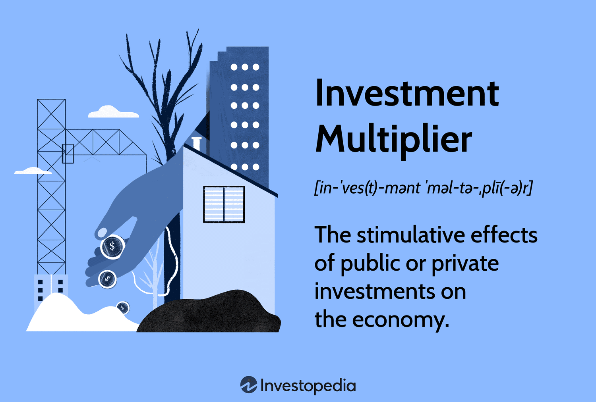

## Table of Contents

## What is the investment multiplier effect?

The investment multiplier effect is a concept in economics that explains how an initial increase in investment can lead to a larger increase in overall economic output. When a business or government invests money, it doesn't just affect the immediate recipient of that money. Instead, the money keeps circulating through the economy, creating a ripple effect. For example, if a company builds a new factory, it pays workers and buys materials. Those workers and suppliers then spend their earnings, causing more economic activity.

This multiplier effect happens because one person's spending becomes another person's income. As money moves from one person to another, each round of spending adds to the total economic output. The size of the multiplier depends on how much of the additional income people spend rather than save. If people tend to spend a lot, the multiplier effect will be larger. Economists use this concept to predict how changes in investment might impact the overall economy and to guide policy decisions.

## How does the investment multiplier effect work?

The investment multiplier effect is like a chain reaction that starts with someone spending money. Imagine a company decides to build a new factory. They spend money to buy materials and hire workers. Those workers and suppliers then have more money to spend on things they need or want, like food, clothes, or even going to the movies. Each time someone spends money, it goes to someone else, who then spends it again. This keeps going, making the economy grow bigger than the original amount of money that was spent.

The size of this effect depends on how much people choose to spend instead of saving. If people spend most of their extra money, the chain reaction gets bigger and bigger. But if they save a lot, the effect is smaller because the money doesn't keep moving around as much. Economists use this idea to understand how new investments can help the whole economy and to make decisions about things like taxes or government spending.

## What is the formula for calculating the investment multiplier?

The formula for calculating the investment multiplier is simple. It's just 1 divided by (1 minus the marginal propensity to consume). The marginal propensity to consume, or MPC, is a fancy way to say how much of an extra dollar people will spend. If people spend 80 cents of every extra dollar they get, then the MPC is 0.80.

Let's use an example. If the MPC is 0.80, then the formula looks like this: 1 divided by (1 - 0.80). That's 1 divided by 0.20, which equals 5. So, if someone invests $100, the total impact on the economy could be $500 because of the multiplier effect.

## Can you provide an example of the investment multiplier effect in action?

Imagine a small town where a new factory is built. The company spends $1 million to build it. They hire workers and buy materials from local businesses. The workers get paid and use their money to buy things like groceries and clothes. The local businesses that sold materials to the factory also have more money to spend. This spending keeps going around the town, making the economy grow.

Let's say people in this town spend 80 cents of every extra dollar they get. That means the investment multiplier is 5. So, the $1 million spent on the factory could lead to a total of $5 million in economic activity. The town gets busier, more people have jobs, and everyone benefits from the money moving around.

## How does the investment multiplier effect influence economic growth?

The investment multiplier effect helps the economy grow by making money move around more. When a company or the government spends money on something big like a new factory or a road, it doesn't just help the people who get paid for that work. Those people then spend their money on things they need, like food and clothes. This spending helps other businesses and workers, who then spend their money too. It's like a chain reaction that keeps going, making the economy bigger than it was before.

This effect can be really powerful because it can turn a small amount of money into a lot more economic activity. If people tend to spend most of their extra money, the multiplier effect gets even bigger. That's why governments and businesses pay attention to it. They know that by investing in things like infrastructure or new businesses, they can help the whole economy grow. It's a way to get more out of the money they spend and help everyone in the economy.

## What factors can affect the size of the investment multiplier?

The size of the investment multiplier depends on how much people spend out of their extra money. If people spend a lot, the multiplier will be bigger because the money keeps moving around the economy. But if people save a lot of their extra money, the multiplier will be smaller because the money doesn't keep circulating as much. This is called the marginal propensity to consume, or how much of an extra dollar people will spend.

Other things can also change the size of the multiplier. For example, if there are a lot of taxes, people have less money to spend, so the multiplier might be smaller. Also, if a country imports a lot of goods, the money spent might go to another country instead of staying in the local economy. These factors can make the multiplier effect stronger or weaker, depending on how they affect spending and saving in the economy.

## How does the marginal propensity to consume relate to the investment multiplier?

The marginal propensity to consume, or MPC, is how much of an extra dollar people will spend. It's really important for figuring out the investment multiplier. The investment multiplier shows how much the whole economy can grow from just a little bit of spending. If the MPC is high, it means people spend most of their extra money, and this makes the multiplier bigger. The formula for the multiplier is 1 divided by (1 minus the MPC). So, if people spend 80 cents of every extra dollar, the MPC is 0.80, and the multiplier is 5.

When the MPC is high, the money keeps moving around the economy more. This makes the effect of the initial spending bigger. For example, if a company builds a new factory and the MPC is high, the workers and suppliers will spend their money, which helps other businesses and people. This chain reaction can turn a small amount of money into a lot more economic activity. So, the MPC is a key part of understanding how investments can help the whole economy grow.

## What are the limitations of the investment multiplier effect?

The investment multiplier effect can help the economy grow, but it has some limits. One big limit is that it assumes people will keep spending their extra money. If people start saving a lot instead of spending, the multiplier effect gets smaller. Also, if the economy is already working at full capacity, new spending might just make prices go up instead of making more stuff. This is called inflation, and it can make the multiplier effect less helpful.

Another limit is that the multiplier effect can be different in different places. If a country buys a lot of things from other countries, the money might leave the local economy instead of staying and helping it grow. Also, taxes can take money away from people, so they have less to spend. These things can make the multiplier effect smaller than we might expect. It's important to think about these limits when trying to use the multiplier effect to help the economy.

## How do different economic theories interpret the investment multiplier effect?

Different economic theories look at the investment multiplier effect in their own ways. In Keynesian economics, the multiplier effect is a big deal. Keynesians think that when the government spends money or when businesses invest, it can really help the economy grow. They believe that if people spend most of their extra money, the multiplier effect can be huge. This idea helps them argue for things like government spending on roads or schools to help the economy when it's not doing well.

On the other hand, classical and neoclassical economists are not as sure about the multiplier effect. They think that the economy can fix itself without help. They worry that if the government spends too much, it might just make prices go up instead of making the economy grow. They also think that people might save their extra money instead of spending it, which would make the multiplier effect smaller. So, they are more cautious about using the multiplier effect to guide economic policy.

## What role does government policy play in enhancing the investment multiplier effect?

Government policy can help make the investment multiplier effect stronger. When the government spends money on things like building roads, schools, or hospitals, it can start a chain reaction in the economy. This spending gives people jobs and money to spend, which helps other businesses and creates more jobs. If the government also makes it easier for businesses to invest, like by giving them tax breaks or loans, it can encourage more spending and investment. This can make the multiplier effect bigger because more money is moving around the economy.

However, government policy needs to be careful. If the government spends too much money when the economy is already doing well, it might just make prices go up instead of helping the economy grow. Also, if the government raises taxes too much, people might have less money to spend, which could make the multiplier effect smaller. So, the government needs to find a good balance to make sure its policies help the economy grow without causing other problems like inflation.

## How can the investment multiplier effect be measured in real economic data?

To measure the investment multiplier effect in real economic data, economists look at how much the economy grows after there's new spending or investment. They start by figuring out how much money was spent, like if the government built a new road or a company opened a factory. Then, they watch how this spending moves through the economy. They look at things like how much more people are spending, how many new jobs are created, and how much the total output of the economy goes up. By comparing the initial spending to the total increase in economic activity, economists can estimate the size of the multiplier effect.

For example, if the government spends $1 billion on a new highway and the economy grows by $5 billion, the multiplier might be around 5. Economists use different data sources like national income accounts, employment data, and consumer spending surveys to get these numbers. They also need to think about other things happening in the economy at the same time, like changes in interest rates or global events, which can affect their measurements. By carefully analyzing all this data, economists can get a good idea of how strong the investment multiplier effect is in real life.

## What are some advanced models that incorporate the investment multiplier effect?

One advanced model that uses the investment multiplier effect is the Dynamic Stochastic General Equilibrium (DSGE) model. This model tries to understand how the whole economy works by looking at how different parts, like households, businesses, and the government, interact. It includes things like how much people spend and how much businesses invest. The DSGE model can show how a change in investment can lead to more spending and growth in the economy. It's like a big computer game that helps economists see what might happen if the government spends more money or if businesses invest more.

Another model is the Input-Output model, which was created by Wassily Leontief. This model looks at how different industries depend on each other. If one industry, like car manufacturing, gets a boost from new investment, it needs more parts from other industries, like steel and rubber. This creates a chain reaction where more spending in one part of the economy can help many other parts. The Input-Output model can help show how the investment multiplier effect spreads through the economy, making it grow bigger than the original amount spent.

## What is the Investment Multiplier and how does it work?

The investment multiplier is a fundamental concept in Keynesian economics, quantifying how initial investments can lead to greater levels of aggregate income. This theoretical framework reflects a chain reaction whereby an investment not only affects the sector it directly finances but also sets off a cascade of economic transactions that amplify its initial impact. The effectiveness of the multiplier is primarily driven by the marginal propensity to consume (MPC) and the marginal propensity to save (MPS). These behavioral propensities dictate the degree to which additional income is spent or saved by consumers, thereby influencing the subsequent rounds of spending.

Mathematically, the investment multiplier ($k$) can be expressed as:

$$
k = \frac{1}{1 - MPC} = \frac{1}{MPS}
$$

where $MPC$ is the marginal propensity to consume. For example, if individuals spend 80% of any increase in income (i.e., $MPC = 0.8$), the multiplier effect is:

$$
k = \frac{1}{1 - 0.8} = 5
$$

This implies that an initial investment would expand the overall economic activity by a [factor](/wiki/factor-investing) of five, as each round of spending feeds into the next.

Consider a practical example: a government injects an additional $1 million into infrastructure projects. If the $MPC$ is 0.8, the multiplier effect would potentially generate an additional $5 million in economic activity. The process unfolds as contractors and suppliers receiving the initial $1 million purchase goods and services, whose providers, in turn, spend their increased earnings.

However, real-world applications of the investment multiplier consider several complexities. Leakage factors such as taxes, imports, and financial savings can reduce the magnitude of the multiplier effect. When calculating potential impacts, economists adjust for these leakages to derive a more accurate representation of economic growth.

The investment multiplier's role in economic stability is significant. By understanding the multiplier effect, policymakers can design fiscal strategies to either stimulate or temper economic activity. During periods of recession, an increased multiplier effect can help resuscitate economic growth through deliberate investment measures. Conversely, it can also flag potential overheating in an economy, advising necessary counter-cyclical policies.

Effective application and management of the investment multiplier involve balancing consumer behavior with appropriate fiscal actions, underscoring its importance in fostering stable economic environments.

## References & Further Reading

- Blinder, A. S. (2008). "The Case for a Strong Stimulus." NBER Working Paper No. 13862. This paper discusses the rationale behind implementing significant fiscal stimuli to overcome economic downturns, focusing on multiplier effects. Available at: http://www.nber.org/papers/w13862.

- Bordo, M. D., & Haubrich, J. G. (2017). "Deep Recessions, Fast Recoveries, and Financial Crises." NBER Working Paper No. 23554. This research examines historical financial cycles, emphasizing the role of multipliers in economic recoveries post-crisis. Available at: http://www.nber.org/papers/w23554.

- Carney, M. (2018). "The Future of Money." Speech by Mark Carney, Governor of the Bank of England, explores implications of technological advancements like algorithmic trading on economic policies. Available at: https://www.bankofengland.co.uk/speech/2018/the-future-of-money.

- BIS (2011). "High-Frequency Trading in the Foreign Exchange Market." Markets Committee Publications. This report analyzes the impact of high-frequency trading on forex markets, addressing concerns of market manipulation and liquidity. Available at: https://www.bis.org/publ/mktc05.pdf.

- Haldane, A. G. (2011). "The Race to Zero." Bank of England. A discussion on the effects of algorithmic trading speed on financial stability and market integrity, reflecting broader economic patterns. Available at: https://www.bankofengland.co.uk/speech/2011/the-race-to-zero.

- Lopez de Prado, M. (2018). "Advances in Financial Machine Learning." Wiley. This book introduces machine learning applications in trading strategies, offering insights into the evolving landscape of algorithmic trading. Available at: https://www.wiley.com/en-us/Advances+in+Financial+Machine+Learning-p-9781119482086.

