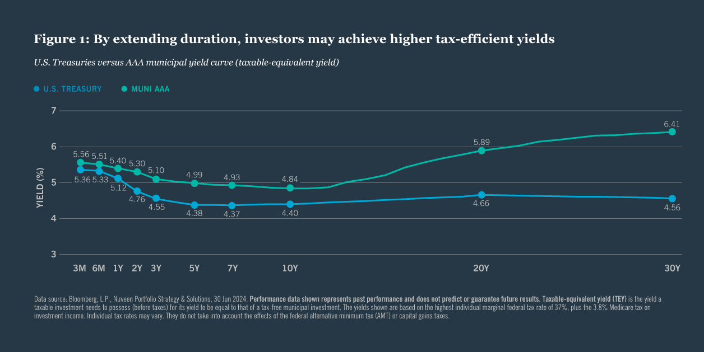

## Table of Contents

## What are municipal bonds?

Municipal bonds are loans that people give to local governments, like cities or towns, to help pay for big projects. These projects can be things like building new schools, fixing roads, or improving water systems. When you buy a municipal bond, you are lending money to the government, and in return, they promise to pay you back with interest over time. This interest is usually paid every six months until the bond reaches its maturity date, which can be anywhere from a few years to several decades.

One of the main attractions of municipal bonds is that the interest you earn is often免税的, meaning you don't have to pay federal taxes on it, and sometimes state and local taxes as well. This can make them a good choice for people looking to reduce their tax bill. However, like any investment, municipal bonds come with risks. If the local government runs into financial trouble, it might not be able to pay back the bond. So, it's important to research the financial health of the government issuing the bond before you invest.

## How do interest rates affect municipal bond prices?

Interest rates and municipal bond prices have an opposite relationship. When interest rates go up, the prices of existing municipal bonds go down. This happens because new bonds are issued with higher interest rates, making them more attractive to investors. If you want to sell your old bond, you have to lower its price to make it competitive with the new bonds that offer higher interest.

On the other hand, when interest rates go down, the prices of existing municipal bonds go up. This is because the interest rates on the old bonds are now higher compared to the new bonds being issued. Investors are willing to pay more for these old bonds because they offer better returns. So, if you own a bond and want to sell it when interest rates are low, you can ask for a higher price.

## What are the benefits of investing in municipal bonds?

Investing in municipal bonds can give you a steady income. When you buy a municipal bond, the local government pays you interest regularly, usually every six months. This can help you plan your money better because you know when you'll get paid. Also, municipal bonds are often seen as safe investments. The chance of a local government not paying back the bond is low, so your money is pretty secure.

Another big benefit of municipal bonds is that the interest you earn is often tax-free. This means you don't have to pay federal taxes on the interest, and sometimes you don't have to pay state and local taxes either. This can save you a lot of money, especially if you're in a high tax bracket. So, even though the interest rate might be lower than other investments, the tax savings can make municipal bonds a smart choice for your money.

## What are the risks associated with municipal bonds?

One risk with municipal bonds is that the local government might not be able to pay you back. If the city or town runs into money problems, they might not have enough to pay the interest or return your investment when the bond matures. This is called default risk. While it doesn't happen often, it's something to think about, especially if you're looking at bonds from smaller or less financially stable places.

Another risk is that interest rates might change. If rates go up after you buy a bond, the value of your bond can go down. This is because new bonds will be issued with higher interest rates, making your older bond less attractive to other investors. If you need to sell your bond before it matures, you might have to sell it for less than what you paid. This is called interest rate risk.

Lastly, there's also the risk of inflation. If the cost of things goes up a lot, the money you get from the bond might not be worth as much as when you first invested. This means your investment might not grow as much as you hoped, especially if you're relying on the bond's income to keep up with rising prices.

## How can an investor assess the creditworthiness of a municipal bond?

To assess the creditworthiness of a municipal bond, an investor should first look at the bond's credit rating. Credit rating agencies like Moody's, Standard & Poor's, and Fitch rate municipal bonds based on the financial health of the issuing government. A higher rating means the bond is less likely to default, making it safer. You can find these ratings on financial websites or through the bond issuer's official documents.

Another way to assess creditworthiness is by looking at the financial statements of the local government. These statements show how much money the government is making and spending, and how much debt they have. If the government has a lot of debt or is spending more money than it's making, it might be riskier to invest in their bonds. You can usually find these statements on the government's website or by contacting their finance department.

Lastly, consider the economic conditions of the area where the bond is issued. If the local economy is strong, with lots of jobs and growing businesses, the government is more likely to have the money to pay back the bond. On the other hand, if the area is struggling economically, it might be harder for the government to keep up with their payments. Talking to local experts or reading local news can give you a good sense of the economic health of the area.

## What is the tax advantage of investing in municipal bonds?

One big advantage of investing in municipal bonds is that the interest you earn is often tax-free. This means you don't have to pay federal taxes on the interest, and sometimes you don't have to pay state and local taxes either. This can save you a lot of money, especially if you're in a high tax bracket. So, even though the interest rate might be lower than other investments, the tax savings can make municipal bonds a smart choice for your money.

For example, if you're in a high tax bracket and you invest in a regular bond, you might have to give a big part of your interest earnings to the government in taxes. But with a municipal bond, you get to keep all of that interest. This makes the actual return on your investment higher than it might seem at first glance. That's why many people, especially those looking to reduce their tax bill, find municipal bonds attractive.

## How do rising interest rates impact the yield of municipal bonds?

When interest rates go up, the yield on new municipal bonds also goes up. This is because new bonds are issued with higher interest rates to attract investors. If you're thinking about buying a new municipal bond, you'll see that it offers a higher yield than before. This makes new bonds more appealing because you can earn more interest on your investment.

However, if you already own a municipal bond, rising interest rates can make your bond less valuable. The yield on your existing bond stays the same, but because new bonds offer higher yields, the price of your old bond might go down. If you want to sell your bond before it matures, you might have to sell it for less than what you paid for it. This is why it's important to think about how long you plan to hold onto your bond when interest rates are changing.

## What strategies can investors use to manage interest rate risk in municipal bonds?

One way investors can manage interest rate risk in municipal bonds is by choosing bonds with shorter maturities. Shorter-term bonds are less affected by interest rate changes because they will mature sooner, and you'll get your money back faster. This means you can reinvest that money at the new, higher interest rates if they go up. So, if you think interest rates might rise, picking bonds that mature in a few years instead of decades can help protect your investment.

Another strategy is to build a bond ladder. This means buying several bonds that mature at different times. For example, you might buy bonds that mature in one year, three years, and five years. As each bond matures, you can reinvest the money in new bonds at the current interest rates. This way, you're not putting all your money into bonds at one time, which can help you manage the risk of interest rates going up. Plus, you get a steady stream of income as the bonds mature at different times.

## How does the duration of a municipal bond influence its sensitivity to interest rate changes?

The duration of a municipal bond tells you how sensitive it is to changes in interest rates. Duration is a measure of how long it takes for the bond's cash flows (like interest payments and the return of the principal) to pay back the bond's price. If a bond has a longer duration, it means it will be more affected by interest rate changes. For example, if interest rates go up, the price of a long-duration bond will drop more than the price of a short-duration bond.

On the other hand, if a bond has a shorter duration, it is less sensitive to interest rate changes. This is because you get your money back sooner, so you can reinvest it at the new interest rates. So, if you think interest rates might go up, choosing bonds with shorter durations can help protect your investment from losing too much value. This is why understanding a bond's duration is important when you're thinking about how interest rate changes might affect your investment.

## What role do municipal bonds play in a diversified investment portfolio?

Municipal bonds can be a good part of a diversified investment portfolio because they offer a steady income and are usually safe. When you invest in different kinds of assets, like stocks, bonds, and real estate, you spread out your risk. If one type of investment goes down, the others might go up or stay the same, balancing out your overall returns. Municipal bonds help with this because they pay interest regularly, which can give you a reliable source of income. Plus, since they are backed by local governments, they are often seen as less risky than other investments like stocks.

Another reason to include municipal bonds in your portfolio is the tax benefits they offer. The interest you earn from municipal bonds is often free from federal taxes, and sometimes from state and local taxes too. This can make them especially attractive if you're in a high tax bracket. By having municipal bonds in your portfolio, you can reduce your tax bill while still earning a steady income. This combination of income, safety, and tax advantages makes municipal bonds a valuable part of a well-rounded investment strategy.

## How have historical interest rate cycles affected municipal bond performance?

Interest rate cycles have a big impact on how well municipal bonds do. When interest rates go up, the prices of existing municipal bonds usually go down. This is because new bonds come out with higher interest rates, so people want to buy those instead of the older ones. If you want to sell your old bond, you might have to sell it for less money. But if you hold onto your bond until it matures, you'll still get the same interest payments, which can be good if you're looking for steady income. During times when interest rates are rising, people often look for shorter-term bonds or build bond ladders to manage the risk.

On the other hand, when interest rates go down, the prices of existing municipal bonds usually go up. This is because the interest rates on the old bonds are now higher compared to the new ones being issued. If you want to sell your bond during a time when interest rates are low, you can usually sell it for more money than you paid for it. This can be a good time to invest in longer-term bonds because they will keep paying the higher interest rate for a longer time. Overall, understanding interest rate cycles can help you make better choices about when to buy or sell municipal bonds and how to manage your investment.

## What advanced analytical tools can be used to forecast municipal bond performance amidst interest rate fluctuations?

One advanced tool that can help forecast municipal bond performance when interest rates change is duration analysis. Duration tells you how sensitive a bond is to interest rate changes. If a bond has a long duration, its price will go up a lot when interest rates go down, but it will also drop a lot when interest rates go up. By using duration analysis, investors can see how much their bond's price might change with different interest rate scenarios. This helps them plan their investments better and pick bonds that fit their risk level.

Another tool is yield curve analysis. The yield curve shows how interest rates change for bonds with different lengths of time until they mature. When the yield curve changes, it can tell you a lot about where interest rates might be headed. If the yield curve is steep, it means long-term rates are a lot higher than short-term rates, which might mean interest rates will go up. If the yield curve is flat or inverted, it might mean rates will go down. By watching the yield curve, investors can guess how interest rates might affect their municipal bonds and adjust their investment strategies accordingly.

## What is the impact of interest rate hikes on municipal bonds?

Interest rates and bond prices share an inverse relationship, a fundamental aspect of fixed-income investments. When interest rates rise, the present value of a bond's future cash flows decreases, leading to a drop in the bond's price. This is particularly relevant in the municipal bond market, where the prices of existing bonds fall as new bonds are issued with higher yields to attract investors. This dynamic can be expressed through the bond pricing formula:

$$
P = \frac{C}{(1 + r)^1} + \frac{C}{(1 + r)^2} + \ldots + \frac{C + F}{(1 + r)^n}
$$

where $P$ is the price of the bond, $C$ is the annual coupon payment, $r$ is the yield, and $F$ is the face value of the bond. As $r$ increases, the present value $P$ decreases.

Despite the negative impact on existing bond prices, rising interest rates can make newly issued municipal bonds more appealing due to the higher coupon rates they offer. These higher coupons can compensate for the increased risk premium associated with a rising [interest rate](/wiki/interest-rate-trading-strategies) environment. This creates a challenging backdrop for holders of existing bonds but offers opportunities for investors purchasing new issues. 

For existing bondholders, the challenge lies in the potential devaluation of their bond portfolios as interest rates increase. This can be particularly concerning for those who may need to liquidate assets or rebalance their portfolios. However, the opportunity emerges in the form of investing in higher-yielding new issues, offering improved income streams and the potential for capital gains if the interest rates stabilize or decrease in the future.

For investors looking to capitalize on these changes, understanding the timing and magnitude of interest rate hikes is crucial. Those with the capacity to adapt to changing conditions may benefit by strategically positioning their portfolios to include a mix of both current holdings and new bond purchases with more favorable yields.

Overall, interest rate hikes present a duality of effects on the municipal bond market, where potential losses on existing bonds may be offset by the prospects of higher returns on new purchases. Adjusting strategies in response to interest rate fluctuations is essential for maximizing returns in this evolving market landscape.

## References & Further Reading

[1]: Fabozzi, F. J. (2016). ["Bond Markets, Analysis, and Strategies,"](https://books.google.com/books/about/Bond_Markets_Analysis_and_Strategies_ten.html?id=bQpNEAAAQBAJ) 9th Edition. Pearson.

[2]: Lee, W., & Cicerone, J. (2011). ["Investing in Municipal Bonds: How to Balance Risk and Reward for Success in Today’s Bond Market"](https://www.amazon.com/INVESTING-MUNICIPAL-BONDS-Balance-Success/dp/0071809759). McGraw-Hill Education.

[3]: Choudhry, M. (2018). ["The Bond & Money Markets: Strategy, Trading, Analysis."](https://www.sciencedirect.com/book/9780750646772/the-bond-and-money-markets) Wiley Finance.

[4]: Litterman, R., & Scheinkman, J. (1991). ["Common Factors Affecting Bond Returns"](https://www.pm-research.com/content/iijfixinc/1/1/54). The Journal of Fixed Income, 1(1), 54-61.

[5]: Durbin, M. (2010). ["All About High-Frequency Trading"](https://www.mhebooklibrary.com/doi/book/10.1036/9780071743457). McGraw-Hill Education.