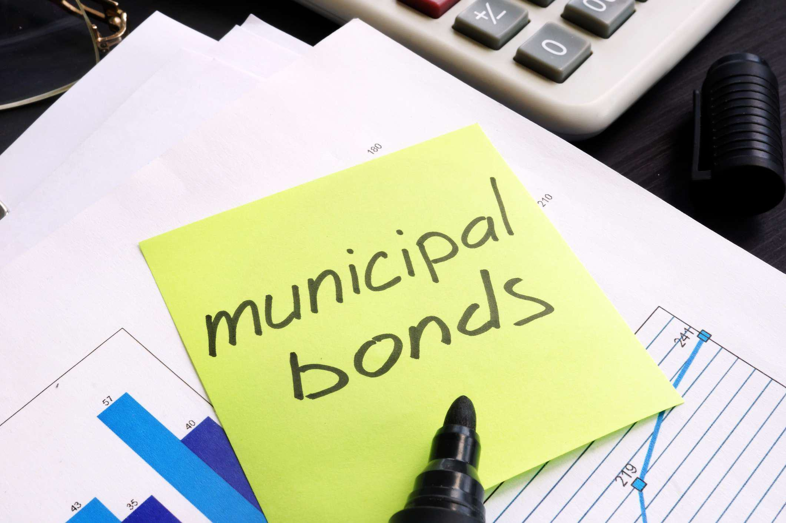

The world of investments is multifaceted and often challenging, particularly when it comes to understanding the interplay between interest rates and various financial instruments such as municipal bonds. Municipal bonds, commonly referred to as "munis," are debt securities issued by local governments, often to fund public infrastructure projects. These financial tools are generally considered secure investment options due to their stable returns and tax advantages. However, investment in municipal bonds becomes more complex with the fluctuating interest rates set forth by the Federal Reserve.

In recent times, the Federal Reserve has progressively increased interest rates, aiming to manage inflation and stabilize the economic landscape. These hikes have sent ripples through investment markets, affecting a wide array of financial assets. The relationship between interest rates and bond prices is inverse, meaning that as interest rates rise, the prices of existing bonds tend to fall. Consequently, investors holding municipal bonds may find their positions depreciating in value despite the security and tax benefits these instruments offer.



This article will explicate the effects of the Federal Reserve's interest rate hikes on municipal bonds—examining both the challenges and the opportunities presented to investors. Additionally, it will shed light on the emerging role of algorithmic trading within the bond market. Algorithmic trading utilizes computer-based algorithms to execute trades efficiently, providing an advanced means for investors to react to rapid market changes and optimize trading strategies. Understanding these elements is paramount for investors aiming to capitalize on market conditions and maximize returns despite fluctuations in interest rates. By combining traditional strategies with modern technological tools, investors can better navigate the current economic environment.

## Table of Contents

## Understanding Municipal Bonds

Municipal bonds, commonly referred to as 'munis,' are debt instruments issued by municipalities, states, and other local government entities. These bonds are primarily used to finance essential public projects, including roads, schools, hospitals, and utility infrastructures. The interest income from municipal bonds is often exempt from federal income tax, and in many cases, it is also exempt from state and local taxes, especially if the investor is a resident of the issuing state. This tax advantage makes municipal bonds particularly attractive to investors in higher tax brackets seeking tax-efficient income.

The perceived safety of municipal bonds largely stems from the stable revenue sources and taxing authority that back them. While they might not offer the high returns associated with more volatile investments such as stocks, they provide a dependable stream of tax-free income, making them appealing for conservative investors or those nearing retirement who prioritize income stability over growth. Furthermore, the credit quality of municipal bonds can vary; they are rated by credit rating agencies, with higher-rated bonds posing lower credit risk.

In terms of types, municipal bonds are categorized mainly into general obligation bonds and revenue bonds. General obligation bonds are secured by the full faith and credit of the issuing authority, meaning they are backed by the issuer's taxing power. In contrast, revenue bonds are supported by the revenue generated from specific projects, like toll roads or water treatment facilities. For investors, understanding these distinctions is crucial, as they directly impact the risk profile and yield of the bonds.

Overall, municipal bonds serve as a crucial conduit for funding public infrastructure while providing investors with a relatively secure and tax-efficient means of generating income. Hence, they play a vital role in both the financial markets and in fostering community development.

## Impact of Interest Rate Hikes on Municipal Bonds

Interest rates and bond prices share an inverse relationship, a fundamental aspect of fixed-income investments. When interest rates rise, the present value of a bond's future cash flows decreases, leading to a drop in the bond's price. This is particularly relevant in the municipal bond market, where the prices of existing bonds fall as new bonds are issued with higher yields to attract investors. This dynamic can be expressed through the bond pricing formula:

$$
P = \frac{C}{(1 + r)^1} + \frac{C}{(1 + r)^2} + \ldots + \frac{C + F}{(1 + r)^n}
$$

where $P$ is the price of the bond, $C$ is the annual coupon payment, $r$ is the yield, and $F$ is the face value of the bond. As $r$ increases, the present value $P$ decreases.

Despite the negative impact on existing bond prices, rising interest rates can make newly issued municipal bonds more appealing due to the higher coupon rates they offer. These higher coupons can compensate for the increased risk premium associated with a rising [interest rate](/wiki/interest-rate-trading-strategies) environment. This creates a challenging backdrop for holders of existing bonds but offers opportunities for investors purchasing new issues. 

For existing bondholders, the challenge lies in the potential devaluation of their bond portfolios as interest rates increase. This can be particularly concerning for those who may need to liquidate assets or rebalance their portfolios. However, the opportunity emerges in the form of investing in higher-yielding new issues, offering improved income streams and the potential for capital gains if the interest rates stabilize or decrease in the future.

For investors looking to capitalize on these changes, understanding the timing and magnitude of interest rate hikes is crucial. Those with the capacity to adapt to changing conditions may benefit by strategically positioning their portfolios to include a mix of both current holdings and new bond purchases with more favorable yields.

Overall, interest rate hikes present a duality of effects on the municipal bond market, where potential losses on existing bonds may be offset by the prospects of higher returns on new purchases. Adjusting strategies in response to interest rate fluctuations is essential for maximizing returns in this evolving market landscape.

## Advantages of Investing in Municipal Bonds Post Rate Hikes

Investing in municipal bonds post rate hikes can be advantageous for several reasons, primarily due to higher coupon rates, potential capital gains, and tax benefits. When interest rates increase, newly issued municipal bonds generally offer higher coupon rates. This presents an opportunity for investors to enhance their interest income. For example, if a municipal bond is issued with a coupon rate of 4% in a 2% interest rate environment, an interest rate hike to 4% on new issues will likely lead to even higher coupon rates to attract investors. Consequently, investors purchasing these new issues can benefit from increased income relative to bonds issued in lower interest rate conditions.

Another advantage is the potential for capital gains. The inverse relationship between bond prices and interest rates means that when rates eventually decline after a hike, the market value of existing bonds with higher coupons may rise. Therefore, investors who have acquired municipal bonds during or immediately after a rate hike could enjoy price appreciation. This can be particularly beneficial if the bond is sold before maturity in an environment where interest rates are decreasing.

Tax advantages also significantly incentivize investing in municipal bonds. The interest earned on municipal bonds is generally exempt from federal income taxes and sometimes state and local taxes, depending on the jurisdiction of both the issuer and the investor. This tax-exempt status can lead to substantial savings for investors, especially those in higher tax brackets. For instance, if an investor earns $5,000 in interest from municipal bonds, this amount is typically not subject to federal taxation, allowing the investor to retain the full earned interest, compared to taxable bonds where a portion of the interest income would be paid as tax.

In conclusion, municipal bonds in a post rate hike scenario offer several benefits. The higher coupon rates improve interest income, the potential for capital gains is enhanced with declining future interest rates, and the advantageous tax treatment allows investors to maximize their returns. This combination of factors makes investing in municipal bonds a compelling option for those seeking steady and tax-efficient income.

## Algorithmic Trading in the Bond Market

Algorithmic trading has become an increasingly vital component in the bond markets, particularly as investors seek to navigate the complexities introduced by fluctuating interest rates. This form of trading involves the use of sophisticated computer algorithms to execute orders based on pre-set criteria, which can include timing, price, and [volume](/wiki/volume-trading-strategy). By leveraging vast data sets and advanced computational techniques, algorithms improve the precision and efficiency of trading strategies.

The integration of algorithms in the bond market is largely driven by their ability to analyze changes in interest rates swiftly. Interest rates significantly impact bond prices; when rates increase, bond prices generally decrease, and vice versa. Algorithms can process these rate changes in real time, thus optimizing the timing of trades to capitalize on price movements. An algorithm might use historical data to forecast future rate movements and make predictive trading decisions.

For instance, consider a simple Python-based algorithm that identifies optimal times to buy or sell municipal bonds based on interest rate trends:

```python
import pandas as pd
from sklearn.linear_model import LinearRegression

# Sample data: interest rates and bond prices
data = {'Interest_Rate': [2.5, 2.6, 3.0, 3.5, 3.7],
        'Bond_Price': [100, 98, 95, 90, 88]}
df = pd.DataFrame(data)

# Train linear regression model
X = df[['Interest_Rate']]
y = df['Bond_Price']
model = LinearRegression().fit(X, y)

# Predict bond prices for new interest rates
new_rates = pd.DataFrame({'Interest_Rate': [2.8, 3.2, 4.0]})
predicted_prices = model.predict(new_rates)

print(predicted_prices)
```

This basic model forecasts bond prices based on interest rates, allowing traders to make informed decisions. While simplified, it exemplifies how algorithms can effectively manage data to predict market conditions.

Algorithmic trading also enhances investors' abilities to react promptly to market fluctuations, maintaining or even improving portfolio performance. Algorithms can execute trades with minimal latency, which is particularly advantageous in fast-moving markets where delays can significantly affect returns. They enable automated execution of complex strategies, from hedging to [arbitrage](/wiki/arbitrage), thus reducing the manual burden on traders.

Moreover, [algorithmic trading](/wiki/algorithmic-trading) systems can be continuously refined by incorporating [machine learning](/wiki/machine-learning) techniques, which further enhance their predictive accuracy and adaptability to changing market conditions. This adaptability offers a competitive edge, as the constant refinement of algorithms ensures alignment with the latest market trends and investor requirements.

In conclusion, algorithmic trading provides a powerful mechanism for optimizing bond trading strategies. Its ability to methodically analyze interest rates and execute trades with precision empowers investors to effectively manage and enhance their portfolios in shifting market environments.

## Conclusion

The landscape of municipal bond investments is undergoing significant changes due to recent interest rate hikes. As interest rates rise, new municipal bonds are often issued with higher coupon rates, offering the potential for increased returns while maintaining the inherent tax advantages that make munis attractive. This environment presents investors with unique opportunities to enhance their portfolios through strategic bond selection.

Algorithmic trading plays a crucial role in this evolving market by allowing investors to swiftly and efficiently respond to fluctuating interest rates. These automated systems can process vast amounts of financial data in real-time, optimizing trading strategies based on predictive models and trend analyses. By employing algorithmic trading, investors can not only navigate changes with agility but also identify advantageous opportunities that may arise from market [volatility](/wiki/volatility-trading-strategies).

In conclusion, a combination of traditional investment strategies and advanced technological tools like algorithmic trading provides a robust approach to maximizing returns in the municipal bond market. Investors are encouraged to explore and integrate these methodologies to harness the full potential of their bond investments amidst rising interest rates.

## FAQs

### FAQs

**What are the current trends in municipal bond investments post-interest rate hikes?**

In the aftermath of recent interest rate hikes by the Federal Reserve, municipal bond investments have seen a notable shift. As interest rates climb, the prices of existing municipal bonds typically decline, leading to a more competitive market for new bond issuances, which often feature higher coupon rates. This trend attracts investors who are seeking better yields compared to previous low-rate environments. The potential for higher returns with new issues is enticing to both individual and institutional investors looking to balance portfolios against the backdrop of increased rates. Furthermore, there is a growing interest in short-duration municipal bonds as investors seek to minimize duration risk—a measure of a bond's price sensitivity to interest rate changes. Additionally, demand for municipal bonds remains robust due to their tax-exempt status, which is particularly appealing to high-net-worth investors seeking to mitigate tax liabilities.

**How does algorithmic trading work in bond markets?**

Algorithmic trading in bond markets utilizes advanced computer algorithms to automate the process of buying and selling bonds. These algorithms can analyze large datasets in real-time, applying complex mathematical models to assess market trends, optimize execution speed, and minimize trading costs. For example, algorithms may incorporate interest rate changes, yield curve movements, and historical pricing data to predict price movements and execute trades at advantageous times. A basic Python example of a moving average crossover strategy for bond trading would be as follows:

```python
import pandas as pd

# Load your bond market data into a DataFrame
bond_data = pd.read_csv('bond_prices.csv')

# Calculate the moving averages
bond_data['20_day_MA'] = bond_data['Price'].rolling(window=20).mean()
bond_data['50_day_MA'] = bond_data['Price'].rolling(window=50).mean()

# Function to signal buy/sell
def trading_signal(row):
    if row['20_day_MA'] > row['50_day_MA']:
        return 'Buy'
    elif row['20_day_MA'] < row['50_day_MA']:
        return 'Sell'
    else:
        return 'Hold'

# Apply the trading signal function
bond_data['Signal'] = bond_data.apply(trading_signal, axis=1)
```

This basic strategy signals a 'Buy' when the 20-day moving average crosses above the 50-day moving average and a 'Sell' when it crosses below, automating decisions that would traditionally require manual analysis.

**What are the primary risks associated with municipal bonds in a rising interest rate environment?**

In a rising interest rate environment, municipal bonds face several risks. The primary concern is interest rate risk, as bond prices inversely correlate with interest rate movements. When interest rates increase, the market price of existing bonds typically decreases since newer bonds may be issued with higher yields. This can lead to capital losses for holders of older bonds if they decide to sell before maturity. Additionally, there is reinvestment risk, which pertains to the possibility that cash flows received from the bond, such as coupon payments, will have to be reinvested at lower prevailing rates due to the bond's maturity or call provisions. Credit risk is another concern, particularly for bonds issued by municipalities experiencing financial difficulties, as rising rates can strain their fiscal budgets, potentially affecting their ability to meet debt obligations. Lastly, [liquidity](/wiki/liquidity-risk-premium) risk may increase if fewer investors are interested in trading bonds in an environment of rising rates and market uncertainty.

## References & Further Reading

[1]: Fabozzi, F. J. (2016). ["Bond Markets, Analysis, and Strategies,"](https://books.google.com/books/about/Bond_Markets_Analysis_and_Strategies_ten.html?id=bQpNEAAAQBAJ) 9th Edition. Pearson.

[2]: Lee, W., & Cicerone, J. (2011). ["Investing in Municipal Bonds: How to Balance Risk and Reward for Success in Today’s Bond Market"](https://www.amazon.com/INVESTING-MUNICIPAL-BONDS-Balance-Success/dp/0071809759). McGraw-Hill Education.

[3]: Choudhry, M. (2018). ["The Bond & Money Markets: Strategy, Trading, Analysis."](https://www.sciencedirect.com/book/9780750646772/the-bond-and-money-markets) Wiley Finance.

[4]: Litterman, R., & Scheinkman, J. (1991). ["Common Factors Affecting Bond Returns"](https://www.pm-research.com/content/iijfixinc/1/1/54). The Journal of Fixed Income, 1(1), 54-61.

[5]: Durbin, M. (2010). ["All About High-Frequency Trading"](https://www.mhebooklibrary.com/doi/book/10.1036/9780071743457). McGraw-Hill Education.