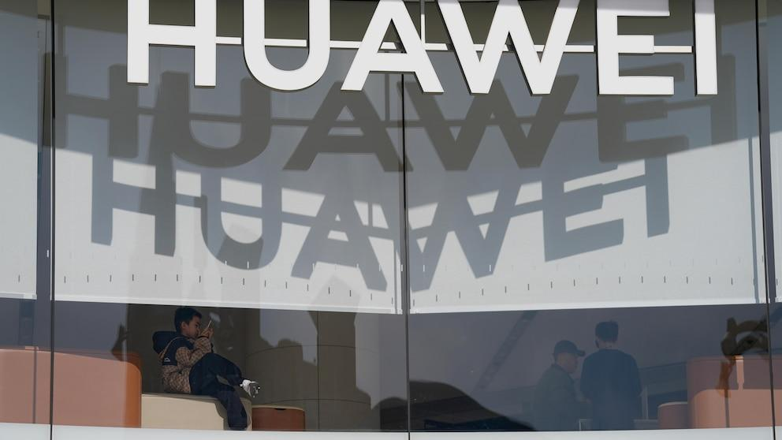

Huawei, a global leader in technology, has increasingly extended its reach beyond traditional telecommunications and consumer electronics, delving into the financial sector, particularly through algorithmic trading. This intersection of technology and finance has garnered significant attention as Huawei's influence in the tech domain presents substantial implications for the financial markets.

Algorithmic trading, which refers to the use of computer algorithms to execute trading orders at speeds and frequencies that are impossible for human traders, represents a fundamental shift in the dynamics of stock markets globally. Central to this transformation are advancements in big data, machine learning, and artificial intelligence, all of which have enabled the development of sophisticated trading algorithms. These algorithms can process vast amounts of market data, identifying trading opportunities and executing trades with precision and efficiency. The significance of algorithmic trading in today's stock markets cannot be understated, as it often provides liquidity, enhances price discovery, and reduces transaction costs.

Huawei, known for its robust research and development capabilities, is well-positioned to play a significant role in the ongoing evolution of financial technologies. As a tech giant, its potential foray into algorithmic trading could introduce novel technologies and platforms that further enhance trading efficiencies and market functionalities. The move towards integrating cutting-edge technology in finance not only underscores Huawei's leadership in the tech sector but also marks its potential as a key player in shaping the future of finance.

However, this expansion into algorithmic trading presents its own set of challenges and opportunities for Huawei. Engaging with the highly regulated and competitive financial markets necessitates navigating intricate regulatory landscapes and managing geopolitical tensions, particularly with Western markets. Additionally, Huawei’s private ownership structure adds another layer of complexity to its financial aspirations and market positioning.

Given these factors, Huawei's exploration into algorithmic trading and the broader financial sector presents an intriguing blend of innovation potential and strategic hurdles. Its journey signifies a broader trend of technological convergence with finance, offering exciting possibilities for market participants, while also posing questions regarding regulatory compliance and global market integration. As Huawei continues to pioneer in technology, its endeavors in financial markets warrant close observation for investors and industry stakeholders alike.

## Table of Contents

## Huawei's Business Landscape

Huawei Technologies Co., Ltd., founded in 1987 by Ren Zhengfei, has grown from a small telecommunications vendor into one of the largest multinational technology companies. With its headquarters in Shenzhen, China, Huawei has expanded its operations to over 170 countries and serves more than three billion people worldwide.

**Key Business Segments**

Huawei operates three main business segments: 

1. **Telecommunications:** As a leading provider of telecom equipment, Huawei holds a substantial share of the global market for communication networks. The company is known for its advancements in 5G technology, providing infrastructure for network deployment across various countries.

2. **Consumer Electronics:** Huawei is a significant player in the consumer electronics market, particularly known for its smartphones, tablets, and wearable devices. The company's smartphones consistently rank among the top in global sales, competing closely with brands such as Samsung and Apple.

3. **Enterprise Solutions:** Huawei offers a wide array of products and services for enterprises, including cloud computing, data storage, and AI-powered solutions. This segment focuses on enhancing digital transformation for businesses across different sectors.

**Current Standing and Influence**

In the global tech industry, Huawei is recognized as a technology innovator, particularly in the telecom and mobile technology sectors. With its pivotal role in 5G deployment, Huawei's technologies are at the forefront of the next revolution in wireless communication, positioning the company as a critical player in global digital infrastructure development.

**Private Ownership Implications**

Huawei remains a privately held company, primarily owned by its employees through a unique shareholding structure. This ownership model means that Huawei is not subject to the pressures of public stock markets, allowing it to focus on long-term strategies. However, this structure also limits direct investment opportunities for external investors, challenging those wishing to gain exposure to Huawei's financial performance directly.

**Controversies and Market Challenges**

Huawei faces significant challenges, particularly in Western markets. The company has been embroiled in controversies, mainly related to cybersecurity concerns and allegations of espionage. These issues have led to regulatory hurdles and restrictions, notably in the United States, where Huawei is effectively barred from participating in government contracts and some private network deployments.

Despite these challenges, Huawei continues to maintain robust growth in other regions, leveraging its technological advancements and competitive pricing strategies. The geopolitical tensions have compelled Huawei to diversify its product offerings and seek new markets, which could potentially reshape its business strategy in the coming years.

## Algorithmic Trading: A Revolution in Finance

Algorithmic trading refers to the process of using computer programs and algorithms to execute financial securities orders at speeds and frequencies that human traders cannot match. Initially emerging in the late 20th century, this innovative approach capitalized on the increasing computational capacity and connectivity of global markets. The mid-2000s marked a significant uptick in its utilization, correlating with advancements in information technology and telecommunications, which facilitated the rapid flow of market data and transactions.

Big data, [machine learning](/wiki/machine-learning), and [artificial intelligence](/wiki/ai-artificial-intelligence) (AI) are at the heart of this transformation. These technologies enable traders to analyze vast amounts of market data to identify patterns, optimize trading strategies, and make real-time decisions. Machine learning algorithms, in particular, can adapt to new information or market conditions, improving their predictive accuracy over time. For example, predictive models can assess historical data to forecast stock price movements, while natural language processing can parse news articles and social media feeds for sentiment analysis, influencing trading decisions.

Algorithmic trading offers several advantages. Speed, a critical [factor](/wiki/factor-investing), allows for the execution of trades in fractions of a second, capitalizing on minutely favorable market conditions that could quickly dissipate. This immediacy not only enhances efficiency but also improves accuracy, as algorithms can systematically implement strategies with precision, reducing the margin of human error. Furthermore, the capability to execute trades based on predefined criteria ensures a level of consistency that manual trading processes often lack.

However, [algorithmic trading](/wiki/algorithmic-trading) is not without risks and ethical concerns. The high-frequency trading ([HFT](/wiki/high-frequency-trading-strategies)) segment, characterized by executing a large number of trades in extremely short time frames, has been criticized for potentially exacerbating market [volatility](/wiki/volatility-trading-strategies), as seen in events like the Flash Crash of 2010. Additionally, the opaque nature of complex algorithms can lead to unintended consequences, where automated systems react unpredictably to unforeseen market conditions. Moreover, the reliance on historical data for predictive modeling incurs the risk of ignoring unprecedented scenarios, possibly resulting in significant financial losses.

On a broader scale, algorithmic trading exerts substantial influence on global markets. It enhances [liquidity](/wiki/liquidity-risk-premium), narrowing bid-ask spreads and facilitating lower transaction costs for all market participants. Nonetheless, its predominance can disadvantage traditional traders, who may struggle to compete with automated systems' speed and precision. For investors, this landscape underscores the necessity for robust risk management strategies and an awareness of the rapidly evolving technological environment in finance.

## Huawei's Investments in Algorithmic Trading

Huawei, as a major player in the technology sector, has the potential to play a significant role in algorithmic trading. The company's expertise in telecommunications and information technology could enable it to develop advanced trading solutions that leverage big data, machine learning, and artificial intelligence. These technologies are crucial for the execution of algorithmic trading strategies, which rely on speed, data analysis, and automation.

One potential strategy for Huawei could be to develop and provide cutting-edge trading platforms. These platforms may incorporate sophisticated algorithms capable of executing trades with high efficiency and minimal latency. Huawei's extensive experience with high-speed networks and data infrastructures would be a considerable advantage in this area, facilitating the necessary data transmission and processing speeds required by modern trading systems.

In terms of partnerships and collaborations, Huawei might explore alliances with financial institutions and fintech companies. Such collaborations could allow Huawei to integrate its technological capabilities with the financial expertise of its partners. Joint ventures could result in the development of new trading technologies or enhancement of existing platforms.

Huawei's innovation capabilities in the financial technology sector might be further illustrated through its potential development of proprietary algorithms or investment in startups specializing in algorithmic trading. Through its research and development initiatives, Huawei could contribute to the evolution of trading technologies, potentially setting new benchmarks for efficiency and intelligence in the financial industry.

Geopolitical tensions, however, present a substantial challenge for Huawei's ambitions in the financial sector. Restrictions and scrutiny, particularly from Western countries, could limit Huawei's ability to collaborate with certain financial entities or enter specific markets. These tensions may also impact the company’s supply chain and access to critical technologies needed for developing sophisticated financial solutions.

In conclusion, while Huawei possesses the technological prowess to significantly impact algorithmic trading, the realization of this potential is intricately linked to navigating geopolitical issues and building strategic partnerships within the financial sector.

## Barriers to Investing in Huawei

Huawei, a leading global technology company, has maintained a private ownership structure, which poses unique challenges for potential investors. Unlike publicly traded companies, Huawei's shares are not available on any stock exchange, limiting direct investment opportunities. This structure is primarily due to its origins as a private entity founded in 1987 by Ren Zhengfei. The company's employee ownership model, where shares are held by a union representing a majority of its workforce, reinforces its private status and is designed to align employees' interests with organizational goals.

The reasons why Huawei has not pursued an Initial Public Offering (IPO) are multifaceted. A significant factor is the desire to maintain strategic control without the scrutiny and regulatory obligations that accompany public listing. By remaining private, Huawei can focus on long-term objectives without the pressure to deliver short-term shareholder returns. This approach allows for agility in decision-making and underscores its commitment to investment in research and development (R&D).

Moreover, Huawei faces substantial legal and regulatory challenges, particularly in the United States, due to national security concerns. These issues stem from suspicions regarding the potential for espionage, given its alleged ties with the Chinese government. Legal restrictions such as the Entity List and bans on Huawei products severely impact its ability to engage with U.S. markets, further complicating investment access for American investors and limiting strategic partnerships with U.S.-based technology firms.

Huawei's private ownership structure influences its investor appeal and market strategies. While private ownership aids in safeguarding proprietary technologies and internal strategies, it also limits transparency and external accountability. Investors often perceive openness and accountability as indicators of reliable investment, which may explain the relatively conservative appetite for investment in Huawei compared to publicly listed tech giants. The lack of liquidity and public market valuation potentially discourages institutional investors, who typically seek liquid and well-governed investment opportunities.

For those interested in engaging with Huawei indirectly, alternative investment avenues exist through proxies or related tech investments. Investing in Huawei's suppliers, partners, or competitors that are publicly traded can provide a pathway to benefit from Huawei's market influence. Funds or exchange-traded funds (ETFs) with significant exposure to the Chinese technology sector might offer indirect investment opportunities for those looking to capitalize on Huawei's trajectory without direct exposure to its regulatory and geopolitical risks.

In sum, Huawei's private status presents both barriers and strategic advantages, shaped by its ownership model, regulatory landscape, and global market positioning. As such, potential investors must weigh these factors, considering both the limitations and the innovative prospects that Huawei offers through its dynamic role in the technology sector.

## The Future of Huawei in the Financial Sector

Huawei's exploration into the financial sector represents a potential shift in its business model towards integrating fintech and stock market innovations. With its strong technological foundation, Huawei is well-positioned to make significant advancements in financial technology. The company's expertise in telecommunications, artificial intelligence (AI), and data analytics could drive new solutions in algorithmic trading and fintech services.

### Technological Advances in the Finance Sector

Huawei's efforts in AI and big data are crucial as these technologies underpin modern algorithmic trading systems. By leveraging machine learning, Huawei could develop proprietary algorithms that enhance predictive analytics and automate trading processes. The integration of AI and 5G technology, another domain where Huawei is a leader, can facilitate instantaneous data processing and trade execution, crucial for high-frequency trading platforms.

Moreover, Huawei's previous work in developing secure and efficient communication networks could lead to innovations in blockchain applications for secure transactions and smart contract executions in financial markets.

### U.S.-China Relations and Global Operations

The geopolitical tension between the U.S. and China affects Huawei's international operations and could influence its strategy in the financial sector. Restrictions on access to Western semiconductor technologies have pushed Huawei to invest in self-reliant supply chains and partnerships in Asia and Europe. These geopolitical dynamics might prompt Huawei to prioritize markets where it faces fewer regulatory barriers and to seek collaborations with non-U.S. financial institutions.

### Huawei's Public Listing Prospects

As a privately held company, Huawei's prospects of going public within the next decade remain speculative. The company’s private status offers flexibility in decision-making and independence from shareholder pressures. However, an Initial Public Offering (IPO) could provide capital to accelerate R&D and expand its footprint in fintech. Should Huawei decide to go public, it would likely assess the regulatory complexities, especially in jurisdictions where it currently faces restrictions.

### Strategic Recommendations for Investors

Investors interested in Huawei’s market evolution should consider the following strategies:

1. **Monitor Technological Developments**: Stay updated on Huawei’s investments in AI, 5G, and blockchain, as these are likely to drive its fintech innovations.

2. **Geopolitical Assessment**: Keep an eye on U.S.-China relations, as changes could impact Huawei’s global market access and operations.

3. **Diversification**: Given Huawei's private status, investors might look at related public companies or sectors that benefit from Huawei's advancements, such as 5G infrastructure providers or AI development firms.

4. **Risk Management**: Consider potential risks associated with regulatory challenges and market volatility when evaluating investments connected to Huawei’s growth trajectory.

While Huawei’s navigation of the financial sector is fraught with challenges, its technological prowess provides a solid foundation for potentially transformative contributions to fintech. Investors should maintain a watchful eye on Huawei's strategic moves as these developments unfold.

## Conclusion

Huawei's exploration into algorithmic trading presents both opportunities and challenges as it seeks to extend its technological reach into the financial sector. The tech giant's established prowess in telecommunications and consumer electronics positions it as a potential leader in financial technology innovation. However, its private status and geopolitical tensions present significant barriers.

Huawei's potential in algorithmic trading lies in its ability to leverage advanced technologies such as AI and machine learning, which are critical components of modern trading strategies. These technologies offer the promise of increased efficiency, speed, and accuracy in trade execution—attributes highly valued in the finance world. Despite these advantages, Huawei must navigate complex ethical considerations and the inherent risks of algorithmic trading, such as market manipulation and systemic risk.

As a privately held company, Huawei does not offer direct investment opportunities through public trading, which limits investor access. This structure can diminish its appeal compared to publicly traded technology firms, as it lacks the transparency and liquidity that come with public markets. However, the private nature allows Huawei to operate with greater strategic flexibility, giving it an edge in rapidly evolving markets.

Investors interested in Huawei and the broader technology-finance intersection should remain vigilant of Huawei's updates and technological advancements. The dynamic nature of global tech investments necessitates attention to diversification and risk management. As the financial landscape evolves, staying informed about the geopolitical dynamics and potential shifts in U.S.-China relations will be crucial for understanding Huawei's future role in finance.

In summary, while Huawei's current investment potential may be constrained by its private ownership and external factors, its ongoing innovations warrant attention. Investors are encouraged to look beyond conventional avenues, exploring peripheral areas of investment and related technological developments, to seize opportunities amidst the evolving global tech landscape.

## References & Further Reading

[1]: Bergstra, J., Bardenet, R., Bengio, Y., & Kégl, B. (2011). ["Algorithms for Hyper-Parameter Optimization."](https://dl.acm.org/doi/10.5555/2986459.2986743) Advances in Neural Information Processing Systems 24.

[2]: ["Advances in Financial Machine Learning"](https://www.amazon.com/Advances-Financial-Machine-Learning-Marcos/dp/1119482089) by Marcos Lopez de Prado

[3]: ["Evidence-Based Technical Analysis: Applying the Scientific Method and Statistical Inference to Trading Signals"](https://www.amazon.com/Evidence-Based-Technical-Analysis-Scientific-Statistical/dp/0470008741) by David Aronson

[4]: ["Machine Learning for Algorithmic Trading"](https://github.com/stefan-jansen/machine-learning-for-trading) by Stefan Jansen

[5]: ["Quantitative Trading: How to Build Your Own Algorithmic Trading Business"](https://www.amazon.com/Quantitative-Trading-Build-Algorithmic-Business/dp/1119800064) by Ernest P. Chan