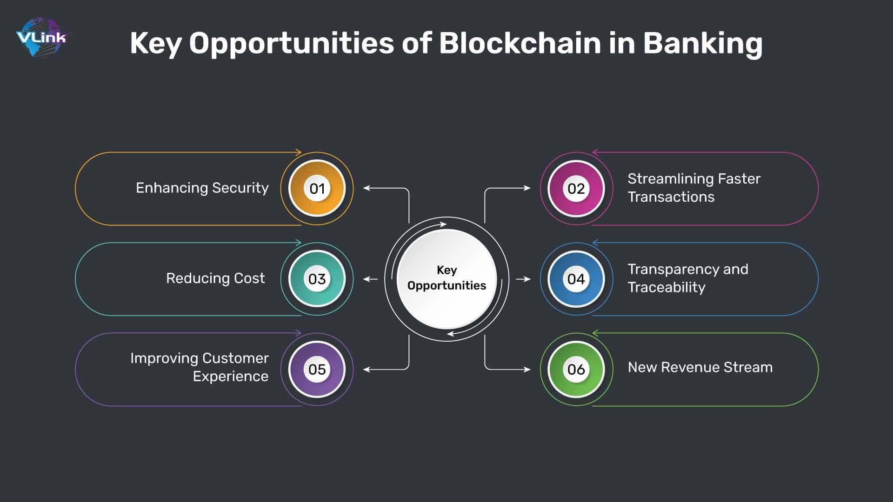

In recent years, the world of finance and investment has witnessed a technological revolution with the advent of blockchain and algorithmic trading. These technologies have not only streamlined processes but have also opened up new avenues for investors to explore. Blockchain technology, with its decentralized and transparent system, offers a secure way to record transactions, ensuring tamper-proof data integrity. Originally developed for cryptocurrencies like Bitcoin, its applications now extend far beyond digital currencies, encompassing various sectors such as supply chain management, voting systems, and more. This expansion highlights the growing importance of blockchain in increasing efficiency and security within the financial sector.

Algorithmic trading, on the other hand, utilizes complex algorithms to analyze market data and execute trades at speeds that far surpass human capabilities. This technology is democratizing trading by enabling more participants to engage in the markets through automated platforms. It enhances accuracy, reduces transaction costs, and allows for back-testing strategies against historical data. These advancements are providing traders with the tools to better capitalize on market inefficiencies and optimize their investment portfolios.

As more investors look to technology for optimizing their strategies, understanding the synergy between blockchain and algorithmic trading becomes crucial. Blockchain's decentralized nature can offer enhanced transparency and security to algorithmic trading strategies, thus improving trust and reliability in automated transactions. This interaction between two cutting-edge technologies offers promising prospects for future market developments.

This article considers the intricacies involved in investing in blockchain and algorithmic trading technologies, questioning why they are becoming indispensable in today's financial landscape. It looks to uncover how these fields interconnect and the potential they hold for the future of investing. As these technologies continue to evolve, they are likely to transform traditional investment approaches, offering novel strategies and opportunities for those who are prepared to engage with technological innovation. Join us as we explore the future potential of these technologies and their role in redefining the investment landscape.

## Table of Contents

## Understanding Blockchain Technology

Blockchain technology provides decentralized and transparent ledger systems that fundamentally revolutionize the manner in which transactions are recorded and authenticated. Initially developed to support Bitcoin, the tech world now recognizes a multitude of applications for blockchain technology. At its core, a blockchain is a distributed database that maintains a continuously growing list of ordered records, called blocks. Each block contains a timestamp and a link to a previous block, creating a chain. 

One of the key advantages of blockchain is its immutability, which ensures that once information is recorded, it cannot be altered retroactively without the consensus of the network. This characteristic significantly reduces the potential for fraud and increases the level of trust among users. The technology's decentralized nature eliminates the need for intermediaries, thereby enhancing transaction efficiency and reducing costs.

Beyond its role in cryptocurrencies, blockchain has transformative potential across various industries. In supply chain management, for instance, blockchain can offer enhanced transparency and traceability, allowing businesses to track products from origin to consumer efficiently. This may help in minimizing fraudulent activities and ensuring product authenticity.

Furthermore, blockchain's potential extends to secure voting systems, where it can offer a transparent and tamper-proof electoral process, significantly enhancing the integrity of democratic institutions. By providing a reliable and verifiable record, blockchain can mitigate issues such as voter fraud and election manipulation.

In the financial sector, blockchain is poised to offer significant benefits concerning efficiency and security. The technology facilitates faster settlement times and reduces the risk of errors, which are common in traditional financial processes. Moreover, by diminishing the reliance on centralized financial institutions, blockchain can lower costs and improve access to financial services for more individuals, including the unbanked population.

Investors are increasingly attracted to blockchain-based solutions as a promising investment opportunity. The potential for high returns and the ability to enhance transparency and trust in various operations make blockchain an appealing prospect. Additionally, blockchain startups, despite their inherent risks, often offer substantial upside potential due to the transformative impact of the technology in various sectors. 

As blockchain technology continues to evolve and integrate into more aspects of society, its role in reshaping industries and presenting new opportunities for investment and innovation becomes increasingly apparent. The ongoing development in blockchain applications signifies its critical importance in the modern digital economy.

## The Rise of Algorithmic Trading

Algorithmic trading, a vital component of modern financial markets, employs intricate algorithms to analyze vast quantities of market data and execute trades at speeds far surpassing human capabilities. This technology has revolutionized trading by enabling a wider range of participants to automate their trading strategies, thereby democratizing market access.

One of the key advantages of [algorithmic trading](/wiki/algorithmic-trading) is its precision. By using advanced computational techniques, algorithms can execute trades with pinpoint accuracy, reducing the errors and delays often associated with manual trading. This accuracy is particularly beneficial in high-frequency trading ([HFT](/wiki/high-frequency-trading-strategies)) environments where split-second decisions can have significant financial implications.

Moreover, algorithmic trading offers significant reductions in transaction costs. Automated systems minimize the need for human intervention, which can reduce labor costs and help traders avoid costly emotional decisions. Additionally, algorithms can optimize the execution of trades to minimize market impact and leverage the most favorable pricing conditions.

A notable feature of algorithmic trading is its ability to back-test trading strategies against historical data. Traders can simulate how strategies would have performed in the past, enabling them to refine their approaches and improve potential outcomes. This capability is essential for the development of robust trading strategies that can withstand various market conditions and respond to changing dynamics.

As algorithms have become more sophisticated, they are increasingly employed to identify and exploit market inefficiencies. Machine learning and [artificial intelligence](/wiki/ai-artificial-intelligence) (AI) are enhancing the capabilities of algorithms, allowing them to detect complex patterns and predict price movements with increasing accuracy. This has led to improved portfolio optimization and increased returns for traders who leverage these advanced tools.

Major financial institutions and hedge funds have long recognized the advantages of algorithmic trading. These organizations have invested significantly in developing proprietary algorithms to maintain a competitive edge in the fast-paced trading landscape. The adoption of algorithmic strategies by these entities underscores the critical role of technology in shaping the future of trading and investment.

Overall, algorithmic trading represents a dynamic fusion of technology and finance, offering unparalleled opportunities for traders to enhance their strategies, reduce costs, and achieve superior market performance. As technology continues to advance, the potential for innovation within algorithmic trading remains vast, promising further transformation of the financial markets.

## Investing in Blockchain and Algo Trading

Investors are increasingly recognizing the potential of blockchain technology and algorithmic trading as promising areas for investment, largely due to their potential for high returns. Within the blockchain sector, startups present significant upside potential. These enterprises have the advantage of integrating cutting-edge technologies into various industries, thus promising substantial growth. However, the nascent nature of many blockchain companies also introduces considerable risk factors, including market [volatility](/wiki/volatility-trading-strategies), technological execution risk, and regulatory hurdles.

Algorithmic trading, often synonymous with [quantitative trading](/wiki/quantitative-trading), focuses on leveraging complex algorithms to execute trades at optimal conditions. Investment opportunities abound in the technological infrastructure supporting algorithmic trading. This encompasses software platforms and technology providers that develop tools and solutions for efficient trading operations. The appeal of this domain lies in its capacity to handle large volumes of trades at high speed, reducing transaction costs while increasing accuracy and efficiency.

Both sectors are not devoid of challenges, with regulatory frameworks continually evolving. Investors need to be aware of these regulatory changes that can radically impact market dynamics and the feasibility of certain investment strategies. Additionally, the inherent volatility associated with blockchain markets necessitates careful consideration and management.

A strategic approach for investors involves diversifying their portfolios to include both blockchain and algorithmic trading technologies. This diversification not only mitigates risks but also aligns with the current trajectory towards a more digital and technologically advanced economy. By capitalizing on the strengths of both sectors, investors can position themselves advantageously in a rapidly progressing financial landscape.

## The Intersection of Blockchain and Algo Trading

Blockchain and algorithmic trading are interlinking in ways that leverage the strengths of both technologies, leading to new opportunities in the financial sector. Blockchain's decentralized architecture offers algorithmic trading strategies enhanced transparency and security. Transactions processed on a blockchain are immutable and verifiable by all parties, reducing the risk of fraud and errors that could occur in traditional systems. This increased transparency can lead to improved trust between brokers, traders, and investors, as all actors could verify the legitimacy and accuracy of trades.

Real-time data reliability is a critical component in the execution of algorithmic trades. Blockchain can offer a reliable mechanism for data ingestion and sharing, as all nodes in the network share and verify the same transaction data almost instantaneously. This consistency ensures that trading algorithms operate on the most accurate and up-to-date information, thereby optimizing execution strategies.

Decentralized exchanges (DEX), an innovation driven by blockchain technology, present a paradigm shift from traditional centralized exchanges. DEXs facilitate peer-to-peer trading without intermediaries, potentially lowering transaction costs and increasing execution speed. They also align well with algorithmic trading methods by providing direct access to markets, thus allowing algorithmic strategies to be deployed seamlessly.

The ongoing development of blockchain-based applications for algorithmic trading exhibits the potential to transform the industry fundamentally. These applications aim to harness blockchain's capabilities to offer features such as smart contracts, which automate the execution of trading conditions once predefined criteria are met. This automation could drastically increase the efficiency of the trades and reduce latency.

In summary, the confluence of blockchain technology with algorithmic trading is not merely theoretical but is actively driving innovation within the finance industry. By providing a secure, transparent, and efficient framework, blockchain technology is well-positioned to enhance the execution and strategy aspects of algorithmic trading, paving the way for next-generation financial ecosystems.

## Challenges and Future Prospects

Despite the promising potential of blockchain technology and algorithmic trading, both fields face several challenges that could hinder their widespread adoption. One of the primary issues is scalability. For blockchain, this means managing the [volume](/wiki/volume-trading-strategy) of transactions processed without compromising speed and efficiency. Most blockchains, such as Bitcoin and Ethereum, have faced significant scalability issues, causing slower transaction times and increased fees during peak periods. Solutions like the Lightning Network for Bitcoin and Ethereum 2.0's transition to Proof of Stake are being developed to address these concerns, but they are still in progress and need widespread adoption to prove effective.

Algorithmic trading also encounters scalability challenges, particularly in handling vast amounts of market data in real-time and making rapid decisions. As the volume of data increases, the computational resources required to process it grow, demanding more sophisticated technology infrastructure. This necessitates investment in high-performance computing resources, which may be prohibitive for smaller trading firms.

Regulatory hurdles constitute another significant challenge for both technologies. The financial sector is heavily regulated, and adapting these novel technologies within existing legal frameworks can be complex. Blockchain, for example, operates on a decentralized model that can conflict with financial regulations focused on centralized oversight. Algorithmic trading can be prone to market manipulation, leading to increased scrutiny and calls for regulatory measures. The future of these technologies hinges on the development of regulations that protect traders and investors while allowing for innovation. Regulatory bodies around the world are actively working to establish guidelines that balance security with technological advancement.

In the future, advancements in artificial intelligence (AI) and [machine learning](/wiki/machine-learning) may play a crucial role in overcoming some current limitations. AI could improve algorithmic trading strategies by enabling more accurate and faster analysis of market trends, potentially leading to enhanced profitability. Machine learning models can process large datasets and identify patterns that human traders might overlook, revolutionizing trade execution and risk management.

As innovative solutions continue to emerge, the interplay between blockchain and algorithmic trading could transform investment strategies and market dynamics. Blockchain's capacity to offer transparent and immutable data could improve trust and data accuracy in algorithmic trading platforms. This combination might enable more sophisticated and secure trading systems, pushing towards a future where decentralized exchanges become the norm.

To capitalize on these opportunities, stakeholders must navigate the challenges and leverage technological advancements effectively. The trajectory of these technologies will depend on rapid innovation and adaptation, alongside evolving regulatory landscapes. Successful integration of AI, blockchain, and algorithmic trading could redefine how financial markets operate, offering new strategic pathways for investing.

## Conclusion

The fusion of blockchain technology and algorithmic trading represents a new frontier in the world of investment, creating unprecedented opportunities and challenges. On one hand, these technologies offer transformative potential by enhancing the efficiency, transparency, and security of financial markets. Blockchain's decentralized nature ensures a tamper-proof ledger of transactions, thereby reducing fraud and increasing trust among market participants. Meanwhile, algorithmic trading leverages complex models to execute trades at optimal prices, maximizing returns with speed and precision.

However, embracing these innovations is not without its challenges. Both blockchain and algorithmic trading involve significant risks, including regulatory uncertainties, market volatility, and the need for substantial computational resources. Investors must remain agile and informed to successfully navigate this evolving landscape. Adapting to these changes requires a willingness to integrate new technology and reconsider traditional investment strategies.

As these fields continue to expand, they are set to fundamentally alter the operation of financial markets and the strategies employed by investors. With advancements in artificial intelligence and machine learning, there will be opportunities to further enhance the capabilities of both blockchain and algorithmic trading systems. As such, staying informed and prepared becomes crucial for investors aiming to leverage these technological advancements effectively.

Looking ahead, the future of technology investment is promising, with blockchain and algorithmic trading poised to lead the charge towards a more innovative and efficient financial system. Investors who strategically engage with these technologies may find themselves at the forefront of this exciting evolution, poised to benefit from the numerous opportunities it presents.

## References & Further Reading

[1]: Nakamoto, S. (2008). ["Bitcoin: A Peer-to-Peer Electronic Cash System."](https://nakamotoinstitute.org/library/bitcoin/)

[2]: Tapscott, D., & Tapscott, A. (2016). ["Blockchain Revolution: How the Technology Behind Bitcoin Is Changing Money, Business, and the World."](https://dl.acm.org/doi/10.5555/3051781) Penguin.

[3]: Narayanan, A., Bonneau, J., Felten, E., Miller, A., & Goldfeder, S. (2016). ["Bitcoin and Cryptocurrency Technologies: A Comprehensive Introduction."](https://press.princeton.edu/books/hardcover/9780691171692/bitcoin-and-cryptocurrency-technologies) Princeton University Press.

[4]: Kissell, R. (2014). ["The Science of Algorithmic Trading and Portfolio Management."](https://www.sciencedirect.com/book/9780124016897/the-science-of-algorithmic-trading-and-portfolio-management) Academic Press.

[5]: Durbin, M. (2010). ["All About High-Frequency Trading."](https://www.amazon.com/All-About-High-Frequency-Trading/dp/0071743448) McGraw-Hill.

[6]: Vuorenmaa, T. (2010). ["Efficient Data Structures for Algorithmic Trading."](https://www.semanticscholar.org/paper/The-Good%2C-the-Bad%2C-and-the-Ugly-of-Trading-Vuorenmaa/e29f02eb8efd987d8625cff9bdd101a64abe27d3) Social Science Research Network.