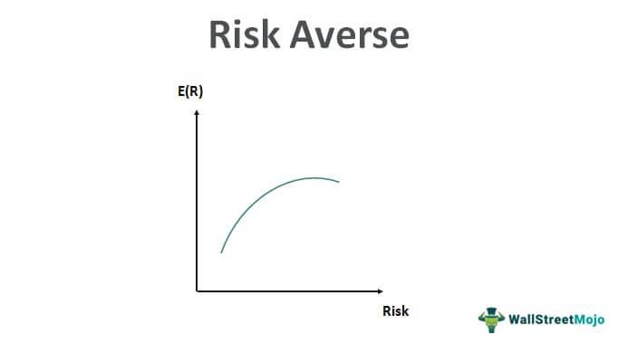

Investing is a crucial component of financial planning, allowing individuals to grow their wealth over time. However, the approach to investing varies significantly based on the individual’s appetite for risk. Risk-averse investors tend to prioritize preserving their capital and achieving a steady income stream instead of seeking high returns that come with higher volatility. This conservative approach can prove challenging, as it requires selecting investment strategies and securities that align with a lower risk tolerance.

For risk-averse investors, the primary objective is capital preservation, which typically involves selecting assets that are less prone to market fluctuations and economic downturns. These investors often seek out securities that provide a reliable income, albeit lower compared to more aggressive investment strategies. In this context, the challenge is to identify investment opportunities that ensure the safety of principal while offering some degree of income generation.



In addressing these concerns, various strategies can be adopted. Diversification, for instance, plays a critical role in mitigating risk by spreading investments across multiple low-risk asset classes. Additionally, the advent of algorithmic trading presents new opportunities for risk management. Through the use of automated trading systems, risk-averse investors can execute trades based on predefined criteria, minimizing emotional biases and adhering strictly to risk parameters.

This article explores several investment strategies suitable for risk-averse investors, including a focus on safe securities such as bank products, government securities, corporate bonds, and preferred stocks. It also investigates into the role of algorithmic trading in managing risk and ensuring disciplined investment practices. By understanding these strategies, risk-averse individuals can make informed decisions that align with their financial objectives and risk tolerance.

## Table of Contents

## Understanding Risk-Averse Investment Strategies

Risk-averse investors prioritize minimizing potential losses over seeking high returns, accepting lower profits in exchange for greater financial security. The central objective of such investors is capital preservation, which involves maintaining the original value of their investment while simultaneously generating a stable, albeit modest, income stream. This conservative approach is typically characterized by several key strategies, of which diversification plays a pivotal role.

Diversification is a fundamental principle in managing investment risk. By spreading investments across a broad spectrum of asset classes, investors can reduce the impact of poor performance in any single investment. For risk-averse individuals, this means allocating their capital among a variety of low-risk assets, such as government securities, high-grade corporate bonds, and selected equity investments with a history of stable returns. The essence of diversification lies in its ability to provide a buffer against market volatility, ensuring that the adverse effects of downturns in one sector are cushioned by more stable or positively performing assets in others.

To illustrate the concept mathematically, consider the expected return $E(R)$ and the variance $\sigma^2$ of a portfolio. The expected return of a diversified portfolio can be calculated as a weighted sum of the individual asset returns:

$$
E(R) = \sum_{i=1}^{n} w_i \cdot R_i
$$

where $w_i$ is the weight of asset $i$ in the portfolio, and $R_i$ is the expected return of asset $i$.

The variance, reflecting the overall risk of the portfolio, is generally reduced through diversification:

$$
\sigma^2 = \sum_{i=1}^{n} w_i^2 \cdot \sigma_i^2 + \sum_{i=1}^{n} \sum_{j \neq i} w_i \cdot w_j \cdot \sigma_i \cdot \sigma_j \cdot \rho_{ij}
$$

where $\sigma_i^2$ is the variance of asset $i$, $\sigma_j$ is the standard deviation of asset $j$, and $\rho_{ij}$ is the correlation coefficient between assets $i$ and $j$. By diversifying investments, the correlation between assets plays a critical role in decreasing the overall portfolio risk, especially when assets are not perfectly correlated ($\rho_{ij} < 1$).

Risk-averse strategies also involve the careful selection of assets that exhibit lower [volatility](/wiki/volatility-trading-strategies) and more predictable income streams, often resulting in the inclusion of investment vehicles with historically lower but more stable returns. Additionally, maintaining a long-term perspective and regularly reviewing asset performance aligns with the objectives of preserving capital while achieving a consistent income flow. By combining these principles, risk-averse investors can navigate market fluctuations more comfortably, ensuring that their investment approach remains aligned with their risk preferences and financial objectives.

## Types of Safe Securities for Risk-Averse Investors

Bank products, government securities, corporate and municipal bonds, and preferred stocks are considered safe securities for risk-averse investors, as they offer reliable returns and lower risk profiles compared to other investment options.

**Bank Products**  
Savings accounts, money market accounts, and certificates of deposit (CDs) are traditional bank products providing stability and security. These products are insured by the Federal Deposit Insurance Corporation (FDIC) up to $250,000 per depositor, per account category, in the United States. Savings accounts are highly liquid, offering modest interest rates while allowing easy access to funds. Money market accounts typically offer higher interest rates than savings accounts, with limited check-writing capabilities. Certificates of deposit provide fixed interest rates over specified terms, with penalties for early withdrawal. These characteristics make bank products attractive for conservative investors prioritizing capital preservation over high returns.

**Government Securities**  
Government securities, such as Treasury Inflation-Protected Securities (TIPS) and other Treasury bonds, are low-risk investments backed by the U.S. government. TIPS are specifically designed to protect against inflation, with principal values adjusted based on changes in the Consumer Price Index (CPI). Apart from TIPS, other Treasury securities, like Treasury bills, notes, and bonds, offer varying maturities and are considered risk-free due to the U.S. government's creditworthiness. These securities provide predictable income streams and are deemed secure investments for risk-averse individuals.

**Corporate and Municipal Bonds**  
Corporate bonds are debt securities issued by companies, offering higher yields than government securities while maintaining a manageable level of risk. Credit ratings from agencies like Moody’s and Standard & Poor’s help investors assess the default risk associated with corporate bonds. High-quality corporate bonds with strong credit ratings are suitable for conservative investors seeking moderate returns. Municipal bonds, issued by state and local governments, often provide tax advantages, such as tax-free interest income at the federal level, and sometimes at state and local levels. Like corporate bonds, municipal bonds are subject to credit risk, but they generally offer higher yields than Treasury securities, making them appealing for those seeking relatively safe investments with some income generation potential.

**Preferred Stocks**  
Preferred stocks are hybrid securities that offer the stability of fixed-income investments, such as bonds, while providing equity-like characteristics. These stocks pay dividends at predetermined rates and stand above common stocks in the hierarchy of claims on a company's assets during liquidation. Preferred shareholders often have no voting rights but benefit from dividend priority over common shareholders. The fixed dividend nature and preferential claim position make preferred stocks an attractive option for investors wary of the volatility associated with common stocks but seeking higher income streams than traditional bonds.

In summary, bank products, government securities, corporate and municipal bonds, and preferred stocks each present unique advantages for risk-averse investors focused on capital preservation and generating stable income. These securities collectively facilitate a well-rounded, lower-risk investment portfolio.

## Algorithmic Trading for Risk Management

Algorithmic trading refers to the use of computer algorithms to automate trading processes in financial markets based on predetermined criteria. This method can be particularly advantageous for risk-averse investors who aim to maintain low-risk profiles while still engaging in market activities. The automated nature of [algorithmic trading](/wiki/algorithmic-trading) systems allows for rigorous adherence to trading strategies, thereby reducing the impact of human emotions and biases that can often lead to impulsive and unstrategic trading decisions.

For risk-averse investors, these algorithms can be programmed to target low-risk securities such as government bonds, blue-chip stocks, or other stable financial instruments. The primary objective is to achieve small, but steady gains over time, aligning with the investor's goal of capital preservation with minimal volatility. Algorithms are designed to identify trading opportunities that fit the defined risk profile, allowing for systematic and disciplined execution of trades.

The technical aspects of algorithmic trading involve constructing rules for trade entries and exits. These can be based on various factors such as price levels, technical indicators, or even news sentiment analysis. Once a strategy is defined, the algorithm continuously monitors market conditions, placing orders at predetermined points without human intervention. This ensures that trades are executed at optimal times, adhering strictly to the risk parameters set by the investor.

Python is a commonly used programming language for developing algorithmic trading strategies due to its extensive libraries and ease of handling data. For instance, using the `pandas` library, historical price data can be analyzed to construct an effective model:

```python
import pandas as pd
import numpy as np
import talib

# Load historical data
data = pd.read_csv('historical_prices.csv')

# Calculate simple moving averages
data['SMA50'] = talib.SMA(data['Close'], timeperiod=50)
data['SMA200'] = talib.SMA(data['Close'], timeperiod=200)

# Define a trading signal: buy when SMA50 crosses above SMA200
data['Signal'] = np.where(data['SMA50'] > data['SMA200'], 1, 0)

# Execute trades based on the signal
def execute_trades(data):
    for index, row in data.iterrows():
        if row['Signal'] == 1:
            # Code to place a buy order
            pass
        else:
            # Code to sell or hold
            pass

execute_trades(data)
```

The inclusion of algorithmic trading in a risk-averse portfolio not only aims for consistent returns but also enhances portfolio management through efficient execution and risk controls. By automating the trading process, investors can avoid the pitfalls of emotional decision-making and focus on maintaining stable, long-term investment growth.

## Implementing a Balanced Investment Portfolio

A balanced investment portfolio for risk-averse investors aims to minimize potential losses while providing steady income and some capital appreciation. Key elements include government securities, blue-chip stocks, and corporate bonds, all chosen for their relatively low risk and reliability in income generation. 

Government securities, such as U.S. Treasury bonds, are fundamental to a risk-averse portfolio due to their backing by the U.S. government, which minimizes default risk. Treasury bonds offer predictable interest income and are considered one of the safest investment options available. Including Treasury Inflation-Protected Securities (TIPS) can further guard against inflation, ensuring that the real value of investments is maintained over time.

Blue-chip stocks, shares of large, well-established, and financially sound companies with a history of reliable performance, can provide both income and moderate growth potential. These companies often pay regular dividends, contributing to the income component of a portfolio. Their diverse international operations and strong market positions make them more resilient to economic downturns, which aligns with the objectives of a risk-averse investment strategy.

Corporate bonds, issued by established firms, offer higher yields than government securities but come with modestly higher risk. Selecting investment-grade corporate bonds is crucial, as these have been rated BBB or higher by rating agencies, signifying a lower risk of default. Including such bonds can enhance the portfolio's income without considerably increasing risk.

Regular review and rebalancing of the portfolio are vital for ensuring that it remains aligned with the investor's goals and risk tolerance. Market fluctuations can lead to shifts in the portfolio's asset allocation, potentially increasing exposure to more volatile segments than initially intended. By reassessing the portfolio periodically, investors can adjust their holdings to maintain their desired level of risk.

Diversification is another critical strategy for reducing risk. By spreading investments across various asset classes and geographic regions, investors can mitigate the impact of adverse events in any single market or sector. For instance, including international government and corporate bonds can provide exposure to global economic growth while reducing reliance on the domestic market's performance.

Investors might employ a simple Python model to simulate and visualize portfolio diversification effects. Here is a basic example to calculate the expected portfolio return and risk, assuming different weighting scenarios for asset classes:

```python
import numpy as np

# Define expected returns and covariance matrix (example values)
returns = np.array([0.02, 0.04, 0.03])  # Government, blue-chip stocks, corporate bonds
cov_matrix = np.array([[0.0001, 0.00002, 0.000015],
                       [0.00002, 0.0004, 0.00003],
                       [0.000015, 0.00003, 0.00025]])

# Define portfolio weights
weights = np.array([0.5, 0.3, 0.2])  # Example weights

# Calculate expected portfolio return
expected_return = np.dot(weights, returns)

# Calculate portfolio risk (standard deviation)
portfolio_variance = np.dot(weights.T, np.dot(cov_matrix, weights))
portfolio_std = np.sqrt(portfolio_variance)

print(f"Expected Portfolio Return: {expected_return:.2%}")
print(f"Portfolio Risk (Standard Deviation): {portfolio_std:.2%}")
```

This example offers a simplified view of how different allocations can affect a portfolio's overall performance. Such tools can provide critical insights, helping investors to make informed decisions that align with their risk appetite and financial goals.

## Conclusion

Risk-averse investors have numerous options to achieve their financial goals, focusing on minimal risk and steady income. These investors prioritize safeguarding their capital while generating a reliable flow of income, often opting for investment vehicles considered to be low-risk. Effective management of risks can be achieved by selecting the right combination of safe securities and leveraging algorithmic trading. Safe securities, such as savings accounts, government bonds, and certain corporate bonds, provide stability and predictable returns. By incorporating algorithmic trading, investors can automate trading strategies, ensuring that investments are executed according to predefined risk parameters, reducing the emotional biases typically associated with investment decisions.

To successfully align their investment strategies with financial objectives and risk tolerance, it is crucial for investors to consider both professional advice and technology. Consulting financial advisors offers tailored insights that can guide investment decisions, while automated tools provide the advantage of efficiency and precision. Algorithmic tools can monitor and adjust portfolios systematically, ensuring adherence to the desired risk levels and contributing to a more disciplined investment approach.

Ultimately, the selection and management of investment strategies should be a reflection of individual financial goals and risk tolerance. By adopting a thoughtful and informed approach, risk-averse investors can effectively achieve a balance between security and income, ensuring long-term financial success.

## References & Further Reading

[1]: Reilly, F. K., & Brown, K. C. (2011). ["Investment Analysis & Portfolio Management."](https://books.google.com/books/about/Investment_Analysis_and_Portfolio_Manage.html?id=CfB-qTXqRWEC) Cengage Learning.

[2]: Bodie, Z., Kane, A., & Marcus, A. J. (2014). ["Investments."](https://books.google.com/books/about/EBOOK_Investments_Global_edition.html?id=BMsvEAAAQBAJ) McGraw-Hill Education.

[3]: Swensen, D. F. (2009). ["Pioneering Portfolio Management: An Unconventional Approach to Institutional Investment."](https://www.amazon.com/Pioneering-Portfolio-Management-Unconventional-Institutional/dp/1416544690) Free Press.

[4]: Brown, S. J., & Goetzmann, W. N. (1995). ["Performance Persistence."](https://onlinelibrary.wiley.com/doi/abs/10.1111/j.1540-6261.1995.tb04800.x) The Journal of Finance, 50(2), 679-698.

[5]: Fabozzi, F. J. (2007). ["Fixed Income Analysis."](https://www.amazon.com/Fixed-Income-Analysis-Frank-Fabozzi/dp/047005221X) John Wiley & Sons.

[6]: Hull, J. C. (2020). ["Options, Futures, and Other Derivatives."](https://elibrary.pearson.de/book/99.150005/9781292410623) Pearson.