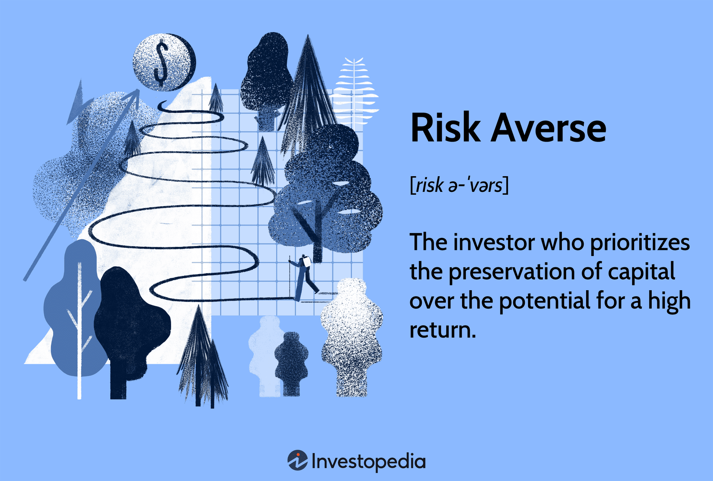

## Table of Contents

## What does it mean to be a risk-averse investor?

Being a risk-averse investor means you prefer to avoid risks as much as possible when investing your money. You would rather have a smaller, more certain return on your investment than take a chance on a bigger return that comes with a higher risk of losing money. For example, instead of investing in a new, unproven company that could either make you a lot of money or lose it all, you might choose to put your money in a well-established company or a savings account that offers a lower but more predictable return.

Risk-averse investors often choose safer investment options like government bonds, savings accounts, or established companies with a long history of steady performance. These choices might not grow your money as quickly as riskier investments, but they are less likely to lose value suddenly. This approach suits people who need their money to be safe and available, like those saving for retirement or a big purchase, and who would rather sleep well at night knowing their investments are secure.

## Why is understanding risk important for investment decisions?

Understanding risk is important for investment decisions because it helps you know how safe or dangerous an investment might be. When you understand risk, you can choose investments that match how much risk you are okay with. Some people are fine with taking big risks for the chance of big rewards, but others want to keep their money safe and grow it slowly. Knowing the risk helps you pick the right investments for you.

Also, understanding risk helps you plan for the future. If you know that an investment might go up and down a lot, you can be ready for those changes and not panic if the value drops for a while. This can stop you from making quick, bad decisions like selling your investment at a low point. By understanding risk, you can make smarter choices and feel more confident about your investments.

## What are the basic investment options available for risk-averse investors?

Risk-averse investors have several safe choices for their money. One common option is savings accounts. These are offered by banks and give you a small but steady return on your money. Savings accounts are very safe because they are usually protected by the government, so even if the bank has problems, your money is safe. Another option is certificates of deposit (CDs). With CDs, you agree to leave your money in the bank for a certain time, like six months or a year, and in return, you get a bit more interest than a regular savings account. CDs are also very safe and can be a good choice if you don't need your money right away.

Another safe investment for risk-averse investors is government bonds. These are loans you give to the government, and in return, they pay you back with interest over time. Government bonds are considered very safe because the government is unlikely to go bankrupt. There are also bonds from big, stable companies, called corporate bonds, but they can be a bit riskier than government bonds. Lastly, some risk-averse investors might choose to invest in well-established companies that have been around for a long time and have a good track record. These companies might not grow as fast as newer ones, but they are more likely to stay steady and safe.

## How can savings accounts be used as a low-risk investment option?

Savings accounts are a great choice for people who want to keep their money safe and grow it a little bit. When you put your money in a savings account, the bank pays you interest. This interest is like a small reward for letting the bank use your money. The interest rate might not be very high, but it's steady and predictable. That means you know how much your money will grow over time, which makes it a low-risk investment.

Another reason savings accounts are low risk is that they are usually protected by the government. In many countries, there is something called deposit insurance. This means if the bank has problems and can't give you your money back, the government will step in and make sure you get your money. This makes savings accounts one of the safest places to keep your money. So, if you're someone who wants to avoid risk and just wants your money to be safe and grow a little, a savings account is a good choice.

## What are the benefits of investing in government bonds for risk-averse individuals?

Government bonds are a great choice for people who don't want to take big risks with their money. When you buy a government bond, you're basically lending money to the government. They promise to pay you back with interest over time. Because it's the government borrowing the money, it's very safe. Governments are usually very stable and unlikely to go bankrupt, so there's a very low chance you'll lose your money. This makes government bonds a safe place to keep your money and grow it a little bit.

Another good thing about government bonds is that they give you a steady income. The interest you get from the bond comes at regular times, like every six months or every year. This can be really helpful if you need a reliable source of money, like when you're retired and need money to live on. Plus, you can choose how long you want to keep your money in the bond, from a few months to many years. This flexibility means you can plan your money better and feel more secure about your future.

## How do certificates of deposit (CDs) work and why are they considered safe?

Certificates of deposit, or CDs, are a type of savings account where you agree to leave your money in the bank for a certain time, like six months or a year. In return, the bank gives you a higher interest rate than a regular savings account. When you put your money in a CD, you can't take it out until the time is up, or you might have to pay a fee. Once the time is over, you get your money back plus the interest the bank promised you. This makes CDs a good choice if you don't need your money right away and want to earn a bit more interest.

CDs are considered safe because, like regular savings accounts, they are usually protected by the government. This means if the bank has problems and can't give you your money back, the government will step in and make sure you get your money. Also, the interest rate on a CD is fixed, so you know exactly how much your money will grow by the end of the term. This predictability and the government's protection make CDs a low-risk way to save and grow your money.

## What role do money market funds play in a risk-averse investment strategy?

Money market funds are another good choice for people who want to keep their money safe and grow it a little bit. These funds invest in very safe things like short-term government bonds, certificates of deposit, and other secure investments. They aim to keep the value of your money steady and give you a small return. This makes them different from riskier investments that can go up and down a lot.

Money market funds are considered low risk because they focus on safe investments. They are a good choice if you want to keep your money safe but also want it to be easy to get to. Unlike some other safe investments like CDs, you can usually take your money out of a money market fund whenever you need it without paying a fee. This makes them a flexible and secure option for people who don't want to take big risks with their money.

## How can fixed annuities provide security for risk-averse investors?

Fixed annuities can be a good choice for people who want to keep their money safe and know exactly how much they will get back. When you buy a fixed annuity, you give an insurance company your money, and they promise to pay you a certain amount of interest every year. This interest rate stays the same for the whole time you have the annuity, so you know exactly how much your money will grow. This makes fixed annuities a low-risk investment because you don't have to worry about the value going up and down like it can with stocks or other investments.

Another reason fixed annuities are safe for risk-averse investors is that they can give you a steady income. You can choose to start getting payments from the annuity right away or at a later time, like when you retire. Once you start getting payments, they come regularly, so you know you'll have money coming in every month or year. This can be really helpful if you need a reliable source of money to live on. Plus, the insurance company backs the annuity, so it's very unlikely that you'll lose your money.

## What are the advantages and potential drawbacks of investing in blue-chip stocks?

Blue-chip stocks are shares in big, well-known companies that have been around for a long time and are very stable. These companies are usually leaders in their industries and have a good track record of making money. One big advantage of investing in blue-chip stocks is that they are less risky than stocks from smaller or newer companies. They often pay regular dividends, which means you get a bit of money every few months just for owning the stock. This can be a nice steady income. Also, because these companies are so well-known and stable, their stock prices don't go up and down as much as others, which makes them a safer choice for people who don't want to take big risks.

However, there are some potential drawbacks to investing in blue-chip stocks. One is that they might not grow as fast as smaller or newer companies. If you're looking for a big return on your investment quickly, blue-chip stocks might not be the best choice. Another thing to think about is that even though they are safer, their stock prices can still go down. If the whole market goes down, even blue-chip stocks can lose value. Also, the dividends they pay might not be as high as the potential returns from riskier investments. So, while blue-chip stocks can be a safe place to put your money, they might not give you the big gains you could get from other types of investments.

## How can dividend-paying stocks fit into a risk-averse portfolio?

Dividend-paying stocks can be a good choice for people who want to keep their money safe but still get a little extra money. These stocks are from companies that give you a bit of money, called a dividend, every few months just for owning their stock. Many of these companies are big and stable, so they are less likely to lose value suddenly. This makes them safer than other stocks that might go up and down a lot. By choosing dividend-paying stocks, you can get a steady income without taking big risks.

However, dividend-paying stocks are not completely risk-free. The stock price can still go down, and sometimes companies might cut or stop paying dividends if they are not doing well. But if you pick stocks from strong, well-known companies, the risk is lower. Adding dividend-paying stocks to your portfolio can help balance out other safer investments like savings accounts or bonds. This way, you can still grow your money a bit more while keeping most of it safe.

## What advanced strategies can risk-averse investors use to diversify their portfolios?

Risk-averse investors can use a strategy called asset allocation to diversify their portfolios. This means they spread their money across different types of investments like savings accounts, government bonds, CDs, and maybe some blue-chip or dividend-paying stocks. By doing this, they can lower the risk of losing money because if one type of investment does poorly, the others might still do well. For example, if the stock market goes down, the money in savings accounts and bonds might stay safe. This way, the overall value of the portfolio stays more stable.

Another strategy is to use a laddering approach, especially with CDs and bonds. Laddering means buying investments that mature at different times. For example, you might buy a one-year CD, a two-year CD, and a three-year CD all at the same time. When the one-year CD matures, you can either take the money out or buy another CD. This helps you have access to your money at different times and can also help you take advantage of different interest rates. By spreading out when your investments mature, you can keep your money safe and still have some flexibility.

## How can risk-averse investors balance potential returns with safety in a changing economic environment?

Risk-averse investors can balance potential returns with safety by carefully choosing a mix of investments that match their comfort with risk. In a changing economic environment, they might lean more towards very safe options like savings accounts, government bonds, and CDs. These investments might not grow their money as fast as riskier ones, but they are less likely to lose value suddenly. By focusing on these safe choices, risk-averse investors can protect their money and still get a small, steady return.

To add a bit more potential for growth, risk-averse investors can also include a small part of their portfolio in blue-chip or dividend-paying stocks. These stocks come from big, stable companies that are less likely to lose value quickly. By keeping the amount invested in stocks small, investors can still benefit from any growth in the stock market without putting too much of their money at risk. This way, they can balance the safety of their investments with the chance to earn a bit more money, even when the economy is changing.

## What are the key aspects of understanding risk-averse investment strategies?

Risk-averse investors prioritize minimizing potential losses over seeking high returns, accepting lower profits in exchange for greater financial security. The central objective of such investors is capital preservation, which involves maintaining the original value of their investment while simultaneously generating a stable, albeit modest, income stream. This conservative approach is typically characterized by several key strategies, of which diversification plays a pivotal role.

Diversification is a fundamental principle in managing investment risk. By spreading investments across a broad spectrum of asset classes, investors can reduce the impact of poor performance in any single investment. For risk-averse individuals, this means allocating their capital among a variety of low-risk assets, such as government securities, high-grade corporate bonds, and selected equity investments with a history of stable returns. The essence of diversification lies in its ability to provide a buffer against market volatility, ensuring that the adverse effects of downturns in one sector are cushioned by more stable or positively performing assets in others.

To illustrate the concept mathematically, consider the expected return $E(R)$ and the variance $\sigma^2$ of a portfolio. The expected return of a diversified portfolio can be calculated as a weighted sum of the individual asset returns:

$$
E(R) = \sum_{i=1}^{n} w_i \cdot R_i
$$

where $w_i$ is the weight of asset $i$ in the portfolio, and $R_i$ is the expected return of asset $i$.

The variance, reflecting the overall risk of the portfolio, is generally reduced through diversification:

$$
\sigma^2 = \sum_{i=1}^{n} w_i^2 \cdot \sigma_i^2 + \sum_{i=1}^{n} \sum_{j \neq i} w_i \cdot w_j \cdot \sigma_i \cdot \sigma_j \cdot \rho_{ij}
$$

where $\sigma_i^2$ is the variance of asset $i$, $\sigma_j$ is the standard deviation of asset $j$, and $\rho_{ij}$ is the correlation coefficient between assets $i$ and $j$. By diversifying investments, the correlation between assets plays a critical role in decreasing the overall portfolio risk, especially when assets are not perfectly correlated ($\rho_{ij} < 1$).

Risk-averse strategies also involve the careful selection of assets that exhibit lower [volatility](/wiki/volatility-trading-strategies) and more predictable income streams, often resulting in the inclusion of investment vehicles with historically lower but more stable returns. Additionally, maintaining a long-term perspective and regularly reviewing asset performance aligns with the objectives of preserving capital while achieving a consistent income flow. By combining these principles, risk-averse investors can navigate market fluctuations more comfortably, ensuring that their investment approach remains aligned with their risk preferences and financial objectives.

## References & Further Reading

[1]: Reilly, F. K., & Brown, K. C. (2011). ["Investment Analysis & Portfolio Management."](https://books.google.com/books/about/Investment_Analysis_and_Portfolio_Manage.html?id=CfB-qTXqRWEC) Cengage Learning.

[2]: Bodie, Z., Kane, A., & Marcus, A. J. (2014). ["Investments."](https://books.google.com/books/about/EBOOK_Investments_Global_edition.html?id=BMsvEAAAQBAJ) McGraw-Hill Education.

[3]: Swensen, D. F. (2009). ["Pioneering Portfolio Management: An Unconventional Approach to Institutional Investment."](https://www.amazon.com/Pioneering-Portfolio-Management-Unconventional-Institutional/dp/1416544690) Free Press.

[4]: Brown, S. J., & Goetzmann, W. N. (1995). ["Performance Persistence."](https://onlinelibrary.wiley.com/doi/abs/10.1111/j.1540-6261.1995.tb04800.x) The Journal of Finance, 50(2), 679-698.

[5]: Fabozzi, F. J. (2007). ["Fixed Income Analysis."](https://www.amazon.com/Fixed-Income-Analysis-Frank-Fabozzi/dp/047005221X) John Wiley & Sons.

[6]: Hull, J. C. (2020). ["Options, Futures, and Other Derivatives."](https://elibrary.pearson.de/book/99.150005/9781292410623) Pearson.