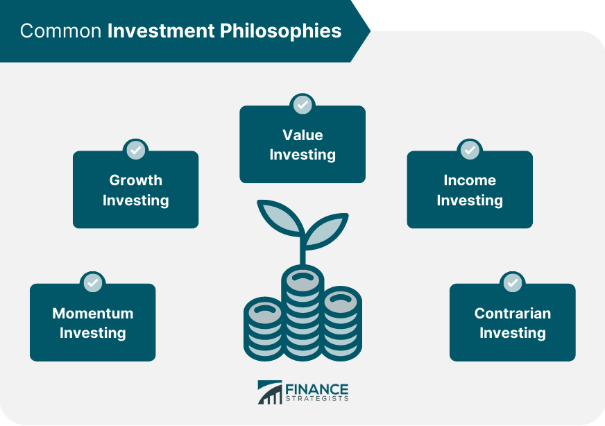

## Table of Contents

## What is an investment philosophy?

An investment philosophy is like a set of rules or beliefs that guide how someone invests their money. It helps people decide which investments to choose and how to manage them. For example, some people might believe in buying and holding stocks for a long time, while others might focus on finding undervalued companies to buy and sell quickly.

Having a clear investment philosophy is important because it helps keep you focused and disciplined. It can prevent you from making hasty decisions based on short-term market changes or emotions. By sticking to your philosophy, you can build a consistent approach to investing that matches your goals and risk tolerance.

## Why is it important to have an investment philosophy?

Having an investment philosophy is important because it gives you a clear plan for how to invest your money. It's like a roadmap that helps you make decisions about which investments to pick and how to handle them. Without a philosophy, you might feel lost or confused, and you could end up making choices based on what everyone else is doing or what you hear on the news. A good investment philosophy keeps you focused on your long-term goals and helps you avoid making quick, emotional decisions that could hurt your investments.

Another reason an investment philosophy is important is that it helps you stay disciplined. The stock market can be unpredictable, and it's easy to get scared or excited by short-term changes. But if you have a clear set of beliefs about investing, you can stick to your plan even when things get tough. This discipline can lead to better results over time because you're not constantly changing your strategy based on the latest trends or news. Instead, you're following a consistent approach that aligns with your personal goals and how much risk you're willing to take.

## How does an investment philosophy guide investment decisions?

An investment philosophy guides investment decisions by giving you a clear set of rules to follow. It's like a personal guidebook that helps you decide which stocks or other investments to buy, when to buy them, and when to sell them. For example, if your philosophy is to invest in companies that are growing quickly, you'll look for businesses that are expanding and doing well. This helps you focus on what's important to you and avoid getting distracted by other things that might not fit your plan.

Your investment philosophy also helps you stay calm and make smart choices even when the market is going up and down. It's easy to get scared or excited by short-term changes, but if you have a clear philosophy, you can stick to your plan. For instance, if you believe in holding onto your investments for a long time, you won't sell them just because the market drops a little. This discipline can help you make better decisions and avoid mistakes that come from acting on emotions or following the crowd.

## What are the common types of investment philosophies?

There are several common types of investment philosophies that people use. One popular philosophy is called value investing. People who follow this philosophy look for companies that they think are undervalued, meaning the stock price is lower than what the company is really worth. They buy these stocks and hold onto them until the market recognizes the true value of the company, hoping to make a profit. Another common philosophy is growth investing. Growth investors focus on companies that are growing quickly and have a lot of potential for future earnings. They are willing to pay more for these stocks because they believe the company will keep growing and the stock price will go up.

Another type of investment philosophy is income investing. People who follow this approach look for investments that will give them regular payments, like dividends from stocks or interest from bonds. They want to build a steady stream of income from their investments. Then there's the buy-and-hold philosophy, where investors buy stocks or other assets and keep them for a long time, often many years. They believe that over the long run, the market will go up, and they want to benefit from that growth. Each of these philosophies has its own way of looking at the market and making investment decisions, and people choose the one that fits their goals and how much risk they are willing to take.

## How can a beginner start developing their own investment philosophy?

A beginner can start developing their own investment philosophy by first thinking about what they want to achieve with their investments. Are they looking to grow their money over the long term, or do they need regular income? Once they have a clear goal, they can start learning about different investment philosophies like value investing, growth investing, or income investing. They can read [books](/wiki/algo-trading-books), watch videos, or even talk to more experienced investors to understand what each philosophy means and how it works. By understanding these different approaches, a beginner can start to figure out which one feels right for them based on their goals and how much risk they are comfortable taking.

After learning about different philosophies, a beginner should try to put what they've learned into practice. They can start by investing a small amount of money using the approach they think they like best. It's important to keep track of how their investments are doing and think about why they are making certain decisions. Over time, they might find that they need to adjust their philosophy a bit based on what they learn from their experiences. The key is to keep learning and be open to changing their approach as they gain more knowledge and confidence. By doing this, a beginner can slowly build a personal investment philosophy that works well for them.

## What role does risk tolerance play in shaping an investment philosophy?

Risk tolerance is a big part of shaping an investment philosophy. It's all about how much risk you're okay with when you invest your money. Some people are fine with taking big risks because they think it could lead to big rewards. They might choose a philosophy like growth investing, where they look for companies that could grow a lot but might also be more risky. On the other hand, if you don't like taking risks, you might go for a safer approach like income investing, where you focus on getting regular payments from your investments.

Understanding your risk tolerance helps you pick an investment philosophy that fits you. If you're not comfortable with big ups and downs in your investments, you'll want a philosophy that keeps things more stable. This way, you won't feel too stressed or worried about your money. By knowing how much risk you can handle, you can build an investment plan that you feel good about and stick to it over time.

## How do market conditions influence an investment philosophy?

Market conditions can really change how you think about investing. When the market is doing well and everything is going up, you might feel more confident and be willing to take bigger risks. You might decide to follow a growth investing philosophy, looking for companies that are growing fast and could make you a lot of money. But if the market starts to go down, you might get worried and want to be more careful. You could switch to a value investing approach, trying to find good deals on stocks that are cheaper because of the market drop.

Even though market conditions can make you want to change your investment philosophy, it's important to stick to what you believe in. If you have a clear plan and know what you want to achieve, you can keep your focus even when the market is going crazy. For example, if you believe in holding onto your investments for the long term, you won't sell them just because the market is down. By staying true to your philosophy, you can make better decisions and avoid getting too caught up in what's happening right now in the market.

## Can an investment philosophy change over time, and if so, why?

Yes, an investment philosophy can change over time. As people learn more about investing and the market, they might find new ideas that make sense to them. They could also have different goals or be willing to take more or less risk as they get older or their life changes. For example, someone might start out wanting to grow their money fast and be okay with taking big risks, but later decide they want their investments to be safer and give them regular income.

Another reason an investment philosophy might change is because of what's happening in the market. If the market goes through a big change, like a crash or a boom, people might want to adjust their plan. They might see that their old way of investing isn't working as well anymore, so they try something new. But it's important to think carefully before changing your philosophy just because of what's happening right now in the market. The best approach is to keep learning and be open to changing your plan if it makes sense for your long-term goals.

## How do successful investors like Warren Buffett or Ray Dalio articulate their investment philosophies?

Warren Buffett, often called the "Oracle of Omaha," has a simple but powerful investment philosophy: value investing. He looks for companies that are undervalued, meaning their stock price is lower than what the company is really worth. Buffett believes in buying these good businesses at a fair price and holding onto them for a long time. He also focuses on companies with strong management and a clear competitive advantage. Buffett's approach is all about patience and discipline, sticking to his plan even when the market goes up and down. He once said, "Our favorite holding period is forever," showing how much he believes in long-term investing.

Ray Dalio, the founder of Bridgewater Associates, has a different investment philosophy called "All Weather." He thinks about how to make money no matter what's happening in the economy. Dalio's approach is to build a portfolio that can handle different economic conditions, like inflation, deflation, or a booming economy. He uses a strategy called "risk parity," where he balances the risk across different types of investments. Dalio believes in understanding how the economy works and using that knowledge to make smart investment choices. His philosophy is about being prepared for anything and staying calm no matter what the market does.

## What are the pitfalls to avoid when developing an investment philosophy?

One big mistake to avoid when developing an investment philosophy is letting emotions guide your decisions. It's easy to get scared or excited by what's happening in the market right now, but that can make you change your plan too quickly. If you let your feelings take over, you might buy or sell investments at the wrong time, which can hurt your money. It's better to stick to your plan and make choices based on what you believe in, not just what you're feeling at the moment.

Another pitfall is copying what other people are doing without thinking about if it fits your own goals and how much risk you're okay with. Just because a certain investment worked well for someone else doesn't mean it's right for you. Everyone's situation is different, so it's important to build a philosophy that makes sense for you. If you follow the crowd without thinking, you might end up with a plan that doesn't work for your needs and could lead to problems down the road.

## How can one measure the effectiveness of their investment philosophy?

One way to measure the effectiveness of your investment philosophy is by looking at how well your investments are doing over time. You can check if your portfolio is growing and if it's meeting the goals you set for yourself. For example, if your goal is to grow your money over the long term, you can see if your investments are going up in value. It's also important to compare your results to a benchmark, like a stock market index, to see if you're doing better or worse than the market as a whole. If your investments are doing well and you're happy with the results, that's a good sign that your philosophy is working.

Another way to measure the effectiveness of your investment philosophy is by seeing if you're sticking to your plan. If you find yourself changing your strategy a lot because of what's happening in the market or because you're feeling worried or excited, that might mean your philosophy isn't strong enough. A good investment philosophy should help you stay disciplined and make decisions based on what you believe in, not just what's happening right now. If you can stick to your plan and feel confident in your choices, that's a sign that your philosophy is effective and helping you reach your goals.

## What advanced strategies can be incorporated into an investment philosophy for expert investors?

Expert investors might want to use something called "hedging" in their investment philosophy. Hedging is like a safety net that helps protect your money if the market goes down. One way to do this is by using options, which are special contracts that give you the right to buy or sell stocks at a certain price. By buying options, you can limit how much you might lose if your investments don't do well. Another advanced strategy is called "short selling," where you borrow stocks and sell them, hoping to buy them back later at a lower price. This can be risky, but it can also help you make money if you think a stock is going to go down.

Another strategy that expert investors might use is "diversification across asset classes." This means spreading your money not just across different stocks, but also into things like bonds, real estate, and even commodities like gold. By doing this, you can reduce the risk of losing money because different types of investments don't always go up and down at the same time. This can help keep your portfolio more stable, even when the market is unpredictable. It's all about balancing risk and reward to make sure your investments are as safe as possible while still growing your money.

## References & Further Reading

[1]: Bergstra, J., Bardenet, R., Bengio, Y., & Kégl, B. (2011). ["Algorithms for Hyper-Parameter Optimization."](https://papers.nips.cc/paper/4443-algorithms-for-hyper-parameter-optimization) Advances in Neural Information Processing Systems 24.

[2]: ["Advances in Financial Machine Learning"](https://www.amazon.com/Advances-Financial-Machine-Learning-Marcos/dp/1119482089) by Marcos Lopez de Prado

[3]: ["Evidence-Based Technical Analysis: Applying the Scientific Method and Statistical Inference to Trading Signals"](https://www.amazon.com/Evidence-Based-Technical-Analysis-Scientific-Statistical/dp/0470008741) by David Aronson

[4]: ["Machine Learning for Algorithmic Trading"](https://github.com/stefan-jansen/machine-learning-for-trading) by Stefan Jansen

[5]: ["Quantitative Trading: How to Build Your Own Algorithmic Trading Business"](https://www.amazon.com/Quantitative-Trading-Build-Algorithmic-Business/dp/1119800064) by Ernest P. Chan