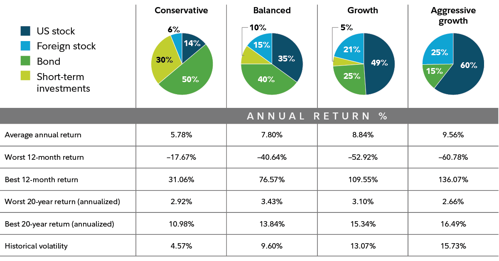

## Table of Contents

## What is investment portfolio diversification?

Investment portfolio diversification is a strategy where you spread your money across different types of investments. This helps to reduce risk because if one investment does poorly, others might do well and balance it out. Imagine putting all your eggs in one basket; if you drop the basket, you lose all your eggs. But if you spread your eggs into different baskets, dropping one basket won't ruin everything.

A diversified portfolio might include stocks, bonds, real estate, and even cash. Each type of investment reacts differently to the same economic events. For example, when stocks go down, bonds might go up. By having a mix, you're not relying on just one type of investment to do well. This way, you can potentially earn more stable returns over time and protect your money from big losses.

## Why is diversification important in investing?

Diversification is important in investing because it helps you manage risk. When you spread your money across different types of investments, you're not putting all your eggs in one basket. If one investment goes down in value, others might go up or stay the same, which can help balance out your losses. This means you're less likely to lose a lot of money all at once.

It also gives you a chance to benefit from different parts of the market. Different investments do well at different times. For example, when the stock market is doing great, stocks might be the best place to be. But when the stock market is down, bonds or real estate might do better. By having a mix, you can take advantage of these ups and downs and potentially earn more stable returns over time.

## What are the basic types of assets one can diversify into?

When you want to diversify your investment portfolio, you can put your money into different types of assets. The main ones are stocks, bonds, and cash. Stocks are pieces of a company that you can buy. If the company does well, the value of your stocks can go up. Bonds are like loans you give to a company or government. They pay you back with interest over time. Cash is money you keep in a savings account or money market fund, which is safe but usually doesn't grow much.

Another type of asset is real estate, which means buying property like houses or buildings. Real estate can grow in value over time and can also give you rental income. You can also diversify into commodities, which are things like gold, oil, or agricultural products. Commodities can be a good way to protect against inflation, which is when the price of things goes up.

Finally, there are alternative investments like hedge funds, private equity, and even art or collectibles. These can be riskier but might offer high returns. By spreading your money across these different types of assets, you can reduce your risk and potentially earn more stable returns over time.

## How can beginners start diversifying their investment portfolio?

Beginners can start diversifying their investment portfolio by first setting clear financial goals. They should think about what they want to achieve, like saving for retirement, buying a house, or just growing their money. Once they know their goals, they can decide how much risk they're willing to take. A good starting point is to split their money into different types of investments. For example, they might put some money into stocks, some into bonds, and keep a little in cash. This way, they're not relying on just one type of investment to do well.

A simple way to start is by using mutual funds or exchange-traded funds (ETFs). These funds hold a mix of different investments, so by buying one fund, a beginner can own a piece of many different stocks or bonds. This makes it easier to spread their money out without needing to pick each investment themselves. As they get more comfortable, beginners can start adding other types of assets, like real estate or commodities, to their portfolio. The key is to keep learning and adjusting their investments over time to match their goals and the changing market.

## What is the difference between diversification and asset allocation?

Diversification and asset allocation are both important parts of investing, but they are a bit different. Diversification is about spreading your money across different types of investments within the same category. For example, if you have money in stocks, you might buy stocks from different companies in different industries. This way, if one company or industry does badly, it won't hurt your whole portfolio. Diversification helps reduce risk by making sure you're not too dependent on any one investment.

Asset allocation, on the other hand, is about deciding how much of your money to put into different categories of investments, like stocks, bonds, and cash. It's like dividing a pie into slices, where each slice represents a different type of asset. Your asset allocation should match your goals, how much risk you're willing to take, and how long you plan to invest. For example, if you're young and can handle more risk, you might put more money into stocks. As you get older, you might shift more money into bonds and cash to keep your money safer.

## Can you explain the concept of correlation in the context of portfolio diversification?

When you're building a diversified investment portfolio, understanding correlation is really important. Correlation is about how different investments move in relation to each other. Imagine you have two friends, and you want to know if they tend to be happy or sad at the same time. If they are usually happy or sad together, they have a high correlation. In investing, if two investments tend to go up and down at the same time, they have a high correlation. If they move in opposite directions, they have a low or negative correlation.

In the context of diversification, you want to include investments that don't all move in the same way. If you only have investments that are highly correlated, like all stocks in the same industry, your portfolio might go up and down a lot because they're all affected by the same things. But if you mix in investments with low or negative correlations, like stocks and bonds, you can smooth out those ups and downs. This helps reduce risk because when one investment goes down, another might go up, balancing things out. So, paying attention to correlation helps you build a more stable and balanced portfolio.

## What are some advanced strategies for diversifying a portfolio?

One advanced strategy for diversifying a portfolio is to use alternative investments. These can include things like hedge funds, private equity, and even art or collectibles. These investments often don't move in the same way as traditional stocks and bonds, which can help reduce risk. For example, hedge funds might use different strategies to make money even when the stock market is going down. By adding a small part of your portfolio to these alternative investments, you can make your overall portfolio more stable and possibly earn higher returns. Just remember, these can be riskier and harder to understand, so it's good to do a lot of research or talk to a financial advisor before diving in.

Another advanced strategy is to diversify across different countries and currencies. This is called geographic diversification. By investing in companies or funds from different parts of the world, you can protect your portfolio from problems in just one country. For example, if the U.S. economy is doing badly, maybe the European or Asian markets are doing well. Also, by holding investments in different currencies, you can protect against changes in currency values. This can be tricky because you need to understand different markets and economies, but it can really help spread your risk and possibly find new opportunities for growth.

## How does international diversification benefit an investment portfolio?

International diversification means spreading your investments across different countries. This can help protect your money because if one country's economy is doing badly, another country might be doing well. For example, if the U.S. economy is in a slump, maybe the economy in Germany or China is growing. By having investments in different places, you can balance out the ups and downs of any one country's market. This can help keep your overall portfolio more stable and reduce the risk of big losses.

Another benefit of international diversification is that it can open up more opportunities for growth. Different countries have different industries that might be doing better than others. For example, tech companies might be booming in the U.S., while renewable energy companies are growing fast in Europe. By investing in different countries, you can take advantage of these different opportunities. Plus, you can also benefit from changes in currency values. If the dollar gets weaker, your investments in other currencies might become more valuable, helping your portfolio grow even more.

## What role do alternative investments play in portfolio diversification?

Alternative investments are things like hedge funds, private equity, and even art or collectibles. They can help make your investment portfolio more diverse because they often don't move in the same way as stocks and bonds. When the stock market goes down, some alternative investments might still do well, which can help balance out your losses. This makes your portfolio more stable and can protect you from big swings in value. But, alternative investments can be riskier and harder to understand, so you need to do a lot of research or talk to a financial advisor before putting your money into them.

Adding a small part of your portfolio to alternative investments can also give you a chance to earn higher returns. Hedge funds, for example, might use special strategies to make money even when the stock market is doing badly. Private equity investments can let you own a piece of private companies that might grow a lot over time. And things like art or collectibles can go up in value if they become more popular. By mixing these different types of investments into your portfolio, you can spread your risk and possibly make more money over time.

## How can one measure the effectiveness of their diversification strategy?

You can measure how well your diversification strategy is working by looking at how much your whole portfolio goes up and down over time. If your portfolio is very diverse, it should not jump around as much as a portfolio that only has one type of investment. You can check this by calculating something called the standard deviation of your portfolio's returns. A lower standard deviation means your portfolio is more stable, which is usually a good sign that your diversification is working.

Another way to see if your diversification strategy is effective is by looking at how different parts of your portfolio perform compared to each other. You want to see if some parts of your portfolio do well when others do badly. This means they are not moving in the same way, which is good for diversification. You can measure this by looking at the correlation between your different investments. If the correlation is low, it means your diversification is helping to spread out your risk. By keeping an eye on these measures, you can tell if your diversification strategy is doing its job to keep your investments safer and more balanced.

## What are the common pitfalls to avoid when diversifying an investment portfolio?

One common mistake people make when diversifying their investment portfolio is over-diversifying. This happens when you spread your money too thin across too many different investments. It can make it hard to keep track of everything and might lead to lower returns because you're not putting enough money into your best opportunities. It's important to find a balance where you're spreading your risk but still focusing on investments that have good potential to grow.

Another pitfall to avoid is not understanding the correlation between your investments. If you put money into different things that all move in the same way, you're not really diversifying. For example, if you buy stocks from different companies in the same industry, they might all go up or down together because they're affected by the same things. You want to choose investments that don't all move in the same direction, so when one goes down, another might go up, helping to balance out your portfolio.

Lastly, many people forget to adjust their portfolio over time. As markets change and your life goals shift, what was a good mix of investments might not work anymore. It's important to regularly check your portfolio and make changes as needed. This way, you can keep your investments diverse and aligned with your current needs and the current market conditions.

## How should an investor adjust their diversification strategy as they approach retirement?

As you get closer to retirement, you should think about changing your investment strategy to make it safer. When you're young, you can take more risks because you have time to recover if your investments go down. But as you get older, you don't want to lose a lot of money right before you need it. So, you should start moving your money from riskier investments like stocks into safer ones like bonds and cash. This way, your money will be more stable, and you won't have to worry as much about big drops in the market.

It's also a good idea to look at your whole investment plan as you near retirement. You might want to make sure your investments are spread out in a way that matches your new goals. Maybe you want to have some money that you can use right away and some that will keep growing for later. By adjusting your diversification strategy, you can make sure you have a good mix of investments that will help you live comfortably in retirement without taking too many risks.

## What is Understanding Investment Portfolio Diversification?

Investment portfolio diversification encompasses the practice of allocating resources across a variety of assets or asset classes to mitigate risk. This strategy aims to achieve a balance where the gains from some investments offset the losses from others, effectively reducing unsystematic risk. Unsystematic risk, or specific risk, pertains to the company or industry-specific uncertainties that can be mitigated through careful selection and allocation of assets.

The principle of diversification is underpinned by the concept that individual asset classes or individual investments are unlikely to perform in the same manner concurrently. Consequently, by investing in a wide spectrum of assets, the portfolio's overall volatility can be reduced, which means the total risk a portfolio carries is less than the weighted average risk of its individual components. Mathematically, this can be expressed with the formula for portfolio variance ($\sigma_p^2$):

$$
\sigma_p^2 = \sum_{i=1}^{n}w_i^2\sigma_i^2 + \sum_{i=1}^{n}\sum_{j=1, j \neq i}^{n}w_iw_j\sigma_i\sigma_j\rho_{ij}
$$

Where:
- $w_i$ and $w_j$ are the weights of assets $i$ and $j$ in the portfolio,
- $\sigma_i$ and $\sigma_j$ are the standard deviations of returns of assets $i$ and $j$,
- $\rho_{ij}$ is the correlation coefficient between the returns of assets $i$ and $j$.

In practice, a well-diversified portfolio typically includes a mix of asset classes such as stocks, bonds, commodities, real estate, and alternative investments. Each of these asset classes possesses distinct characteristics and contributes differently to the portfolio's return and risk profile. For instance, equities offer potential high returns but come with higher [volatility](/wiki/volatility-trading-strategies), while bonds usually provide stable income with lower risk. Commodities, like gold and oil, often act as a hedge against inflation and currency risk, whereas real estate can deliver income through rents and potential value appreciation.

Additionally, diversification is essential in curbing reliance on any single asset class or market condition. By adopting various asset classes, investors can potentially shield their portfolios against significant losses caused by market downturns, sector-specific collapses, or other idiosyncratic shocks. This comprehensive approach not only aims to smooth returns over time but also seeks to achieve a desired risk-adjusted return profile.

Overall, the diversification strategy is a cornerstone of modern portfolio theory (MPT), which advocates that the optimal portfolio is not one with the highest potential returns, but one that provides the best balance between risk and reward. By ensuring a diversified mix of assets, investors can construct portfolios that stand resilient against various market cycles, thereby enhancing the likelihood of meeting their long-term financial objectives.

## References & Further Reading

[1]: Markowitz, H. (1952). ["Portfolio Selection."](https://onlinelibrary.wiley.com/doi/abs/10.1111/j.1540-6261.1952.tb01525.x) The Journal of Finance, 7(1), 77-91.

[2]: Ang, A. (2014). ["Asset Management: A Systematic Approach to Factor Investing."](https://archive.org/details/assetmanagements0000anga) Oxford University Press.

[3]: Lopez de Prado, M. (2018). ["Advances in Financial Machine Learning."](https://www.amazon.com/Advances-Financial-Machine-Learning-Marcos/dp/1119482089) Wiley.

[4]: Chan, E. (2009). ["Quantitative Trading: How to Build Your Own Algorithmic Trading Business."](https://github.com/ftvision/quant_trading_echan_book) Wiley.

[5]: Jansen, S. (2020). ["Machine Learning for Algorithmic Trading."](https://github.com/stefan-jansen/machine-learning-for-trading) Packt Publishing.

[6]: Grinold, R. C., & Kahn, R. N. (2000). ["Active Portfolio Management: A Quantitative Approach for Producing Superior Returns and Controlling Risk."](https://www.amazon.com/Active-Portfolio-Management-Quantitative-Controlling/dp/0070248826) McGraw-Hill Education.