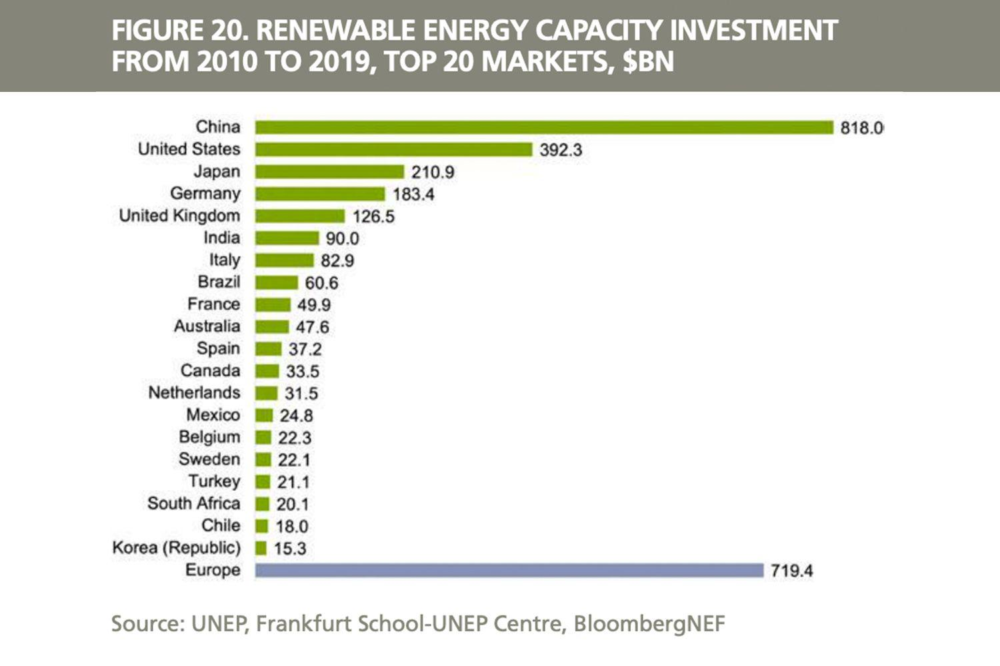

Climate change is undeniably one of the most critical issues facing the world today, with wide-ranging implications not only for the environment but also for global economic stability. The shift in weather patterns, increasing frequency of extreme weather events, and rising sea levels are just some of the manifestations of climate change that threaten ecosystems and human societies alike. These environmental changes pose new challenges and risks to the global economy, impacting everything from agriculture to infrastructure, and creating volatility in financial markets.

As the reality of climate change becomes increasingly evident, investors are taking note and recognizing the need to integrate climate change adaptation into their financial strategies. This shift is driven by the understanding that long-term investment success depends on resilience and adaptability to environmental changes. Investors are now more than ever focusing on sustainability and are actively seeking out opportunities that align with climate-conscious objectives.



This article aims to explore the incorporation of climate change considerations into financial strategies and investment portfolios. We will examine how these considerations are reshaping investment approaches, with a focus on the ways in which algorithmic trading is being adapted to better account for climate-related variables. The exploration will shed light on the economic impacts of climate change and provide insights into effective adaptation strategies for investors looking to mitigate risks and seize new opportunities.

By understanding and adapting to the potential economic impacts of climate change, investors can position themselves to not only protect their assets but also contribute to a global transition towards a more sustainable future. This dual focus on financial returns and sustainability is crucial for addressing the challenges posed by climate change and fostering resilience in global markets. Through informed decision-making and strategic portfolio diversification, investors can play a pivotal role in steering the global economy towards a more sustainable path.

## Table of Contents

## Climate Change and Financial Strategies

As global temperatures continue to rise and extreme weather events become more frequent, traditional financial strategies face increasing challenges. The financial industry is adapting to manage these risks more efficiently by integrating climate change considerations into their investment approaches.

Understanding the implications of climate change is crucial in crafting resilient investment portfolios that can withstand potential environmental impacts. Changes in weather patterns, sea level rise, and the frequency of natural disasters can affect various sectors, from agriculture to real estate. Analysts and investors need to understand these risks to allocate resources effectively and safeguard their assets against unforeseen climate-related events.

One strategic approach is the diversification of investment portfolios with climate-conscious investments. This includes investing in sectors that are not only less vulnerable to climate impacts but also contribute positively to the environment. The energy sector, particularly renewables, represents a significant opportunity. As the global demand for clean energy grows, investments in solar, wind, and other renewable energy technologies are becoming increasingly attractive. By focusing on these areas, investors can mitigate potential financial risks associated with fossil fuel-dependent industries. 

Furthermore, regulatory pressures and growing public awareness are compelling companies to adopt sustainable practices. Governments worldwide are implementing policies to reduce carbon emissions and promote sustainable development. Companies that fail to comply with these regulations may face financial penalties, decreased consumer trust, and heightened investor scrutiny. As a result, businesses are progressively embedding sustainability into their operations, thereby influencing market dynamics and investment patterns.

To keep up with these changes, financial markets are witnessing the emergence of new instruments and metrics, such as Environmental, Social, and Governance ([ESG](/wiki/esg-investing)) criteria. These metrics help investors assess a company's environmental impact and sustainability practices. Incorporating ESG factors into financial analyses and decision-making processes can identify risks and opportunities associated with climate change, promoting a more sustainable investment landscape.

In conclusion, integrating climate change considerations into financial strategies is no longer optional; it is essential for risk management and long-term growth. Investors are urged to embrace climate-conscious strategies by diversifying their portfolios and responding to regulatory and public pressures. This not only aids in mitigating financial risks but also contributes to a more sustainable and resilient global economy.

## Building a Climate Change-Resilient Investment Portfolio

Investing in green technology and renewable energy is gaining traction as governments worldwide adopt stricter environmental regulations to combat climate change. This shift is creating a wealth of opportunities for investors aiming to build resilient investment portfolios. One significant area of focus is renewable energy, particularly solar and wind, which are experiencing rapid technological advancements and cost reductions. These improvements enhance the feasibility and attractiveness of investing in renewables, offering potential long-term financial gains.

The global renewable energy market is projected to grow substantially, supported by policies promoting clean energy transition. For instance, the International Energy Agency (IEA) forecasts that renewable electricity capacity may expand by more than 60% by 2026, compared to 2020 levels, reaching over 4,800 gigawatts. Such expansion represents a significant portion of the world's energy supply, creating lucrative investment avenues in stocks, bonds, and infrastructure projects related to renewable energy.

Further, climate-focused funds and Exchange-Traded Funds (ETFs) provide accessible pathways for investors to engage in sustainable investment practices. These funds typically invest across a variety of sectors that are either directly linked to renewable energy or focus on companies committed to reducing their carbon footprint. By investing in these funds, investors not only stand to gain financial returns but also contribute to net-zero emission targets and broader sustainable goals.

Moreover, integrating Environmental, Social, and Governance (ESG) metrics into investment portfolios can yield considerable benefits. ESG integration involves considering a company's ecological and social impacts, alongside traditional financial analysis, to assess its long-term sustainability and ethical implications. Many studies suggest that portfolios incorporating ESG criteria may exhibit lower [volatility](/wiki/volatility-trading-strategies) and risk, higher returns, and better alignment with ethical standards. For instance, a 2020 study by Morgan Stanley found that sustainable funds often perform in line with or better than traditional funds, evidencing the financial viability of ESG investments.

Overall, constructing a climate change-resilient investment portfolio necessitates a strategic emphasis on green technology, renewables, and ESG metrics. Through thoughtful investment in these areas, investors can achieve diversification, manage climatic risks, and contribute positively to global sustainability efforts.

## The Role of Algorithmic Trading in Climate Change Adaptation

Algorithmic trading, a sophisticated mechanism employing complex algorithms and extensive data analysis, enables rapid and informed investment decision-making. As climate change increasingly influences market variables, alterations to these algorithms are crucial to account for climate-specific data, thereby enhancing their predictive capabilities and mitigating exposure to climatic risks.

The integration of climate data into trading algorithms can revolutionize risk management. Climatic factors such as temperature variance, sea-level rise, and the frequency of extreme weather events can significantly impact sectors like agriculture, insurance, and energy. By incorporating these variables, traders can better anticipate market shifts and adjust their strategies accordingly.

For instance, Python, a versatile programming language used in [algorithmic trading](/wiki/algorithmic-trading), allows for the efficient handling of large datasets, including climate data. A basic implementation might involve using historical climate data to predict future energy demands or agricultural yields. Below is a simplified example in Python:

```python
import pandas as pd
import numpy as np
from sklearn.linear_model import LinearRegression

# Load historical climate and market data
climate_data = pd.read_csv('climate_data.csv')
market_data = pd.read_csv('market_data.csv')

# Merge and clean data
data = pd.merge(climate_data, market_data, on='date')
data.dropna(inplace=True)

# Feature selection
features = data[['temperature', 'rainfall', 'humidity']]
target = data['market_index']

# Model training
model = LinearRegression()
model.fit(features, target)

# Predictive analysis
future_climate_data = pd.read_csv('future_climate_data.csv')
predicted_market_index = model.predict(future_climate_data[['temperature', 'rainfall', 'humidity']])

print(predicted_market_index)
```

This code snippet illustrates how climate data can be employed to predict market trends, forming the basis for algorithmic trading strategies that accommodate climate change considerations.

By adapting algorithms to incorporate climate-related variables, algorithmic trading not only enhances predictive accuracy but also represents a scalable approach to embedding sustainable investment practices in everyday operations. This methodological shift enables traders and investors to align their economic objectives with broader environmental goals, potentially leading to significant societal impacts as capital flows towards more sustainable ventures.

As such, algorithmic trading can serve as a powerful tool in supporting the transition to a resilient and sustainable global economy, navigating the challenges posed by evolving climatic conditions. This proactive integration of climate risks and opportunities into trading frameworks not only safeguards financial interests but also contributes to the broader climate adaptation efforts essential for long-term planetary health.

## Challenges and Risks

Integrating climate change factors into financial strategies presents a unique set of challenges and risks that investors must navigate adeptly. One significant challenge is the availability and reliability of data. Accurate climate data is often scarce or inconsistent, complicating efforts to integrate these variables into financial models. For instance, assessing the long-term financial impact of climate change on a particular sector requires extensive historical and predictive data, which is not always readily available. This issue is further compounded by the need to interpret data from different geographic and industry-specific contexts.

Regulatory complexity introduces another layer of difficulty. Climate policies can vary significantly across regions and over time, leading to market volatility and unpredictability. Policies aimed at curbing emissions, such as carbon taxes or cap-and-trade systems, can directly impact the profitability of certain industries. Consequently, investors must remain vigilant and adaptable, anticipating shifts in regulations and adjusting their portfolios accordingly. Python tools like regulatory impact models can be used to simulate potential scenarios based on different policy frameworks:

```python
import numpy as np

def simulate_regulatory_impact(initial_value, policy_strength):
    # Simulate market value changes based on policy strength
    return initial_value * np.exp(-policy_strength)

initial_value = 1000  # hypothetical starting value
policy_strength = 0.05  # hypothetical policy impact factor

impact_value = simulate_regulatory_impact(initial_value, policy_strength)
print(f"Estimated impact value: {impact_value}")
```

Moreover, the integration of environmental, social, and governance (ESG) metrics introduces additional financial considerations. ESG compliance often entails upfront costs and adherence to stringent processes, which can lower short-term returns. However, over the long term, companies that prioritize ESG factors may enhance their resilience to climate risks and appeal more to conscious investors, potentially leading to greater sustainable growth.

Despite the possible lower short-term returns posed by rigorous ESG compliance, the transition towards green investments is vital. This shift supports sustainable economic growth and contributes to reducing the environmental footprint of economic activities. While challenges exist, the investment community's increasing emphasis on sustainability indicates that integrating climate change factors into financial strategies is a necessary and forward-thinking approach to secure long-term financial and societal benefits.

## Conclusion

Adapting financial strategies to consider climate change is critical for effectively navigating the extensive challenges posed by environmental change. Climate change is not only reshaping the physical environment but is also altering economic landscapes and financial market dynamics. In this context, investors possess a unique position and responsibility to foster the transition towards a sustainable economy through informed and strategic financial decisions.

Incorporating climate risks and opportunities into investment portfolios is essential for achieving a balanced approach that considers both financial and societal benefits. By focusing on investments that support decarbonization, energy efficiency, and resilience against extreme weather events, investors can mitigate risks associated with climate change while potentially tapping into new growth opportunities. For example, investing in renewable energy projects or companies that emphasize sustainability can provide competitive returns as these sectors continue to expand in response to global policy changes and consumer demand for greener solutions.

Moreover, as climate change continues to have a widespread impact on global markets, adopting a proactive investment approach is vital for ensuring long-term resilience. This involves continuously assessing emerging risks and opportunities and adjusting strategies accordingly. Investors can leverage technological advancements, such as algorithmic trading that incorporates climate data, to enhance their ability to predict market shifts and swiftly adapt to new conditions. 

In summary, integrating climate considerations into financial strategies is no longer optional but a necessity for maintaining competitive advantage and driving positive environmental change. Through strategic investments that account for climate risks and leverage related opportunities, investors can not only seek beneficial returns but also contribute to a sustainable future. Proactive engagement and adaptation will be key in aligning financial interests with the broader goal of ecological stability and economic sustainability.

## References & Further Reading

[1]: TCFD. (2017). ["Recommendations of the Task Force on Climate-related Financial Disclosures."](https://www.fsb.org/2017/06/recommendations-of-the-task-force-on-climate-related-financial-disclosures-2/)

[2]: International Energy Agency (IEA). (2021). ["Renewables 2021: Analysis and forecast to 2026."](https://www.iea.org/reports/renewables-2021) 

[3]: López de Prado, M. (2018). ["Advances in Financial Machine Learning."](https://www.amazon.com/Advances-Financial-Machine-Learning-Marcos/dp/1119482089)

[4]: Khan, M., Serafeim, G., & Yoon, A. (2016). ["Corporate sustainability: First evidence on materiality."](https://www.jstor.org/stable/24907173) The Accounting Review, 91(6), 1697-1724.

[5]: Gillingham, K., & Stock, J. (2018). ["The Cost of Reducing Greenhouse Gas Emissions."](https://www.aeaweb.org/articles?id=10.1257/jep.32.4.53) Journal of Economic Perspectives, 32(4), 53-72. 

[6]: Climate Bonds Initiative. (2021). ["Climate Bonds Taxonomy."](https://www.climatebonds.net/standard/taxonomy)

[7]: UNEP FI. (2019). ["Changing Course: A Comprehensive Investor Guide to Scenario-based Methods for Climate Risk Assessment, in Response to the TCFD."](https://www.unepfi.org/industries/investment/changing-course-a-comprehensive-investor-guide-to-scenario-based-methods-for-climate-risk-assessment-in-response-to-the-tcfd/)

[8]: Markowitz, H. (1952). ["Portfolio Selection."](https://onlinelibrary.wiley.com/doi/abs/10.1111/j.1540-6261.1952.tb01525.x) The Journal of Finance, 7(1), 77-91.

[9]: Mercer. (2019). ["Investing in a Time of Climate Change – The Sequel 2019."](https://www.marshmclennan.com/web-assets/insights/publications/2020/september/Investing%20in%20a%20time%20of%20climate%20change_The%20sequel.pdf)