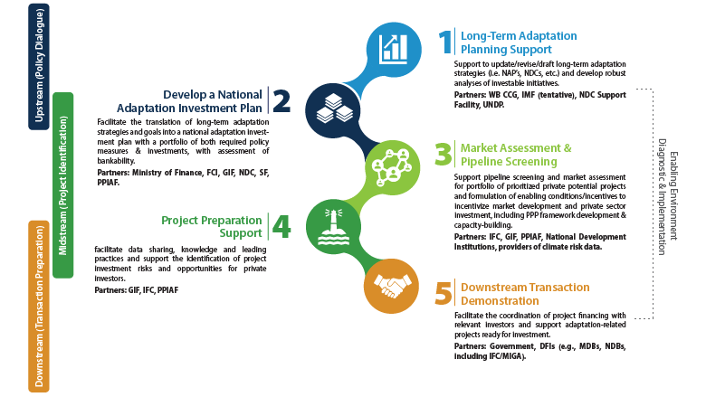

## Table of Contents

## What is climate change and why is it important for investment portfolios?

Climate change is the long-term change in the average weather patterns across the world. It is caused by increased levels of greenhouse gases, like carbon dioxide, in the atmosphere. These gases trap heat from the sun, making the Earth warmer. This warming can lead to more extreme weather, like hotter temperatures, more storms, and rising sea levels. It's a big problem because it affects people, animals, and the environment in many ways.

Climate change is important for investment portfolios because it can change how businesses work and make money. Companies that use a lot of energy or produce a lot of greenhouse gases might face new rules or taxes, which could hurt their profits. On the other hand, businesses that help fight climate change, like those making renewable energy or energy-saving products, might grow and do well. Investors need to think about these changes when they decide where to put their money, so their investments can be safer and more successful in the long run.

## How can climate change impact different sectors of the economy?

Climate change can affect many parts of the economy in different ways. For example, the agriculture sector might see big changes because of hotter temperatures and more unpredictable weather. This can make it harder for farmers to grow crops and raise animals, which can lead to less food and higher prices. Also, the energy sector could be hit hard. Companies that rely on fossil fuels like coal and oil might face new rules and taxes to cut down on greenhouse gases. This could make their business more expensive and less profitable. On the other hand, companies that make renewable energy, like solar and wind power, might grow and do better as more people look for clean energy options.

Another sector that climate change can impact is insurance. With more storms, floods, and other extreme weather events, insurance companies might have to pay out more money for damages. This could make insurance more expensive for everyone. The tourism industry can also be affected. Places that people like to visit for their beaches or snow might not be as attractive if the sea levels rise or if there's less snow. This could mean fewer tourists and less money for businesses in those areas. Overall, climate change can shake up many parts of the economy, making some businesses struggle while others might find new opportunities to grow.

## What are the basic principles of building a climate-adaptive investment portfolio?

Building a climate-adaptive investment portfolio means choosing investments that can handle the changes brought by climate change. It's important to look at companies that are working on reducing their impact on the environment. These might be businesses that use less energy, make renewable energy, or help people use less water. By investing in these companies, you can help the planet and also make your investments safer. It's also a good idea to spread your money across different types of investments. This way, if one part of your portfolio is hurt by climate change, other parts might still do well.

Another key part of a climate-adaptive portfolio is keeping an eye on how climate change might affect different industries. For example, companies that rely a lot on fossil fuels might face new rules or taxes, which could hurt their profits. On the other hand, businesses that help fight climate change, like those making electric cars or energy-saving products, might grow and do well. By understanding these trends, you can make smarter choices about where to put your money. This can help your investments stay strong even as the world changes because of climate change.

## What types of investments are considered climate-friendly?

Climate-friendly investments are those that help the planet by reducing harm to the environment. These can include companies that make renewable energy like solar or wind power. They also include businesses that help people use less energy or water, like those making energy-efficient appliances or water-saving technologies. Another type of climate-friendly investment is in companies that work on reducing pollution or waste, like those that recycle materials or clean up the air and water.

Another way to invest in a climate-friendly way is by putting money into green bonds. These are special bonds that companies or governments issue to raise money for projects that help the environment, like building wind farms or improving public transportation. Investing in sustainable agriculture is also climate-friendly. This means supporting farms that use methods that are good for the soil and don't harm the environment, like organic farming or using less harmful chemicals.

Overall, climate-friendly investments focus on supporting businesses and projects that help fight climate change. By choosing these types of investments, you can help the planet and also make your investment portfolio more resilient to the changes that climate change might bring.

## How can investors assess the climate risk of their current portfolio?

To assess the climate risk of their current portfolio, investors should first look at the companies they have invested in. They need to find out if these companies are likely to be affected by climate change. For example, do they use a lot of energy from fossil fuels? Are they in industries that might face new rules or taxes to cut down on greenhouse gases? By understanding how climate change could impact these companies, investors can see if their investments might be at risk.

Another way to assess climate risk is by using tools and reports from experts. There are special reports and scores that show how much a company might be affected by climate change. These can help investors see which parts of their portfolio might be in danger. By looking at these reports and scores, investors can make better choices about where to put their money. This can help them lower the risk that climate change might bring to their investments.

## What are the key metrics to consider when evaluating climate change adaptation strategies?

When evaluating climate change adaptation strategies, it's important to look at how well they help businesses handle the changes brought by climate change. One key metric is resilience, which means how well a company can keep working even when there are big changes like more storms or hotter temperatures. Another important thing to consider is the cost-effectiveness of these strategies. This means figuring out if the money spent on adapting to climate change will help the company save money or make more money in the long run.

Another metric to think about is the reduction in greenhouse gas emissions. If a strategy helps a company use less energy or switch to cleaner energy sources, it's a good sign that it's helping to fight climate change. It's also useful to look at how flexible the strategy is. A good adaptation strategy should be able to change as new information about climate change comes in. This helps the company stay strong no matter what happens.

Overall, when looking at climate change adaptation strategies, investors should focus on resilience, cost-effectiveness, emission reductions, and flexibility. These metrics can help them understand if a company's plan to deal with climate change is strong and likely to succeed.

## How do green bonds and other climate-focused financial instruments work?

Green bonds and other climate-focused financial instruments are special types of investments that help the planet. Green bonds are like loans that companies or governments take out to pay for projects that help the environment. For example, the money from green bonds might be used to build wind farms, plant more trees, or improve public transportation. People who buy these bonds are lending money to these projects, and in return, they get their money back with some interest. This way, investors can make money while also helping to fight climate change.

Other climate-focused financial instruments include things like sustainability-linked loans and carbon credits. Sustainability-linked loans are loans that give companies better interest rates if they meet certain goals that help the environment, like using less energy or reducing waste. Carbon credits are like permits that let companies produce a certain amount of greenhouse gases. If a company produces less than its limit, it can sell its extra credits to other companies that need them. This system encourages companies to pollute less and helps them find new ways to be more environmentally friendly. By using these financial tools, investors can support businesses that are working to make the world a better place.

## What role do renewable energy investments play in a climate-adaptive portfolio?

Renewable energy investments are a big part of a climate-adaptive portfolio. They help the planet by using clean energy sources like solar, wind, and hydro power. These sources don't produce harmful greenhouse gases like fossil fuels do. By putting money into renewable energy, investors can support companies that are working to fight climate change. This can make their portfolio safer because these companies are less likely to be hurt by new rules or taxes on pollution.

Renewable energy investments can also be a good way to make money. As more people and governments want to use clean energy, the demand for solar panels, wind turbines, and other renewable technologies is growing. This means that companies in the renewable energy sector might do well and grow. By including these investments in a climate-adaptive portfolio, investors can help the environment and also have a chance to earn good returns on their money.

## How can investors use scenario analysis to prepare for various climate outcomes?

Investors can use scenario analysis to imagine different ways that climate change might affect the world and their investments. This means they think about different possible futures, like one where climate change gets really bad and causes a lot of problems, or another where people work hard to stop it and things get better. By looking at these different scenarios, investors can see which companies might do well or struggle in each case. This helps them make smarter choices about where to put their money so their investments can be safer no matter what happens.

For example, if investors think about a scenario where sea levels rise a lot, they might see that companies with buildings near the coast could be in trouble. They could then decide to invest less in those companies and more in ones that make things like flood barriers or water pumps. On the other hand, if they imagine a future where everyone switches to clean energy quickly, they might want to invest more in solar and wind power companies. By using scenario analysis, investors can plan for different climate outcomes and make their portfolios stronger and more ready for the future.

## What advanced strategies exist for hedging against climate-related financial risks?

One advanced strategy for hedging against climate-related financial risks is to use insurance products specifically designed for climate risks. These products can protect investments from damages caused by events like storms, floods, or droughts. For example, parametric insurance pays out money when certain climate events happen, like when the temperature gets too high or when there's too much rain. This can help investors cover losses from climate events without waiting for traditional insurance claims to be processed.

Another strategy is to invest in climate derivatives. These are financial tools that let investors bet on future climate conditions, like temperature or rainfall. If an investor thinks it will be hotter than usual next summer, they can buy a derivative that pays out if the temperature hits a certain level. This can help offset losses in other parts of their portfolio that might be hurt by the hot weather. By using climate derivatives, investors can manage their risks better and protect their investments from the ups and downs caused by climate change.

A third strategy involves diversifying investments across different regions and sectors that are less vulnerable to climate change. For example, investing in companies that are in areas less prone to extreme weather or in industries that benefit from climate change, like renewable energy or water management, can help spread the risk. By balancing their portfolio in this way, investors can reduce the impact of climate-related events on their overall investments, making their portfolio more resilient to the unpredictable effects of climate change.

## How can portfolio managers integrate climate change adaptation into their overall investment strategy?

Portfolio managers can integrate climate change adaptation into their overall investment strategy by first understanding how climate change might affect different industries and companies. They need to look at which companies are at risk from things like rising sea levels, more storms, or new rules to cut down on pollution. By doing this, they can decide to invest less in companies that might struggle and more in ones that are working to fight climate change. For example, they might put more money into companies that make renewable energy or help people use less water. This way, they can help the planet and also make their investments safer and more likely to do well in the long run.

Another way portfolio managers can adapt to climate change is by using special tools and strategies. They can use scenario analysis to imagine different ways the future might go because of climate change. This helps them see which companies might do well or badly in each case. They can also use insurance products and climate derivatives to protect their investments from climate events like storms or droughts. By spreading their investments across different regions and sectors that are less affected by climate change, they can make their portfolio stronger. Overall, by thinking about climate change and using these tools, portfolio managers can build a strategy that helps the environment and keeps their investments safe.

## What are the latest trends and innovations in climate change investment strategies?

The latest trends in climate change investment strategies focus a lot on using technology and data to make better choices. One big trend is using [artificial intelligence](/wiki/ai-artificial-intelligence) and [machine learning](/wiki/machine-learning) to look at a lot of data about climate change and how it might affect different companies. This helps investors see which companies might do well or struggle because of climate change. Another trend is investing in new technologies that help fight climate change, like batteries for storing renewable energy or ways to take carbon out of the air. These technologies are getting better and cheaper, which makes them more interesting for investors.

Another important trend is the growing popularity of impact investing. This means putting money into companies that not only make money but also help the planet or society. For example, more investors are looking at companies that work on clean energy, sustainable farming, or clean water. These investments can help the environment and also make good returns. Also, there are more green bonds and other climate-focused financial tools now. These let investors support projects that help the environment, like building wind farms or planting trees, and get paid back with interest. By using these new trends and tools, investors can make their portfolios stronger and help fight climate change at the same time.

## References & Further Reading

[1]: TCFD. (2017). ["Recommendations of the Task Force on Climate-related Financial Disclosures."](https://www.fsb.org/2017/06/recommendations-of-the-task-force-on-climate-related-financial-disclosures-2/)

[2]: International Energy Agency (IEA). (2021). ["Renewables 2021: Analysis and forecast to 2026."](https://www.iea.org/reports/renewables-2021) 

[3]: López de Prado, M. (2018). ["Advances in Financial Machine Learning."](https://www.amazon.com/Advances-Financial-Machine-Learning-Marcos/dp/1119482089)

[4]: Khan, M., Serafeim, G., & Yoon, A. (2016). ["Corporate sustainability: First evidence on materiality."](https://www.jstor.org/stable/24907173) The Accounting Review, 91(6), 1697-1724.

[5]: Gillingham, K., & Stock, J. (2018). ["The Cost of Reducing Greenhouse Gas Emissions."](https://www.aeaweb.org/articles?id=10.1257/jep.32.4.53) Journal of Economic Perspectives, 32(4), 53-72. 

[6]: Climate Bonds Initiative. (2021). ["Climate Bonds Taxonomy."](https://www.climatebonds.net/standard/taxonomy)

[7]: UNEP FI. (2019). ["Changing Course: A Comprehensive Investor Guide to Scenario-based Methods for Climate Risk Assessment, in Response to the TCFD."](https://www.unepfi.org/industries/investment/changing-course-a-comprehensive-investor-guide-to-scenario-based-methods-for-climate-risk-assessment-in-response-to-the-tcfd/)

[8]: Markowitz, H. (1952). ["Portfolio Selection."](https://onlinelibrary.wiley.com/doi/abs/10.1111/j.1540-6261.1952.tb01525.x) The Journal of Finance, 7(1), 77-91.

[9]: Mercer. (2019). ["Investing in a Time of Climate Change – The Sequel 2019."](https://www.marshmclennan.com/web-assets/insights/publications/2020/september/Investing%20in%20a%20time%20of%20climate%20change_The%20sequel.pdf)