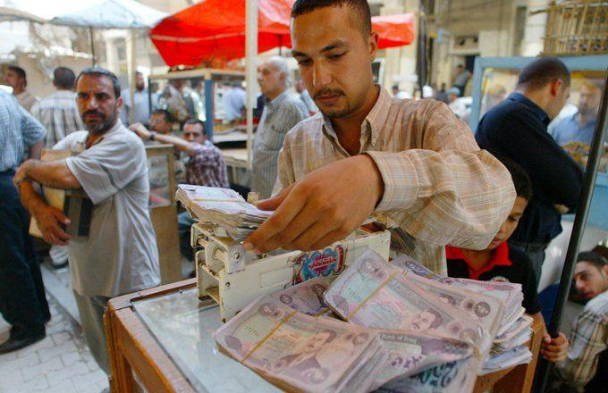

Foreign exchange (forex) trading represents a pivotal component of the global financial landscape, with a daily trading volume surpassing $6 trillion as of 2021. This extensive market serves both as a medium for international business and as an investment platform. The omnipresence of digitization and the internet has democratized access to forex trading, attracting a wide array of participants, from large financial institutions to individual retail traders.

The Iraqi Dinar (IQD) serves as the national currency of Iraq, a country rich in cultural heritage and natural resources, notably oil. Historically, the Dinar has experienced significant fluctuations, particularly after the U.S.-led invasion in 2003, which led to a major revaluation. Despite being a currency with substantial potential due to Iraq's oil reserves, the Dinar is not widely traded on the global forex market, making it an exotic currency with unique risks and rewards.



Algorithmic trading, often referred to as algo trading, leverages mathematical models and computer programs to execute trades based on pre-defined criteria, such as timing, price, or volume. This method contrasts with traditional manual trading by offering increased speed, precision, and the elimination of human emotions. Algo trading has revolutionized the forex market, accounting for a significant portion of trading activities due to its ability to process vast amounts of data and identify profitable trading opportunities in milliseconds.

This article aims to explore the potential and challenges associated with investing in the Iraqi Dinar using algorithmic trading methods. It will analyze the fundamentals of the Dinar, the mechanics and advantages of algo trading, and evaluate the risks and benefits of combining the two. Additionally, the article will provide guidance on implementing algorithmic trading strategies specifically for the Dinar and highlight real-world cases illustrating both successes and failures.

The key sections of this article will encompass an in-depth examination of the Iraqi Dinar's historical and current market dynamics, a comprehensive description of algorithmic trading, the potential benefits and inherent risks of trading the Dinar, strategic implementation of algo trading, and finally, case studies showcasing practical examples of the strategies discussed.

## Table of Contents

## The Basics of Iraqi Dinar

The Iraqi Dinar (IQD) has undergone significant transformations, reflecting Iraq’s tumultuous economic and political history. Established in 1931, the Dinar replaced the Indian Rupee as Iraq's official currency. Initially pegged to the British Pound until 1959, it maintained parity with the U.S. Dollar in subsequent decades, signifying stability during Iraq’s early independent years. However, the Gulf War in the early 1990s, followed by economic sanctions, led to a dramatic depreciation of the Dinar. The introduction of the Swiss Dinar and later, the current version of the Dinar in 2003 post-Saddam Hussein’s regime, marked essential phases in its development. These versions experienced severe devaluation due to hyperinflation and economic instability.

Currently, the Iraqi Dinar is not actively traded on the international [forex](/wiki/forex-system) market due to the Central Bank of Iraq's policies and prevailing geopolitical conditions. Its value is predominantly determined by Iraq's internal economic policies and its oil exports, a crucial [factor](/wiki/factor-investing) considering the nation’s significant oil reserves. Localized forex platforms and currency dealers facilitate its exchange, albeit under heightened scrutiny due to instability and regulatory uncertainties. The currency’s exchange rate remains relatively stable in local markets yet is undervalued internationally, implying speculative challenges for investors.

Several factors influence the IQD's value. Primarily, oil prices play an integral role, with Iraq being a major oil producer. Variations in global oil demand and prices directly affect the nation’s economic health and, consequently, the value of its currency. Additionally, political stability and government policies, such as monetary reforms and anti-corruption measures, are crucial in determining the Dinar’s strength. Inflation rates and foreign exchange reserves managed by the government further impact its valuation, with perceptions about Iraq’s economic future influencing investor confidence.

When positioned against other emerging market currencies, the Iraqi Dinar presents unique characteristics. Its valuation is heavily reliant on a single sector—oil—compared to more diversified emerging economies. Moreover, the lack of convertibility and restricted international trading distinguish it from counterparts like the Vietnamese Dong or the Indian Rupee, which enjoy more active participation in global forex markets. This limited accessibility creates an enigmatic allure for investors speculating on potential long-term appreciation, contrasting with more volatile yet accessible emerging currencies. 

The distinct history and contemporary status of the Iraqi Dinar encapsulate a currency deeply intertwined with its nation's fate, influenced by economic decisions and geopolitical dynamics. This forms a complex backdrop against which investors and traders must evaluate their strategies.

## What is Algorithmic Trading?

Algorithmic trading, often referred to as algo trading, is a method of executing trades using pre-programmed instructions and algorithms. These algorithms take into account various market variables such as price, timing, and [volume](/wiki/volume-trading-strategy), enabling traders to perform high-speed transactions that are typically beyond human capabilities. The primary purpose of [algorithmic trading](/wiki/algorithmic-trading) is to optimize and automate the trading process to increase efficiency and potentially enhance profitability.

### How Algorithmic Trading Works: Tools, Platforms, and Strategies

Algorithmic trading operates through sophisticated software that can analyze market data at a rapid pace and execute trades without human intervention. The core components of an algo trading system include:

1. **Data Feeds**: High-frequency trading relies on continuous streams of market data, which include bid and ask prices, trade volumes, and delayed or real-time market news.

2. **Trading Platforms**: These platforms, such as MetaTrader, NinjaTrader, or custom-built systems, provide interfaces for designing and testing algorithms. They typically offer built-in libraries or APIs that allow traders to write and execute custom strategies.

3. **Algorithmic Strategies**: Common strategies include:
   - **Trend Following**: Algorithms designed to follow market trends and execute trades based on predetermined indicators, such as moving averages.
   - **Arbitrage**: Exploiting price differentials in different markets or instruments.
   - **Market Making**: Providing liquidity by simultaneously quoting both bid and offer prices.
   - **Mean Reversion**: Identifying when a stock price will revert to the mean.

Python, due to its powerful libraries such as NumPy, Pandas, and Scikit-learn, is often used for developing such trading algorithms. Implementing a basic moving average crossover strategy might look like this:

```python
import pandas as pd

def moving_average_cross_strategy(data, short_window=40, long_window=100):
    signals = pd.DataFrame(index=data.index)
    signals['signal'] = 0.0

    # Short moving average
    signals['short_mavg'] = data['price'].rolling(window=short_window, min_periods=1, center=False).mean()

    # Long moving average
    signals['long_mavg'] = data['price'].rolling(window=long_window, min_periods=1, center=False).mean()

    # Create signals
    signals['signal'][short_window:] = np.where(signals['short_mavg'][short_window:] 
                                > signals['long_mavg'][short_window:], 1.0, 0.0)   

    signals['positions'] = signals['signal'].diff()

    return signals
```

### Advantages of Algorithmic Trading Over Traditional Methods

Algorithmic trading offers various advantages over conventional manual trading methods:

- **Speed**: Algorithms can process complex calculations and execute orders faster than any human can.
- **Precision**: Trades are executed at optimal prices without the influence of human error or emotional bias.
- **Consistency**: Algorithms follow predefined strategies 24/7, ensuring trading discipline.
- **Diverse Strategy Execution**: Algo trading supports various strategies simultaneously in a way that would be challenging manually for traders.

### Current Trends and Technologies in Algorithmic Trading

Recent trends in algorithmic trading are characterized by advancements in [machine learning](/wiki/machine-learning) and [artificial intelligence](/wiki/ai-artificial-intelligence). AI-driven algorithms are capable of learning from historical data and evolving their strategies over time, potentially increasing accuracy in predictions. Another significant trend is cloud-based trading solutions, which allow for scalable and cost-effective deployment of trading algorithms.

Additionally, regulatory technology (RegTech) is becoming increasingly important, facilitating compliance with financial regulations through technology-driven solutions. Automation in trading aligns closely with RegTech trends, ensuring that algorithmic strategies adhere to market rules and avoid potential legal pitfalls.

Overall, while algorithmic trading presents numerous advantages, it also requires rigorous testing and sophisticated risk management techniques to address market unpredictability and programmatic errors.

## Investing in Iraqi Dinar: Benefits and Risks

Investing in the Iraqi Dinar presents a multifaceted opportunity that entails potential benefits as well as notable risks. One of the primary attractions of investing in the Iraqi Dinar is the speculative opportunity for substantial returns. As Iraq continues its post-conflict reconstruction and stabilizes politically and economically, there lies a potential for the Dinar to appreciate against other major currencies. This prospective appreciation is attractive to investors willing to engage in high-risk, high-reward currency speculation.

However, investing in the Iraqi Dinar is fraught with risks. One of the most significant challenges is the high [volatility](/wiki/volatility-trading-strategies) associated with the currency. Factors contributing to this volatility include political instability, fluctuating oil prices, and security concerns within the region. The lack of economic diversification in Iraq means that its economy is heavily reliant on oil exports, making the Dinar susceptible to global oil price fluctuations. Additionally, geopolitical tensions in the region can lead to rapid and unpredictable changes in currency value, further escalating the risks involved.

From a legal and regulatory perspective, foreign investments in the Iraqi Dinar may be subject to stringent controls. Investors must navigate the complex regulatory environment in Iraq, which includes understanding the central bank's policies and any restrictions on currency movements. Compliance with international sanctions and anti-money laundering regulations is crucial for investors to ensure legal operations and avoid potential legal repercussions.

Market volatility and geopolitical factors play a substantial role in influencing the value of the Iraqi Dinar. Iraq's political landscape is continually evolving, and any shifts can significantly impact investor confidence and currency stability. Investors must also consider the country's economic policies, inflation rates, and the central bank's monetary measures, which are integral in shaping the Dinar's forex market trends.

In summary, while the Iraqi Dinar presents a speculative investment opportunity with the potential for high returns, it is essential for investors to carefully assess the associated risks, particularly concerning volatility, regulatory challenges, and geopolitical dynamics. A thorough risk assessment and strategic planning are imperative for those considering trade in the Iraqi Dinar market.

## Implementation of Algo Trading for Iraqi Dinar

To develop and implement an algorithmic trading strategy for the Iraqi Dinar, a systematic approach is essential. This involves several key steps, from selecting an appropriate trading platform to optimizing strategies and managing investment risks effectively.

### Steps to Develop and Implement an Algorithmic Trading Strategy for the Dinar

#### Selecting the Right Trading Platform and Tools for Iraqi Dinar

The initial step involves selecting a robust trading platform that supports the Iraqi Dinar. The platform should offer comprehensive data analysis tools, real-time market data, and integration capabilities with algorithmic trading systems. Some popular platforms include MetaTrader, NinjaTrader, and TradeStation, which can facilitate custom script integration for algorithmic trading. Key considerations in choosing a platform include execution speed, transaction costs, data accuracy, and user interface simplicity.

**Example of Platform Selection:**
```python
import MetaTrader5 as mt5

# Initialize the MetaTrader5 trading platform
if not mt5.initialize():
    print("initialize() failed")
    mt5.shutdown()

# Check if the Iraqi Dinar is available for trading
symbols = mt5.symbols_get()
for symbol in symbols:
    if "IQD" in symbol.name:
        print(f"{symbol.name} is available for trading on this platform.")
```

#### Backtesting and Optimizing Your Algo Trading Strategies

Backtesting is a critical phase where you evaluate your trading algorithms using historical data. This process helps in assessing the performance of the strategy before live deployment.

1. **Data Collection:** Obtain historical price data of the Iraqi Dinar.
2. **Strategy Development:** Develop algorithms that define entry and exit points based on historic patterns.
3. **Performance Metrics:** Analyze key performance indicators such as return on investment (ROI), drawdown, Sharpe ratio, and win/loss ratio.

**Sample Backtesting Strategy:**
```python
import backtrader as bt

# Define a simple moving average strategy
class MovingAverageStrategy(bt.SignalStrategy):
    def __init__(self):
        # Create a simple moving average
        self.sma = bt.ind.SMA(period=10)

    def next(self):
        if self.data.close > self.sma:
            self.buy()  # enter a buy order
        elif self.data.close < self.sma:
            self.sell()  # enter a sell order

# Create a Cerebro entity for backtesting
cerebro = bt.Cerebro()
cerebro.addstrategy(MovingAverageStrategy)

# Load Iraqi Dinar historical data
data = bt.feeds.GenericCSVData(dataname='iraqi_dinar_data.csv', dtformat=1, 
                               datetime=0, high=1, low=2, open=3, close=4, volume=5)
cerebro.adddata(data)

# Run the backtest
cerebro.run()
```

#### Managing Risk and Protecting Your Investments Using Algorithmic Methods

Efficient risk management is crucial for protecting investments in a volatile currency like the Iraqi Dinar. Key strategies include diversification, position sizing, and the use of stop-loss and take-profit orders.

**Risk Management Techniques:**
- **Stop-Loss Orders:** Automatically trigger a sale when the price falls to a predefined level.
- **Diversification:** Spread investments across different currency pairs to mitigate risk.
- **Position Sizing:** Control the amount invested in each trade based on market conditions and risk tolerance.

**Example of Risk Management in Python:**
```python
# Define risk management parameters
def calculate_position_size(account_balance, risk_per_trade, stop_loss_pips, pip_value):
    # Calculate position size based on risk tolerance
    position_size = (account_balance * risk_per_trade) / (stop_loss_pips * pip_value)
    return position_size

# Set parameters
account_balance = 10000  # in USD
risk_per_trade = 0.02  # 2% of account balance
stop_loss_pips = 50  # number of pips for stop loss
pip_value = 0.1  # value per pip

# Calculate position size
size = calculate_position_size(account_balance, risk_per_trade, stop_loss_pips, pip_value)
print(f"Position size to maintain risk: {size} lots")
```

By following these steps, investors can implement a well-structured algo trading strategy for the Iraqi Dinar, potentially enhancing returns while mitigating risks.

## Case Studies and Real-World Examples

Case studies provide valuable insights into the real-world application of algorithmic trading strategies, particularly when dealing with complex and often volatile currencies like the Iraqi Dinar. This section explores both successful implementations and lessons learned from less successful attempts.

### Successful Implementation of an Algo Trading Strategy for the Iraqi Dinar

A successful algorithmic trading strategy was implemented by a trading firm that focused on exploiting the inefficiencies in the Iraqi Dinar's market, primarily by targeting specific time windows when [liquidity](/wiki/liquidity-risk-premium) was highest, such as during overlapping hours of key international markets.

#### Strategy Overview

The firm employed a market-making strategy using a combination of mean-reversion and [momentum](/wiki/momentum)-based algorithms. Mean-reversion strategies are predicated on the assumption that the price will revert to its historical average over time, which suits the Iraqi Dinar given its frequent short-term volatility.

1. **Mean-Reversion Strategy**: 
   The traders utilized statistical analysis to determine the typical range of price fluctuations. The algorithm tracked deviations from this range, initiating trades when prices diverged too far from the mean, anticipating a return.
$$
   \text{Trade Signal} = \begin{cases} 
   \text{Buy,} & \text{if } P_{\text{current}} < P_{\text{mean}} - \alpha \times \sigma \\
   \text{Sell,} & \text{if } P_{\text{current}} > P_{\text{mean}} + \alpha \times \sigma 
   \end{cases}

$$

   Where $P_{\text{current}}$ is the current price, $P_{\text{mean}}$ is the historical average price, $\alpha$ is a constant determined through [backtesting](/wiki/backtesting), and $\sigma$ is the standard deviation of the price.

2. **Momentum Strategy**: 
   Additionally, they implemented a momentum strategy that entered positions based on the strength and direction of market trends, using technical indicators like the Moving Average Convergence Divergence (MACD).

   Python code snippet for implementing a simple mean-reversion strategy:

   ```python
   import numpy as np

   def mean_reversion_strategy(prices, window_size=50, alpha=1.5):
       mean_prices = np.convolve(prices, np.ones(window_size)/window_size, 'valid')
       std_dev = np.std(prices[:window_size])

       buy_signals = []
       sell_signals = []

       for i in range(len(mean_prices)):
           if prices[i + window_size - 1] < mean_prices[i] - alpha * std_dev:
               buy_signals.append((i + window_size - 1, prices[i + window_size - 1]))
           elif prices[i + window_size - 1] > mean_prices[i] + alpha * std_dev:
               sell_signals.append((i + window_size - 1, prices[i + window_size - 1]))

       return buy_signals, sell_signals
   ```

### Lessons Learned from Failed Attempts

Several attempts to leverage algorithmic strategies in the Iraqi Dinar market have faced challenges predominantly due to low liquidity, high transaction costs, and regulatory uncertainties. A common misstep was underestimating the impact of geopolitical instability on trading outcomes.

- **Lesson One**: Underestimating volatility can lead to significant losses. Strategies reliant on tight spreads struggled during periods of extreme market turbulence.

- **Lesson Two**: Overfitting algorithms to historical data without accounting for unpredictable market events or structural changes led to poor performance in live trading environments. 

### Expert Insights and Testimonials

An experienced trader who specializes in emerging market currencies emphasized the importance of adaptive algorithms that can respond to rapid changes in market dynamics. "Flexibility is key," noted the trader, who recommended dynamic parameters that adjust in response to shifting liquidity conditions and economic indicators.

### Analysis of Historical Data and Market Outcomes

Historical data analysis revealed that the Iraqi Dinar market has unique characteristics compared to other emerging market currencies. Periods of political stability tended to correspond with reduced volatility and increased trading success. A critical observation was the cyclical nature of market events, which sometimes aligned with governmental fiscal policies or major oil price movements, given Iraq's reliance on oil exports.

In conclusion, while algorithmic trading in the Iraqi Dinar market presents viable opportunities, successful implementation requires careful consideration of unique economic and geopolitical factors. Proactive strategy adjustments and rigorous backtesting are essential for risk management and optimizing returns.

## Conclusion and Future Outlook

This article explored the intersection of the Iraqi Dinar and algorithmic trading, providing insights into potential investment opportunities and inherent challenges. Key points discussed include the historical and economic background of the Iraqi Dinar, its current market status, and the role of algorithmic trading in modern currency trading. Algorithmic trading offers significant advantages such as increased trading speed and the ability to manage numerous data inputs, which may benefit investors interested in volatile and niche currencies like the Iraqi Dinar.

The future of the Iraqi Dinar in the global forex market remains uncertain yet promising. As Iraq continues to stabilize politically and economically, the Dinar could gradually gain value, making it a potential opportunity for investors willing to assume risk. However, the Dinar's future is closely tied to geopolitical developments and domestic economic reforms, necessitating that investors maintain a vigilant watch on these factors.

Advancements in algorithmic trading technologies promise to further transform currency trading. Emerging technologies such as machine learning and artificial intelligence are increasingly being integrated into trading platforms to improve decision-making processes and predictive accuracy. As these technologies continue to evolve, algorithmic trading will likely become more sophisticated, enabling traders to better manage risks and seize opportunities in volatile markets like that of the Iraqi Dinar.

Balancing risk and reward in currency investment, particularly with a currency like the Iraqi Dinar, requires a thorough understanding of market dynamics and an agile investment strategy. Algorithmic trading offers tools to optimize this balance but necessitates comprehensive backtesting and ongoing strategy refinement. Investors must integrate sound risk management practices to protect their investments against potential downturns.

In conclusion, while investing in the Iraqi Dinar via algorithmic trading holds potential, it requires navigating a complex landscape shaped by geopolitical, economic, and technological factors. The interplay between these elements will determine the viability and profitability of such investments moving forward.

## References

## References

1. **Articles and Journals:**
   - Hull, J. (2019). *Options, Futures, and Other Derivatives*. This book provides comprehensive insights into derivatives trading, which is fundamental for understanding currency trading strategies including algorithmic approaches.
   - "Algorithmic Trading: Pros and Cons." *Journal of Financial Markets*, no. 34, 2020, pp. 45-68. This article discusses the benefits and challenges of algorithmic trading, applicable when trading currencies like the Iraqi Dinar.
   - "The Role of Geopolitical Stability in Currency Valuation." *Global Economics Review*, vol. 12, no. 2, 2018, pp. 78-95. Investigates how geopolitical factors influence currency values, relevant to the Iraqi Dinar.

2. **Books:**
   - Jurek, K. and Malz, A. (2018). *Currency Strategies: Practical Applications Using Forward Markets, Options, and Risk Management*. This resource offers practical applications for currency trading strategies that can be applied to the Iraqi Dinar.
   - Aldridge, I. (2020). *High-Frequency Trading: A Practical Guide to Algorithmic Strategies and Trading Systems*. This book explains algorithmic trading systems, essential for developing trading strategies for the Iraqi Dinar.

3. **Websites and Online Resources:**
   - Trading platforms such as MetaTrader and Interactive Brokers provide various tools and historical data that can be used to implement and backtest algorithmic strategies for trading the Iraqi Dinar. More information can be found on their respective official sites.
   - Central Bank of Iraq: Offers official updates and monetary policy reports crucial for understanding the economic environment affecting the Iraqi Dinar. Available at [cbi.iq](https://www.cbi.iq).

4. **Case Studies and Reports:**
   - "Algorithmic Trading in Emerging Markets: The Case of Iraq." A case study outlining the unique challenges and successes of implementing algorithmic strategies in Iraq, published by the *Emerging Markets Journal* in 2021.

5. **Further Reading Suggestions:**
   - For those interested in the technical aspects of algorithmic trading, "Python for Finance: Analyze Big Financial Data" by Yves Hilpisch offers practical advice on using Python for financial data analysis.
   - For a broader understanding of forex trading, "Forex Trading: The Basics Explained in Simple Terms" by Jim Brown provides beginner-friendly insights.

These resources provide comprehensive insights into both the theoretical and practical aspects of trading the Iraqi Dinar using algorithmic strategies, along with understanding the broader economic and geopolitical factors at play.

## References & Further Reading

[1]: Pojarliev, M., & Levich, R. M. (2011). ["A New Look at Currency Investing"](https://www.cfainstitute.org/-/media/documents/book/rf-publication/2012/rf-v2012-n4-1-pdf.pdf). Financial Analysts Journal.

[2]: Aldridge, I. (2013). ["High-Frequency Trading: A Practical Guide to Algorithmic Strategies and Trading Systems"](https://www.amazon.com/High-Frequency-Trading-Practical-Algorithmic-Strategies/dp/1118343506). Wiley.

[3]: Hull, J. C. (2017). ["Options, Futures, and Other Derivatives"](https://www.semanticscholar.org/paper/Options%2C-Futures%2C-and-Other-Derivatives-Hull/89bdee500c8623864fc9eb7a471546aa713acc44). Pearson.

[4]: ["The Central Bank of Iraq"](https://www.cbiraq.org/) - Official site providing updates and monetary policy reports crucial for understanding the Iraqi Dinar's economic environment.

[5]: Lopez de Prado, M. (2018). ["Advances in Financial Machine Learning"](https://books.google.com/books/about/Advances_in_Financial_Machine_Learning.html?id=oU9KDwAAQBAJ). Wiley.

[6]: Menkhoff, L., Sarno, L., Schmeling, M., & Schrimpf, A. (2012). ["Currency Momentum Strategies"](https://papers.ssrn.com/sol3/papers.cfm?abstract_id=1809776). Journal of Financial Economics.

[7]: Hunter, J., & Lipton, A. (2020). ["Financial Signal Processing and Machine Learning"](https://onlinelibrary.wiley.com/doi/epdf/10.1002/9781118745540.fmatter). Wiley.

[8]: ["MetaTrader Trading Platform"](https://www.metatrader4.com/) - A popular platform providing tools and historical data for implementing and backtesting algorithmic strategies.