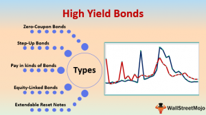

In recent years, the financial investment landscape has seen significant evolution, particularly with the advent and intersection of high-yield bonds, often termed 'junk bonds', and algorithmic trading. High-yield bonds have become a focal point for investors willing to embrace increased risk for the prospect of higher returns. These bonds, issued by companies with lower credit ratings, offer elevated yields to compensate for their inherent default risk. This dynamic presents an attractive opportunity for investors ready to navigate the volatility and uncertainty associated with these financial instruments.

Simultaneously, algorithmic trading, a mainstay in equity markets, is beginning to establish itself within bond markets, a domain historically distinguished by its complexity and diversity. The introduction of algorithmic systems in bond trading is driven by the need for efficiency and the capability to process and analyze vast quantities of data swiftly. Algorithms facilitate automatic and systematic trading strategies that can adapt to market conditions, thereby potentially enhancing liquidity and reducing transaction costs.



This article will explore the intricate landscape of high-yield bond investments and how algorithmic trading is increasingly influencing bond markets. The discussion will cover the benefits and risks of high-yield bonds and examine how algorithms are reshaping the processes involved in trading these instruments, bringing both opportunities and challenges. Through this lens, the article aims to provide a comprehensive understanding of these evolving facets of financial markets, equipping investors with the insights needed to leverage these tools effectively.

## Table of Contents

## Understanding High-Yield Bonds

High-yield bonds, often referred to as "junk bonds," are a type of debt security issued by companies that do not have investment-grade credit ratings. These bonds offer higher yields than their investment-grade counterparts, compensating investors for the increased risk associated with their issuance. The higher yields make them attractive to investors who are comfortable with a higher degree of risk in exchange for potentially greater returns.

The risk associated with high-yield bonds stems from the credit ratings of the issuing companies. Typically, these companies are rated below 'BBB' by rating agencies such as Standard & Poor's or below 'Baa' by Moody's. A lower credit rating signifies a greater chance of default, thus increasing the risk profile of these bonds relative to investment-grade securities. Despite this, investors with a high-risk tolerance may find these bonds appealing, particularly if they can accurately assess the issuer's potential and market conditions.

One method investors use to manage the risks associated with high-yield bonds is through pooled investment vehicles such as mutual funds or exchange-traded funds (ETFs). These vehicles offer diversification by creating a portfolio of various high-yield bonds, which can reduce the impact of any single bond's underperformance on the overall investment. Additionally, these funds are typically managed by professionals who employ rigorous research and risk management strategies to optimize returns, providing an added layer of assurance for investors. 

High-yield mutual funds and ETFs can be especially beneficial for individual investors who may not have the resources or expertise to select individual high-yield bonds. By investing in a fund, they can gain exposure to a broader range of bonds with differing maturities, industries, and credit ratings, potentially smoothing out the overall [volatility](/wiki/volatility-trading-strategies) and enhancing performance through diversification.

In conclusion, high-yield bonds present a significant investment avenue for those seeking higher returns relative to conventional fixed-income investments. However, they require a thorough understanding of the associated risks and market dynamics. Investors can mitigate some of these risks through diversified investment vehicles, thereby potentially optimizing their portfolios for high returns with managed risk.

## Algorithmic Trading in the Bond Markets

Algorithmic trading has significantly impacted the bond markets, revolutionizing how these financial instruments are traded. Traditionally, bond markets have been less digitized compared to stock markets, primarily due to the vast number of diverse bonds available, each with unique features and credit qualities. This diversity has naturally slowed the adoption of [algorithmic trading](/wiki/algorithmic-trading); however, recent technological advancements are bridging this gap, making algorithmic interventions both viable and promising.

Algorithms in bond markets automate several key processes, notably improving the efficiency of responding to Request for Quotes (RFQs), pricing, and portfolio management. Automation reduces the time and human resources needed to handle complex bond transactions, allowing for faster and more accurate trading. The efficiency gained through this automation has led to a reduction in the bid-offer spread, particularly significant in exchange-traded funds ([ETF](/wiki/etf-trading-strategies)) related bonds, where high-[volume](/wiki/volume-trading-strategy) and high-frequency trades are common.

Technological advancements have played a crucial role in facilitating these developments. With millions of unique bonds exhibiting distinct characteristics, the capacity to manage such complexity efficiently is made possible by adopting advanced algorithms. These technologies utilize vast datasets to model pricing and risk, improving trade execution quality. For instance, [machine learning](/wiki/machine-learning) algorithms can process large volumes of historical data to predict bond price movements, thus, aiding in more informed investment decisions.

Python, a preferred language for algorithmic trading, offers libraries like `pandas` for data manipulation, `numpy` for numerical calculations, and `machine learning` frameworks like `scikit-learn` for predictive modeling, which are instrumental in developing trading algorithms. Below is a simplified example of how Python can be used to calculate the yield of a bond using its price, coupon rate, and maturity, which can be a small part of a larger trading algorithm:

```python
def bond_yield(face_value, coupon_rate, price, years_to_maturity):
    try:
        annual_coupon = face_value * coupon_rate
        yield_to_maturity = (annual_coupon + ((face_value - price) / years_to_maturity)) / ((face_value + price) / 2)
        return yield_to_maturity * 100  # Convert to percentage
    except ZeroDivisionError:
        return None

# Example usage
face_value = 1000  # Face value of the bond
coupon_rate = 0.05  # 5% annual coupon rate
price = 950  # Current market price of the bond
years_to_maturity = 10  # Years until maturity

yield_percentage = bond_yield(face_value, coupon_rate, price, years_to_maturity)
print(f"The yield of the bond is {yield_percentage:.2f}%")
```

This example illustrates the fundamental principle of calculating bond yield, which can be integrated into more comprehensive trading algorithms that account for real-time market data, historical trends, and various risk factors.

In conclusion, the integration of algorithmic trading in bond markets, although initially slower compared to equities, presents a promising future. By automating intricate processes and harnessing technological advances, algorithms provide a streamlined, precise approach to bond trading, ultimately enhancing market [liquidity](/wiki/liquidity-risk-premium) and trade execution. As these technologies continue to evolve, the bond markets will likely experience increased efficiency and sophistication, benefiting both issuers and investors.

## Benefits and Challenges of Algorithmic Trading in High-Yield Bonds

Algorithmic trading in high-yield bonds offers several advantages while also presenting notable challenges. Algorithms can swiftly identify trading opportunities by analyzing large datasets at high speeds, which improves decision-making and execution in volatile markets. This ability enhances market liquidity, as faster transactions can occur with less manual intervention, contributing to more dynamic and efficient markets.

Algorithms provide systematic trading approaches that reduce human error and biases, allowing for consistent and reproducible strategies. These algorithms can handle numerous variables and complex calculations, enabling traders to optimize portfolio management and pricing models. This precision is crucial when dealing with high-yield bonds, which are inherently riskier and more volatile than investment-grade bonds.

Despite these benefits, algorithmic trading in high-yield bonds faces significant challenges. One primary issue is the complexity and lower liquidity of these markets compared to equities. High-yield bonds often have fewer buyers and sellers, leading to wider bid-offer spreads. This lower liquidity makes it more difficult for algorithms to execute large trades without significantly impacting the market price.

Furthermore, the diversity in issuer quality and varying economic conditions adds layers of complexity that algorithms must navigate. High-yield bonds typically involve companies with different creditworthiness, requiring algorithms to account for these variations and adjust trading strategies accordingly. This involves sophisticated modeling and robust data analytics to ensure accuracy and effectiveness in recommendations.

Recent advancements, such as the rise of Exchange-Traded Funds (ETFs), have contributed to more efficient markets, enhancing liquidity and the viability of algorithmic trading. ETFs aggregate individual high-yield bonds into a single financial product, making it easier for algorithms to trade and manage risks across multiple bonds simultaneously. This development helps overcome some liquidity challenges and supports the broader application of algorithmic strategies in the bond markets. 

In essence, while algorithmic trading brings efficiency and precision to high-yield bond markets, it also requires advanced technology and sophisticated models to navigate the market’s inherent complexities.

## Expert Insights and Future Trends

Experts note that high-yield bonds exhibit a correlation with stock market performance, attributing to their higher risk-return profile compared to investment-grade bonds. This correlation creates unique opportunities for portfolio diversification, offering potential returns that are beneficial especially during periods of low stock market volatility. By thoroughly analyzing the credit risk and market dynamics associated with each issuer, investors can harness these bonds to bolster their investment strategies, reducing the overall portfolio risk through strategic diversification.

The gradual integration of automated systems is redefining the landscape of bond trading, paving the way for algorithmic trading to become a norm, even in markets dealing with high-yield bonds. Many industry professionals suggest that the adoption of this technology is not just a trend but a necessity for operational efficiency and enhanced liquidity. As bond trading becomes more sophisticated, the deployment of algorithmic systems facilitates the optimization of trade execution by swiftly identifying price discrepancies and trading opportunities. For instance, many trading platforms now use algorithms to automatically calculate bond prices in response to fluctuating market conditions, enhancing the speed and precision of trades.

Future trends are likely to revolve around the increased automation across the entire lifecycle of bond trading. This encompasses activities from data modeling, to real-time analytics, trading, and risk management. Through machine learning and advanced modeling techniques, algorithms can efficiently process vast amounts of trading data to provide insights and forecasts, which are crucial for making informed decisions. Python, with libraries such as NumPy and Pandas, plays a significant role in handling such computations. For example:

```python
import numpy as np
import pandas as pd

# Simulating bond price changes
bond_data = pd.DataFrame({
    'current_price': np.random.randn(100) + 100,
    'market_factor': np.random.randn(100)
})

# Predicting future price using a simple linear regression model
from sklearn.linear_model import LinearRegression
model = LinearRegression()
X = bond_data[['market_factor']]
y = bond_data['current_price']

model.fit(X, y)
bond_data['predicted_price'] = model.predict(X)
```

This kind of modeling aids in creating a seamless trading environment, guided by innovative algorithms that are capable of enhancing decision-making and performance in bond markets.

Moreover, as technological advancements continue to unfold, the systematic automation of trading processes is expected to further enhance transparency, efficiency, and accuracy in bond trading, which, in turn, contributes to the resilience and dynamism of financial markets. By leveraging these technological innovations, investors can better navigate the complexities of high-yield bonds, ultimately leading to improved investment outcomes and strategic portfolio management.

## Conclusion

High-yield bonds offer a notable avenue for investors seeking substantial returns, albeit coupled with heightened risk. These bonds, issued by entities with lower credit ratings, promise lucrative yields yet demand a sophisticated understanding of market dynamics and issuer stability. The introduction of algorithmic trading into this sector presents an intriguing evolution, where the analytical prowess of algorithms can potentially enhance investment outcomes.

Algorithmic trading in high-yield bonds facilitates the swift identification of trading opportunities, optimizes liquidity, and establishes systematic trading methods. Despite these advantages, the integration of algorithms into bond trading must be approached with caution. The inherent complexities of high-yield bonds, such as issuer variability and economic unpredictability, can challenge the efficacy of algorithms, necessitating a deep appreciation of both their capabilities and their limitations.

As technological innovations continue to shape the trading landscape, investors are equipped with unprecedented tools to refine their investment strategies in high-yield bonds. The deployment of advanced algorithms may soon become standard practice, enhancing the efficiency and precision of bond trading. Investors who can strategically harness these technologies stand to significantly bolster the diversification and resilience of their portfolios.

Ultimately, the measured application of algorithmic trading within high-yield bonds has the potential to significantly enhance investment performance. With thorough analysis and strategic execution, investors can navigate the complexities of this market to achieve meaningful returns, reinforcing the robustness of their investment portfolios.

## References & Further Reading

[1]: Armstrong, F., & Chan, E. (2008). ["Quantitative Trading: How to Build Your Own Algorithmic Trading Business"](https://onlinelibrary.wiley.com/doi/pdf/10.1002/9781119203377.fmatter). Wiley.

[2]: Aronson, D. R. (2007). ["Evidence-Based Technical Analysis: Applying the Scientific Method and Statistical Inference to Trading Signals"](https://onlinelibrary.wiley.com/doi/book/10.1002/9781118268315). Wiley.

[3]: Lopez de Prado, M. (2018). ["Advances in Financial Machine Learning"](https://www.amazon.com/Advances-Financial-Machine-Learning-Marcos/dp/1119482089). Wiley.

[4]: Jansen, S. (2020). ["Machine Learning for Algorithmic Trading"](https://github.com/stefan-jansen/machine-learning-for-trading). Packt Publishing.

[5]: Fabozzi, F. J., & De Jong, F. (2018). ["Bond Markets, Analysis, and Strategies"](https://mitpress.mit.edu/9780262046275/bond-markets-analysis-and-strategies/). Pearson.