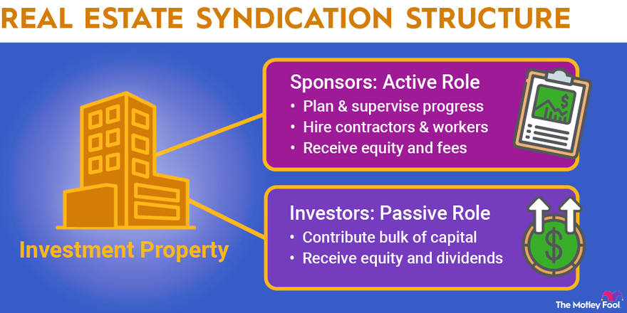

## Table of Contents

## What is a real estate syndicate?

A real estate syndicate is a group of investors who pool their money together to buy a property that they might not be able to afford on their own. This group is usually led by a sponsor or syndicator, who finds the property, manages it, and handles all the details. The investors put in money and, in return, they get a share of the profits from renting out or selling the property.

Syndicates are popular because they let people invest in big real estate projects without needing a lot of money or expertise. The sponsor does most of the work, like finding the right property, getting loans, and managing the property. The investors just need to provide the money and trust the sponsor to make good decisions. This way, everyone can benefit from the potential profits of real estate without having to do all the work themselves.

## How does investing in a real estate syndicate work?

Investing in a real estate syndicate is like joining a team to buy a big property. You and other investors give money to a leader called a sponsor. The sponsor uses this money to buy the property, which could be an apartment building, a shopping center, or something else. You don't need to be an expert in real estate because the sponsor handles everything, from finding the right property to managing it.

Once the property is bought, it starts making money through rent or by being sold later for a profit. The sponsor takes care of the property and makes sure it's doing well. As an investor, you get a share of the profits based on how much money you put in. This way, you can earn money from real estate without having to do all the work yourself. It's a good option if you want to invest in big properties but don't have enough money or time to do it alone.

## What are the benefits of investing in real estate syndicates?

Investing in real estate syndicates has many benefits. One big benefit is that you can invest in large properties without needing a lot of money. By pooling your money with other investors, you can buy a big apartment building or shopping center that you couldn't afford on your own. This way, you can enjoy the profits from big real estate without having to be rich.

Another benefit is that you don't need to be an expert in real estate. The sponsor, who leads the syndicate, handles all the hard work like finding the right property, getting loans, and managing it. This means you can invest in real estate without spending a lot of time or having to know everything about it. You just put in your money and the sponsor takes care of the rest, making it easier for you to earn from real estate.

Lastly, real estate syndicates can offer a good return on your investment. When the property earns money from rent or is sold for a profit, you get a share based on how much you invested. This can be a steady source of income and can also grow your money over time. Plus, since you're investing with others, the risk is spread out, which can make it a safer way to invest in real estate.

## What are the risks associated with real estate syndicate investments?

Investing in real estate syndicates can be risky. One big risk is that you might lose your money if the property doesn't do well. If the property doesn't get enough rent or if its value goes down, you might not get back what you put in. The sponsor might make bad choices or the market might change in ways that hurt the property's value. This means you could lose some or all of your investment.

Another risk is that you have less control over your investment. When you join a syndicate, you trust the sponsor to make all the decisions. If the sponsor doesn't manage the property well or makes bad choices, there's not much you can do about it. You can't decide to sell the property or change how it's managed. This lack of control can be scary because your money is in someone else's hands.

Lastly, real estate syndicates can be hard to get out of. If you need your money back quickly, it might be tough because real estate isn't easy to sell fast. You might have to wait until the property is sold or until the syndicate ends, which could take years. This means your money might be tied up for a long time, and you need to be okay with that before you invest.

## How can beginners start investing in real estate syndicates?

If you're a beginner looking to start investing in real estate syndicates, the first step is to learn about them. You can do this by reading [books](/wiki/algo-trading-books), watching videos, or joining online groups where people talk about real estate syndicates. Once you feel like you understand how they work, you can start looking for a good syndicate to join. Look for a sponsor who has a good track record and who you trust to manage your money well. You can find these sponsors through real estate investment websites, networking events, or by asking people you know who are already investing in real estate.

Once you've found a syndicate you like, you'll need to put in some money. The amount can vary, but it's usually less than what you'd need to buy a property on your own. After you invest, the sponsor will use the money to buy a property and manage it. You won't have to do much work after that, but you should keep an eye on how the property is doing. The sponsor will usually give you updates on how the property is performing and when you can expect to get your share of the profits. Remember, investing in real estate syndicates can be risky, so make sure you're okay with the possibility of losing your money before you start.

## What types of properties are typically involved in real estate syndicates?

Real estate syndicates often invest in big properties that need a lot of money to buy. These can be apartment buildings with many units, which are popular because they can bring in a lot of rent money. Another common type is commercial properties like shopping centers or office buildings. These can be good because businesses pay rent, and if the location is good, it can be a steady source of income.

Sometimes, syndicates also invest in other types of properties like hotels or self-storage units. Hotels can be a bit riskier because they depend a lot on how many people are traveling, but they can also make a lot of money. Self-storage units are often seen as a safer bet because people always need a place to store their stuff, and these units can bring in steady rent without needing a lot of upkeep.

The type of property a syndicate chooses depends on what the sponsor thinks will make the most money and what the investors are interested in. The goal is always to find a property that will bring in good rent or can be sold later for a profit. This way, everyone in the syndicate can share in the success of the investment.

## How do real estate syndicates generate returns for investors?

Real estate syndicates generate returns for investors mainly through rental income and property value growth. When the syndicate buys a property like an apartment building or a shopping center, it starts [earning](/wiki/earning-announcement) money from the rent that tenants pay. This rental income is shared among the investors based on how much money each person put into the syndicate. The sponsor, who manages the property, takes care of all the day-to-day stuff like collecting rent and making sure the property stays in good shape.

Another way syndicates make money is by selling the property later for more than they paid for it. If the property's value goes up over time, the syndicate can sell it at a profit. This profit is then divided among the investors. Sometimes, the syndicate might also make improvements to the property to increase its value, like fixing it up or adding new features. Either way, the goal is to make sure the property earns enough money to give investors a good return on their investment.

## What is the role of a syndicator in a real estate syndicate?

The syndicator, also called the sponsor, is the leader of a real estate syndicate. They are the ones who find the right property to buy, like an apartment building or a shopping center. The syndicator also gets the money together from investors to buy the property. They handle all the hard parts, like getting loans and making sure everything is legal. The syndicator is like the captain of the team, making sure everything goes smoothly.

Once the property is bought, the syndicator takes care of it. They manage the property, collect rent from tenants, and make sure it stays in good shape. If the property needs fixing up or if there are any problems, the syndicator deals with it. They also keep the investors updated on how the property is doing and when they can expect to get their share of the profits. The syndicator's job is to make sure the property makes money so that everyone in the syndicate can benefit.

## How do tax implications affect investments in real estate syndicates?

Investing in real estate syndicates can have some tax benefits, but it can also be complicated. One big benefit is that you can deduct things like mortgage interest, property taxes, and the costs of running the property from your taxes. This can lower the amount of money you have to pay in taxes each year. Also, if the property goes up in value and you sell it, you might be able to use a special tax rule called a 1031 exchange to swap it for another property without paying taxes right away on the profit.

But there are also some tricky parts to think about. When you invest in a syndicate, you get something called a K-1 form at tax time, which shows your share of the income and losses from the property. This can make your taxes more complicated because you have to report this on your personal tax return. Plus, if the syndicate makes money, you'll have to pay taxes on your share of the profits, even if you don't get the money right away. So, it's a good idea to talk to a tax expert to understand all the tax rules and how they might affect your investment.

## What are the key factors to consider when evaluating a real estate syndicate opportunity?

When you're thinking about joining a real estate syndicate, one of the first things to look at is the sponsor. The sponsor is the person who leads the syndicate and manages the property. You want to make sure they have a good track record and know what they're doing. Check if they've successfully managed other properties before and if they have a good reputation. It's also important to understand the sponsor's plan for the property, like how they plan to make money from it and what they'll do if things don't go as planned.

Another key [factor](/wiki/factor-investing) is the property itself. You should look at where it is located and what kind of property it is, like an apartment building or a shopping center. Think about if the area is growing and if there's a good chance the property will make money from rent or by being sold later. Also, consider the financial details, like how much money you need to invest and what kind of returns you can expect. Make sure you understand all the risks involved and if you're okay with the possibility of losing your money. Talking to a financial advisor can help you make a smart decision.

## How does the structure of a real estate syndicate impact investment potential?

The way a real estate syndicate is set up can really affect how much money you might make from it. A syndicate is usually split into two groups: the sponsor, who runs the show, and the investors, who put in the money. The sponsor finds the property, manages it, and makes all the big decisions. They usually get a bigger share of the profits to cover their work. The investors, on the other hand, just put in money and get a smaller share of the profits based on how much they invested. This setup means investors can get into big real estate deals without needing a lot of money or knowing everything about real estate, but they also have less control over what happens with their investment.

The structure of the syndicate can also affect how easy it is to get your money out. In some syndicates, your money might be tied up for a long time because real estate isn't quick to sell. You might have to wait until the property is sold or until the syndicate ends before you can get your money back. This can be good if the property keeps making money over time, but it can be a problem if you need your money back quickly. So, when you're thinking about joining a syndicate, it's important to understand how it's set up and how that might affect your investment, both in terms of potential profits and how easy it is to get your money out.

## What advanced strategies can expert investors use to maximize returns from real estate syndicates?

Expert investors can use a few smart moves to get the most out of real estate syndicates. One good strategy is to focus on value-add properties. These are properties that need some work, like fixing up old apartments or adding new features to a shopping center. By improving the property, you can raise the rent or sell it for more money later. Expert investors also look for syndicates with experienced sponsors who have a proven track record of making money from similar projects. This way, they can trust that the sponsor knows what they're doing and will make smart choices to increase the property's value.

Another strategy is to use leverage, which means borrowing money to invest more than you could with just your own cash. By using loans to buy bigger properties or more properties, expert investors can spread their money around and possibly make more profit. But, this can also be risky because if things go wrong, the losses can be bigger too. That's why it's important to carefully pick properties in growing areas and keep a close eye on how they're doing. By combining these strategies, expert investors can aim for higher returns while managing the risks that come with real estate syndicates.

## References & Further Reading

[1]: ["The Complete Guide to Real Estate Syndication: Learn How to Make Passive Income, Earn a High ROI, and Stockpile More Money."](https://www.forbes.com/councils/forbesbizcouncil/2021/10/26/a-guide-to-investing-in-real-estate-syndications/) by Derek Clifford

[2]: Geltner, D., Miller, N.G., Clayton, J., & Eichholtz, P. (2013). ["Commercial Real Estate Analysis and Investments."](https://www.researchgate.net/publication/245702364_Commercial_Real_Estate_Analysis_and_Investments) Cengage Learning.

[3]: Lopez de Prado, M. (2018). ["Advances in Financial Machine Learning."](https://www.amazon.com/Advances-Financial-Machine-Learning-Marcos/dp/1119482089) Wiley.

[4]: Chan, E.P. (2009). ["Quantitative Trading: How to Build Your Own Algorithmic Trading Business."](https://github.com/ftvision/quant_trading_echan_book) Wiley.

[5]: Golec, J., & Ma, C. (2003). ["Automated Trading Systems: The Next Generation."](https://scholar.google.com/citations?user=7cvozzEAAAAJ&hl=en) Journal of Wealth Management, 6(1), 100-106.

[6]: Sutton, R.S., & Barto, A.G. (2018). ["Reinforcement Learning: An Introduction."](https://web.stanford.edu/class/psych209/Readings/SuttonBartoIPRLBook2ndEd.pdf) The MIT Press.