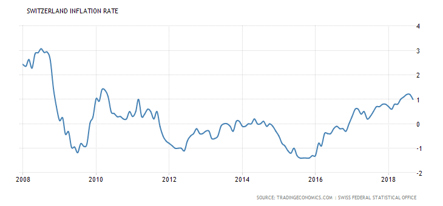

## Table of Contents

## What is the Swiss Franc and why is it considered a safe-haven currency?

The Swiss Franc is the official currency of Switzerland and Liechtenstein. It is represented by the symbol CHF and is often referred to simply as the Franc. The Swiss Franc is known for its stability and strength, which comes from Switzerland's strong economy and political neutrality. People trust the Swiss Franc because Switzerland has a history of not getting involved in wars and maintaining a stable government.

The Swiss Franc is considered a safe-haven currency because it tends to hold its value well, even during times of global economic uncertainty. When there is trouble in the world, like financial crises or political instability, investors often move their money into safe-haven currencies to protect their wealth. The Swiss Franc is one of these currencies because it is seen as a reliable and secure option. This makes it attractive to investors who want to keep their money safe during uncertain times.

## How does the Swiss Franc's value compare to other major currencies?

The Swiss Franc is often stronger than many other major currencies. For example, compared to the US Dollar, one Swiss Franc is usually worth more than one US Dollar. This means that if you have one Swiss Franc, you can exchange it for more than one US Dollar. The same goes for the Euro; one Swiss Franc is typically worth more than one Euro. This strength comes from Switzerland's stable economy and the trust people have in the Swiss Franc.

When compared to currencies from countries with less stable economies, the difference can be even bigger. For instance, against the Japanese Yen, one Swiss Franc can be worth a lot more Yen. This is because Japan's economy can be more volatile than Switzerland's. The Swiss Franc's value can also change over time, but it usually stays strong because people see it as a safe place to keep their money. This makes it different from currencies like the British Pound, which can go up and down more often due to economic and political changes in the UK.

## What are the historical performance trends of the Swiss Franc?

Over the years, the Swiss Franc has shown a strong and steady performance. It has often been seen as a safe place to keep money, especially during tough times like financial crises. For example, during the 2008 global financial crisis, the Swiss Franc became even stronger as people moved their money to safer places. This trend has been seen in other times of uncertainty too, like during the European debt crisis in the early 2010s. The Swiss Franc's value has generally gone up against other major currencies like the US Dollar and the Euro, showing how much people trust it.

However, the Swiss Franc has not always gone up in value. There have been times when it weakened, but these periods were usually short and linked to specific events. For instance, in January 2015, the Swiss National Bank suddenly stopped trying to keep the Franc weak against the Euro, which caused the Franc to jump in value very quickly. This move surprised a lot of people and caused some problems in the short term. But over the long term, the Swiss Franc has been known for its stability and strength, making it a popular choice for people looking to protect their money.

## What economic factors influence the value of the Swiss Franc?

The value of the Swiss Franc is influenced by many things. One big [factor](/wiki/factor-investing) is Switzerland's economy. If the economy is doing well, with lots of people buying and selling things, the Franc tends to be strong. Another factor is interest rates. If Switzerland's interest rates are higher than other countries, people might move their money to Switzerland to get a better return, which makes the Franc stronger. Also, if there is a lot of money coming into Switzerland from other countries, like from tourists or businesses, this can make the Franc stronger too.

Another important thing that affects the Swiss Franc is what is happening in the rest of the world. If there are problems in other countries, like financial crises or political trouble, people often move their money to safe places like Switzerland. This makes the Franc stronger because more people want to hold it. The Swiss National Bank also plays a big role. They can buy or sell Francs to try to keep its value stable. If they think the Franc is too strong, they might sell some to make it weaker, and if they think it's too weak, they might buy some to make it stronger.

## How does Switzerland's political stability affect the Swiss Franc's investment potential?

Switzerland's political stability makes the Swiss Franc a good choice for people looking to invest their money. Because Switzerland stays out of wars and has a strong government, people trust that the country will stay safe and stable. This trust makes the Swiss Franc a popular choice when there are problems in other parts of the world. Investors feel that their money is safer in Swiss Francs because Switzerland's political situation is less likely to change suddenly.

This stability also means that the Swiss Franc is less likely to lose value quickly. When other countries have political trouble, their currencies can go down in value fast. But the Swiss Franc stays strong because people know that Switzerland's government will keep things running smoothly. This makes the Swiss Franc a good option for people who want to keep their money safe over a long time.

## What role does the Swiss National Bank play in managing the Swiss Franc?

The Swiss National Bank (SNB) is very important in managing the Swiss Franc. They try to keep the Franc's value stable so that it doesn't go up or down too much. The SNB does this by buying and selling Swiss Francs. If they think the Franc is too strong, they might sell some to make it weaker. If they think it's too weak, they might buy some to make it stronger. This helps keep the economy running smoothly because a stable currency is good for businesses and people.

The SNB also sets interest rates, which can affect the Swiss Franc's value. If they raise interest rates, it can make the Franc stronger because people might move their money to Switzerland to get a better return on their savings. If they lower interest rates, it can make the Franc weaker. The SNB watches what is happening in the world and in Switzerland's economy to decide what to do. They want to make sure the Swiss Franc stays a safe and reliable currency for everyone.

## How can investors gain exposure to the Swiss Franc?

Investors can gain exposure to the Swiss Franc by buying it directly. They can do this through a bank or a currency exchange service. This means they exchange their own country's money for Swiss Francs. They can then hold onto the Swiss Francs as a way to keep their money safe, especially during times when other currencies might be going down in value. Another way to get exposure to the Swiss Franc is by investing in Swiss assets, like stocks or bonds, that are priced in Swiss Francs. When they buy these assets, they are also buying Swiss Francs.

Another option for investors is to use financial products like currency ETFs or mutual funds that focus on the Swiss Franc. These funds allow investors to bet on the Swiss Franc's value without actually owning the currency. They can buy shares in these funds, which will go up or down based on how the Swiss Franc performs. Some investors also use [forex](/wiki/forex-system) trading platforms to trade the Swiss Franc against other currencies. This can be riskier, but it gives them a way to make money from changes in the Swiss Franc's value.

## What are the risks associated with investing in the Swiss Franc?

Investing in the Swiss Franc can be risky because its value can change. Even though the Swiss Franc is known for being stable, it can still go up and down. If the Swiss Franc gets weaker compared to other currencies, investors might lose money. Also, if the Swiss economy has problems, the Franc might not be as safe as people think. The Swiss National Bank can also make sudden changes, like they did in 2015 when they stopped trying to keep the Franc weak against the Euro. This surprised a lot of people and caused some investors to lose money.

Another risk is that the Swiss Franc might not give investors a good return. If interest rates in Switzerland are low, investors might not earn much money from holding Swiss Francs. Also, if other currencies are doing better, investors might miss out on better opportunities. It's important for investors to think about these risks and maybe not put all their money into the Swiss Franc. They should look at their whole investment plan and see how the Swiss Franc fits into it.

## How do interest rates in Switzerland impact the Swiss Franc's attractiveness as an investment?

Interest rates in Switzerland play a big role in how attractive the Swiss Franc is for investors. When interest rates in Switzerland are higher than in other countries, the Swiss Franc becomes more appealing. This is because investors can earn more money by keeping their savings in Swiss Francs. They might move their money from other currencies to the Swiss Franc to get a better return. This increased demand for the Swiss Franc can make it stronger compared to other currencies.

On the other hand, if interest rates in Switzerland are low, the Swiss Franc might not be as attractive. Low interest rates mean that investors won't earn much money from holding Swiss Francs. They might look for better opportunities in other countries where interest rates are higher. This can lead to less demand for the Swiss Franc, which might make it weaker. So, the level of interest rates in Switzerland can really affect whether investors see the Swiss Franc as a good place to put their money.

## What are the tax implications for foreign investors holding Swiss Francs?

When foreign investors hold Swiss Francs, they need to think about taxes. In Switzerland, there are no taxes on the money you make from changes in the value of the Swiss Franc itself. But, if you earn interest from holding Swiss Francs in a bank account, you might have to pay taxes on that interest in your home country. Each country has different rules about taxing money made from foreign currencies, so it's important to check what the rules are where you live.

Also, if you buy and sell Swiss Francs to make a profit, you might have to pay capital gains tax in your home country. This depends on whether your country sees currency trading as something you should pay tax on. Some countries don't tax profits from currency trading if it's not your main job, but others do. It's a good idea to talk to a tax expert to understand how holding Swiss Francs might affect your taxes.

## How does the Swiss Franc perform during global financial crises?

During global financial crises, the Swiss Franc often becomes stronger. This is because people see it as a safe place to keep their money. When there is trouble in other parts of the world, like during the 2008 financial crisis or the European debt crisis, investors move their money to safe-haven currencies like the Swiss Franc. They do this to protect their wealth from losing value. Because so many people want to hold Swiss Francs during these times, its value goes up compared to other currencies.

However, this strength can also cause problems. If the Swiss Franc gets too strong, it can make Swiss exports more expensive and hurt Switzerland's economy. The Swiss National Bank sometimes steps in to try to control how strong the Franc gets. They might sell Swiss Francs to weaken it a bit. But overall, the Swiss Franc's reputation as a safe place to put money during crises makes it very attractive to investors who want to keep their money safe.

## What advanced trading strategies can be employed to capitalize on fluctuations in the Swiss Franc?

One advanced trading strategy to capitalize on fluctuations in the Swiss Franc is called [carry](/wiki/carry-trading) trading. In this strategy, investors borrow money in a country with low interest rates, like Japan, and then use that money to buy Swiss Francs. They do this because the interest rates in Switzerland might be higher, so they can earn more money from the difference in interest rates. But this strategy has risks. If the Swiss Franc suddenly gets weaker compared to the currency they borrowed, they could lose money. So, they need to watch the market closely and be ready to change their plans if things start to go the wrong way.

Another strategy is called hedging. This is when investors use financial tools to protect themselves from big changes in the Swiss Franc's value. For example, if they think the Swiss Franc might get weaker, they can buy options or futures contracts that will make money if the Franc does go down. This can help them avoid losing too much money if their guess is right. Hedging can be complicated and costs money, but it's a way to manage risk. It's important for investors to understand these tools well before using them, because they can be tricky to use correctly.

## References & Further Reading

[1]: Bergstra, J., Bardenet, R., Bengio, Y., & Kégl, B. (2011). ["Algorithms for Hyper-Parameter Optimization."](https://papers.nips.cc/paper/4443-algorithms-for-hyper-parameter-optimization) Advances in Neural Information Processing Systems 24.

[2]: ["Advances in Financial Machine Learning"](https://www.amazon.com/Advances-Financial-Machine-Learning-Marcos/dp/1119482089) by Marcos Lopez de Prado

[3]: ["Evidence-Based Technical Analysis: Applying the Scientific Method and Statistical Inference to Trading Signals"](https://www.amazon.com/Evidence-Based-Technical-Analysis-Scientific-Statistical/dp/0470008741) by David Aronson

[4]: ["Machine Learning for Algorithmic Trading"](https://github.com/stefan-jansen/machine-learning-for-trading) by Stefan Jansen

[5]: ["Quantitative Trading: How to Build Your Own Algorithmic Trading Business"](https://www.amazon.com/Quantitative-Trading-Build-Algorithmic-Business/dp/1119800064) by Ernest P. Chan