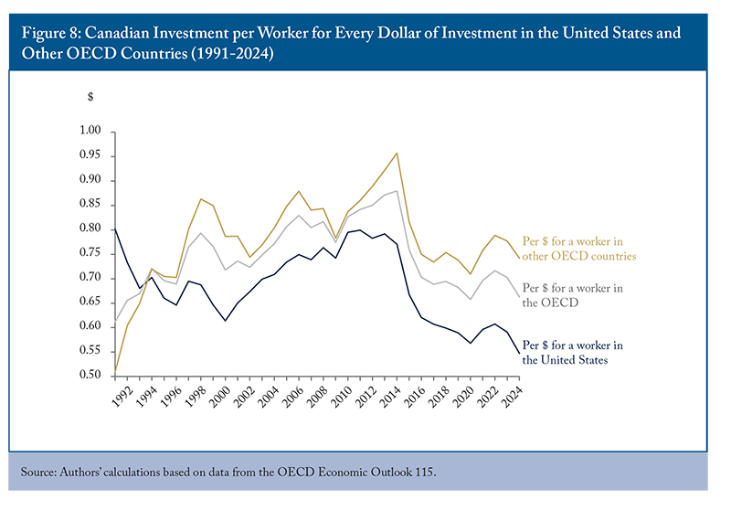

In the world of finance, Canada and the United States stand out as two highly developed economies sharing a long border and many cultural similarities. Both nations have robust financial systems and play significant roles in the global market. However, when it comes to automated trading, known as algorithmic trading, these countries exhibit notable differences in their investment landscapes. Algorithmic trading utilizes computer algorithms to execute trading orders at high speed and efficiency, which heavily relies on the infrastructure and regulatory framework of each country.

Canada and the United States, while culturally and economically aligned, diverge in their approach to algorithmic trading due to variations in their financial markets, regulatory environments, and technological advancements. In Canada, the financial market is primarily centered around the Toronto Stock Exchange (TSX), which is known for its focus on the resource and mining sectors. Conversely, the U.S. market, led by the New York Stock Exchange (NYSE), presents a broader range of industries, significantly enhancing market liquidity—an essential factor for algorithmic trading.

Regulatory frameworks also play a crucial role. The U.S. adopts stringent financial regulations through agencies like the Securities and Exchange Commission (SEC) and the Commodity Futures Trading Commission (CFTC). These regulations include specific requirements for high-frequency traders. In contrast, Canada, regulated by entities such as the Investment Industry Regulatory Organization of Canada (IIROC), prioritizes market stability with a less rigid approach towards policing algorithmic trading.

Furthermore, technological advancements and infrastructure are fundamental to the success of algorithmic trading. The U.S. boasts a more developed fintech ecosystem, fueled by its larger tech industry, which offers advanced trading platforms and data analytics tools. Meanwhile, Canada's tech infrastructure, although robust, is smaller, presenting unique opportunities and challenges for algorithmic traders operating within the region.

This article aims to explore the investment differences between Canada and the USA in the context of algorithmic trading. It will review the financial markets, regulatory environments, and technological advancements affecting algorithmic trading in both countries. Understanding these distinctions is essential for investors looking to navigate algorithmic trading across these neighboring North American markets.

## Table of Contents

## Overview of Financial Markets in Canada and the USA

Canada and the United States each have significant financial markets, anchored by the Toronto Stock Exchange (TSX) and the New York Stock Exchange (NYSE), respectively. The TSX is a prominent global exchange with a particular emphasis on the resource and mining sectors. This focus aligns with Canada’s abundant natural resources, making the TSX a critical platform for companies involved in mining, oil, and gas. In contrast, the NYSE offers a more diversified array of industries, including technology, healthcare, finance, and consumer goods, contributing to its status as one of the most liquid stock exchanges in the world.

Algorithmic trading depends significantly on market [liquidity](/wiki/liquidity-risk-premium). Liquidity refers to the ability to buy or sell assets in the market without causing drastic price changes. Higher liquidity is advantageous for algorithmic traders, as it allows for faster execution of trades with minimal price impact. The NYSE, with its broad industry representation and large volumes of traded securities, provides a higher degree of liquidity compared to the TSX. As a result, the U.S. markets offer more abundant opportunities for [algorithmic trading](/wiki/algorithmic-trading) strategies that rely on quick execution and minimal market disruption.

In Canada, the concentration on resource-based industries results in a market with specific trading dynamics, where liquidity can vary significantly between sectors. This can pose limitations for algorithmic trading strategies that require consistent liquidity across diversified sectors. However, for traders specializing in the natural resources market, the TSX offers targeted opportunities to capitalize on sector-specific trends and developments.

Overall, the differing focuses of the TSX and NYSE illustrate the unique opportunities and challenges present in each market. Algorithmic traders must navigate these differences, assessing factors such as industry concentration and liquidity to optimize their strategies in Canada and the U.S.

## Regulatory Environment for Algorithmic Trading

Both Canada and the United States place a strong emphasis on financial regulation, yet each country has a distinct approach to overseeing algorithmic trading. In the U.S., the regulatory framework is characterized by stringent oversight, primarily administered by the Securities and Exchange Commission (SEC) and the Commodity Futures Trading Commission (CFTC). These agencies impose specific requirements for high-frequency traders, particularly focusing on ensuring market integrity and transparency. For example, the SEC enforces rules to mitigate risks associated with algorithmic trading, such as the Regulation SCI (Systems Compliance and Integrity), which requires key market participants to have policies and procedures to ensure the integrity of their technological systems.

High-frequency trading ([HFT](/wiki/high-frequency-trading-strategies)) firms in the U.S. are subject to rigorous reporting and compliance requirements. The CFTC, particularly under the Dodd-Frank Wall Street Reform and Consumer Protection Act, has broad authority to manage and mitigate systemic risks posed by algorithmic trading in derivatives markets. The focus is often on ensuring that algorithms do not disrupt orderly trading, through measures such as circuit breakers and pre-trade risk controls.

Canada's regulatory framework, while comprehensive, tends to focus more on market stability rather than prescriptive rules. The Investment Industry Regulatory Organization of Canada (IIROC) serves as the primary body overseeing algorithmic trading. Unlike the U.S., which enforces more detailed compliance obligations, Canada's IIROC prioritizes maintaining fair and orderly markets by setting principles-based guidelines that encourage firms to self-regulate while providing oversight to detect and manage risks associated with algorithmic and high-frequency trading. According to IIROC’s rule framework, dealers are required to establish, maintain, and ensure compliance with a risk management and supervisory control system that addresses the risk associated with algorithmic trading.

The disparate regulatory approaches reflect broader differences between Canadian and U.S. philosophies regarding financial regulation. The U.S. system emphasizes proactive management and intervention to prevent market abuses, while Canada's system leans towards principles-based regulation that emphasizes the responsibility of market participants to comply with fair trading practices and market integrity on their initiative. These distinct regulatory environments impact the operational strategies and risk management protocols of algorithmic traders within each country.

## Technological Advancements and Infrastructure

Technology is a critical component in the advancement and efficacy of algorithmic trading. It enables the rapid processing of large volumes of data, precise execution of trades, and the development of complex trading strategies. The United States possesses a more advanced fintech ecosystem, substantially driven by its large and innovative tech sector. This ecosystem provides state-of-the-art trading platforms and sophisticated data analytics tools, allowing traders to harness substantial computational power for [backtesting](/wiki/backtesting) and deploying algorithms. The dense concentration of top-tier technology firms and startups in regions like Silicon Valley further augments the availability of cutting-edge resources.

In contrast, Canada's technological infrastructure, although stable and efficient, operates on a smaller scale. This has implications for algorithmic traders operating within the region. On the one hand, Canadian algo traders can find unique market niches, particularly in sectors with substantial representation on Canadian exchanges, such as mining and energy. This specificity allows Canadian traders to develop specialized algorithms that can capitalize on these sectors' unique data patterns and market behaviors.

However, the smaller scale of Canada's tech industry does pose challenges. There is often a reduced availability of high-frequency data feeds and lower overall market liquidity compared to the U.S., which can impact the effectiveness and profitability of certain high-speed trading strategies. Additionally, the limited presence of fintech startups may constrain the level of innovation and the pace at which new trading technologies are adopted and integrated.

In summary, while Canada's tech infrastructure enables effective algorithmic trading, the scale and breadth of the U.S. tech industry position it as a more fertile ground for the rapid advancement of algorithmic trading capabilities. Traders in Canada must navigate these challenges while leveraging local expertise to exploit market-specific opportunities.

## Investment Opportunities and Challenges

Algorithmic trading in Canada presents unique investment opportunities, particularly in sectors such as mining and energy, which are prominently featured on the Toronto Stock Exchange (TSX). The TSX is home to numerous companies in these industries, allowing algorithmic traders to capitalize on their market dynamics. For example, fluctuations in commodity prices often create [arbitrage](/wiki/arbitrage) opportunities that algorithms can exploit. Furthermore, Canada's focus on natural resources provides a somewhat stable yet niche market environment that can be attractive for specialized trading strategies.

In contrast, the United States offers a broader landscape for algorithmic trading due to its larger and more diverse market. The New York Stock Exchange (NYSE) and other American exchanges provide exposure to a wide variety of sectors including technology, healthcare, and finance. This diversity allows algorithmic traders to optimize their strategies across different economic segments, thereby enhancing their opportunities to generate returns. The vast array of industries results in a more liquid market environment, which is essential for the efficient execution of algorithmic trading strategies. In addition to liquidity, the availability of vast datasets and advanced analytics tools in the U.S. empowers traders to refine and adapt their algorithms to varying market conditions.

Despite the plentiful opportunities, algorithmic trading in Canada faces certain challenges. The smaller market size and reduced liquidity compared to the U.S. can limit the scope of trading strategies and impact the execution capabilities of algorithms. These constraints may lead to higher transaction costs and less efficient price discovery, requiring traders to fine-tune their algorithms for optimal performance. Additionally, Canadian markets may experience greater [volatility](/wiki/volatility-trading-strategies) in sectors such as mining and energy, which could pose additional risks but also opportunities for savvy algorithmic traders who can anticipate and manage these fluctuations.

Overall, while Canadian algorithmic trading offers niche opportunities, particularly in sectors tied to natural resources, it is limited by market size and liquidity. Meanwhile, the U.S. provides a vast and diversified trading environment with significant technological support, making it conducive to a wide range of algorithmic strategies. Understanding these opportunities and challenges is essential for investors looking to succeed in algorithmic trading within these two distinct North American markets.

## Conclusion

Despite many shared characteristics, Canada and the U.S. present distinct landscapes for algorithmic trading, which investors must navigate with care. In the U.S., the expansive regulatory framework, overseen by bodies such as the Securities and Exchange Commission (SEC) and the Commodity Futures Trading Commission (CFTC), provides a comprehensive and intricate environment for algorithmic traders. The large-scale U.S. market, characterized by high liquidity and diversity across sectors, offers numerous opportunities for traders to optimize their algorithms and strategies. The technological infrastructure in the U.S. is advanced due to a robust fintech ecosystem that ensures access to cutting-edge trading platforms and sophisticated data analytics tools. This encourages innovation and accommodates high-frequency trading with relative ease.

Conversely, Canada offers a more specialized environment, particularly advantageous for those focusing on resource sectors such as mining and energy, which are heavily represented on the Toronto Stock Exchange (TSX). The Canadian regulatory framework, managed by the Investment Industry Regulatory Organization of Canada (IIROC), emphasizes stability, which might appeal to investors who prefer a more controlled policing of algorithmic trading activities. However, the Canadian market's smaller size and lower liquidity compared to the U.S. pose challenges. These can constrain the execution capabilities of certain trading strategies that require larger volumes and faster execution speeds.

Understanding these differences is vital for investors aiming to engage in algorithmic trading within these North American markets. The U.S. presents a vast array of opportunities driven by its scale and technological prowess, ideal for diversified and high-frequency trading strategies. Meanwhile, Canada's market, with its specialized opportunities in key sectors, requires a nuanced approach, leveraging its niche strengths. Strategically navigating these environments can offer unique benefits and competitive advantages to algorithmic traders adept at optimizing their approaches to the specific characteristics of each market.

## FAQs

### FAQs

**What are the regulatory differences affecting algo trading between Canada and the U.S.?**

The regulatory differences between Canada and the United States in the context of algorithmic trading stem primarily from the focus and structure of their respective financial oversight bodies. In the U.S., the Securities and Exchange Commission (SEC) and the Commodity Futures Trading Commission (CFTC) impose rigorous regulations with specific requirements for high-frequency traders (HFTs). These include mandatory registration, detailed reporting, and stress testing to ensure market stability. The U.S. approach is generally considered stringent, emphasizing investor protection and market integrity.

Conversely, Canada's algo trading regulations, governed by the Investment Industry Regulatory Organization of Canada (IIROC), prioritize market stability and efficiency over strict rule enforcement. While Canada does monitor algorithmic trading activities, the regulatory framework is less prescriptive compared to the U.S., reflecting a preference for flexibility. This results in a regulatory environment that may appeal to traders seeking less stringent oversight but places more responsibility on traders to maintain market integrity.

**How do technology and infrastructure play a role in the success of algorithmic trading in these countries?**

Technology and infrastructure are crucial to the success of algorithmic trading in both Canada and the U.S. In the U.S., the well-developed fintech ecosystem is supported by a vast tech industry, which provides traders with cutting-edge trading platforms and advanced data analytics tools. This technological edge allows traders to develop complex and efficient algorithms, optimize execution speed, and access real-time market data, enhancing their trading capabilities in terms of both speed and accuracy.

In Canada, the technological infrastructure, while robust, is smaller in scale compared to the U.S., resulting in a unique set of opportunities and challenges for algorithmic traders. The smaller tech ecosystem means fewer locally-based fintech solutions but offers niche opportunities, particularly for resource-focused algorithms on the Toronto Stock Exchange. As a result, technological infrastructure influences the choice of trading strategies and the capacity to capitalize on market opportunities in each country.

**Can American investors easily participate in Canadian markets through algorithmic trading?**

American investors can participate in Canadian markets through algorithmic trading, but several factors need to be considered. First, cross-border trading typically requires compliance with regulatory requirements in both nations, including those set by the IIROC in Canada. Investors must ensure their trading strategies align with Canadian regulations, which might differ from those in the U.S.

Additionally, American investors must consider the relative liquidity and volatility of Canadian markets. The Toronto Stock Exchange, while significant, offers less liquidity than major U.S. exchanges, potentially impacting the execution of certain trading algorithms. However, the sector focus on resources like mining and energy can provide specialized investment opportunities for algorithms tailored to these markets. Accessing Canadian markets also often requires collaboration with local brokers or financial institutions to facilitate seamless trading and adherence to local laws. 

Overall, while algorithmic trading across borders is feasible, it demands careful navigation of the regulatory landscapes and market conditions in both the U.S. and Canada.

## References & Further Reading

[1]: Bergstra, J., Bardenet, R., Bengio, Y., & Kégl, B. (2011). ["Algorithms for Hyper-Parameter Optimization."](https://papers.nips.cc/paper/4443-algorithms-for-hyper-parameter-optimization) Advances in Neural Information Processing Systems 24.

[2]: ["Advances in Financial Machine Learning"](https://www.amazon.com/Advances-Financial-Machine-Learning-Marcos/dp/1119482089) by Marcos Lopez de Prado

[3]: ["Evidence-Based Technical Analysis: Applying the Scientific Method and Statistical Inference to Trading Signals"](https://www.amazon.com/Evidence-Based-Technical-Analysis-Scientific-Statistical/dp/0470008741) by David Aronson

[4]: ["Machine Learning for Algorithmic Trading"](https://github.com/stefan-jansen/machine-learning-for-trading) by Stefan Jansen

[5]: ["Quantitative Trading: How to Build Your Own Algorithmic Trading Business"](https://www.amazon.com/Quantitative-Trading-Build-Algorithmic-Business/dp/1119800064) by Ernest P. Chan