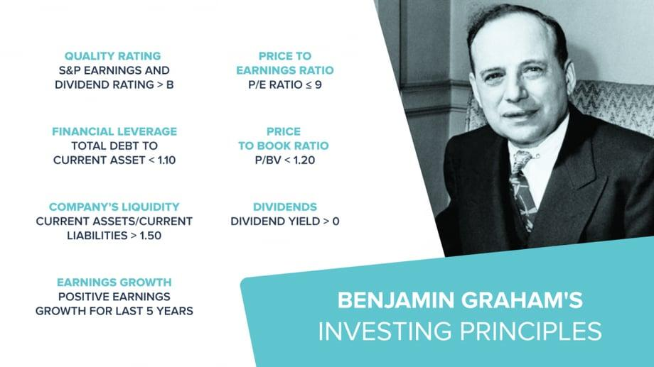

Value investing is a strategic approach to investing that emphasizes purchasing stocks that are priced below their intrinsic value, with the expectation that their true worth will be recognized over time, leading to profit. This strategy is distinguished by its focus on strong fundamental analysis to uncover securities that the market has undervalued, providing a margin of safety and potential for long-term capital appreciation. 

Benjamin Graham, esteemed as the father of value investing, laid down foundational principles that continue to steer investors towards prudent and informed decision-making. Through his influential works, particularly "The Intelligent Investor" and "Security Analysis," Graham taught the essence of investing with a margin of safety, the importance of understanding market fluctuations, and the necessity for self-awareness among investors. His principles champion a disciplined investment approach that eschews speculation and embraces thorough analysis.



In today's technologically advanced landscape, algorithmic trading presents novel opportunities to synergize Graham's time-honored principles with cutting-edge methods. Algorithmic trading, defined by the use of computer algorithms to execute trades at optimal speeds and conditions, allows for the automation of trading strategies based on pre-set criteria. This advancement offers the potential to swiftly identify undervalued stocks, capitalize on market volatility, and adhere consistently to strategic investing principles without the interference of emotional biases.

This article examines how Graham's investment principles can be effectively integrated with modern algorithmic trading techniques. We will delve into three primary areas where this amalgamation can be most beneficial: the concept of Margin of Safety, the capitalizing on Market Volatility, and the understanding of Investor Self-Awareness. By blending traditional investment wisdom with contemporary technology, investors can enhance their ability to achieve superior investment outcomes in an ever-evolving financial ecosystem.

## Table of Contents

## Principle #1: Always Invest with a Margin of Safety

The Margin of Safety is an essential concept in value investing, originally advanced by Benjamin Graham. This principle guides investors to purchase assets at prices significantly below their intrinsic value, thereby providing a buffer against errors in valuation and unforeseen market fluctuations. By ensuring a margin between the purchase price and the intrinsic value, investors can mitigate potential risks and enhance their chances of realizing a profit.

Graham advocated for this approach as a way to protect against both market volatility and human error in judgment. The intrinsic value of a stock is determined through comprehensive analysis of its fundamentals, including earnings, dividends, assets, and growth prospects. When the market price falls substantially below this calculated value, a margin of safety exists.

In contemporary investing, [algorithmic trading](/wiki/algorithmic-trading) systems offer efficient tools to implement this principle. These systems utilize sophisticated algorithms to analyze vast amounts of financial data, seeking out investment opportunities that align with Graham's margin of safety criterion. By quickly processing and evaluating extensive datasets, algorithmic systems can identify discrepancies between market prices and intrinsic values, which might take a human investor much longer to uncover.

For instance, technological tools can automate the calculation of intrinsic value using financial metrics and models. An example of such a model is the Discounted Cash Flow (DCF) analysis, which estimates a company's value based on its future cash flows. The intrinsic value $V$ can be calculated as:

$$
V = \sum \frac{CF_t}{(1 + r)^t}
$$

where $CF_t$ represents the cash flow in year $t$, $r$ is the discount rate, and $n$ is the number of years projected. Algorithmic systems can set these calculations on autopilot across a range of equities, quickly highlighting stocks where the intrinsic value substantively exceeds the current market price.

Moreover, by incorporating [machine learning](/wiki/machine-learning) models, algorithmic trading systems can refine their predictions and continuously improve valuation processes. These models can adjust algorithms based on historical data patterns, enhancing the accuracy of intrinsic value assessments and the identification of stocks with a sufficient margin of safety.

In summary, combining Graham's principle of investing with a margin of safety with state-of-the-art algorithmic trading techniques offers a formidable strategy for modern investors. It not only adheres to the cautionary approach advocated by Graham but also leverages technology to maximize efficiency and accuracy in investment decision-making.

## Principle #2: Expect Volatility and Profit from It

Market [volatility](/wiki/volatility-trading-strategies) is frequently perceived as a deterrent for investors who seek stability and consistent returns. However, Benjamin Graham, renowned for his foundational contributions to value investing, viewed volatility differently. He recognized that the unpredictable fluctuations of market prices could reveal opportunities to purchase undervalued stocks, hence maximizing profit potential.

Graham's concept of 'Mr. Market' serves as a pivotal illustration of how market irrationality can be harnessed. 'Mr. Market' is an allegorical figure used by Graham to describe the stock market's emotional and often irrational behavior. He posited that investors should regard market quotes as mere suggestions rather than definitive valuations. The underlying principle is that investors should maintain a rational and objective approach, capitalizing on periods when 'Mr. Market' undervalues stocks due to emotional overreactions.

Innovations in technology and the advent of algorithmic trading provide a modern means to exploit market volatility effectively. Algorithmic trading systems function by executing trades based on predefined guidelines and strategic models, diminishing the human emotional interference that often disrupts rational decision-making. These systems are designed to identify market inefficiencies and fluctuations quickly, enabling investors to take advantage of price movements in real time.

Algorithmic trading relies heavily on data analysis, mathematical models, and statistical computations to detect fleet market changes and execute trades. For example, an algorithm might be programmed to initiate a buy order if a stock's price falls significantly below its historical average or intrinsic value, in alignment with Graham's principles. Conversely, the system could sell when prices surge past a certain threshold, capturing gains before subsequent corrections.

```python
def volatility_trading_strategy(data, buy_threshold, sell_threshold):
    for stock in data:
        if stock['current_price'] < stock['historical_low'] * buy_threshold:
            print(f"Buying stock: {stock['name']} at {stock['current_price']}")

        if stock['current_price'] > stock['historical_high'] * sell_threshold:
            print(f"Selling stock: {stock['name']} at {stock['current_price']}")
```

The advantages of using algorithmic trading strategies in market volatility encompass speed, precision, and the capacity to handle vast amounts of data across multiple markets and instruments. By setting specific parameters—such as buy and sell thresholds—algorithms can align trading activities closely with an investor's risk tolerance and strategic goals.

Algorithmic systems excel at simultaneously monitoring numerous market dynamics, capturing opportunities that might elude human investors constrained by emotional biases. These events might include sudden market downturns where 'Mr. Market' underprices assets, allowing investors to buy with a substantial margin of safety—one of Graham's primary investment tenets. In sum, recognizing market volatility as an opportunity rather than an obstacle enables investors to strengthen their investment portfolios through adapative and disciplined strategies.

## Principle #3: Know What Kind of Investor You Are

Understanding oneself as an investor is essential for determining the most suitable investment strategy, as Benjamin Graham advocated. Identifying whether one is an active or passive investor can significantly influence the decision-making process and ultimately, the success of an investment portfolio.

Active investors engage closely with their investments, often conducting meticulous research and analysis. This approach involves evaluating financial statements, understanding market trends, and keeping abreast of industry developments. Active investing aligns well with systematic trading strategies, where investors employ algorithmic tools to enhance their decision-making process. These tools can process vast amounts of data, run predictive models, and execute trades based on predefined criteria. For example, an active investor might write a Python script to automate the analysis of financial ratios, such as the Price-to-Earnings (P/E) ratio, to identify potential investment opportunities:

```python
import pandas as pd

def calculate_PE_ratio(price, earnings):
    return price / earnings if earnings != 0 else None

data = pd.DataFrame({'Price': [100, 200, 150], 'Earnings': [5, 10, 15]})
data['P/E Ratio'] = data.apply(lambda row: calculate_PE_ratio(row['Price'], row['Earnings']), axis=1)
print(data)
```

In contrast, passive investors typically prefer a more hands-off approach, often opting for strategies like index investing. This strategy involves mimicking a market index, which can reduce the amount of research needed and minimize risks associated with attempting to outperform the market. Passive investors can also leverage algorithmic trading to enhance their strategies through techniques such as automated portfolio rebalancing. Automatically rebalancing an index-based portfolio can maintain the desired asset allocation and control risk without the emotional biases that may affect human decision-making.

Reflection on personal investment objectives and limitations is critical in formulating an effective strategy. Investors need to consider their risk tolerance, time horizon, and financial goals. These factors will dictate the choice between an active or passive investment strategy and the appropriate tools to support it. By aligning these personal attributes with a complementary investment style, investors can maximize their potential for success while minimizing unnecessary stress and risk.

This introspective approach, combined with the strategic use of technology, allows investors to adopt a disciplined and consistent investment methodology, aligning their personal attributes and preferences with Graham's enduring principles.

## Algorithmic Trading: Integrating Graham's Principles

Algorithmic trading provides a considerable advantage in implementing Benjamin Graham's value investing principles, chiefly through speed and precise execution. By programming trading rules that align with Graham's concepts of margin of safety and volatility, investors can achieve a higher degree of consistency in adhering to these value criteria. 

One of the cornerstones of Graham's methodology is the margin of safety, which involves purchasing stocks when their market prices are significantly below their intrinsic values. This principle can be effectively integrated into algorithmic trading systems. Algorithms can be designed to evaluate stocks against predefined valuation metrics, swiftly filtering through large databases to find opportunities that meet the margin of safety requirement. For instance, algorithms can be programmed to calculate the intrinsic value of a stock using discounted cash flow (DCF) analysis or a price-to-earnings (P/E) ratio and then compare this to the current market price. When a target differential is identified, trades can be automatically executed.

Algorithmic systems also excel in addressing the market volatility aspect of Graham's strategy. Graham's allegory of 'Mr. Market' highlights the irrational behavior of the market, which algorithms can capitalize on by setting predefined conditions for trade execution. These systems can react nearly instantaneously to market changes, executing trades based on volatility thresholds that have been established through historical data analysis. By removing the emotional component of trading, these algorithms maintain discipline and adherence to value investing principles, where human investors might falter due to psychological pressures.

Backtesting is another crucial advantage when integrating algorithmic trading with Graham's principles. By simulating how strategies would have performed on historical data, investors can examine the efficacy and robustness of their value investing strategies under various market conditions. This retrospective analysis helps refine algorithms, ensuring they maintain alignment with value investing principles while adapting to ever-changing market dynamics.

Consider this Python snippet for a simple [backtesting](/wiki/backtesting) scenario using price data:

```python
import pandas as pd
import numpy as np

# Sample Data: stock_prices is a DataFrame with 'Date' and 'Price'
stock_prices = pd.DataFrame({'Date': pd.date_range(start='1/1/2020', periods=100),
                             'Price': np.random.rand(100) * 100})

# Define a simple moving average strategy for illustration
short_window = 10
long_window = 30

# Calculate moving averages
stock_prices['Short_Moving_Avg'] = stock_prices['Price'].rolling(window=short_window).mean()
stock_prices['Long_Moving_Avg'] = stock_prices['Price'].rolling(window=long_window).mean()

# Generate signals
stock_prices['Signal'] = 0
stock_prices['Signal'][short_window:] = np.where(stock_prices['Short_Moving_Avg'][short_window:] > 
                                                 stock_prices['Long_Moving_Avg'][short_window:], 1, 0)

# Calculate daily returns
stock_prices['Returns'] = stock_prices['Price'].pct_change()

# Calculate strategy returns
stock_prices['Strategy_Returns'] = stock_prices['Returns'] * stock_prices['Signal'].shift(1)

# Output the strategy performance
strategy_performance = stock_prices['Strategy_Returns'].cumsum().apply(np.exp)
print(strategy_performance)
```

This code illustrates a moving average crossover strategy and calculates the cumulative returns of the strategy. While simplistic, it demonstrates the potential of using algorithms to apply investment principles systematically. By integrating algorithmic tools with Graham’s time-tested principles, modern investors can leverage technology to achieve more disciplined, objective, and efficient investment processes.

## Case Studies and Practical Applications

Case studies elucidate how Benjamin Graham's value investing principles, when integrated with algorithmic trading, have facilitated significant returns. One of the notable examples is the application of these principles in the management of Geico by Graham himself. Geico showcased the efficacy of purchasing undervalued companies with robust intrinsic value. Graham's acumen in identifying Geico's potential amidst market undervaluation led to substantial appreciation in its stock price over time, demonstrating the effectiveness of his value-oriented approach.

In modern contexts, the amalgamation of value investing with algorithmic trading delivers substantial advantages. Algorithmic systems, with their capacity for processing large volumes of financial data and executing trades rapidly, embody advancements that can identify undervalued stocks meeting set criteria. These systems, driven by pre-set algorithms, utilize Graham’s principles to evaluate stocks on metrics such as price-to-earnings ratios, asset valuations, and return on equity. Utilizing programming languages like Python, these algorithms systematically screen for equities that reflect a favorable margin of safety, following Graham’s insistence on purchasing at prices far beneath intrinsic value.

For instance, consider a Python snippet that identifies undervalued stocks based on Graham's formula for intrinsic value: 

```python
def graham_number(eps, book_value_per_share):
    return math.sqrt(22.5 * eps * book_value_per_share)

# Example: Calculate Graham Number for a stock with EPS of $4 and Book Value per Share of $20
eps = 4
book_value_per_share = 20
graham_number_value = graham_number(eps, book_value_per_share)
print(f"Graham Number: {graham_number_value}")
```

This algorithm identifies potential stocks trading under the computed Graham Number, suggesting they are undervalued, thereby allowing algorithm traders to efficiently filter through thousands of equities.

Additionally, quantitative investment firms such as Renaissance Technologies and Two Sigma have successfully blended the systematic evaluation of stocks epitomized by value investing with technological sophistication. They construct and backtest algorithms that model financial theories, combining factors including market volatility indicators and intrinsic valuation tools. Such practices reaffirm Graham’s principle that market inefficiencies present lucrative opportunities, further enhanced by leveraging technology to eliminate emotional biases and execute specified trading strategies.

Moreover, algorithmic strategies bolster risk management by providing continuous market monitoring and adaptive decision-making based on real-time data. These capabilities are paramount in navigating complex market environments, where traditional analysis may falter due to sheer [volume](/wiki/volume-trading-strategy) and velocity of information changes.

Therefore, the integration of Graham's foundational principles with algorithmic trading reflects not only a continued adherence to disciplined investing but also an embrace of innovative methodologies that enhance strategic execution and scale. These case studies exemplify the real-world applicability of value investing principles in advancing financial success in dynamic, technology-driven markets.

## Conclusion

Benjamin Graham’s value investing principles remain an enduring foundation for building long-term wealth. By focusing on intrinsic value and centering investment decisions around the concept of Margin of Safety, Graham's approach minimizes risks and aims for sustainable growth. The integration of these time-tested principles with modern algorithmic trading techniques represents a progressive evolution in financial strategy. Algorithmic systems, through their ability to process vast datasets at high speed and efficiency, enhance the precision of Graham's methodologies. They identify undervalued stocks with greater accuracy and exploit market volatility without the emotional biases that often impact human decision-making.

Investors seeking to enhance their portfolio performance should re-evaluate their methods to seamlessly incorporate these advanced tools, aligning them with Graham’s fundamental investment strategies. This involves not only adopting algorithmic systems for speed and precision but also maintaining the discipline and patience emphasized by Graham. By programming algorithms with parameters that reflect Graham’s value criteria, investors can ensure consistent adherence to a value investing strategy, even in fluctuating market conditions.

Ultimately, blending traditional wisdom with contemporary technology empowers investors to better navigate and succeed in today's dynamic financial marketplaces. This symbiosis of classic investment principles and cutting-edge technology fosters a more resilient investment approach, equipped to tackle both the challenges and opportunities presented by modern financial markets. As the landscape continues to evolve, those who adeptly integrate these principles with innovative technologies will be well-positioned for sustained success.

## References & Further Reading

[1]: Graham, B. (1949). ["The Intelligent Investor: The Definitive Book on Value Investing. A Book of Practical Counsel."](https://www.amazon.com/Intelligent-Investor-Definitive-Investing-Essentials/dp/0060555661) Harper & Brothers.

[2]: Graham, B., & Dodd, D. (1934). ["Security Analysis: Sixth Edition, Foreword by Warren Buffett."](https://www.amazon.com/Security-Analysis-Foreword-Buffett-Editions/dp/0071592539) McGraw-Hill.

[3]: Narang, R. K. (2013). ["Inside the Black Box: A Simple Guide to Quantitative and High Frequency Trading."](https://onlinelibrary.wiley.com/doi/book/10.1002/9781118662717) Wiley.

[4]: Chan, E. P. (2009). ["Quantitative Trading: How to Build Your Own Algorithmic Trading Business."](https://github.com/ftvision/quant_trading_echan_book) Wiley.

[5]: Lopez de Prado, M. (2018). ["Advances in Financial Machine Learning."](https://www.amazon.com/Advances-Financial-Machine-Learning-Marcos/dp/1119482089) Wiley.

[6]: Juselius, M. (2012). ["Volatility, Correlations and Volatility of Volatility, Toggle Volatility."](https://books.google.com/books/about/Handbook_of_Volatility_Models_and_Their.html?id=I2SddfXAR2kC) Quantitative Finance Letters.

[7]: Jansen, S. (2018). ["Machine Learning for Algorithmic Trading - Second Edition: Predictive Models to Extract Signals from Market and Alternative Data for Systematic Trading Strategies with Python."](https://www.oreilly.com/library/view/machine-learning-for/9781839217715/Text/Front_Matter.xhtml) Packt Publishing.
