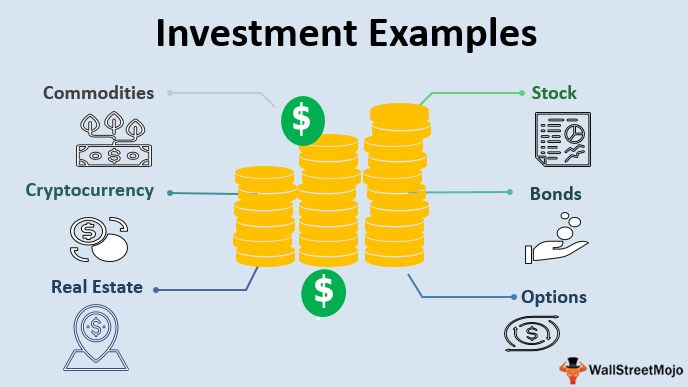

Financial markets offer a plethora of investment opportunities, ranging from traditional financial products to advanced algorithmic trading strategies. With these opportunities comes the need for investors to comprehend the diverse landscape of financial products and the integration of algorithmic trading to optimize returns. Traditional investment products, such as stocks, bonds, and mutual funds, have long been the cornerstone of portfolio management, each catering to different risk profiles and investment goals. 

Recent developments in technology and data analysis have given rise to algorithmic trading, a method that employs computer programs to execute trades based on pre-defined strategies. This innovation enhances trading efficiency, minimizes human error, and uncovers market opportunities that might be overlooked manually. 



This article offers insights into notable investment examples by examining financial products and algorithmic trading. We will explore popular investment instruments, elucidate the fundamentals of algorithmic trading, and present ways to combine these to effectively enrich portfolio performance. Our holistic approach aims to elevate your understanding of modern investment strategies, equipping you with the knowledge to navigate and capitalize on the intricacies of today's financial markets.

## Table of Contents

## Understanding Financial Products

Investment products are essential instruments for individuals and institutions aiming to achieve their financial objectives. These instruments offer opportunities for both capital appreciation and income generation, accommodating investors' varying risk appetites and investment goals. 

**Stocks** are equity investments that represent ownership in a company. They serve as a vehicle for potential growth and income. Investors can benefit from capital gains as the company's value increases and earn dividend income distributed from the company’s profits. Stocks are inherently riskier than bonds, as they are subject to market volatility and economic fluctuations, but they also offer potentially higher returns over the long term. 

**Bonds**, on the other hand, are debt instruments issued by governments, municipalities, and corporations to raise capital. They are considered safer investments than stocks as they offer fixed interest payments, known as coupon payments, and the principal is typically returned at maturity. Bonds are particularly appealing to risk-averse investors seeking stable and predictable returns, although they may offer lower growth potential compared to stocks. 

**Mutual Funds** pool money from multiple investors to purchase a diversified portfolio of stocks, bonds, or other securities. They provide investors with access to professionally managed portfolios, which can help mitigate risk through diversification. Mutual funds charge management fees, which can vary depending on the fund's investment strategy and objectives.

**Exchange-Traded Funds (ETFs)** are similar to mutual funds in terms of diversification but differ as they are traded on stock exchanges like individual stocks. ETFs offer flexibility in trading and typically have lower expense ratios than mutual funds. This makes them an attractive option for investors seeking cost-effective access to a diversified portfolio across various asset classes and markets.

Finally, **derivatives** such as options and futures are complex financial instruments that derive their value from an underlying asset, such as stocks, bonds, or commodities. Derivatives are used for hedging risks or speculating on an asset's price movements. For example, options grant buyers the right, but not the obligation, to purchase or sell an asset at a predetermined price within a specific timeframe. While derivatives offer versatility and the potential for high returns, they come with significant risk, making them suitable for more experienced investors.

In conclusion, understanding the characteristics and purposes of various financial products is critical for investors to align their portfolios with their risk tolerance and investment goals. Each product serves a unique role in an investment strategy, offering a spectrum of risk-reward profiles to suit diverse investment needs.

## Examples of Key Financial Products

Stocks provide investors with equity ownership in a company, offering both growth potential and the possibility of dividend income. As partial owners, shareholders benefit from the company's profits, typically distributed through dividends. Moreover, the value of their shares appreciates as the company grows and performs well in the market, presenting an opportunity for capital gains. However, stocks come with inherent risks due to market [volatility](/wiki/volatility-trading-strategies) and company-specific factors.

Bonds are fixed-income securities that offer returns in the form of interest payments. They are generally perceived as safer investment vehicles compared to stocks, given their defined interest payment schedule and principal repayment upon maturity. Bonds are issued by governments, municipalities, and corporations, each varying in terms of credit risk and [interest rate](/wiki/interest-rate-trading-strategies), thus influencing their respective yields. While they provide stability and regular income, their potential for capital growth is limited compared to equities.

Mutual funds and exchange-traded funds (ETFs) provide diversified exposure to a variety of securities. Managed by professional fund managers, these investment vehicles pool money from numerous investors to buy a diversified portfolio of stocks, bonds, or other assets. This diversification assists in risk mitigation, as losses in one security can be offset by gains in another. Mutual funds are typically actively managed and traded at the end of the day, whereas ETFs are passively managed and trade like stocks on an exchange throughout the day.

Options and other derivatives serve as versatile financial instruments used for hedging or speculative purposes. Options give the holder the right, but not the obligation, to buy or sell an underlying asset at a predetermined price before a specified expiration date. These contracts can be used to hedge against potential losses in an investor's portfolio or speculate on future market movements. Derivatives can be complex and [carry](/wiki/carry-trading) significant risk, as their value is derived from the underlying asset's price movements, which can be volatile.

Overall, these financial products cater to various investment objectives and risk appetites, each offering unique advantages and potential drawbacks. Investors must carefully consider their specific financial goals and risk tolerance when deciding how to allocate resources among these products.

## What is Algorithmic Trading?

Algorithmic trading is the use of computer programs to automatically execute trades by following a set of pre-defined instructions. This method draws heavily on mathematical models and theoretical constructs to make trading decisions. Its primary appeal lies in the potential for enhanced efficiency, precision, and speed over traditional manual trading methods.

### Efficiency and Speed
Algorithmic trading systems can process vast amounts of market data rapidly. They can execute buy or sell orders nearly instantaneously when conditions specified in their programming are met. This level of speed is crucial in modern financial markets, where price dynamics can change in milliseconds. By removing the human element from trade execution, [algorithmic trading](/wiki/algorithmic-trading) significantly minimizes reaction time and reduces the likelihood of missed opportunities due to human delay or error.

### Reducing Human Error
Human traders are susceptible to emotions such as fear and greed, potentially leading to irrational decisions. Algorithms operate unemotionally, executing trades strictly based on their programming without psychological factors intervening. This helps in maintaining a consistent, disciplined approach to trading. By eliminating emotion from the equation, algorithmic trading helps in maintaining a more consistent performance.

### Exploiting Market Opportunities
Algorithmic trading strategies can identify and exploit market opportunities that might be too subtle for a human trader to recognize promptly. These strategies often rely on high-frequency trading techniques, statistical [arbitrage](/wiki/arbitrage), and other sophisticated models. They can detect price inefficiencies and execute numerous trades across multiple markets simultaneously, capitalizing on minuscule price discrepancies that exist only for fractions of a second.

### Algorithmic Trading Strategies
1. **Moving Averages**: One of the simplest forms of algorithmic trading involves the use of moving averages. Traders may program an algorithm to buy or sell stock based on moving average crossovers. For example, a simple moving average (SMA) is calculated as:
$$
   \text{SMA}_t = \frac{1}{N} \sum_{i=0}^{N-1} P_{t-i}

$$

   where $P_t$ is the price at time $t$ and $N$ is the number of periods in the moving average.

2. **Statistical Arbitrage**: More complex strategies involve statistical arbitrage, where traders exploit price anomalies between related securities. This requires sophisticated models to predict expected price movements and execute trades based on the predicted convergence or divergence of asset prices.

3. **High-Frequency Trading (HFT)**: HFT is a subset of algorithmic trading characterized by high turnover rates and order-to-trade ratios. It capitalizes on ultra-short-term market inefficiencies, often using arbitrage strategies to gain a competitive edge. The algorithms analyze numerous market indicators to transact large volumes of orders at very high speeds.

Python is a preferred programming language for implementing these strategies due to its rich set of libraries for data analysis and algorithm development, such as NumPy, pandas, and scikit-learn. Here is a basic example of Python code that implements a moving average crossover strategy:

```python
import pandas as pd

# Assuming 'data' is a pandas DataFrame containing stock prices with a 'Close' column
short_window = 40
long_window = 100

signals = pd.DataFrame(index=data.index)
signals['signal'] = 0.0

# Create short simple moving average
signals['short_mavg'] = data['Close'].rolling(window=short_window, min_periods=1).mean()

# Create long simple moving average
signals['long_mavg'] = data['Close'].rolling(window=long_window, min_periods=1).mean()

# Create signals
signals['signal'][short_window:] = np.where(signals['short_mavg'][short_window:] > signals['long_mavg'][short_window:], 1.0, 0.0)   

# Generate trading orders
signals['positions'] = signals['signal'].diff()
```

This example demonstrates how algorithms can automate and optimize the trading process, making decisions based on technical indicators coded into a systematic trading strategy. As markets continue to evolve, the role of algorithmic trading is expected to grow, cementing its place as a cornerstone of modern finance.

## Advantages and Disadvantages of Algorithmic Trading

Algorithmic trading has revolutionized the dynamics of financial markets by allowing for the automation of trading strategies. This approach offers several advantages, making it an attractive option for many investors. One of the primary benefits is faster execution speeds. By utilizing computer algorithms, trades can be executed in a fraction of a second, significantly faster than any manual trading process. This speed enables traders to capitalize on fleeting opportunities that human traders might miss.

Precision in trading is another advantage, as algorithmic systems can execute trades with exact timing, size, and price parameters, reducing the likelihood of human errors. This precision enhances trade accuracy and can lead to better investment outcomes. Additionally, algorithmic trading often leads to reduced transaction costs. Algorithms can optimize trade execution by breaking down large orders into smaller ones, thus minimizing market impact and taking advantage of favorable pricing conditions.

Moreover, algorithmic trading offers the ability to backtest strategies. This involves simulating trading strategies using historical data to assess their viability before deploying them in live markets. Backtesting helps traders refine their strategies, ensuring they are robust and applicable in various market conditions.

Despite these advantages, algorithmic trading presents several challenges. The need for significant technological infrastructure is a considerable barrier to entry. Maintaining low-latency connections, powerful computing resources, and reliable execution platforms requires substantial investment in technology and human resources. Furthermore, there is a risk of over-reliance on historical data. Market conditions are dynamic, and algorithms derived from past data may not perform well in future scenarios, particularly during black swan events—unexpected and highly impactful occurrences.

Regulatory scrutiny is also a potential challenge. Financial markets are subject to strict regulations, and algorithmic traders must ensure compliance with all relevant laws and guidelines. This includes adhering to market manipulation rules and ensuring that algorithms do not contribute to market instability.

Finally, algorithmic strategies may struggle with adapting to unprecedented market conditions. While algorithms can effectively manage routine market fluctuations, they might not cope well with extreme events that fall outside their programmed parameters, potentially leading to significant financial losses. Therefore, continuous monitoring and updates to algorithmic strategies are essential to ensure they remain effective under various market conditions.

## Integrating Algo Trading with Financial Products

Algorithmic trading can be deployed across a broad spectrum of financial products, markedly improving the efficiency and execution quality of investment strategies. By leveraging pre-defined criteria and computational power, algorithmic trading enables more precise and timely decision-making, particularly in fast-paced financial markets.

For mutual funds and exchange-traded funds (ETFs), algorithmic trading can automate the rebalancing process. Rebalancing involves adjusting the portfolio to maintain a desired asset allocation, which can be cumbersome if done manually. Algorithms can evaluate current market conditions and automatically execute trades that optimize the portfolio's weighted distribution, ensuring adherence to strategic investment objectives without human intervention. This not only minimizes the time burden on fund managers but also enhances the adaptability of the portfolio to market changes.

When it comes to bond trading, algorithmic systems can analyze interest rate environments to optimize trading decisions. Given that bond prices are inversely correlated with interest rates, algorithms can be programmed to predict rate movements and execute trades that take advantage of these fluctuations. This could involve buying bonds expected to appreciate or selling those likely to decline, thereby maximizing returns. Additionally, algorithms can adjust to credit spreads and other macroeconomic indicators, offering a dynamic approach to fixed-income investing.

In the derivatives market, algorithmic trading provides robust tools for risk management. Derivatives such as options and futures can be complex, with price movements that depend on various underlying factors. Algorithmic strategies can manage this complexity by monitoring these factors in real-time and executing hedging strategies that limit potential losses. For example, algorithms can continuously compute the Greeks—such as delta, gamma, and theta—of options portfolios and make necessary adjustments to maintain a desired risk profile.

High-frequency trading ([HFT](/wiki/high-frequency-trading-strategies)) algorithms are particularly advantageous in markets with high [liquidity](/wiki/liquidity-risk-premium) and quick price changes. These algorithms can identify and exploit minute price discrepancies across various exchanges or financial instruments, allowing traders to achieve incremental gains that aggregate into significant profit margins over time. A typical HFT strategy might involve rapid buying and selling of equities within fractions of a second to capitalize on these tiny price movements, which are often imperceptible to human traders.

Overall, the integration of algorithmic trading with financial products represents a formidable advancement in modern finance. By automating complex processes, reducing the impact of human error, and leveraging data-driven insights, algorithmic trading enhances the strategic capabilities of investors across different asset classes.

## Case Study: Successful Algo Trading Integration

The successful integration of algorithmic trading into a diversified portfolio can be exemplified by the approach taken by Renaissance Technologies, a notable [hedge fund](/wiki/hedge-fund-trading-strategies) known for its quantitative-driven strategies. Founded by mathematician James Simons, Renaissance Technologies has consistently outperformed traditional investment benchmarks through its Medallion Fund, which heavily employs algorithmic trading.

### Significant Returns and Strategies

Renaissance's Medallion Fund has achieved average annual returns exceeding 30% after fees over several decades. This remarkable performance can be attributed to the fund's ability to harness vast amounts of data and implement sophisticated quantitative models for trading decisions. The models are designed to identify patterns and arbitrage opportunities across a multitude of financial products, including equities, futures, options, and foreign exchange markets.

The fund employs a diverse array of strategies, such as:

1. **Statistical Arbitrage**: Utilizing complex algorithms to identify price discrepancies between correlated financial instruments. These arbitrage opportunities are often fleeting and require rapid execution, a hallmark of algorithmic trading.

2. **Market Microstructure Models**: Understanding the intricacies of order book dynamics to optimize order execution and minimize market impact.

3. **Machine Learning**: Continuously improving trading models through machine learning techniques that adapt to evolving market conditions, enhancing predictive accuracy.

### Risk Management and Mitigation

Despite the high-frequency and sometimes high-risk nature of algorithmic trading, Renaissance Technologies has implemented robust risk management protocols. These include:

- **Portfolio Diversification**: Spreading investments across a diverse set of asset classes to mitigate unsystematic risk.
- **Stress Testing and Scenario Analysis**: Continuously assessing potential adverse market conditions and their impact on the portfolio.
- **Real-time Monitoring Systems**: Employing real-time analysis to quickly identify and respond to emerging risks in the trading environment.

### Regulatory Challenges

Operating a hedge fund of such size and with advanced algorithmic trades often brings regulatory scrutiny. Renaissance Technologies has encountered challenges related to:

- **Market Manipulation Concerns**: Due to the high volume and speed of trades, regulatory bodies like the SEC and CFTC closely monitor for any activities that may unfairly manipulate market conditions.

- **Data Privacy and Use**: Ensuring compliance with data protection laws, especially as big data plays a crucial role in strategy development.

Renaissance has navigated these regulatory challenges through transparency and adherence to financial regulations. By maintaining cooperative relationships with regulators and employing a dedicated compliance team, the hedge fund continues to operate effectively within the legal framework.

In summary, Renaissance Technologies exemplifies how algorithmic trading can be successfully integrated into a diversified financial product portfolio, yielding substantial returns while managing associated risks and regulatory challenges. This case highlights the critical importance of sophisticated technology, continuous model improvement, and robust compliance mechanisms in maintaining competitive advantage.

## Conclusion

Investment success today requires understanding both traditional financial products and sophisticated algorithmic trading techniques. Integrating these elements allows investors to adapt and thrive in a fluid market environment. Achieving a balanced portfolio that leverages algorithmic insights alongside core financial product holdings is vital for enduring investment performance. This means not only investing in blue-chip stocks, government bonds, or diversified ETFs but also integrating algorithmic models to enhance decision-making and execution efficiency.

Algorithmic trading can uncover patterns and opportunities that would be difficult to identify through manual analysis, giving investors an edge in spotting trends or arbitrage opportunities. For instance, algorithms might analyze vast datasets quickly to identify undervalued stocks or predict bond price movements based on interest rate changes. However, incorporating these technologies requires a commitment to continuous education and strategic flexibility, as market conditions are ever-changing and algorithms need regular updates to remain effective.

Moreover, a solid technological foundation is essential. Investors must either develop or access advanced trading platforms capable of executing complex strategies with precision and speed. High-frequency trading, for instance, relies on systems that can execute and settle trades in milliseconds, requiring significant investment in infrastructure.

Ultimately, the key to navigating the dynamic investment landscape is combining the tried-and-true advantages of financial products with the agility and analytical power of algorithmic trading. This combination enables investors not only to safeguard their portfolios from market volatility but also to capitalize on emerging opportunities, leading to sustained financial growth.

## References & Further Reading

[1]: Chan, E. P. (2009). ["Quantitative Trading: How to Build Your Own Algorithmic Trading Business"](https://github.com/ftvision/quant_trading_echan_book). John Wiley & Sons.

[2]: Jansen, S. (2018). ["Machine Learning for Algorithmic Trading"](https://github.com/stefan-jansen/machine-learning-for-trading). Packt Publishing.

[3]: Lopez de Prado, M. (2018). ["Advances in Financial Machine Learning"](https://www.amazon.com/Advances-Financial-Machine-Learning-Marcos/dp/1119482089). Wiley.

[4]: Aronson, D. (2006). ["Evidence-Based Technical Analysis: Applying the Scientific Method and Statistical Inference to Trading Signals"](https://www.amazon.com/Evidence-Based-Technical-Analysis-Scientific-Statistical/dp/0470008741). Wiley.

[5]: Bergstra, J., Bardenet, R., Bengio, Y., & Kégl, B. (2011). ["Algorithms for Hyper-Parameter Optimization."](https://dl.acm.org/doi/10.5555/2986459.2986743) Advances in Neural Information Processing Systems 24.