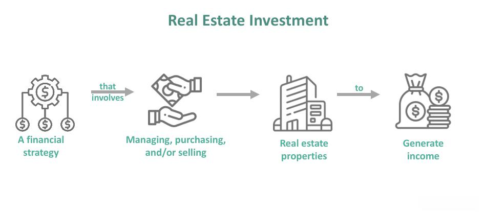

In today's dynamic financial landscape, investors are presented with a confluence of opportunities through the intersection of investment properties, financing options, and algorithmic trading. Investment properties, traditionally regarded as a reliable source of income through rentals or capital appreciation, are experiencing enhanced synergies through modern financing strategies and technological advancements. Algorithmic trading, typically associated with stock and forex markets, is increasingly being applied to real estate investments. This convergence provides investors new avenues to optimize investment returns by leveraging data-driven insights and strategic financial planning.

Investment property types, ranging from residential and commercial to mixed-use, offer diverse avenues for income generation and capital growth. Understanding the distinct characteristics and income potential associated with each type allows investors to make targeted decisions that align with their financial objectives. Financing options, including traditional bank loans, alternative lending, and utilizing home equity, offer the leveraged means to acquire these properties. The choice of financing strategy significantly impacts the investment outcome, highlighting the importance of aligning financing with both immediate and long-term investment goals.



Algorithmic trading represents a technological advancement that integrates sophisticated data analysis to refine investment strategies in real estate. By analyzing market trends, property valuations, and economic indicators, algorithms offer enhanced decision-making capabilities, reducing human error and increasing the efficiency of portfolio management. This application extends to timely acquisitions, precise risk assessments, and improved overall management of real estate investments.

Understanding these elements not only empowers investors to make informed decisions but also facilitates the optimization of returns. This article examines these synergies, exploring how the strategic integration of investment property types, financing options, and algorithmic trading can enhance investment outcomes. As real estate continues to be a vital component of diversified investment portfolios, staying informed and adaptable to emerging market trends and technologies is crucial for achieving success and generating wealth.

## Table of Contents

## Understanding Investment Properties

Investment properties are acquired with the primary objective of generating income, either through rental yields or capital appreciation. These properties can be broadly classified into three main categories: residential, commercial, and mixed-use.

**Residential Properties:** These investment properties include single-family homes, condominiums, townhouses, and multi-family units. Residential properties usually generate income through monthly rent payments and tend to be less sensitive to broader economic cycles compared to commercial properties. The residential real estate market is influenced by factors such as demographic trends, interest rates, and housing policies.

**Commercial Properties:** This category encompasses office spaces, retail centers, industrial properties, and warehouses. Commercial properties generally yield higher rental income compared to residential properties due to longer lease durations and the potential for multiple revenue streams from larger tenants. However, they also present higher risks, often requiring significant capital outlay and professional management expertise. The performance of commercial properties is closely tied to economic conditions, business growth, and consumer spending patterns.

**Mixed-Use Properties:** These properties combine residential, commercial, or industrial functions within a single development. Mixed-use properties can offer diversified income streams, which may stabilize cash flow and reduce investment risk. Strategic urban locations can significantly enhance their appeal and potential returns, attracting both residential tenants and commercial lessees.

The value and income potential of these investment properties are closely linked to market conditions and strategic management. Economic factors such as GDP growth, employment rates, and inflation can affect property values and rental income. Moreover, tax incentives, zoning regulations, and government policies may either enhance or hinder the potential returns from investment properties.

To maximize returns, investors need to consider several critical factors:

1. **Location:** The location of an investment property is paramount, affecting its desirability and value. High-demand areas with strong infrastructure, access to amenities, and economic activity often provide better investment opportunities.

2. **Market Trends:** Staying informed on local and global real estate trends helps investors make timely decisions and anticipate shifts in property values. Trends such as urbanization, remote work, and demographic changes can have a lasting impact on investment returns.

3. **Property Management:** Effective property management strategies are key to maintaining and enhancing property value. This includes tenant acquisition and retention, property maintenance, and financial management. Professional property management services can ensure efficient operations and address legal and logistical challenges promptly.

By carefully evaluating these aspects, investors can optimize their investment strategies and achieve favorable outcomes in the real estate market.

## Exploring Real Estate Financing Options

Real estate financing is a pivotal component of acquiring investment properties, offering various pathways to investors seeking to optimize their portfolios. An investor's choice of financing can significantly influence the profitability and sustainability of their real estate ventures. Understanding the nuances of each option can help investors align their choices with specific investment objectives and risk tolerances.

Traditional bank loans are one of the most common financing methods for real estate acquisitions. These typically involve long-term, fixed-rate mortgages provided by commercial banks or financial institutions. Investors benefit from relatively low-interest rates and the predictability of fixed payments. However, securing a traditional loan often requires a strong credit score, a substantial down payment, and thorough documentation to demonstrate financial stability and capacity for repayment.

Alternative lending has gained popularity, offering more flexible options for investors who may not qualify for traditional bank loans. This category includes private lenders, peer-to-peer lending platforms, and real estate crowdfunding. While these options may present higher interest rates and shorter loan terms, they often offer quicker access to capital and less stringent credit requirements. This flexibility can be advantageous for investors seeking to capitalize on timely market opportunities or those with unconventional financial situations.

Leveraging home equity is another financing strategy, where investors use the equity built in their existing properties as collateral to secure additional funding. Home equity lines of credit (HELOCs) and home equity loans are typical examples of this method. This approach allows investors to tap into the accumulated value of their properties, often at lower interest rates than unsecured personal loans. However, it also entails a risk of losing the pledged property if repayments are not met, highlighting the importance of cautious financial planning and risk assessment.

Each financing method has its distinct costs, benefits, and terms, further influencing an investor's choice. For example, bank loans offer stability but lack flexibility, whereas alternative lending provides agility at a potential cost of higher interest rates. Home equity leveraging can be cost-effective but increases exposure to market risks. Therefore, investors must consider their financial standings, investment timelines, property types, and market conditions when selecting a financing option.

Essentially, the choice of real estate financing should align with an investor's overarching investment goals and risk appetite. By carefully evaluating each method's implications, investors can strategically optimize their capital structures to achieve desired returns while managing inherent risks. This alignment is crucial for navigating the complexities of real estate investments and enhancing long-term profitability.

## Algorithmic Trading in Real Estate Investments

Algorithmic trading, a method that uses computer algorithms to execute investment strategies, is becoming increasingly significant in the field of real estate investments. This innovative approach leverages advanced data analysis to enhance the effectiveness of investment strategies, providing a cutting-edge method for portfolio management.

Algorithms serve a crucial role in analyzing vast sets of data encompassing market trends, property values, and broader economic indicators. By processing and interpreting this data, algorithms can make informed predictions and recommendations about potential investment opportunities. This capability is particularly valuable in the real estate sector, where numerous variables can influence asset value. For example, algorithms can assess local and national market trends, changes in property values, and economic forecasts to determine the most promising investment projects. They employ [machine learning](/wiki/machine-learning) techniques and statistical models to identify patterns that a human investor might overlook due to sheer data [volume](/wiki/volume-trading-strategy) or complexity.

The integration of [algorithmic trading](/wiki/algorithmic-trading) into real estate investment practices offers several advantages, including efficient portfolio management. This technology aids investors in maintaining diversified portfolios by helping them identify the right mix of properties based on predicted performance metrics. Furthermore, algorithms are instrumental in risk assessment; they evaluate potential risks associated with different investment options and suggest optimized strategies to mitigate these risks. Algorithms can perform stress tests and run different scenarios to determine how various external factors might impact a portfolio, helping investors prepare for [volatility](/wiki/volatility-trading-strategies).

Timeliness is another critical advantage of algorithmic trading. In real estate markets, where timing can significantly influence investment outcomes, algorithms provide the agility needed to respond quickly to market fluctuations. By executing trades at the optimal moment, investors can capitalize on favorable conditions and avoid losses resulting from delayed actions.

Moreover, algorithmic trading significantly reduces human error, a common challenge in traditional investment practices. The reliance on automated processes eliminates emotional bias and increases accuracy, translating to more consistent decision-making. Algorithms function on pre-defined parameters and criteria, ensuring that every decision is aligned with the investment strategy's objectives without deviations due to human biases or oversights.

In summary, the application of algorithmic trading in real estate investments introduces a systematic and data-driven approach, enhancing efficiency and accuracy in investment decisions. Its ability to analyze large datasets rapidly, minimize risks, and identify timely investment opportunities positions algorithmic trading as a vital component for modern real estate investors seeking to optimize their strategic outcomes.

## Choosing the Right Financing Strategy

Selecting the appropriate financing strategy for investment properties is a critical decision that requires careful consideration of various factors such as financial standing, property type, and prevailing market conditions. Investors need to navigate the trade-offs between traditional financing methods, such as bank loans and mortgages, and alternative options, which may include private lenders or real estate crowdfunding.

Traditional financing methods often come with the benefits of lower interest rates and longer repayment terms but may require substantial documentation and a strong credit history. These options can be ideal for investors interested in stable properties with predictable cash flows. However, they may lack the flexibility needed to adapt to rapidly changing market conditions or more unconventional investment opportunities.

Alternative financing methods, on the other hand, offer greater flexibility and can be tailored to fit specific investment strategies or property types. These may include higher interest rates and shorter terms, but they provide quicker access to funds and less stringent credit requirements. For instance, private lenders might be willing to finance projects that traditional banks consider too risky, such as properties in need of significant renovation or in emerging markets.

A mixed financing approach, which combines both traditional and alternative methods, can provide an optimal balance of cost efficiency and flexibility. By using a mix of funding sources, investors can mitigate the risks associated with reliance on a single type of financing. This approach enables leveraging the lower costs associated with traditional loans while still benefiting from the flexibility and speed of alternative funds.

The decision-making process should be aligned with long-term investment objectives, which might include portfolio diversification, risk management, and capital growth. Calculating the cost of capital, understanding the impact of interest rates, and forecasting cash flow are essential components of this strategy. Tools like discounted cash flow analysis can be employed to assess the viability of financing options against projected returns.

In conclusion, selecting the right financing strategy is a nuanced process that requires aligning financial resources with the unique characteristics of each investment opportunity. By judiciously evaluating financing options and incorporating flexibility into the funding structure, investors can enhance their ability to achieve desirable investment outcomes.

## Benefits and Risks of Investing in Investment Property

Investment properties present investors with several attractive benefits, including the potential for capital gains, steady rental income, and tax incentives. These benefits make real estate an appealing option for diversifying an investment portfolio. Capital gains arise as property values increase over time, potentially yielding substantial returns upon sale. Meanwhile, rental properties can provide a consistent income stream, which is particularly advantageous in fluctuating financial markets. Tax incentives, such as depreciation and mortgage interest deductions, can further enhance an investment's profitability by lowering taxable income.

However, investing in real estate also entails significant risks. Market volatility, influenced by economic conditions, interest rates, and regional factors, can lead to unpredictable changes in property values. Effective property management is crucial, as it directly impacts tenant satisfaction and rental income. Investors must also be prepared to address management challenges, which can include maintenance issues, tenant turnover, or unanticipated expenses. Financing costs are another potential risk, as they can fluctuate with [interest rate](/wiki/interest-rate-trading-strategies) changes and impact the investor's cash flow and profitability.

Risk mitigation in property investment often involves diversification and diligent management practices. Diversifying across different property types or geographic locations can reduce exposure to market-specific risks. Investors should also engage in thorough due diligence when selecting properties, evaluating factors such as location, local market trends, and property condition. By understanding these dynamics, investors can make informed decisions that maximize the benefits of their investment.

For sophisticated investors, employing financial models to predict and assess risks can be advantageous. Python, for instance, offers libraries such as NumPy and Pandas that facilitate data analysis and risk assessment:

```python
# Example of calculating expected rental income and risk
import numpy as np
import pandas as pd

# Sample data: rental income and property values
data = {
    'rental_income': [1200, 1500, 1350, 1600, 1400],
    'property_values': [200000, 250000, 225000, 275000, 240000]
}

df = pd.DataFrame(data)

# Calculate average rental income
avg_income = np.mean(df['rental_income'])

# Calculate variance and standard deviation for rental income (indicative of risk)
variance = np.var(df['rental_income'])
std_deviation = np.std(df['rental_income'])

print(f"Average Rental Income: ${avg_income}")
print(f"Variance: {variance}, Standard Deviation: {std_deviation}")
```

Through disciplined analysis and strategic management, investors can navigate the complexities of real estate investment, balancing potential rewards with associated risks effectively.

## Conclusion

The convergence of investment properties, financing strategies, and algorithmic trading is redefining how investors approach real estate markets. By skillfully integrating these elements, investors can significantly optimize their investment outcomes. Investment properties, with their potential for capital gains and rental income, remain a crucial part of diversified portfolios. They provide stability and a hedge against market volatility.

Strategically leveraging financing options enhances the ability to capitalize on real estate opportunities. Financing strategies, whether traditional or alternative, directly impact the scalability and flexibility of investments. Choosing the right financing options allows investors to align their investment activities with long-term objectives, manage risks effectively, and reduce costs.

Incorporating algorithmic trading into real estate investments further amplifies these benefits by employing sophisticated data analytics and predictive modeling. This technology assists in making timely and informed decisions, thus enhancing the precision and efficiency of investment strategies. Algorithmic tools can assess factors such as market trends and economic indicators, helping investors make data-driven choices that reduce human error.

For success in this evolving landscape, it is imperative to stay informed of market dynamics and technological advancements. The ability to be strategically responsive to these changes is crucial, facilitating adaptation and enhanced decision-making. Investors who embrace these concepts can gain a competitive edge, unlocking the full wealth-generation potential of real estate investments.

## References & Further Reading

In-depth resources can expand on understanding real estate investments and market trends. For those interested in financing strategies, texts such as "Real Estate Finance and Investments" by William Brueggeman and Jeffrey Fisher provide comprehensive insights into financial mechanisms and their applications in real estate. This includes discussions on the different financing instruments available and how they can be aligned with investor objectives.

Regarding algorithmic trading, "Algorithmic Trading and DMA: An Introduction to Direct Access Trading Strategies" by Barry Johnson is an essential resource. It covers the principles of algorithmic decision-making, providing a foundation for applying these techniques to real estate investment strategies. This book explains how algorithms can be used to assess market trends and optimize investment portfolios.

Property management practices are a critical component of successful real estate investment. "Property Management Kit For Dummies" by Robert S. Griswold offers practical advice on managing different types of investment properties. It provides tools and techniques for effective property management, which can significantly influence investment outcomes.

Moreover, staying informed about emerging market dynamics is crucial. Subscribing to periodicals such as "The Real Estate Finance Journal" and "Journal of Property Investment & Finance" can keep investors updated on the latest trends and analyses in real estate markets.

Finally, leveraging online platforms like the Massachusetts Institute of Technology’s Real Estate Center, which offers white papers and reports on current real estate trends and technological innovations, can provide further insights into the rapidly evolving market. These resources collectively help in making informed decisions and optimizing investment returns within the varied and complex landscape of real estate investing.

