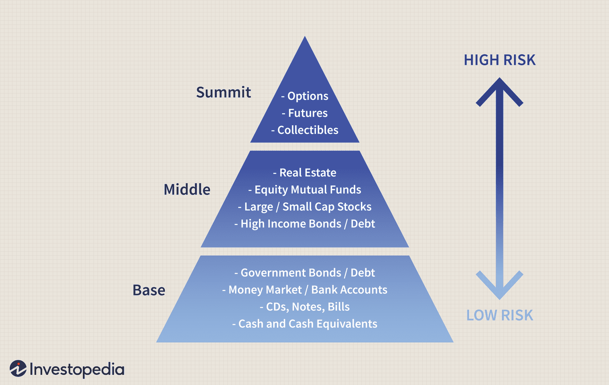

## Table of Contents

## What is an investment pyramid and how does it work?

An investment pyramid is a way to organize your investments based on how risky they are. It looks like a pyramid, with the biggest and safest investments at the bottom and the smaller, riskier ones at the top. The idea is to put most of your money in safe investments, like savings accounts or government bonds, and only a little bit in riskier things, like stocks or cryptocurrencies.

The pyramid helps you balance your investments so you don't lose all your money if something goes wrong. By having a strong base of safe investments, you can take some chances with riskier ones without worrying too much. It's like building a strong foundation for a house before adding the fancy parts on top. This way, you can grow your money over time while keeping it safe.

## Why is asset allocation important in an investment strategy?

Asset allocation is important in an investment strategy because it helps you spread your money across different types of investments. This spreading out, or diversification, reduces the risk of losing all your money if one investment does badly. For example, if you put all your money in one company's stock and that company fails, you could lose everything. But if you spread your money across stocks, bonds, and real estate, a problem with one won't hurt your whole investment plan.

Another reason asset allocation is key is that it matches your investments to your goals and how much risk you're willing to take. If you're saving for a big purchase in a few years, you might want to put more money in safe investments like bonds. But if you're saving for retirement that's far away, you might be okay with riskier investments like stocks that could grow more over time. By choosing the right mix of investments, you can work towards your financial goals while feeling comfortable with the level of risk you're taking.

## What are the different levels of the investment pyramid and what types of investments belong to each level?

The investment pyramid has three main levels, starting with the widest and safest at the bottom. The bottom level is called the foundation, and it's where you put most of your money. This level includes safe investments like savings accounts, certificates of deposit (CDs), and government bonds. These investments are less likely to lose value, so they help protect your money. You want to have a strong foundation because it supports everything else in your investment plan.

The middle level of the pyramid is for income investments. These are a bit riskier than the foundation but can offer higher returns. This level includes things like corporate bonds and dividend-paying stocks. They can help grow your money over time and provide regular income. You put less money here than in the foundation, but more than in the top level.

The top level of the pyramid is for growth investments, which are the riskiest but have the potential for the highest returns. This level includes investments like [growth stocks](/wiki/growth-stocks), real estate, and cryptocurrencies. You put the least amount of money here because these investments can be more volatile. The idea is that the small part of your money you put in these riskier investments can help boost your overall returns without putting your whole investment plan at risk.

## How can beginners start building their own investment pyramid?

Beginners can start building their own investment pyramid by first setting up a strong foundation. This means putting most of their money into safe investments like a savings account, a certificate of deposit (CD), or government bonds. These are the safest places to keep your money because they are less likely to lose value. A good rule of thumb is to put about 50-70% of your money in these safe investments. This way, you have a solid base that protects your money and gives you peace of mind.

Next, beginners can move to the middle level of the pyramid, which is for income investments. This level is a bit riskier but can offer higher returns. You might want to put about 20-40% of your money here. Good choices for this level include corporate bonds and stocks that pay dividends. These investments can help your money grow over time and provide you with regular income. Finally, the top of the pyramid is for growth investments, which are the riskiest but can offer the highest returns. You should only put about 5-10% of your money here. This level can include growth stocks, real estate, or even cryptocurrencies. By starting with a strong foundation and slowly adding riskier investments, beginners can build a balanced investment pyramid that helps them grow their money safely.

## What is the role of risk management in an investment pyramid?

Risk management is super important when you're building an investment pyramid. It's all about making sure you don't lose all your money if something goes wrong. By putting most of your money in safe investments at the bottom of the pyramid, like savings accounts and government bonds, you create a strong base that protects your money. This way, even if the riskier investments at the top don't do well, you won't lose everything because your foundation is solid.

The idea is to balance the risk and reward. The top of the pyramid, where you put just a little bit of your money, is for riskier investments like stocks or cryptocurrencies. These can grow a lot, but they can also lose value quickly. By only putting a small amount of money in these, you can still try to make more money without risking too much. So, risk management in an investment pyramid helps you keep your money safe while still giving you a chance to grow it.

## How should one adjust their investment pyramid as they approach retirement?

As you get closer to retirement, you should change your investment pyramid to make it safer. This means putting more of your money in the bottom part of the pyramid, where the safe investments are. Things like savings accounts, CDs, and government bonds are good choices because they are less likely to lose value. You might want to have around 70-80% of your money in these safe investments. This helps make sure you have money to live on when you stop working.

You should also put less money in the middle and top parts of the pyramid. The middle part, where you have income investments like corporate bonds and dividend stocks, should be smaller now. Maybe around 20-30% of your money can go here. And the top part, with the riskiest investments like growth stocks or real estate, should be very small, maybe just 0-10%. By doing this, you lower the risk of losing money right before you need it for retirement.

## What are common mistakes to avoid when setting up an investment pyramid?

One common mistake people make when setting up an investment pyramid is putting too much money in risky investments at the top. It's exciting to think about making a lot of money fast, but if you put too much in things like stocks or cryptocurrencies, you could lose a lot if they don't do well. The pyramid works best when you have a strong base of safe investments like savings accounts and government bonds. This way, even if the riskier stuff doesn't work out, you won't lose everything.

Another mistake is not adjusting the pyramid as your life changes. For example, if you're getting close to retirement, you should move more money into safe investments to protect what you have. If you keep too much in risky stuff, you might not have enough money when you need it. It's important to check your pyramid every now and then and make changes based on your goals and how much risk you're okay with.

## How does diversification within the investment pyramid reduce risk?

Diversification within the investment pyramid helps reduce risk by spreading your money across different types of investments. Instead of putting all your money in one thing, like one company's stock, you put it in many different things. This way, if one investment does badly, it won't hurt your whole plan. For example, if you have money in stocks, bonds, and real estate, and the stock market goes down, your bonds and real estate might still be doing okay. This balance helps keep your money safer.

In the investment pyramid, you can diversify within each level too. At the bottom, you might have different types of safe investments like savings accounts, CDs, and government bonds. In the middle, you could have a mix of corporate bonds and dividend stocks. And at the top, you might try different growth stocks or even a little bit of real estate or cryptocurrencies. By spreading your money out like this, you're not relying on just one type of investment to do well. This makes your overall investment plan more stable and less risky.

## Can you explain the impact of economic cycles on different levels of the investment pyramid?

Economic cycles can affect the different levels of the investment pyramid in different ways. At the bottom of the pyramid, where you have safe investments like savings accounts and government bonds, the impact is usually small. These investments are designed to be stable, so even when the economy goes up and down, they don't change much. This is good because it means your foundation stays strong no matter what's happening in the economy.

The middle and top levels of the pyramid feel the economic cycles more. The middle level, with income investments like corporate bonds and dividend stocks, can go up and down with the economy. When the economy is doing well, these investments might do better because companies are making more money. But when the economy is struggling, they might not do as well. The top level, with growth investments like stocks and real estate, can be even more affected. These investments can grow a lot when the economy is booming, but they can also lose value quickly if the economy goes into a downturn. So, it's important to keep most of your money in the safe bottom level to protect it from big swings in the economy.

## How do tax considerations influence the structure of an investment pyramid?

Tax considerations can really change how you set up your investment pyramid. When you put money into different investments, you have to think about how much tax you will have to pay on the money you make. Some investments, like certain types of bonds, might give you money that you don't have to pay as much tax on. This can make them a good choice for the bottom or middle of your pyramid because they help you keep more of your money. On the other hand, some investments, like stocks, might have higher taxes on the money you make, especially if you sell them quickly. So, you might want to put less of your money in these riskier investments at the top of the pyramid.

Another thing to think about is where you keep your investments. If you put your money in special accounts like retirement accounts, like a 401(k) or an IRA, you might not have to pay taxes on the money you make until you take it out. This can be a good way to grow your money over time without losing a lot to taxes. So, you might want to put more of your money in these kinds of accounts, especially for the safer investments at the bottom of your pyramid. By thinking about taxes when you build your investment pyramid, you can keep more of your money and make your investment plan work better for you.

## What advanced strategies can be used to optimize returns within an investment pyramid?

One advanced strategy to optimize returns within an investment pyramid is to use tax-efficient investing. This means putting your money in places where you don't have to pay as much tax on the money you make. For example, you can put more of your money in tax-free bonds or in retirement accounts like a Roth IRA, where the money you make grows without being taxed. By doing this, you can keep more of your money and let it grow faster. Another way to use tax-efficient investing is to hold onto your investments for a long time. If you keep stocks for more than a year, you might pay less tax on the money you make when you sell them. This can help you make more money in the long run.

Another strategy is to use dollar-cost averaging. This means you put a little bit of money into your investments regularly, instead of putting a big chunk in all at once. By doing this, you buy more when prices are low and less when prices are high, which can help you get a better average price over time. This can be especially helpful for the riskier investments at the top of your pyramid, like stocks. It helps you smooth out the ups and downs of the market and can lead to better returns over time. By combining these strategies, you can make your investment pyramid work better and help your money grow more.

## How can one use performance metrics to evaluate and adjust their investment pyramid over time?

To evaluate and adjust your investment pyramid over time, you can use performance metrics like return on investment (ROI) and risk-adjusted returns. ROI tells you how much money you've made from an investment compared to how much you put in. If you see that the ROI for your safe investments at the bottom of the pyramid is too low, you might want to look for better options or move some money to the middle level where you might get higher returns. Risk-adjusted returns, like the Sharpe ratio, help you understand if the returns you're getting are worth the risk you're taking. If the risk-adjusted returns for your riskier investments at the top are not good enough, you might want to put less money there or find different investments that give you better returns for the same level of risk.

Another important metric is the [volatility](/wiki/volatility-trading-strategies) of your investments, which shows how much their value goes up and down. If the volatility of your middle or top-level investments is too high, it might be time to adjust your pyramid to make it safer. You can do this by moving some money from the riskier levels to the safer bottom level. Also, comparing your investments to benchmarks like the S&P 500 can help you see if they're doing well or not. If your investments are not keeping up with the benchmarks, it might be a sign to make changes. By regularly checking these performance metrics and adjusting your investment pyramid, you can keep your money growing safely and reach your financial goals.

## References & Further Reading

[1]: Bergstra, J., Bardenet, R., Bengio, Y., & Kégl, B. (2011). ["Algorithms for Hyper-Parameter Optimization."](https://dl.acm.org/doi/10.5555/2986459.2986743) Advances in Neural Information Processing Systems 24.

[2]: ["Advances in Financial Machine Learning"](https://www.amazon.com/Advances-Financial-Machine-Learning-Marcos/dp/1119482089) by Marcos Lopez de Prado

[3]: ["Evidence-Based Technical Analysis: Applying the Scientific Method and Statistical Inference to Trading Signals"](https://www.amazon.com/Evidence-Based-Technical-Analysis-Scientific-Statistical/dp/0470008741) by David Aronson

[4]: ["Machine Learning for Algorithmic Trading"](https://github.com/stefan-jansen/machine-learning-for-trading) by Stefan Jansen

[5]: ["Quantitative Trading: How to Build Your Own Algorithmic Trading Business"](https://www.amazon.com/Quantitative-Trading-Build-Algorithmic-Business/dp/1119800064) by Ernest P. Chan