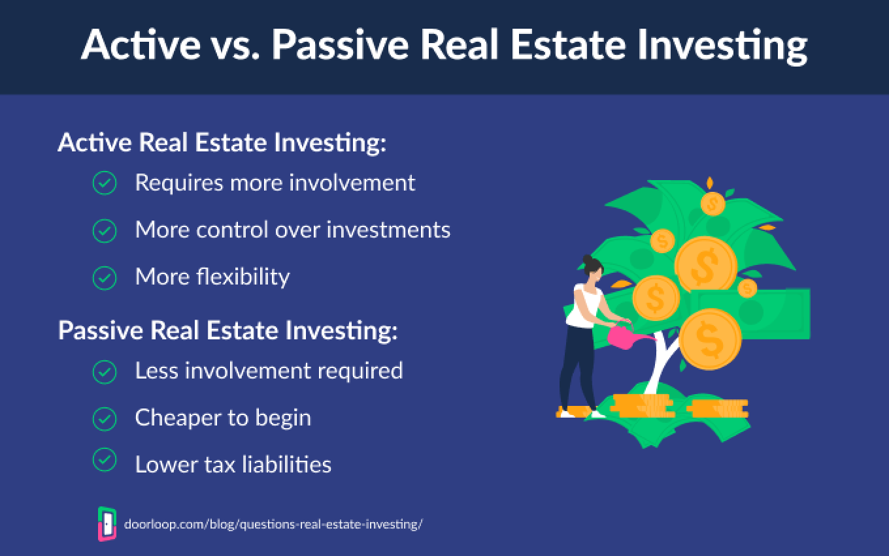

## Table of Contents

## What is investment real estate?

Investment real estate is when you buy property to make money from it, not to live in it yourself. People buy these properties to rent them out to others, sell them later for a higher price, or use them in other ways to earn income. It's different from buying a home to live in because the main goal is to make a profit.

There are different types of investment real estate. Some people buy houses or apartments to rent to tenants. Others might buy commercial buildings like offices or stores. Some investors even buy land, hoping its value will go up over time. Each type has its own risks and rewards, so it's important to understand them before investing.

Making money from investment real estate can be good, but it's not always easy. You need to think about things like how much it costs to buy and fix up the property, how much rent you can charge, and what might happen to property values in the future. It's a good idea to do a lot of research and maybe talk to experts before you start.

## What are the different types of investment real estate?

Investment real estate can be broken down into several different types. One common type is residential real estate, where people buy houses, apartments, or condos to rent out to others. This can be a good way to earn regular income because there's always a need for places for people to live. Another type is commercial real estate, which includes buildings used for businesses like offices, stores, or warehouses. These can be more expensive to buy but might bring in more rent because businesses can pay more than individual tenants.

Another type of investment real estate is industrial real estate, which involves properties used for manufacturing, storage, or distribution. These can be large buildings or land used for specific industrial purposes. Then there's land investment, where people buy empty land hoping its value will go up over time or that they can develop it later. Finally, there's also something called a real estate investment trust (REIT), which is like a company that owns or finances income-generating real estate and lets investors buy shares in it, making it easier to invest in real estate without buying property directly.

Each type of investment real estate has its own benefits and risks. Residential properties might be easier to understand and manage, but they can also be affected by local economic conditions and tenant turnover. Commercial and industrial properties might offer higher returns, but they can be more complex to manage and require a bigger initial investment. Land investments can be very profitable if the area develops, but it can take a long time to see any return. REITs offer a way to diversify your investment and receive regular dividends, but their performance can be influenced by the overall real estate market and the management of the trust.

## How does investment real estate generate income?

Investment real estate can make money in a few ways. One way is through rental income. When you own a property, you can rent it out to people or businesses. They pay you rent every month, which gives you a steady flow of money. This is common with houses, apartments, and commercial buildings. The more you can charge for rent, the more income you can make. But you also have to think about costs like repairs, taxes, and insurance, which can take away from your profits.

Another way to make money is by selling the property for more than you paid for it. This is called capital appreciation. If you buy a property and its value goes up over time, you can sell it at a higher price and make a profit. This often happens with land or properties in areas that are growing or becoming more popular. But it's not guaranteed, and it can take a long time before you see any money from selling.

There's also a way to make money through real estate investment trusts (REITs). When you invest in a REIT, you're buying shares in a company that owns or finances real estate. The company makes money from rents and property sales, and it shares that money with its investors as dividends. This can be a good way to earn income without having to manage properties yourself. But the amount of money you make can go up and down based on how well the REIT is doing and what's happening in the real estate market.

## What are the initial costs associated with investing in real estate?

When you start investing in real estate, there are a lot of costs you need to think about right from the beginning. The biggest cost is usually the down payment on the property. This is the money you pay upfront to buy the property, and it can be a big chunk of the total price. You might need to borrow the rest of the money through a mortgage, which will come with its own costs like interest and fees. You also need to pay for things like property inspections to make sure the place is in good shape, and appraisals to figure out how much the property is worth.

On top of the down payment and mortgage costs, there are other expenses you'll have to deal with. You'll need to pay closing costs, which are fees for things like legal services, title insurance, and other paperwork needed to finish the purchase. If the property needs repairs or upgrades before you can rent it out or sell it, you'll have to pay for those too. And don't forget about ongoing costs like property taxes, insurance, and maybe even maintenance or management fees if you hire someone to help you take care of the property.

All these costs can add up quickly, so it's important to plan carefully and make sure you have enough money to cover everything before you start investing in real estate. It's not just about the price of the property itself; you need to think about all the other expenses that come with it.

## What are the tax benefits of investing in real estate?

Investing in real estate can give you some good tax benefits. One big benefit is that you can deduct a lot of the costs of owning and managing a property from your taxes. This includes things like mortgage interest, property taxes, insurance, and even the cost of repairs and maintenance. If you're renting out the property, you can also deduct expenses like advertising for tenants and management fees. All these deductions can lower the amount of income you have to pay taxes on, which means you get to keep more of your money.

Another tax benefit is called depreciation. This lets you write off the cost of the building (but not the land) over time, usually over 27.5 years for residential properties and 39 years for commercial ones. Depreciation can help reduce your taxable income even more, even if the property is actually going up in value. And if you sell a property for more than you paid for it, you might be able to use a strategy called a 1031 exchange to swap it for another property without paying taxes on the profit right away. These tax benefits can make investing in real estate a smart move for your wallet.

## How can leverage be used in real estate investment?

Leverage in real estate means using borrowed money to buy a property. Instead of paying for the whole property yourself, you can take out a loan, like a mortgage, to cover part of the cost. This lets you control a bigger investment with less of your own money. For example, if you put down 20% of the price of a house and borrow the other 80%, you're using leverage. If the value of the house goes up, you can make a bigger profit because you only used a small part of your own money to buy it.

But leverage can be risky too. If the value of the property goes down, you could end up owing more on the loan than the property is worth. Plus, you have to make regular payments on the loan, which can be hard if you don't have enough rental income coming in. So, while leverage can help you make more money, it also means you could lose more if things don't go as planned. It's important to think carefully about how much debt you're comfortable with before using leverage in real estate investing.

## What are the key advantages of investing in real estate over other investment types?

One big advantage of investing in real estate is that it can give you a steady income from rent. Unlike stocks or bonds, where your money might go up and down a lot, rental income can be more predictable. This can help you plan your finances better. Plus, real estate can go up in value over time, which means you might be able to sell it later for more than you paid. This is called capital appreciation, and it's another way to make money from real estate. Also, real estate can be a good way to spread out your investments. If you have all your money in one type of investment and it does badly, you could lose a lot. But if you have some money in real estate, it can help balance out other investments that might be riskier.

Another advantage is the tax benefits you can get from real estate. You can deduct a lot of the costs of owning and managing a property from your taxes, like mortgage interest, property taxes, and repairs. This can lower the amount of income you have to pay taxes on. Plus, there's something called depreciation, which lets you write off the cost of the building over time, even if it's going up in value. This can help you save even more on taxes. And if you sell a property for a profit, you might be able to use a 1031 exchange to swap it for another property without paying taxes on the profit right away. These tax benefits can make real estate a smart choice for your money.

## What are the common risks associated with real estate investment?

Investing in real estate can be risky because property values can go up and down. If you buy a property and its value goes down, you might lose money if you have to sell it. This can happen because of things like a bad economy, too many people selling properties at the same time, or changes in the neighborhood. Also, if you use borrowed money to buy a property, you could end up owing more than the property is worth if its value drops. This is called being "underwater" on your loan, and it can be a big problem if you can't make your loan payments.

Another risk is that you might not be able to find tenants to rent your property. If you can't rent it out, you won't have any rental income to help pay for things like your mortgage, taxes, and repairs. This can make it hard to keep up with your costs. Plus, being a landlord can be a lot of work. You might have to deal with tenants who don't pay rent on time, damage the property, or cause other problems. All these things can make real estate investing more challenging and stressful than other types of investments.

## How does market analysis impact real estate investment decisions?

Market analysis is really important when you're thinking about investing in real estate. It helps you understand what's going on in the area where you want to buy a property. You look at things like how much people are paying for rent, how fast properties are selling, and what kinds of jobs and businesses are in the area. This information can tell you if it's a good time to buy a property or if you should wait. For example, if lots of people are moving into an area and there aren't enough places for them to live, you might be able to charge more rent and make more money.

But market analysis can also show you the risks. If the economy in the area is doing badly, or if a lot of people are leaving, property values might go down. This could mean you lose money if you have to sell your property. Also, if there are a lot of empty buildings or if new buildings are being built, it might be harder to find tenants to rent your property. So, by doing a good market analysis, you can make smarter choices about where and when to invest your money in real estate.

## What strategies can be used to mitigate risks in real estate investment?

One way to lower the risks of investing in real estate is by doing a lot of research before you buy a property. This means looking at the local market to see if property values are going up or down, checking how easy it is to find tenants, and understanding the economy in the area. By knowing these things, you can pick a property that is more likely to make you money. Another good strategy is to have enough money saved up to cover costs like repairs, taxes, and times when you might not have a tenant. This can help you keep paying your mortgage even if things don't go as planned.

Another strategy is to spread out your investments, which means not putting all your money into just one property. If you have several properties in different areas, or if you also invest in other things like stocks or bonds, you can balance out the risks. If one investment does badly, the others might do well and help you stay financially stable. Also, using a real estate investment trust (REIT) can be a safer way to invest in real estate because you don't have to manage the properties yourself, and you can still get regular income from dividends.

## How do interest rates affect real estate investment?

Interest rates have a big impact on real estate investment. When interest rates are low, it's usually cheaper to borrow money to buy a property. This means you can get a mortgage with lower monthly payments, which makes it easier to afford a property. More people might want to buy homes or invest in real estate when rates are low, which can drive up property values. But if you're planning to rent out the property, low interest rates might not be as good for you because more people can afford to buy their own homes instead of renting.

On the other hand, when interest rates go up, borrowing money becomes more expensive. This can make it harder to get a mortgage because the monthly payments will be higher. Fewer people might want to buy homes, which can cause property values to go down. If you already own a property and are renting it out, higher interest rates might not affect you as much because you can still charge rent. But if you need to sell the property, you might not get as much money for it as you would when rates were lower. So, keeping an eye on interest rates can help you make better decisions about when to buy or sell real estate.

## What advanced techniques can be used to maximize returns from real estate investments?

One advanced technique to maximize returns from real estate investments is through value-add strategies. This means buying properties that need some work, like fixing them up or making them better, and then renting them out for more money or selling them for a higher price. For example, you could buy an old apartment building, update the kitchens and bathrooms, and add new amenities like a gym or a pool. After the improvements, you can charge higher rent because tenants are willing to pay more for a nicer place. This can boost your income and the value of the property, leading to bigger profits when you sell it.

Another technique is to use leverage smartly. Instead of using all your money to buy one property, you can borrow money to buy several properties. This way, you can spread out your investments and possibly make more money from different properties. But you need to be careful because borrowing money means you have to pay it back with interest. If you do it right, though, you can use the rental income from all your properties to pay off the loans and still have money left over. This can help you grow your real estate portfolio faster and increase your returns over time.

A third technique involves using real estate investment trusts (REITs) and other real estate funds to diversify your investments. By investing in a REIT, you can own a piece of a large portfolio of properties without having to manage them yourself. This can give you regular income from dividends and help you spread out your risk. Additionally, you can look into real estate crowdfunding platforms, which let you invest in real estate projects with other people. This can give you access to bigger and more profitable deals that you might not be able to afford on your own. By using these advanced techniques, you can work towards maximizing your returns from real estate investments.

## References & Further Reading

[1]: Bergstra, J., Bardenet, R., Bengio, Y., & Kégl, B. (2011). ["Algorithms for Hyper-Parameter Optimization."](https://dl.acm.org/doi/10.5555/2986459.2986743) Advances in Neural Information Processing Systems 24.

[2]: ["Advances in Financial Machine Learning"](https://www.amazon.com/Advances-Financial-Machine-Learning-Marcos/dp/1119482089) by Marcos Lopez de Prado

[3]: ["Evidence-Based Technical Analysis: Applying the Scientific Method and Statistical Inference to Trading Signals"](https://www.amazon.com/Evidence-Based-Technical-Analysis-Scientific-Statistical/dp/0470008741) by David Aronson

[4]: ["Machine Learning for Algorithmic Trading"](https://github.com/stefan-jansen/machine-learning-for-trading) by Stefan Jansen

[5]: ["Quantitative Trading: How to Build Your Own Algorithmic Trading Business"](https://www.amazon.com/Quantitative-Trading-Build-Algorithmic-Business/dp/1119800064) by Ernest P. Chan