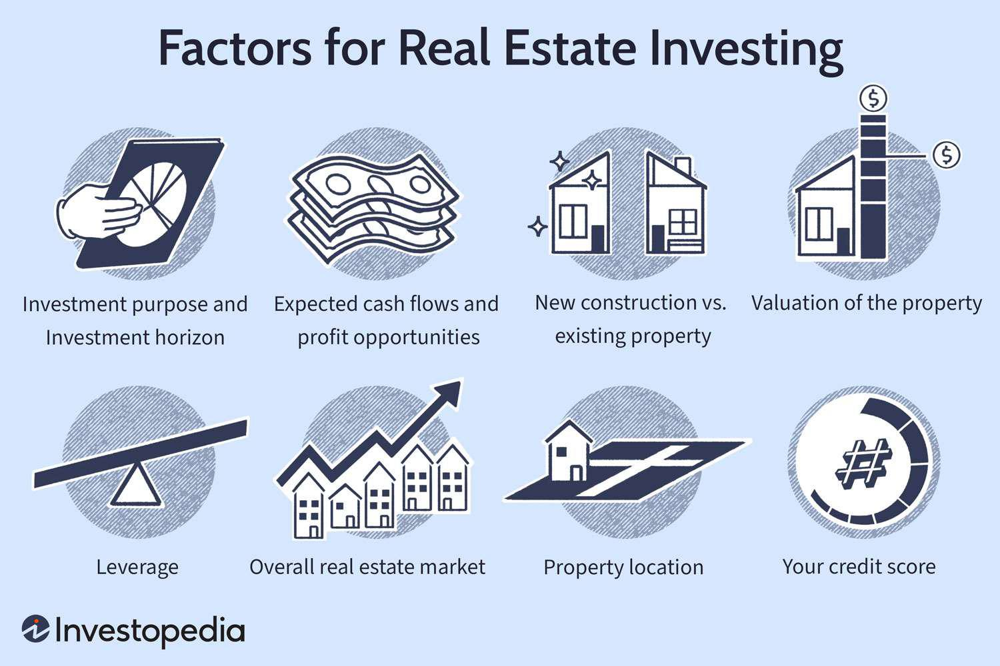

Real estate investment offers a compelling option for diversifying an investment portfolio, providing a mix of stability and potential for appreciation. This investment avenue traditionally involves purchasing, owning, and managing properties or assets linked to the real estate sector. These assets can include residential and commercial properties, as well as Real Estate Investment Trusts (REITs), each providing varying returns and risk levels. The convergence of investment capital with algorithmic trading technologies is reshaping how investors engage with real estate markets. Algorithmic trading, already a staple in financial markets, brings automation and data analytics to real estate, creating innovative ways to enhance investment returns and streamline decision-making processes.

Introducing algorithmic trading into the real estate sector unveils new strategies for optimizing returns. Algorithms, equipped with the capacity to process vast swathes of market data, can identify trends and potential investment opportunities that might elude traditional analysis. This capability enables investors to make informed and timely decisions, thus optimizing their investment strategies and outcomes. By leveraging algorithmic technology, investors stand to benefit from a more precise and expedited approach to identifying lucrative opportunities within the highly dynamic real estate market.



This article provides insights into how the amalgamation of real estate investment and algorithmic trading begins a transformative journey. Readers will gain an understanding of the dynamic interplay between these components and recognize the practical benefits that arise. By the end, investors should appreciate how algorithms can exponentially enhance real estate investment returns, providing a robust framework for navigating and thriving in today's complex financial landscape.

## Table of Contents

## Understanding Real Estate Investment

Real estate investment can be categorized into three primary types: residential properties, commercial properties, and Real Estate Investment Trusts (REITs). Each category has distinct characteristics, risk-reward profiles, and managerial requirements.

Residential real estate comprises single-family homes, apartments, and condominiums. It typically provides steady cash flow through rental income, is relatively stable in terms of market volatility, and often benefits from property appreciation over time. However, managing residential properties involves dealing with tenants, maintenance issues, and potential vacancy periods, which can affect the overall return on investment.

Commercial real estate includes office buildings, retail spaces, industrial warehouses, and more. This category generally offers higher potential returns compared to residential real estate, attributed to longer lease agreements and the potential for business growth in thriving economic areas. Nevertheless, commercial properties come with higher risks, such as susceptibility to economic downturns affecting tenancy rates and rental income stability. The management of commercial properties often requires specialized knowledge and professional services, making it imperative for investors to understand market trends and tenant demands.

Real Estate Investment Trusts (REITs) are companies that own, operate, or finance income-producing real estate across various sectors. REITs provide a way for individual investors to earn a share of the income produced through commercial real estate ownership, without actually having to buy, manage, or finance any properties themselves. They offer [liquidity](/wiki/liquidity-risk-premium) similar to stocks and are required by law to distribute at least 90% of their taxable income as dividends to shareholders, making them an attractive option for income-seeking investors. However, REITs are subject to market risks similar to equities and can be influenced by interest rates and economic factors.

Understanding the fundamentals of real estate investing is essential to making informed investment decisions. Key considerations include the role of rental income, property appreciation, and tax benefits. Rental income provides an ongoing cash flow, which is crucial for covering expenses and realizing profits. Property appreciation contributes to capital growth, offering potential long-term wealth accumulation. Tax benefits, such as deductions for mortgage interest, depreciation, and property taxes, can significantly enhance returns by reducing the overall tax burden.

For those beginning their real estate investment journey, it is essential to assess personal financial situations, understand market conditions, and develop a strategic investment plan. Investors should consider factors like location, property type, financing options, and [exit](/wiki/exit-strategy) strategies. Engaging with real estate professionals, conducting due diligence, and staying informed about market trends are vital steps in building a successful real estate investment portfolio. By aligning investment strategies with individual goals and risk tolerances, investors can optimize their returns and achieve financial growth through real estate.

## Algorithmic Trading in Real Estate

Algorithmic trading introduces a level of automation and data-driven insights that can significantly enhance real estate investing. By utilizing sophisticated algorithms, investors can analyze vast datasets to identify market trends and optimize investment decisions, thus surpassing traditional methods reliant on manual analysis and intuition.

The application of algorithms in real estate involves the synthesis of numerous data points, such as property prices, interest rates, demographic trends, and other economic indicators. By processing this information, these algorithms can predict market movements and valuation changes with greater accuracy. The incorporation of [machine learning](/wiki/machine-learning) techniques further refines this predictive accuracy, augmenting investment efficiency. Machine learning models can adapt to new data, recognizing patterns and correlations that may not be immediately evident to human analysts.

For instance, a Python program can be employed to demonstrate how algorithms facilitate real estate analysis. Python's robust libraries, such as pandas for data manipulation, scikit-learn for machine learning, and matplotlib for data visualization, provide a comprehensive toolkit for developing these predictive models. An example script might involve loading a dataset of historical real estate prices, training a machine learning model to predict future prices, and visualizing the predictions:

```python
import pandas as pd
from sklearn.model_selection import train_test_split
from sklearn.ensemble import RandomForestRegressor
import matplotlib.pyplot as plt

# Load dataset
data = pd.read_csv('real_estate_data.csv')

# Prepare data
X = data.drop('Price', axis=1)
y = data['Price']
X_train, X_test, y_train, y_test = train_test_split(X, y, test_size=0.2, random_state=42)

# Train model
model = RandomForestRegressor(n_estimators=100, random_state=42)
model.fit(X_train, y_train)

# Predict and visualize
predictions = model.predict(X_test)
plt.scatter(y_test, predictions)
plt.xlabel('Actual Prices')
plt.ylabel('Predicted Prices')
plt.title('Actual vs Predicted Real Estate Prices')
plt.show()
```

Proptech, or property technology, is revolutionizing the manner in which real estate data is processed and acted upon. This domain encompasses a range of technologies, from virtual reality and blockchain to advanced analytics. Proptech solutions harness data analytics to streamline property management, enhance tenant services, and refine market predictions. As these technologies evolve, they promise to enhance the speed and precision of real estate transactions, potentially transforming the market landscape.

## Benefits of Combining Real Estate and Algorithmic Trading

Combining real estate investment with [algorithmic trading](/wiki/algorithmic-trading) offers numerous benefits, significantly transforming how investment decisions are evaluated and executed. Algorithmic trading enhances efficiency and speed, allowing investors to process substantial volumes of data in real-time. This capability is crucial for identifying trends and patterns that may not be readily apparent through manual analysis.

Automated processes significantly reduce human error, a major advantage in a field where precision is key. By leveraging algorithms, investors can implement strategies based on consistent logic and objective data analysis, thereby minimizing emotional biases and inaccuracies inherent in human decision-making.

Furthermore, algorithmic trading heightens risk management through the use of predictive models and data analytics. Sophisticated algorithms can analyze historical data alongside current market conditions to forecast future trends with greater accuracy. This predictive capability allows investors to anticipate market shifts and adjust strategies accordingly, thereby mitigating potential risks.

Identifying undervalued properties and market inefficiencies becomes more feasible with algorithmic tools. These tools can swiftly process vast datasets, enabling the detection of anomalies and value opportunities in property markets. For instance, machine learning algorithms trained on features such as location trends, economic indicators, and property characteristics can highlight investment prospects before they have been recognized by the broader market.

The automation of trading also has a profound impact on transaction costs and investment optimization. By executing trades at optimal times based on algorithmic signals, investors can maximize returns and minimize costs associated with timing inefficiencies. This systematic approach can also streamline back-office operations, reducing operational costs and enhancing the overall profitability of investment portfolios.

In summary, the integration of algorithmic trading with real estate investment not only streamlines decision-making processes and minimizes errors but also enhances risk management and uncovers hidden market opportunities. This fusion of technology and investment expertise provides a competitive edge in maximizing returns and optimizing asset management.

## Risks and Challenges

Market [volatility](/wiki/volatility-trading-strategies) poses significant challenges to real estate investment, as it can lead to fluctuations in property values and rental income. The dynamic nature of real estate markets can result in periods of rapid price appreciation followed by sharp declines, affecting the returns on investment. In turbulent market conditions, investors may find it challenging to accurately predict future values and make informed decisions.

Technical risks are inherent in the algorithmic trading systems employed in real estate. Algorithm implementation can face issues such as code bugs, data inaccuracies, and system failures. An error in programming logic, for example, can lead to incorrect decision-making and financial loss. Additionally, improper management of algorithmic tools may result in phishing attempts and cyber threats, as these systems often deal with sensitive financial data.

Maintaining liquidity is crucial in managing unexpected market shifts, ensuring that investors can quickly respond to changing market conditions. During periods of market instability, liquidity allows investors to pivot strategies, such as buying undervalued properties or selling assets to prevent losses. However, inadequate liquidity can lead to forced sales at unfavorable prices, further exacerbating financial challenges.

Over-reliance on technology can be detrimental. While algorithms provide valuable insights, exclusive dependence might lead investors to ignore qualitative factors such as neighborhood trends, property conditions, and changes in local regulations. Human insight remains essential in interpreting data outputs and making holistic investment decisions.

To mitigate these risks, investors should engage in extensive research and seek expert guidance. Regularly auditing and testing algorithms can help identify and rectify potential flaws. Establishing a robust data management framework, including data validation and security measures, is vital to minimize technical risks. Moreover, blending algorithmic analysis with human expertise ensures a comprehensive evaluation of qualitative aspects. Rigorous market research, coupled with advice from industry experts, can provide safeguards against unforeseen challenges, ultimately enhancing the resilience of real estate investment strategies.

## Conclusion

Real estate investment, augmented by algorithmic trading strategies, can lead to considerable returns. By integrating traditional investment practices with cutting-edge technology, investors create a dynamic framework capable of adapting to various market scenarios. This hybrid approach allows for more precise data analysis, uncovering patterns and opportunities that might otherwise remain hidden. As the complexity of financial markets increases, the synergy between human intuition and algorithmic precision becomes essential.

Traditional real estate investments rely heavily on factors such as location, property condition, and market demand. While these remain important, the introduction of algorithmic trading offers a powerful toolset to analyze large datasets, forecast trends, and enhance decision-making processes. Algorithms, particularly those enhanced by machine learning, provide actionable insights that can significantly influence portfolio strategy and optimization.

For instance, predictive models can evaluate numerous market variables in real-time, rapidly adapting to new conditions. This capability not only enhances investment returns but also reduces exposure to risk. Investors benefit from a comprehensive understanding of market dynamics, enabling them to identify undervalued properties and capitalize on inefficiencies with greater accuracy.

The ongoing evolution of technology in real estate suggests a strong future for data-driven investment approaches. Embracing these innovations allows investors to remain competitive and responsive to changing market conditions. However, balancing technological reliance with human judgment is crucial to avoid potential pitfalls and leverage qualitative insights effectively.

Ultimately, the successful integration of algorithmic trading into real estate investment depends on the willingness to adopt new methodologies while maintaining an understanding of traditional market tenets. As the industry progresses, those capable of synthesizing these elements will likely see enhanced wealth creation opportunities and sustained success.

## References & Further Reading

### References & Further Reading

1. **Books**: Several books provide foundational knowledge and advanced insights into real estate investing and algorithmic trading. "The Millionaire Real Estate Investor" by Gary Keller offers an in-depth understanding of real estate principles. For those interested in algorithmic trading, "Algorithmic Trading: Winning Strategies and Their Rationale" by Ernest P. Chan provides a comprehensive guide to trading systems and quantitative strategies.

2. **Articles and Research Papers**: Reading scholarly articles can enhance understanding. For instance, the Journal of Real Estate Research frequently publishes papers on market trends and investment strategies. Similarly, the Journal of Trading features articles that explain the technical aspects and innovations in algorithmic trading.

3. **Online Courses**: Platforms like Coursera and Udemy offer courses such as "Introduction to Real Estate Investments" and "Algorithmic Trading in Financial Markets". These courses, often taught by industry professionals, allow for flexible learning and often include practical exercises.

4. **Industry Expert Insights**: Engaging with content from renowned industry experts can provide unique perspectives. Websites like Investopedia and Bloomberg regularly feature insights from top investors and traders about the current market environment and innovative trading techniques.

5. **Case Studies**: Reviewing case studies such as those found in Harvard Business Review can illustrate successful strategies applied in real-world scenarios. These studies often highlight both triumphs and challenges in combining real estate investments with algorithmic trading platforms.

6. **Community Forums and Networks**: Participation in forums and professional networks like BiggerPockets or Reddit's fintech threads can aid in staying updated on trends. These platforms facilitate interaction with a diverse group of professionals and enthusiasts, fostering knowledge exchange and networking opportunities.

7. **Technological Trends**: Staying informed about new technological methodologies is crucial. Websites like TechCrunch and Wired frequently cover advancements in proptech and fintech, offering insights into how technologies like AI and machine learning are transforming the financial and real estate sectors.

8. **Continuous Learning**: Subscribing to newsletters and journals such as the Financial Analysts Journal or the Wall Street Journal can be beneficial for continuous learning. These sources provide updates on the economic environment, market predictions, and analytical tool advancements, ensuring that one remains informed and prepared to adapt to evolving conditions.

By utilizing these resources, investors and traders can enrich their knowledge and strategies, leading to better decision-making and enhanced investment returns.

