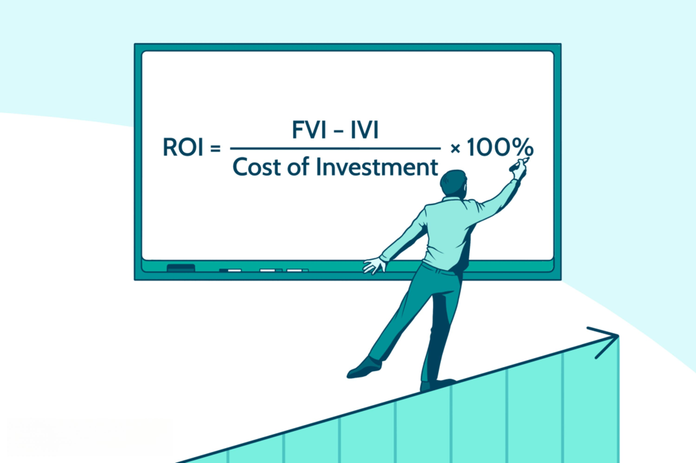

Investments aim to generate returns, and a thorough understanding of these returns is essential for both individual and institutional investors. This article focuses on calculating Return on Investment (ROI) and the specifics of investment returns, particularly linked to algorithmic trading. Algorithmic trading, often referred to as algo trading, involves using automated systems to execute trades based on a set of predefined criteria. This method has gained significant popularity in financial markets due to its efficiency and the ability to handle high volumes of trades swiftly.

The use of algorithmic trading necessitates a detailed comprehension of financial metrics, such as ROI, to accurately assess trade performance. ROI, as a measure of the profitability of investments, plays a pivotal role in evaluating how well an investment has performed compared to its cost. Understanding these calculations can help traders to optimize their strategies and improve overall performance. This article aims to assist investors in accurately calculating ROI for their investments in algorithmic trading, ensuring they utilize the most effective strategies for maximizing their returns.



## Table of Contents

## Understanding ROI in Financial Context

Return on Investment (ROI) represents a crucial profitability ratio employed to assess the performance of investments. The fundamental formula for calculating ROI is:

$$
\text{ROI} = \left( \frac{\text{Net Return}}{\text{Cost of Investment}} \right) \times 100\%
$$

This formula provides a straightforward means of understanding the gains or losses made relative to the initial investment cost. However, despite its apparent simplicity, ROI has inherent limitations. It does not [factor](/wiki/factor-investing) in the time duration over which the investment is held, which can lead to skewed analysis when comparing the performance of investments with varying time frames. For example, an investment that yields a 10% return over one year might be more advantageous than one that yields a 10% return over five years, but this distinction is not captured in the basic ROI calculation.

In the context of automated trading, ROI is invaluable in providing a quick assessment of the effectiveness of trading strategies. The rapid execution of trades and high trading volumes characteristic of algorithmic trading necessitate efficient monitoring of performance metrics such as ROI. By gauging ROI, traders can make informed decisions about adjusting their strategies to enhance profitability.

Understanding both the advantages and shortcomings of ROI is essential when applying it to financial markets. While ROI offers a simple and clear depiction of investment performance, it should be considered alongside other investment metrics to account for factors such as risk, investment periods, and market conditions. This comprehensive approach ensures a balanced evaluation, facilitating informed investment decisions.

## Calculating ROI: Methods and Formulas

Return on Investment (ROI) is a versatile financial metric that provides insights into the profitability of investments, including those in [algorithmic trading](/wiki/algorithmic-trading). The calculation of ROI is generally approached through two primary methods: the basic approach and annualized calculations. Each method serves its purpose, offering distinct advantages depending on the investment horizon and objectives.

The basic method for calculating ROI encompasses a straightforward formula: 

$$
\text{ROI} = \left( \frac{\text{Net Return}}{\text{Cost of Investment}} \right) \times 100\%
$$

In this formula, “Net Return” refers to the profit achieved from the investment after subtracting the initial costs, while “Cost of Investment” pertains to the total expense incurred to acquire the investment.

While simple, the basic ROI formula does not consider the duration over which the investment returns are realized. This omission can present challenges when comparing investments that span different time periods. To address this flaw, the annualized ROI calculation adjusts for the duration of the investment, enabling investors to make more accurate comparisons across different time frames.

The annualized ROI formula is expressed as:

$$
\text{Annualized ROI} = \left[ (1 + \text{ROI})^{\frac{1}{n}} - 1 \right] \times 100\%
$$

Here, $n$ represents the number of years the investment is held. The formula effectively transforms the ROI to reflect equivalent annual returns, offering a consistent basis for comparison.

In algorithmic trading, precise ROI calculations are particularly beneficial. They allow traders to assess the performance of specific trading algorithms over diverse time horizons, facilitating better decision-making processes. Algorithmic strategies that might initially appear profitable using basic ROI may reveal differing insights when annualized, thus guiding traders in optimizing their strategies.

Utilizing programming languages such as Python can further enhance the precision and efficiency of these calculations. Here is a simple implementation for calculating both basic and annualized ROI using Python:

```python
def calculate_roi(net_return, investment_cost):
    if investment_cost == 0:
        return None
    return (net_return / investment_cost) * 100

def calculate_annualized_roi(net_return, investment_cost, years_held):
    if investment_cost == 0 or years_held <= 0:
        return None
    basic_roi = calculate_roi(net_return, investment_cost)
    annualized_roi = ((1 + basic_roi / 100) ** (1 / years_held) - 1) * 100
    return annualized_roi

# Example usage
net_return = 5000
investment_cost = 20000
years_held = 2

basic_roi = calculate_roi(net_return, investment_cost)
annualized_roi = calculate_annualized_roi(net_return, investment_cost, years_held)

print(f"Basic ROI: {basic_roi}%")
print(f"Annualized ROI: {annualized_roi}%")
```

In summary, adopting both the basic and annualized ROI methods provides a comprehensive view of investment performance. In the competitive landscape of algorithmic trading, such insights are vital for evaluating the robustness of trading algorithms across multiple periods, ultimately aiding in the optimization of investment strategies.

## The Role of ROI in Algo Trading

In algorithmic trading, the Return on Investment (ROI) is a critical performance indicator used to evaluate the efficacy of trading strategies. The rapid speed and high [volume](/wiki/volume-trading-strategy) of trades characteristic of algo trading necessitate tools that can quickly assess the profitability of these strategies. ROI serves this purpose effectively, allowing traders to swiftly gauge financial outcomes and adjust strategies where necessary.

In considering ROI, investors must account for both the net returns and the related trading expenses to gain a complete understanding of their investments' effectiveness. Costs such as brokerage fees, slippage, and other transaction-related expenses can significantly impact net returns, thereby affecting ROI calculations. A comprehensive evaluation requires the subtraction of these costs from gross returns before dividing by the initial investment amount and multiplying by 100 to get a percentage value:

$$
\text{ROI} = \left( \frac{\text{Gross Returns} - \text{Trading Costs}}{\text{Cost of Investment}} \right) \times 100\%
$$

Moreover, to assess performance accurately, ROI should be examined alongside other financial metrics like the Sharpe Ratio and R-squared. The Sharpe Ratio, for instance, measures the risk-adjusted return by considering the [volatility](/wiki/volatility-trading-strategies) of returns, while R-squared provides insight into how much of the investment's return can be attributed to market movements versus specific trading strategies.

Regular monitoring of ROI is crucial in algo trading as it can signal the need for strategy adjustments. Performance indicators like ROI can prompt traders to tweak algorithms to enhance profitability and adapt to the ever-changing market conditions. The dynamic nature of the financial markets, coupled with the speed of algorithmic trading, makes it imperative for traders to remain agile and responsive to their ROI metrics, ensuring that the employed strategies continue to deliver optimal returns.

In a Python-based trading environment, algorithmic traders can leverage libraries such as NumPy and pandas to compute these metrics efficiently, incorporating them into their trading systems for real-time analysis and decision-making. This integration not only facilitates better-informed trading choices but also contributes to the continuous refinement of trading strategies, thereby maximizing the potential ROI.

## Leveraging Technology for Better ROI Calculations

Advanced analytics and trading platforms have significantly streamlined the process of calculating Return on Investment (ROI) and other financial metrics in real-time, providing traders with the tools necessary for quick and precise decision-making. These platforms, with their automated capabilities, can integrate multiple factors affecting ROI calculations such as transaction costs, slippage, and price drift. Slippage refers to the difference between the expected price of a trade and the actual price at which the trade is executed, while price drift denotes the gradual change in a stock's price which can impact the final ROI.

Modern algo trading platforms often facilitate these calculations with pre-built features that simplify the process for traders. The use of [backtesting](/wiki/backtesting), a technique to assess the viability of trading strategies using historical data, allows traders to optimize their algorithms before deploying them in live markets. Backtesting ensures that the strategies are not only theoretically sound but can also generate favorable returns under historical market conditions.

Implementing Python algorithms, for instance, can make the process more efficient. Consider the following Python snippet which demonstrates a simple backtesting strategy for evaluating ROI:

```python
def calculate_roi(net_profit, investment_cost):
    roi = (net_profit / investment_cost) * 100
    return roi

# Sample data
historical_prices = [100, 105, 110, 102, 108]  # Example price data
investment_cost = 100  # Initial investment

# Calculate net profit using historical prices
net_profit = historical_prices[-1] - investment_cost

# Calculate ROI
roi = calculate_roi(net_profit, investment_cost)
print(f"ROI: {roi}%")
```

This script provides a simple framework for calculating the ROI by taking into account the net profit from past price data. Advanced analytics can further enhance these calculations by integrating complex data sets and adjusting for various market conditions, allowing for continuous improvements in trading strategies.

Platforms that integrate such technology offer traders the ability to monitor ROI metrics in real-time, ensuring they can adapt swiftly to evolving market conditions. With features like ROI calculators readily available, traders can enhance their decision-making processes, reduce execution errors, and maintain profitability across their trading activities. Leveraging these technologies effectively provides traders with a significant competitive edge, helping them navigate the dynamic and fast-paced environment of algo trading successfully.

## Conclusion

Return on Investment (ROI) plays a pivotal role in evaluating the performance and profitability of investments, particularly in algorithmic trading. Understanding how to calculate and interpret ROI is crucial for traders aiming to make strategic decisions that maximize returns. By leveraging this knowledge, investors can fine-tune their trading algorithms to enhance profitability.

The adoption of advanced trading tools and technologies significantly boosts the ability to monitor and optimize ROI. These tools facilitate real-time tracking of financial metrics, integrating factors such as transaction costs and market fluctuations seamlessly into ROI calculations. This technological synergy ensures that investors maintain a competitive edge by continually refining their strategies based on comprehensive data analysis.

A comprehensive grasp of ROI contributes to successful investment management. It serves not only as a measure of past performance but also as a predictive tool for future decisions. As financial markets are dynamic and continually evolving, staying informed about financial metrics is imperative for investors to adapt and thrive. Continuous education and awareness of such metrics ensure that investors are well-equipped to navigate the complexities of modern financial markets efficiently.

In summary, understanding ROI is indispensable for investors, underpinning strategic planning and execution. Mastery of this metric supports informed decision-making and fosters sustainable investment growth in the competitive landscape of algorithmic trading.

## References & Further Reading

[1]: Bergstra, J., Bardenet, R., Bengio, Y., & Kégl, B. (2011). ["Algorithms for Hyper-Parameter Optimization."](https://papers.nips.cc/paper/4443-algorithms-for-hyper-parameter-optimization) Advances in Neural Information Processing Systems 24.

[2]: ["Advances in Financial Machine Learning"](https://www.amazon.com/Advances-Financial-Machine-Learning-Marcos/dp/1119482089) by Marcos Lopez de Prado

[3]: ["Evidence-Based Technical Analysis: Applying the Scientific Method and Statistical Inference to Trading Signals"](https://www.amazon.com/Evidence-Based-Technical-Analysis-Scientific-Statistical/dp/0470008741) by David Aronson

[4]: ["Machine Learning for Algorithmic Trading"](https://github.com/stefan-jansen/machine-learning-for-trading) by Stefan Jansen

[5]: ["Quantitative Trading: How to Build Your Own Algorithmic Trading Business"](https://www.amazon.com/Quantitative-Trading-Build-Algorithmic-Business/dp/1119800064) by Ernest P. Chan