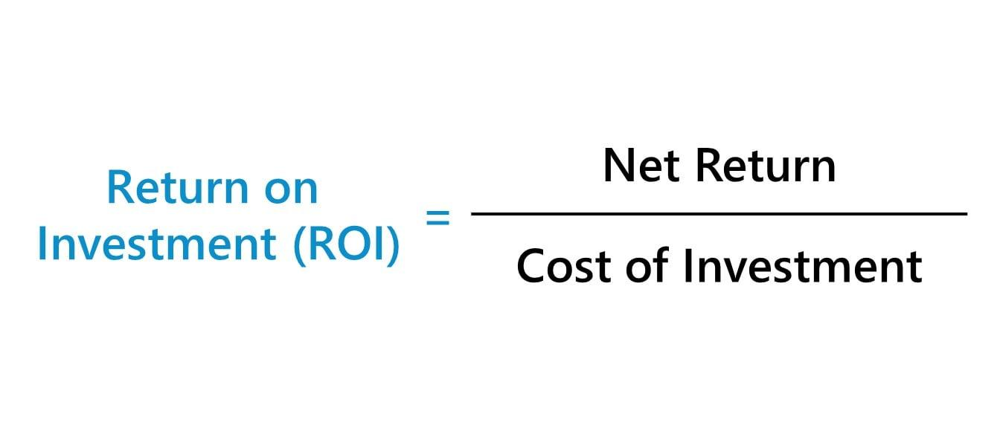

## Table of Contents

## What is investment return?

Investment return is the money you earn or lose from an investment over time. When you invest in something like stocks, bonds, or real estate, you hope that the value of your investment will grow. If the value goes up, you make a profit. If it goes down, you lose money. The return is usually shown as a percentage, which tells you how much your investment has grown or shrunk compared to what you originally put in.

There are different ways to measure investment return. The most common is the total return, which includes any interest, dividends, and changes in the price of the investment. For example, if you buy a stock and it pays dividends, those dividends are part of your total return. Another way to measure return is the annualized return, which shows the average yearly growth of your investment. Understanding these different measures can help you see how well your investments are doing over time.

## Why is calculating investment return important?

Calculating investment return is important because it helps you see if your investments are doing well or not. When you know the return, you can tell if you're making money or losing it. This is useful because it lets you decide if you should keep your money in the same investment or move it somewhere else that might give you a better return.

Knowing the return also helps you plan for the future. If you're saving for something like buying a house or retiring, you need to know how much your investments will grow. By looking at the returns, you can figure out if you're on track to reach your goals or if you need to save more or invest differently. This way, you can make smarter choices about your money.

## What is the difference between simple and compound interest?

Simple interest is interest that you earn only on the original amount of money you put in, which we call the principal. For example, if you put $100 in a bank account that gives you 5% simple interest every year, you will earn $5 each year. No matter how many years go by, you always earn interest only on that $100, so the interest you get stays the same every year.

Compound interest is different because it's interest that you earn on both the principal and any interest you've already earned. Using the same example, if you put $100 in a bank account with 5% compound interest, after the first year, you'll have $105. In the second year, you'll earn interest on $105, not just the original $100. So, you'll earn a bit more than $5 the second year, and this keeps growing over time. This makes compound interest grow faster than simple interest, especially over many years.

## How do you calculate the simple return on an investment?

To calculate the simple return on an investment, you take the amount of money you made or lost and divide it by the amount of money you started with. Then, you multiply that number by 100 to turn it into a percentage. For example, if you bought a stock for $100 and sold it for $120, you made $20. So, the simple return would be ($20 / $100) * 100, which equals 20%.

This method is good for looking at how an investment did over a short time. It's easy to understand and use. But it doesn't take into account things like how long you held the investment or any money you got along the way, like dividends. For a fuller picture, you might want to look at other ways to measure returns, but simple return is a good start.

## What is the formula for calculating compound interest?

The formula for calculating compound interest is A = P(1 + r/n)^(nt). In this formula, 'A' is the amount of money you end up with, 'P' is the principal or the amount of money you start with, 'r' is the yearly [interest rate](/wiki/interest-rate-trading-strategies) written as a decimal, 'n' is the number of times the interest is compounded each year, and 't' is the number of years you keep the money in the investment.

Let's break it down with a simple example. If you put $1,000 into an account with a 5% yearly interest rate, compounded monthly, for 10 years, you would use the formula like this: A = 1000(1 + 0.05/12)^(12*10). When you do the math, you find out that at the end of 10 years, you would have about $1,647. This shows how compound interest can make your money grow over time, especially if you leave it in the account for many years.

## What is the time value of money and how does it affect investment returns?

The time value of money is the idea that money you have now is worth more than the same amount of money you will get in the future. This is because you can use money you have now to invest or spend it right away. If you invest it, you can earn interest or returns over time. So, getting $100 today is better than getting $100 in a year because you can make that $100 grow if you invest it now.

This idea affects investment returns because it helps you understand how much your investments will be worth in the future. When you look at an investment, you need to think about not just the return, but also when you will get that return. If you have to wait a long time to get your money back, it might not be as good as it seems because you could have used that money to make more money somewhere else. So, the time value of money helps you compare different investments and choose the ones that will give you the best return for your money over time.

## How can you use the annual percentage rate (APR) to compare different investments?

The annual percentage rate (APR) is a number that tells you how much interest you will pay or earn on money each year. It's like a yearly score for how good an investment is. When you want to compare different investments, you can look at their APRs to see which one gives you more money back each year. For example, if one investment has an APR of 5% and another has an APR of 3%, the first one is better because it gives you more money for every year you keep your money in it.

But remember, APR is just one part of the story. It doesn't tell you everything about an investment. Sometimes, other things like how long you have to keep your money in the investment or if there are any fees can make a big difference. So, while APR is a good way to start comparing investments, you should also look at these other things to make sure you pick the best one for you.

## What is the internal rate of return (IRR) and how is it used in investment analysis?

The internal rate of return (IRR) is a way to figure out how good an investment is by finding the interest rate that makes the money you get from the investment equal to the money you put into it. It's like a special percentage that shows you how much your investment is growing each year. If the IRR is higher than other ways you could use your money, like putting it in a savings account, then the investment might be a good choice.

People use IRR to compare different investments and see which one will give them the best return for their money. For example, if you're thinking about two different projects, you can calculate the IRR for each one. The project with the higher IRR is usually the better one because it means your money will grow faster. But remember, IRR has its limits. It assumes you can reinvest any money you get back at the same rate, which isn't always true. So, it's a helpful tool, but you should use it with other ways of looking at investments to make the best decision.

## How do inflation and taxes impact the real return on investments?

Inflation and taxes can lower the real return on your investments. Inflation means that over time, the price of things goes up. So, if your investment grows by 5% but inflation is also 5%, your money doesn't buy any more than it did before. This means your real return, or the actual increase in what you can buy with your money, is zero. Taxes also take a bite out of your returns. If you make money from an investment, you might have to pay taxes on that money. This means you get to keep less of what you earn, which lowers your real return.

To figure out the real return, you need to look at your investment's growth after inflation and taxes. For example, if your investment grows by 7% in a year, but inflation is 2% and you pay 20% in taxes on your gains, your real return is less than 7%. After inflation, your return is 5% (7% - 2%). Then, after taxes, you keep 80% of that 5%, which is 4%. So, your real return, after both inflation and taxes, is 4%. Understanding this helps you see how much your money is really growing and helps you make better choices about where to invest.

## What are the risks associated with different types of investments and how do they influence expected returns?

Different types of investments come with different levels of risk. Stocks, for example, can go up and down a lot in value, which makes them riskier than other investments like bonds. Bonds are usually more stable, but they might not grow as much as stocks. Real estate can be a good investment, but it can also be hard to sell quickly if you need your money back fast. And things like savings accounts or certificates of deposit (CDs) are very safe but usually don't give you much return. The riskier an investment is, the more money you might make, but you could also lose more.

The level of risk influences how much return you can expect from an investment. If an investment is very safe, like a savings account, you won't get a big return, but you're pretty sure you won't lose your money either. On the other hand, if you put your money in something riskier, like stocks, you might make a lot more money, but there's also a bigger chance you could lose some or all of it. So, when you're thinking about where to invest, you need to decide how much risk you're okay with and what kind of return you're looking for. It's all about finding the right balance between risk and reward for you.

## How can portfolio diversification affect the overall return on investment?

Portfolio diversification means spreading your money across different types of investments, like stocks, bonds, and real estate. When you do this, you're not putting all your eggs in one basket. If one type of investment goes down, the others might go up or stay the same, which can help protect your money. This can make your overall return more stable because you're not depending on just one thing to do well.

Diversification can affect your overall return in a good way. It might not make your money grow as fast as if you put it all in one thing that does really well, but it can help you avoid big losses. Over time, having a mix of different investments can lead to a smoother, more predictable return. This is because the ups and downs of different investments can balance each other out, giving you a better chance of reaching your financial goals without too much risk.

## What advanced metrics like Sharpe ratio or alpha can be used to assess investment performance?

The Sharpe ratio and alpha are two advanced metrics that help you see how well an investment is doing compared to the risk you're taking. The Sharpe ratio tells you how much return you're getting for the risk you're taking. It's like a score that shows if the extra return you're getting from an investment is worth the extra risk. A higher Sharpe ratio means you're getting more return for the risk you're taking, which is good. If you're comparing two investments, the one with the higher Sharpe ratio is usually better because it's giving you more bang for your buck.

Alpha, on the other hand, tells you how much better or worse an investment is doing compared to a benchmark, like a stock market index. If an investment has a positive alpha, it means it's doing better than the benchmark. A negative alpha means it's doing worse. Alpha is useful because it shows you if a fund manager or an investment strategy is really adding value. If you're looking at a mutual fund, for example, a positive alpha means the fund manager is [picking](/wiki/asset-class-picking) investments that are beating the market, which can be a good sign. Both the Sharpe ratio and alpha give you a deeper look into how an investment is performing, beyond just looking at the returns.

## What is the understanding of ROI in a financial context?

Return on Investment (ROI) represents a crucial profitability ratio employed to assess the performance of investments. The fundamental formula for calculating ROI is:

$$
\text{ROI} = \left( \frac{\text{Net Return}}{\text{Cost of Investment}} \right) \times 100\%
$$

This formula provides a straightforward means of understanding the gains or losses made relative to the initial investment cost. However, despite its apparent simplicity, ROI has inherent limitations. It does not [factor](/wiki/factor-investing) in the time duration over which the investment is held, which can lead to skewed analysis when comparing the performance of investments with varying time frames. For example, an investment that yields a 10% return over one year might be more advantageous than one that yields a 10% return over five years, but this distinction is not captured in the basic ROI calculation.

In the context of automated trading, ROI is invaluable in providing a quick assessment of the effectiveness of trading strategies. The rapid execution of trades and high trading volumes characteristic of algorithmic trading necessitate efficient monitoring of performance metrics such as ROI. By gauging ROI, traders can make informed decisions about adjusting their strategies to enhance profitability.

Understanding both the advantages and shortcomings of ROI is essential when applying it to financial markets. While ROI offers a simple and clear depiction of investment performance, it should be considered alongside other investment metrics to account for factors such as risk, investment periods, and market conditions. This comprehensive approach ensures a balanced evaluation, facilitating informed investment decisions.

## How do you calculate ROI using different methods and formulas?

Return on Investment (ROI) is a versatile financial metric that provides insights into the profitability of investments, including those in [algorithmic trading](/wiki/algorithmic-trading). The calculation of ROI is generally approached through two primary methods: the basic approach and annualized calculations. Each method serves its purpose, offering distinct advantages depending on the investment horizon and objectives.

The basic method for calculating ROI encompasses a straightforward formula: 

$$
\text{ROI} = \left( \frac{\text{Net Return}}{\text{Cost of Investment}} \right) \times 100\%
$$

In this formula, “Net Return” refers to the profit achieved from the investment after subtracting the initial costs, while “Cost of Investment” pertains to the total expense incurred to acquire the investment.

While simple, the basic ROI formula does not consider the duration over which the investment returns are realized. This omission can present challenges when comparing investments that span different time periods. To address this flaw, the annualized ROI calculation adjusts for the duration of the investment, enabling investors to make more accurate comparisons across different time frames.

The annualized ROI formula is expressed as:

$$
\text{Annualized ROI} = \left[ (1 + \text{ROI})^{\frac{1}{n}} - 1 \right] \times 100\%
$$

Here, $n$ represents the number of years the investment is held. The formula effectively transforms the ROI to reflect equivalent annual returns, offering a consistent basis for comparison.

In algorithmic trading, precise ROI calculations are particularly beneficial. They allow traders to assess the performance of specific trading algorithms over diverse time horizons, facilitating better decision-making processes. Algorithmic strategies that might initially appear profitable using basic ROI may reveal differing insights when annualized, thus guiding traders in optimizing their strategies.

Utilizing programming languages such as Python can further enhance the precision and efficiency of these calculations. Here is a simple implementation for calculating both basic and annualized ROI using Python:

```python
def calculate_roi(net_return, investment_cost):
    if investment_cost == 0:
        return None
    return (net_return / investment_cost) * 100

def calculate_annualized_roi(net_return, investment_cost, years_held):
    if investment_cost == 0 or years_held <= 0:
        return None
    basic_roi = calculate_roi(net_return, investment_cost)
    annualized_roi = ((1 + basic_roi / 100) ** (1 / years_held) - 1) * 100
    return annualized_roi

# Example usage
net_return = 5000
investment_cost = 20000
years_held = 2

basic_roi = calculate_roi(net_return, investment_cost)
annualized_roi = calculate_annualized_roi(net_return, investment_cost, years_held)

print(f"Basic ROI: {basic_roi}%")
print(f"Annualized ROI: {annualized_roi}%")
```

In summary, adopting both the basic and annualized ROI methods provides a comprehensive view of investment performance. In the competitive landscape of algorithmic trading, such insights are vital for evaluating the robustness of trading algorithms across multiple periods, ultimately aiding in the optimization of investment strategies.

## What is the Role of ROI in Algo Trading?

In algorithmic trading, the Return on Investment (ROI) is a critical performance indicator used to evaluate the efficacy of trading strategies. The rapid speed and high [volume](/wiki/volume-trading-strategy) of trades characteristic of algo trading necessitate tools that can quickly assess the profitability of these strategies. ROI serves this purpose effectively, allowing traders to swiftly gauge financial outcomes and adjust strategies where necessary.

In considering ROI, investors must account for both the net returns and the related trading expenses to gain a complete understanding of their investments' effectiveness. Costs such as brokerage fees, slippage, and other transaction-related expenses can significantly impact net returns, thereby affecting ROI calculations. A comprehensive evaluation requires the subtraction of these costs from gross returns before dividing by the initial investment amount and multiplying by 100 to get a percentage value:

$$
\text{ROI} = \left( \frac{\text{Gross Returns} - \text{Trading Costs}}{\text{Cost of Investment}} \right) \times 100\%
$$

Moreover, to assess performance accurately, ROI should be examined alongside other financial metrics like the Sharpe Ratio and R-squared. The Sharpe Ratio, for instance, measures the risk-adjusted return by considering the [volatility](/wiki/volatility-trading-strategies) of returns, while R-squared provides insight into how much of the investment's return can be attributed to market movements versus specific trading strategies.

Regular monitoring of ROI is crucial in algo trading as it can signal the need for strategy adjustments. Performance indicators like ROI can prompt traders to tweak algorithms to enhance profitability and adapt to the ever-changing market conditions. The dynamic nature of the financial markets, coupled with the speed of algorithmic trading, makes it imperative for traders to remain agile and responsive to their ROI metrics, ensuring that the employed strategies continue to deliver optimal returns.

In a Python-based trading environment, algorithmic traders can leverage libraries such as NumPy and pandas to compute these metrics efficiently, incorporating them into their trading systems for real-time analysis and decision-making. This integration not only facilitates better-informed trading choices but also contributes to the continuous refinement of trading strategies, thereby maximizing the potential ROI.

## References & Further Reading

[1]: Bergstra, J., Bardenet, R., Bengio, Y., & Kégl, B. (2011). ["Algorithms for Hyper-Parameter Optimization."](https://papers.nips.cc/paper/4443-algorithms-for-hyper-parameter-optimization) Advances in Neural Information Processing Systems 24.

[2]: ["Advances in Financial Machine Learning"](https://www.amazon.com/Advances-Financial-Machine-Learning-Marcos/dp/1119482089) by Marcos Lopez de Prado

[3]: ["Evidence-Based Technical Analysis: Applying the Scientific Method and Statistical Inference to Trading Signals"](https://www.amazon.com/Evidence-Based-Technical-Analysis-Scientific-Statistical/dp/0470008741) by David Aronson

[4]: ["Machine Learning for Algorithmic Trading"](https://github.com/stefan-jansen/machine-learning-for-trading) by Stefan Jansen

[5]: ["Quantitative Trading: How to Build Your Own Algorithmic Trading Business"](https://www.amazon.com/Quantitative-Trading-Build-Algorithmic-Business/dp/1119800064) by Ernest P. Chan