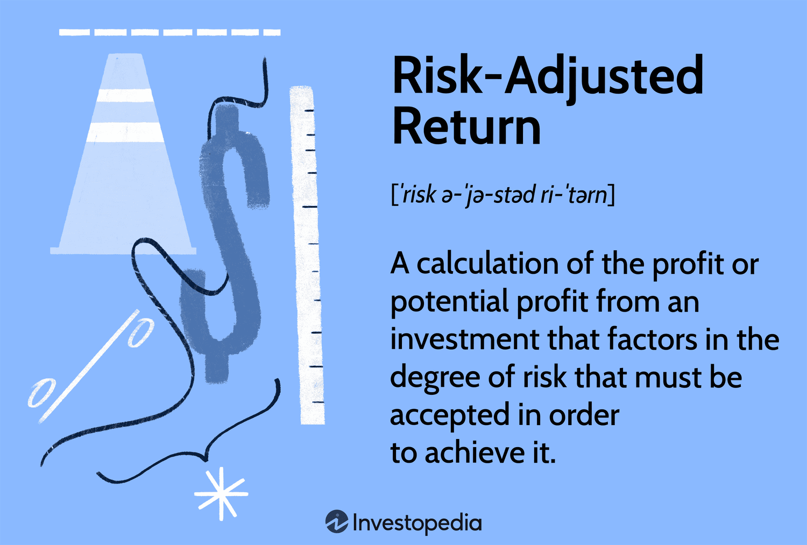

Measuring investment returns is essential for assessing the effectiveness and success of different investment strategies. By accurately calculating and interpreting these returns, investors can make well-informed decisions, aligning their choices with their financial goals. Over recent years, the field of investment management has been revolutionized by algorithmic trading, which employs sophisticated technology to enhance efficiency and precision in trading operations. This technological advancement enables both institutional and individual investors to process and execute trades at speeds that far surpass traditional methods, potentially leading to improved investment outcomes.

This article examines the various metrics used to evaluate investment returns, with a particular emphasis on their implementation within algorithmic trading frameworks. These metrics are essential tools for assessing performance, understanding potential risks, and guiding strategic decisions. As algorithmic trading continues to shape the investment landscape, leveraging data-driven approaches becomes increasingly vital for optimizing investment strategies, aiming to achieve higher returns. By integrating these approaches, investors can enhance their ability to navigate the complex and dynamic financial markets, maximizing the potential for profitability.



## Table of Contents

## Understanding Investment Returns

Investment returns represent the financial result generated by an investment over a specified period. Return on investment is a critical metric for investors as it reflects the effectiveness of an investment strategy. It is essential to identify and understand various forms of returns to accurately assess investment performance and the associated risks.

Investment returns can be presented in two main ways: absolute terms and percentage terms. In absolute terms, returns are expressed as a dollar amount, indicating the total profit or loss from an investment. In percentage terms, the returns are expressed in relation to the initial investment amount, providing a better measure for comparing the profitability of different investments.

### Key Concepts of Investment Returns

#### Nominal Returns
Nominal returns refer to the raw percentage increase or decrease in the value of an investment over time, without accounting for factors such as inflation. While nominal returns provide a basic view of an investment's performance, they do not account for purchasing power changes due to inflation.

#### Real Returns
Real returns adjust nominal returns for inflation, offering a clearer picture of an investment's actual purchasing power over time. The formula to calculate real returns is:

$$
\text{Real Return} = \frac{1 + \text{Nominal Return}}{1 + \text{Inflation Rate}} - 1
$$

This adjustment helps investors assess the true growth in value of their investment in terms of its purchasing power.

#### Total Returns
Total returns encompass all forms of income generated by an investment, including interest, dividends, and capital gains. For dividend-paying stocks, for example, total returns would include both the capital appreciation and the dividends received. Total returns offer a comprehensive view of an investment's overall performance.

### Annualization of Returns

Returns are often annualized to provide a standardized way to compare investment performance across different time periods and to extrapolate the performance over a typical year. The annualized return is calculated using the formula:

$$
\text{Annualized Return} = \left( (1 + \text{Total Return})^{\frac{1}{n}} \right) - 1
$$

where $n$ represents the number of years over which the investment is held. This allows investors to compare investments with varying time horizons on an equal footing.

### Importance of Understanding Investment Returns

Grasping the concept of investment returns is crucial for evaluating the potential for success and understanding the risk profile of an investment strategy. By analyzing and interpreting these returns, investors can make decisions that align with their financial goals and risk tolerance. Having a clear view of nominal, real, and total returns helps investors construct and adjust their portfolios for optimized performance.

In summary, recognizing the different forms of investment returns and their implications is key to successful investment decision-making. It provides the necessary foundation for evaluating potential gains and understanding the cost of opportunities within diverse market environments.

## Metrics for Measuring Investment Returns

Common metrics for measuring investment returns are indispensable tools for evaluating the performance and success of investment strategies. They provide key insights into the profitability and efficiency of investments, enabling investors to make well-informed decisions. Among the most widely used metrics are Return on Investment (ROI), Return on Equity (ROE), and Return on Assets (ROA), each serving distinct purposes.

**Return on Investment (ROI)**:

ROI is a simple yet powerful metric that measures the efficiency of an investment relative to its cost. It is calculated as follows:

$$
\text{ROI} = \left(\frac{\text{Net Profit}}{\text{Cost of Investment}}\right) \times 100
$$

This formula gives a percentage return on the investment, making it easier to compare the profitability of different investments. A higher ROI indicates a more efficient use of invested capital.

**Return on Equity (ROE)**:

ROE measures the profitability of a company in generating income from shareholders' equity. It is calculated using the formula:

$$
\text{ROE} = \left(\frac{\text{Net Income}}{\text{Shareholders' Equity}}\right) \times 100
$$

ROE provides insights into how effectively a company's management is using equity capital to generate profits. Investors often use ROE to compare the financial performance of companies within the same industry.

**Return on Assets (ROA)**:

ROA evaluates how efficiently a company utilizes its assets to generate earnings. It is expressed as:

$$
\text{ROA} = \left(\frac{\text{Net Income}}{\text{Total Assets}}\right) \times 100
$$

A higher ROA indicates that a company is more effective in using its assets to generate profit. It is particularly useful for assessing companies in asset-intensive industries.

**Yield**:

Yield is primarily used in the context of fixed-income investments, such as bonds. It represents the income earned on an investment, typically expressed as an annual percentage rate. Yield calculations can vary depending on the bond type and the investor's holding period, but a simple formula is:

$$
\text{Current Yield} = \left(\frac{\text{Annual Coupon Payment}}{\text{Current Market Price}}\right) \times 100
$$

Each metric offers unique insights into different aspects of investment performance. For instance, ROI provides a generalized measure of investment return, while ROE and ROA offer more detailed perspectives on corporate profitability and asset efficiency. Yield, on the other hand, is crucial for investors focusing on income-generating securities.

The choice of metric depends largely on the type of investment and the specific analysis needed. For equity investments, ROE might offer the most relevant insight, while fixed-income investors might favor yield metrics. Understanding the appropriate application of each metric is essential for comprehensive investment analysis and strategy optimization.

## Algorithmic Trading and its Impact on Returns

Algorithmic trading employs sophisticated algorithms to automate the decision-making process in trading, enabling the execution of orders at speeds and frequencies unattainable by human traders. This advanced method leverages computational power to analyze numerous market variables and execute trades with precision and efficiency. The impact of [algorithmic trading](/wiki/algorithmic-trading) on returns is multifaceted, offering potential enhancements in trading execution and overall investment returns.

One significant advantage of algorithmic trading is its ability to achieve more efficient execution. By executing orders swiftly and at optimal prices, algorithms can minimize transaction costs and reduce market impact. This efficiency can directly contribute to improved returns by capturing favorable price movements that might be missed by manual trading.

Key performance metrics are integral to evaluating the effectiveness of algorithmic trading strategies. The Sharpe Ratio, for instance, measures the risk-adjusted return of an investment strategy. It is calculated as:

$$
\text{Sharpe Ratio} = \frac{\bar{R} - R_f}{\sigma}
$$

where $\bar{R}$ is the average return of the investment, $R_f$ is the risk-free rate, and $\sigma$ is the standard deviation of the excess return. A higher Sharpe Ratio indicates a better risk-adjusted return, making it a valuable metric for comparing algorithmic strategies.

Volatility, another critical metric, represents the degree of variation in trading prices over time, reflecting the risk level associated with a particular strategy. Maximum Drawdown quantifies the largest peak-to-trough decline observed in the strategy's value, offering insights into the potential risks and resilience of algorithmic strategies during adverse market conditions.

Algorithmic strategies require continuous monitoring and adjustment to maintain their efficacy in changing market conditions. Adaptive algorithms can respond dynamically, modifying parameters and strategies in real-time based on evolving market data. This adaptability enhances an algorithm's potential to optimize returns across diverse market environments.

Integrating Return on Investment (ROI) calculations with algorithmic strategies can significantly inform trading decisions. ROI measures the profitability of an investment relative to its initial cost, providing a straightforward assessment of financial performance. By incorporating ROI analysis into algorithmic frameworks, traders can make data-driven decisions aligned with their profitability goals.

Overall, the integration of algorithmic trading with precision metrics such as the Sharpe Ratio, Volatility, and Maximum Drawdown allows for strategic adjustments that can lead to superior investment returns. By harnessing technology to optimize execution and rigorously assess strategy performance, algorithmic trading has the potential to significantly enhance profitability in the financial markets.

## Challenges in Measuring Returns with Algorithmic Trading

Calculating returns in algorithmic trading environments presents unique challenges, primarily driven by the high-frequency nature and rapid shifts observed in markets. One of the critical factors that investors must consider is market [volatility](/wiki/volatility-trading-strategies), which can significantly impact the performance assessment of trading strategies. Market volatility may lead to uneven cash flows, thereby complicating the measurement of returns over short time frames.

Algorithmic trading models require the capacity to process real-time data efficiently to adapt swiftly to evolving market conditions. Such adaptability is crucial, as even minor delays in response can result in significant discrepancies in expected versus actual returns. Furthermore, return on investment (ROI) and other relevant metrics must account for transaction costs, slippage, and real-world frictions. Transaction costs include fees and commissions that accumulate rapidly in high-frequency trading contexts, potentially eroding the net returns. Slippage, the difference between the expected and actual trade execution price, becomes more pronounced under volatile conditions and can impact the accuracy of ROI calculations.

Continuous monitoring and adjustment of algorithmic strategies are pivotal to aligning with desired performance outcomes. As markets exhibit dynamic behavior, strategies that were previously successful may become obsolete, necessitating ongoing tweaks and recalibrations. Advanced analytics and [machine learning](/wiki/machine-learning) can aid in refining these strategies, but they do not eliminate the inherent need for vigilant oversight and timely intervention.

Incorporating these adjustments in algorithmic trading models can be expressed through dynamic programming and adaptive algorithms. For instance, real-time adjustment might be coded in Python as follows:

```python
def adjust_strategy(current_data, model):
    # Incorporate new data into the existing model
    model.update(current_data)

    # Re-evaluate strategy based on updated model predictions
    if market_conditions_changed(model):
        new_strategy = generate_new_strategy(model)
        return new_strategy
    return None

def market_conditions_changed(model):
    # Determine if market conditions warrant a strategy change
    volatility = model.calculate_volatility()
    return volatility > predefined_threshold

def generate_new_strategy(model):
    # Define a new strategy based on the latest model insights
    return model.optimize_strategy(target='max_return', constraints=['risk_limit'])
```

This code provides a basic framework for adjusting trading strategies in response to real-time market data, ensuring that algorithmic trading remains effective amidst shifting market conditions.

## Optimizing Investment Strategies for Better Returns

Leveraging technology in investment strategies, particularly through advanced analytics and machine learning, significantly enhances the optimization of investment returns. These technologies facilitate a deeper understanding of market dynamics and enable more precise investment decisions. Machine learning algorithms, for instance, can analyze vast amounts of historical and real-time data to identify patterns that may not be visible through traditional analysis.

A crucial step in refining algorithmic trading strategies is [backtesting](/wiki/backtesting). It involves assessing how a financial model or trading strategy would have performed using historical data. This process ensures that the models are robust and reliable before they are deployed in live markets. The goal is to validate that the strategy can achieve desired returns without incurring unacceptable levels of risk. In Python, backtesting can be efficiently conducted using libraries such as Backtrader, which allow for the simulation of trading strategies over historical data.

```python
import backtrader as bt

# Define a basic strategy
class MyStrategy(bt.Strategy):
    def next(self):
        if not self.position:
            self.buy(size=1)
        elif self.data.close[0] > self.buy_price * 1.05:
            self.sell(size=1)

# Create a cerebro entity
cerebro = bt.Cerebro()
cerebro.addstrategy(MyStrategy)

# Load historical data
data = bt.feeds.YahooFinanceData(dataname='AAPL', fromdate=datetime(2017, 1, 1),
                                 todate=datetime(2021, 12, 31))
cerebro.adddata(data)

# Run the backtest
result = cerebro.run()
```

In practice, the implementation of these algorithmic strategies requires a comprehensive integration of performance metrics alongside traditional ROI. This includes the use of key metrics such as Sharpe Ratio, Volatility, and Maximum Drawdown to get a holistic view of the strategy's performance under different market conditions. Using a multi-metric approach allows traders to balance risk and return, adapting more swiftly to market changes.

Strategic adjustments further play a critical role in optimizing returns. Investors may vary their leverage, the use of borrowed funds to amplify potential returns, based on insights from metrics like ROI. Additionally, rebalancing portfolios, or adjusting asset allocations in response to market conditions or investment results, ensures alignment with the investment goals and risk tolerance.

The continuous evolution of trading technologies paves the way for enhanced ROI calculations and improved investment outcomes. Innovations in real-time data processing, algorithmic advancements, and the integration of [artificial intelligence](/wiki/ai-artificial-intelligence) allow for unprecedented precision in predicting market trends and optimizing investment strategies. As these technologies advance, investors must stay informed and adaptable, continuously refining their strategies to make the most of the available tools and techniques.

## Conclusion

Understanding and accurately measuring investment returns is a foundation for successful investment practices. This fundamental aspect of investing involves assessing the profitability and performance of various strategies over time. Algorithmic trading has emerged as a significant tool for optimizing returns by employing precise, data-driven strategies that execute trades at speeds beyond human capability. By utilizing algorithms, investors can better react to market conditions, potentially enhancing their returns.

While Return on Investment (ROI) continues to be a central metric for evaluating investment performance, it is essential to consider it alongside other performance indicators for a more comprehensive analysis. These additional metrics can provide insights into risk-adjusted performance and the sustainability of returns. For instance, incorporating the Sharpe Ratio helps gauge the risk-reward balance, while the Maximum Drawdown offers insights into the potential losses within an investment strategy.

With continued advancements in trading technologies, the capacity to optimize investment returns is set to grow further. Innovative technologies such as machine learning and artificial intelligence facilitate more sophisticated data analysis and decision-making processes, leading to enhanced investment strategies. These tools provide investors with the potential to refine their approaches based on historical data and real-time market information.

It is crucial for investors to stay informed of these technological advancements and adapt their strategies accordingly. By effectively leveraging these technologies, investors can develop more resilient and profitable investment strategies, ensuring they remain competitive in dynamically evolving financial markets. Staying adaptable not only involves being open to technological innovations but also entails a commitment to continuous learning and adjustment based on market feedback and technological developments.

## References & Further Reading

[1]: Bergstra, J., Bardenet, R., Bengio, Y., & Kégl, B. (2011). ["Algorithms for Hyper-Parameter Optimization."](https://papers.nips.cc/paper/4443-algorithms-for-hyper-parameter-optimization) Advances in Neural Information Processing Systems 24.

[2]: ["Advances in Financial Machine Learning"](https://www.amazon.com/Advances-Financial-Machine-Learning-Marcos/dp/1119482089) by Marcos Lopez de Prado

[3]: ["Evidence-Based Technical Analysis: Applying the Scientific Method and Statistical Inference to Trading Signals"](https://www.amazon.com/Evidence-Based-Technical-Analysis-Scientific-Statistical/dp/0470008741) by David Aronson

[4]: ["Machine Learning for Algorithmic Trading"](https://github.com/stefan-jansen/machine-learning-for-trading) by Stefan Jansen

[5]: ["Quantitative Trading: How to Build Your Own Algorithmic Trading Business"](https://www.amazon.com/Quantitative-Trading-Build-Algorithmic-Business/dp/1119800064) by Ernest P. Chan