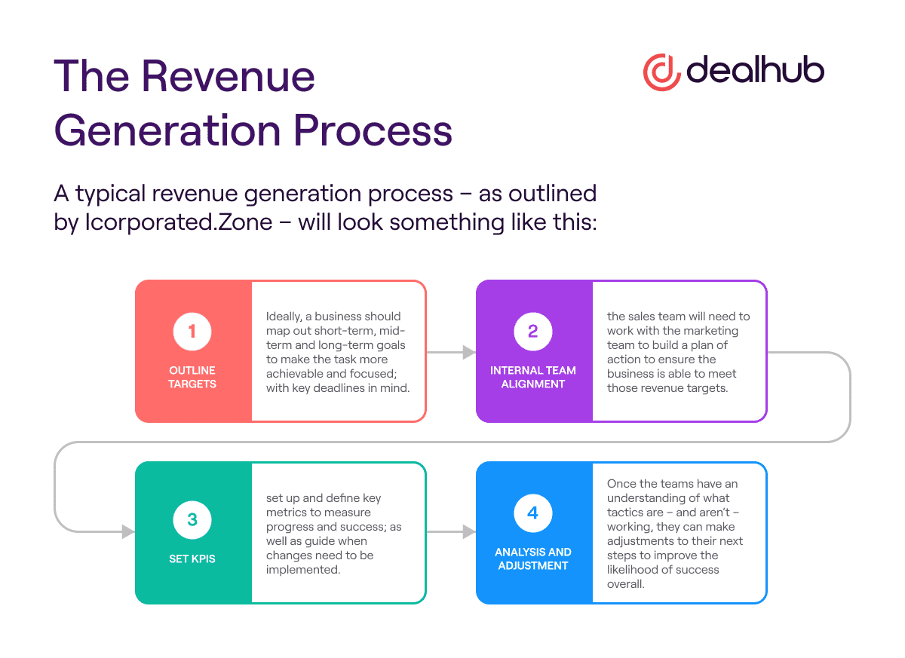

## Table of Contents

## What is investment revenue generation?

Investment revenue generation is the process of making money from investments. When people or companies put their money into things like stocks, bonds, or real estate, they hope to earn more money over time. This can happen in different ways, such as receiving dividends from stocks, interest from bonds, or rental income from properties. The goal is to grow the initial amount of money invested, which is called the principal, through these earnings.

The amount of revenue generated from investments can vary a lot. It depends on factors like the type of investment, how long the money is invested, and the overall performance of the market. For example, stocks might offer high potential returns but also come with more risk. On the other hand, bonds might provide steady but lower returns. By understanding these factors, investors can make choices that match their goals and how much risk they are willing to take.

## Why is it important to generate revenue from investments?

Generating revenue from investments is important because it helps people and companies grow their money over time. When you invest, you are putting your money into something that you hope will increase in value or provide regular income. This can help you reach financial goals like saving for retirement, buying a house, or funding education. Without investment revenue, your money might just sit in a bank account, losing value over time due to inflation.

Another reason why generating revenue from investments is important is that it can provide a source of passive income. This means you can earn money without having to work actively for it. For example, if you invest in rental properties, you can earn money from rent payments. Or if you buy stocks that pay dividends, you can receive regular payments just for holding those stocks. This kind of income can help you become financially independent and improve your quality of life.

## What are the basic types of investment options for beginners?

For beginners, some basic types of investment options are savings accounts, stocks, and bonds. A savings account is a safe place to keep your money at a bank. It usually gives you a small amount of interest over time. Stocks are pieces of ownership in a company. When you buy a stock, you hope the company does well and the value of the stock goes up. You can also get money from stocks through dividends, which are payments companies make to their shareholders. Bonds are like loans you give to a company or the government. They pay you back with interest over time. Bonds are usually safer than stocks but might not grow as much.

Another simple investment option for beginners is mutual funds. A mutual fund is a collection of stocks, bonds, or other investments. When you buy into a mutual fund, you're buying a small piece of all those investments. This can be a good way to spread out your risk because your money is in many different places. Exchange-traded funds, or ETFs, are similar to mutual funds but they trade on the stock market like a stock. They can be a good choice if you want to invest in a certain part of the market, like technology or health care.

Choosing the right investment depends on what you want to achieve and how much risk you're okay with. If you're just starting out, it might be a good idea to talk to a financial advisor. They can help you understand your options and make a plan that fits your goals.

## How can someone start investing with a small amount of money?

Starting to invest with a small amount of money is easier than you might think. One simple way is to use a savings account that gives you interest. This is a safe way to start because you won't lose your money, but you'll earn a little bit more over time. Another option is to buy a small amount of stock through a brokerage app. Many apps let you buy fractions of a stock, so you don't need a lot of money to get started. For example, if you want to invest in a company but their stock costs $100 a share, you might be able to buy just $10 worth of that stock.

Another good choice for small investments is to put your money into a mutual fund or an ETF. These are collections of different investments, like stocks and bonds, and you can often start with as little as $100 or even less. They help spread out your risk because your money is in many different places. If you're interested in these options, you can find apps and websites that make it easy to buy into them. Remember, the key is to start small and learn as you go. Over time, as you get more comfortable and your money grows, you can invest more and try different types of investments.

## What are the risks associated with different investment types?

Investing always comes with some risk, and different types of investments have different levels of risk. For example, putting your money in a savings account is very safe. You won't lose your money, but you also won't earn a lot. The biggest risk with a savings account is that the interest you earn might not keep up with inflation, which means your money could lose value over time. On the other hand, stocks are riskier. The value of a stock can go up and down a lot, and you could lose money if the company doesn't do well. But stocks also have the potential to grow a lot more than a savings account.

Bonds are usually safer than stocks but still come with risks. If you buy a bond and the company or government that issued it runs into financial trouble, they might not be able to pay you back. This is called default risk. Bonds also have interest rate risk, which means if interest rates go up, the value of your bond might go down. Mutual funds and ETFs spread out your risk because they hold many different investments. But they can still go up and down in value based on how the overall market does. So, even though they are less risky than putting all your money in one stock, they are not completely safe.

Understanding the risks of different investments helps you make better choices. It's important to think about how much risk you're okay with and what your financial goals are. If you're just starting out, it might be a good idea to start with safer options and slowly move into riskier ones as you learn more. Talking to a financial advisor can also help you understand the risks and make a plan that fits your needs.

## How does diversification help in managing investment risks?

Diversification helps in managing investment risks by spreading your money across different types of investments. Instead of putting all your money into one thing, like one company's stock, you invest in many different things. This way, if one investment does badly, you won't lose all your money because other investments might still do well. It's like not putting all your eggs in one basket. By having a mix of stocks, bonds, and maybe even real estate, you can lower the chance that a big drop in one investment will hurt your whole portfolio.

For example, if you only invest in tech stocks and the tech industry has a bad year, your investments could lose a lot of value. But if you also have some money in healthcare stocks, bonds, and maybe a mutual fund, those other investments might not go down as much or could even go up. This balance can help protect your money and keep your investments more stable over time. Diversification doesn't get rid of all risk, but it makes it less likely that you'll lose a lot of money all at once.

## What are advanced strategies for maximizing investment returns?

One advanced strategy for maximizing investment returns is called dollar-cost averaging. This means you invest a fixed amount of money at regular times, like every month, instead of putting all your money in at once. By doing this, you buy more shares when prices are low and fewer when prices are high. Over time, this can help you pay a lower average price for your investments and reduce the risk of losing money if the market goes down right after you invest. It's a smart way to keep investing steadily and can lead to better long-term results.

Another strategy is called asset allocation. This involves spreading your money across different types of investments, like stocks, bonds, and real estate, based on your goals and how much risk you're okay with. By having a mix of investments, you can balance out the risks and rewards. For example, stocks might grow a lot but are risky, while bonds are safer but grow less. By adjusting how much you put into each type, you can aim for the best possible return for your level of comfort with risk. It's like making a recipe for your investments that changes over time as your needs and the market change.

A third strategy is rebalancing your portfolio. This means checking your investments regularly and making changes to keep your asset allocation the way you want it. Over time, some investments might grow more than others, which can throw off your balance. By selling some of what has grown a lot and buying more of what hasn't, you can keep your portfolio in line with your goals. Rebalancing helps you stick to your plan and can even help you buy low and sell high, which can boost your returns over the long run.

## How can one use financial instruments like options and futures to generate revenue?

Options and futures are financial instruments that can help you make money, but they are more complex and riskier than simpler investments like stocks or bonds. An option gives you the right, but not the obligation, to buy or sell an asset at a certain price before a certain date. For example, if you think a stock's price will go up, you can buy a call option. This lets you buy the stock at a lower price later, and if the stock goes up, you can make money by selling it at the higher market price. On the other hand, if you think a stock's price will go down, you can buy a put option, which lets you sell the stock at a higher price than the market. Options can be used to make money from small changes in stock prices, but they can also lead to big losses if the market moves against you.

Futures are contracts to buy or sell an asset at a set price on a future date. They are often used by people who want to lock in prices for things like oil, corn, or gold. If you think the price of oil will go up, you can buy a futures contract to buy oil at today's price. If the price does go up, you can sell the oil at the higher price and make money. Futures can be a way to make money from big changes in prices, but they also come with a lot of risk. If the price goes the wrong way, you could lose a lot of money. Both options and futures require a good understanding of the market and a willingness to take on more risk, but they can be powerful tools for generating revenue if used carefully.

## What role does market analysis play in investment decision-making?

Market analysis is really important when you're deciding where to put your money. It's like doing your homework before making a choice. By looking at the market, you can learn about things like how the economy is doing, what people are buying, and what's happening with different industries. This can help you figure out which investments might do well and which ones might not. For example, if you see that more people are buying electric cars, you might want to invest in companies that make them. Market analysis helps you see the big picture and make smarter choices.

Using market analysis also helps you understand risks better. When you know what's going on in the market, you can see what might go wrong and plan for it. Maybe you see that a certain industry is having a tough time, so you decide not to invest there. Or you might see that the market is going up and down a lot, so you choose safer investments. By keeping an eye on the market, you can adjust your plans and try to protect your money. Market analysis doesn't tell you the future, but it gives you information to make better decisions.

## How do tax considerations affect investment revenue generation?

Tax considerations can have a big impact on how much money you make from your investments. Different investments are taxed in different ways, and knowing this can help you keep more of your earnings. For example, if you hold onto a stock for more than a year before selling it, you might pay a lower tax rate on any profit you make. This is called a long-term capital gains tax. But if you sell the stock in less than a year, you'll pay a higher short-term capital gains tax, which is the same as your regular income tax rate. By planning when to buy and sell, you can save money on taxes and keep more of your investment returns.

Another thing to think about is how taxes affect different types of investment income. For instance, interest from bonds is usually taxed as regular income, which can be higher than the tax on dividends from stocks. Some dividends are taxed at a lower rate, which can make stocks a better choice if you're trying to pay less in taxes. Also, putting your money into tax-advantaged accounts like IRAs or 401(k)s can help you grow your investments without paying taxes right away. These accounts let your money grow tax-free or tax-deferred, which means you can keep more of your investment earnings over time. Understanding how taxes work with different investments can help you make smarter choices and increase your overall returns.

## What are the latest trends in investment revenue generation for 2023?

In 2023, one of the big trends in investment revenue generation is focusing on sustainable and green investments. More and more people are putting their money into companies that are good for the environment, like those making renewable energy or working on reducing waste. These investments are not only helping the planet but also making money for investors. Another trend is the rise of technology, especially artificial intelligence (AI) and machine learning. Companies using these technologies are growing fast, and investing in them can lead to good returns. Many investors are looking at tech stocks and funds that focus on AI to grow their money.

Another trend this year is the use of digital platforms and apps for investing. It's easier than ever to start investing with just a few clicks on your phone. Apps like Robinhood and eToro let you buy and sell stocks, cryptocurrencies, and more without needing a lot of money to start. This makes investing accessible to more people and helps them generate revenue from their investments. Also, there's a growing interest in alternative investments like real estate crowdfunding and peer-to-peer lending. These options can offer higher returns than traditional investments and are becoming more popular as people look for new ways to grow their money.

## How can an investor adapt their strategy to global economic changes?

When the world's economy changes, investors need to be ready to change their plans too. One way to do this is by keeping an eye on what's happening around the world. If a big country's economy is doing well, it might be a good time to invest in companies from that country. But if another country is having problems, it might be smart to take your money out of investments there. By watching the news and understanding what's going on, you can move your money to places where it's more likely to grow.

Another way to adapt is by making sure your investments are spread out. This means not putting all your money in one place. If you have investments in different countries and different types of businesses, you're less likely to lose a lot of money if one part of the world has a problem. For example, if you have some money in tech companies, some in healthcare, and some in real estate, and these are in different countries, you can balance out the risks. By being flexible and ready to change your plan, you can keep your money safe and growing even when the world's economy changes.

## How is Revenue Generated in Algorithmic Trading?

Algorithmic trading generates revenue primarily by exploiting small price discrepancies across numerous trades executed in rapid succession. This approach leverages high-speed technology to capitalize on transient market inefficiencies that may be invisible to slower, manual trading processes.

The core of revenue generation lies in the ability to perform high-frequency trading, where vast numbers of trades are completed in fractions of a second. This rapid execution is facilitated by powerful computer algorithms that scan the market for fleeting opportunities to buy low and sell high, often within milliseconds. The cumulative effect of these small spreads captured in each transaction can lead to substantial revenue over time.

Key to this revenue model is scalability. Algorithmic systems are designed to handle high-[volume](/wiki/volume-trading-strategy) trading, exponentially increasing the potential for profit. As the volume of trades grows, so do the opportunities for profit, given the trading model's reliance on small but numerous market inefficiencies.

Consistent revenue streams in [algorithmic trading](/wiki/algorithmic-trading) are achieved by meticulously applying well-designed trading strategies that identify and act upon profitable opportunities. These strategies are rooted in quantitative models, which use historical data and statistical analysis to predict future price movements.

For instance, consider a simple mean-reversion strategy. This method assumes that asset prices will tend to return to their average over time. If an asset's price deviates from its historical average, the algorithm might execute trades to exploit this difference, buying when the price is below average and selling when it is above. The formula representing the mean reversion could be:

$$
P(t) - \bar{P} = \epsilon(t)
$$

where $P(t)$ is the current price, $\bar{P}$ is the historical mean price, and $\epsilon(t)$ is the error term, which should revert to zero over time. Algorithms can use this framework to determine the entry and exit points for trades.

The consistent application of such strategies ensures that algorithmic trading systems can generate revenue even in different market phases, maintaining profitability by adapting to market conditions without emotional bias.

## What are the factors that affect profitability?

Profitability in algorithmic trading significantly depends on the design of trading strategies, the management of risks, and the optimization of systems. To achieve this, traders employ a comprehensive approach involving [backtesting](/wiki/backtesting), real-time analysis, and quantitative models to consistently refine trading strategies.

### Strategy Design

Efficient strategy design is foundational to profitability. This process involves developing trading algorithms that can identify and exploit patterns in market data. Traders use statistical methodologies to detect such patterns, frequently leveraging [machine learning](/wiki/machine-learning) algorithms to improve predictive accuracy. A common approach entails multiple linear regression to model relationships between different market variables:

$$
y = \beta_0 + \beta_1x_1 + \beta_2x_2 + \ldots + \beta_nx_n + \epsilon
$$

where $y$ is the dependent variable, $x_1, x_2, \ldots, x_n$ are independent variables, and $\epsilon$ is the error term.

### Risk Management

Robust risk management is crucial to safeguarding profits. This includes setting stop-loss orders, diversifying trading portfolios, and using hedging strategies to mitigate potential losses. Value at Risk (VaR) is a commonly used metric in risk management, which estimates the potential loss in value of a portfolio over a defined period under normal market conditions. The formula for VaR at a confidence level $c$ is:

$$
\text{VaR} = \sigma \cdot z_c \cdot \sqrt{\Delta t}
$$

where $\sigma$ is the standard deviation of the return, $z_c$ is the z-score corresponding to the confidence level, and $\Delta t$ is the time period.

### System Optimization

Continuous system optimization ensures that trading algorithms remain effective amidst evolving market conditions. This involves ongoing monitoring and adjustment of algorithms to maintain peak performance. Traders often use backtesting, which simulates the trade execution process using historical data to assess the viability of an algorithm. Efficient algorithms also incorporate real-time analysis, leveraging data streams to adjust trading parameters instantly.

In Python, backtesting libraries such as Backtrader or Zipline are used to simulate trading strategies, evaluate performance, and fine-tune strategies. An example of setting up a simple moving average crossover strategy using Backtrader might look like this:

```python
import backtrader as bt

class SMACross(bt.SignalStrategy):
    def __init__(self):
        sma1 = bt.ind.SMA(period=10)
        sma2 = bt.ind.SMA(period=50)
        crossover = bt.ind.CrossOver(sma1, sma2)
        self.signal_add(bt.SIGNAL_LONG, crossover)

if __name__ == '__main__':
    cerebro = bt.Cerebro()
    cerebro.addstrategy(SMACross)
    # Load data
    data = bt.feeds.YahooFinanceData(dataname='AAPL',
                                      fromdate=datetime(2020, 1, 1),
                                      todate=datetime(2021, 1, 1))
    cerebro.adddata(data)
    cerebro.run()
```

### Emotional Bias Elimination

Algorithmic trading effectively removes emotional biases, such as fear and greed, enhancing decision-making objectivity. By relying on quantitative models and data analysis, traders eliminate the psychological influences that often lead to poor trading decisions. This objectivity facilitates consistent profitability, as decisions are driven by empirical evidence rather than subjective judgment.

In summary, the profitability of algorithmic trading relies on a well-crafted strategy design, rigorous risk management, and relentless system optimization, all of which are buttressed by empirical analysis and the absence of emotional interference.

## References & Further Reading

[1]: Bergstra, J., Bardenet, R., Bengio, Y., & Kégl, B. (2011). ["Algorithms for Hyper-Parameter Optimization."](https://dl.acm.org/doi/10.5555/2986459.2986743) Advances in Neural Information Processing Systems 24.

[2]: ["Advances in Financial Machine Learning"](https://www.amazon.com/Advances-Financial-Machine-Learning-Marcos/dp/1119482089) by Marcos Lopez de Prado

[3]: ["Evidence-Based Technical Analysis: Applying the Scientific Method and Statistical Inference to Trading Signals"](https://www.amazon.com/Evidence-Based-Technical-Analysis-Scientific-Statistical/dp/0470008741) by David Aronson

[4]: ["Machine Learning for Algorithmic Trading"](https://github.com/stefan-jansen/machine-learning-for-trading) by Stefan Jansen

[5]: ["Quantitative Trading: How to Build Your Own Algorithmic Trading Business"](https://github.com/LucindaYa/quant-resources/blob/master/Quantitative%20Trading%20How%20to%20Build%20Your%20Own%20Algorithmic%20Trading%20Business.pdf) by Ernest P. Chan