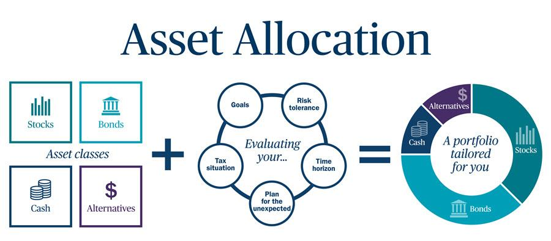

## Table of Contents

## What is investment risk?

Investment risk is the chance that you might lose some or all of the money you put into an investment. It's like a gamble where you hope to gain more money, but there's always a possibility that things won't go as planned. Different types of investments carry different levels of risk. For example, putting money in a savings account is usually very safe, but the returns are low. On the other hand, investing in stocks can be riskier, but the potential rewards can be much higher.

Understanding and managing risk is important when you're thinking about investing. One way to manage risk is by diversifying your investments, which means spreading your money across different types of investments. This way, if one investment does poorly, you won't lose all your money. Another way to manage risk is by doing your homework and understanding the investments you're considering. The more you know about an investment, the better you can judge its risks and potential rewards.

## What are the common types of investment risks?

Investment risks come in many forms, but some of the most common ones are market risk, interest rate risk, and inflation risk. Market risk is when the value of your investments goes up and down because of what's happening in the stock market or the economy. If the market goes down, the value of your investments can drop too. Interest rate risk happens when changes in interest rates affect the value of your investments. For example, if interest rates go up, the value of bonds you own might go down. Inflation risk is when the prices of things you buy go up over time, and your investments don't grow fast enough to keep up with those rising prices.

Another type of risk is credit risk, which is the chance that a company or government you've lent money to (by buying their bonds) won't be able to pay you back. This can happen if the borrower runs into financial trouble. Liquidity risk is also important to consider. This is the risk that you won't be able to sell your investment quickly enough or at a fair price when you need to. For example, some investments like real estate can be hard to sell quickly. Lastly, there's currency risk, which comes into play if you invest in foreign countries. If the value of that country's currency goes down compared to your own, your investment could lose value even if it's doing well in that country.

Understanding these different types of risks can help you make smarter choices about where to put your money. By knowing what could go wrong, you can pick investments that match how much risk you're willing to take and how long you plan to keep your money invested.

## How does market risk affect my investments?

Market risk is the chance that the value of your investments will go up and down because of what's happening in the stock market or the economy. If the market goes down, the value of your stocks, mutual funds, or other investments can drop too. This can happen for many reasons, like a big company doing badly, or because people are worried about the economy. When lots of people start selling their investments because they're worried, it can make the market go down even more.

This kind of risk can affect all your investments, no matter how safe you think they are. Even if you've picked good companies to invest in, if the whole market is going down, your investments can still lose value. But the good news is that markets usually go back up over time. So, if you can wait it out, you might see your investments recover and even grow. That's why it's important to think about how long you can keep your money invested before you need it back.

## What is liquidity risk and how can it impact my portfolio?

Liquidity risk is the chance that you won't be able to sell your investment quickly enough or at a fair price when you need to. Imagine you own a piece of land or a special type of stock that not many people want to buy. If you suddenly need money and try to sell it, you might have to wait a long time or sell it for less than it's worth. This is a problem because it means you can't get your money back when you need it.

This risk can impact your portfolio by making it harder for you to manage your money. If a big part of your investments is in things that are hard to sell, you might be stuck if you need cash quickly. It's like having money tied up in something you can't use right away. To manage this risk, it's a good idea to have some of your money in investments that are easy to sell, like stocks of big companies or money in a savings account. This way, you can get to your money when you need it without losing value.

## How can inflation risk influence my investment returns?

Inflation risk is when the prices of things you buy go up over time, and your investments don't grow fast enough to keep up with those rising prices. Imagine you put your money in a savings account that gives you 1% interest every year. If inflation is at 3%, the things you want to buy are getting more expensive faster than your savings are growing. This means your money is actually losing value, even though you're [earning](/wiki/earning-announcement) interest.

This can really affect your investment returns because over time, the money you get back from your investments might not be worth as much as when you first put it in. For example, if you invest in bonds that pay a fixed amount of interest, and inflation goes up, the money you get from those bonds won't buy as much as it used to. To fight inflation risk, you might want to invest in things that tend to grow faster than inflation, like stocks or real estate. This way, your investments have a better chance of keeping up with or even beating the rising prices.

## What are concentration risks and how can they be mitigated?

Concentration risk is when you put too much of your money into just one type of investment or one company. It's like putting all your eggs in one basket. If that one investment does badly, you could lose a lot of money. For example, if you invest all your money in one company's stock and that company has problems, the value of your investment could drop a lot.

To avoid concentration risk, you should spread your money around. This is called diversification. Instead of putting all your money in one stock, you can invest in different stocks, bonds, and other types of investments. This way, if one investment goes down, the others might still do well and help balance out your losses. It's like having many baskets for your eggs, so if one basket falls, you still have eggs in the other baskets.

## How does credit risk apply to different types of investments?

Credit risk is the chance that the person or company you've lent money to won't be able to pay you back. This can happen with different types of investments, like bonds. When you buy a bond, you're basically lending money to a company or government. If that company or government runs into money problems, they might not be able to pay back what they owe you. This risk is higher with bonds from companies that are not doing well financially, called junk bonds, compared to bonds from stable governments or big, strong companies.

Credit risk also applies to other investments like loans or even some types of stocks. For example, if you invest in a bank that gives out loans, and many of those loans go bad because people can't pay them back, the bank's stock price could go down. This means your investment in the bank could lose value. To manage credit risk, you can look at credit ratings, which tell you how likely it is that the borrower will pay you back. Investing in a mix of different types of investments can also help spread out the risk, so if one investment goes bad, it won't hurt your whole portfolio.

## What role does interest rate risk play in bond investing?

Interest rate risk is important when you invest in bonds. It means that if interest rates go up, the value of your bonds might go down. Here's why: when new bonds are issued with higher interest rates, the old bonds you have, which pay less interest, become less attractive to other people. So, if you want to sell your old bonds, you might have to sell them for less money than you paid for them.

This risk affects all bonds, but it's bigger for bonds that have a long time before they pay you back. If you have a bond that won't mature for many years, and interest rates go up, the value of that bond can drop a lot. To manage this risk, you can look at bonds that will pay you back sooner, or you can mix different types of bonds in your portfolio. This way, if interest rates change, it won't hurt all your investments at once.

## How can geopolitical risk affect global investment portfolios?

Geopolitical risk is when things happening in different countries can affect your investments. This can be things like wars, political changes, or new laws. If a country you've invested in has a war or a big change in government, it can make the value of your investments in that country go down. For example, if a country starts a war, people might sell their investments there because they're worried, and this can make the stock market in that country drop.

To manage geopolitical risk, you can spread your investments across different countries. This way, if something bad happens in one country, your investments in other countries might still do well. It's like not putting all your eggs in one basket. Also, keeping up with the news and understanding what's happening around the world can help you make better choices about where to invest your money.

## What are some advanced strategies for mitigating currency risk?

Currency risk is when the money from another country changes in value compared to your own money. This can affect your investments if you have money in different countries. One way to deal with this risk is by using something called hedging. Hedging is like a safety net. You can use special financial tools, like forward contracts or options, to protect your investments from big changes in currency values. For example, if you think the value of a foreign currency might go down, you can use a forward contract to lock in the current exchange rate for a future date. This way, even if the currency drops, you'll still get the rate you agreed on.

Another strategy is to diversify your investments across different currencies. Instead of putting all your money in one country, you can spread it out. This way, if one currency goes down, the others might go up and balance things out. It's like not putting all your eggs in one basket. You can also keep an eye on what's happening in the world and how it might affect different currencies. By understanding global events and economic trends, you can make better choices about where to invest your money and how to protect it from currency changes.

## How can behavioral biases increase investment risk and what are the counter-strategies?

Behavioral biases can make investment risk bigger because they can lead you to make bad choices with your money. One common bias is overconfidence, where you might think you know more about investing than you really do. This can make you take too many risks, like putting all your money in one stock because you're sure it will go up. Another bias is loss aversion, where you're so scared of losing money that you might sell your investments too soon, even if they could recover and grow over time. These biases can cause you to buy or sell at the wrong times, which can hurt your investment returns.

To fight these biases, it's good to have a plan and stick to it. Instead of making quick decisions based on how you feel, set clear goals for your investments and follow a strategy that matches those goals. It can also help to learn more about investing and how your emotions can affect your choices. Talking to a financial advisor can give you another point of view and help you stay on track. By understanding your biases and having a solid plan, you can make smarter investment decisions and lower your risk.

## What are the latest quantitative methods used for risk assessment and mitigation in investment portfolios?

One of the latest quantitative methods for risk assessment and mitigation in investment portfolios is the use of [machine learning](/wiki/machine-learning) and [artificial intelligence](/wiki/ai-artificial-intelligence). These tools can look at huge amounts of data to find patterns and predict how different investments might do in the future. For example, they can help you figure out how likely it is that a stock will go up or down based on things like past prices, news, and economic reports. By using these predictions, you can make better choices about where to put your money and how to spread it out to lower your risk.

Another method is called Value at Risk (VaR), which helps you understand the most money you could lose in your portfolio over a certain time. VaR uses math to figure out the worst-case scenario for your investments, so you know what could happen if things go badly. This can help you decide if you're okay with that level of risk or if you need to change your investments to be safer. Both machine learning and VaR are powerful tools that can help you manage your investments better and keep your money safer.

## References & Further Reading

[1]: U.S. Securities and Exchange Commission. ["Findings Regarding the Market Events of May 6, 2010."](https://www.sec.gov/news/studies/2010/marketevents-report.pdf) September 30, 2010.

[2]: Hull, J. C. (2015). ["Options, Futures, and Other Derivatives."](https://www.amazon.com/Options-Futures-Other-Derivatives-10th/dp/013447208X) Pearson Education.

[3]: Lopez de Prado, M. (2018). ["Advances in Financial Machine Learning."](https://www.amazon.com/Advances-Financial-Machine-Learning-Marcos/dp/1119482089) Wiley.

[4]: Fabozzi, F. J., & Mann, S. V. (2010). ["The Handbook of Fixed Income Securities."](https://www.mhebooklibrary.com/doi/book/10.1036/9781260473902?contentTab=true) McGraw-Hill Education.

[5]: Chan, E. (2008). ["Quantitative Trading: How to Build Your Own Algorithmic Trading Business."](https://github.com/ftvision/quant_trading_echan_book) Wiley.

[6]: Tuckman, B., & Serrat, A. (2011). ["Fixed Income Securities: Tools for Today's Markets."](https://www.amazon.com/Fixed-Income-Securities-Todays-Markets/dp/0470891696) Wiley.

[7]: Aronson, D. (2006). ["Evidence-Based Technical Analysis: Applying the Scientific Method and Statistical Inference to Trading Signals."](https://www.amazon.com/Evidence-Based-Technical-Analysis-Scientific-Statistical/dp/0470008741) Wiley.

[8]: Jansen, S. (2020). ["Machine Learning for Algorithmic Trading."](https://github.com/stefan-jansen/machine-learning-for-trading) Packt Publishing.