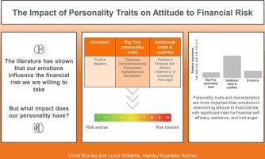

## Table of Contents

## What is investment risk tolerance?

Investment risk tolerance is how much risk you are willing to take when you invest your money. It's about how comfortable you feel with the possibility that your investments might lose value. Everyone has a different level of risk tolerance, and it can depend on things like your age, how much money you have, and your goals for the future.

Understanding your risk tolerance is important because it helps you choose the right investments. If you are okay with taking more risk, you might choose investments that could give you higher returns but are also more likely to go up and down a lot. If you don't like risk, you might pick safer investments that grow more slowly but are less likely to lose value. Knowing your risk tolerance helps you make choices that you can stick with, even when the market changes.

## How is personality typically assessed in relation to investment behavior?

Personality is often assessed in relation to investment behavior through surveys and questionnaires that look at different traits. These tools help figure out if someone is more likely to take risks or if they prefer to play it safe. For example, someone who scores high on openness might be more willing to try new and risky investments, while someone who is very conscientious might stick to a well-thought-out plan and avoid big risks.

Researchers also use models like the Big Five personality traits to understand how personality affects investment choices. The Big Five includes traits like extraversion, agreeableness, conscientiousness, neuroticism, and openness. By studying these traits, experts can predict how someone might react to market ups and downs. For instance, people high in neuroticism might get more stressed about losing money and make quick decisions to sell, while those high in extraversion might enjoy the excitement of the market and be more willing to take chances.

## Can you explain the basic types of investment risks?

Investment risks are the chances that you might lose money when you invest. There are different kinds of risks, but one common type is market risk. Market risk is when the whole market goes down, and it can affect all kinds of investments like stocks and bonds. This risk can happen because of big events like a recession or because people just feel less confident about the economy.

Another type of risk is specific risk, which is when something bad happens to just one company or investment. For example, if a company you invested in has a big problem, like a scandal or a product that fails, the value of your investment in that company might drop a lot. This risk is different from market risk because it's about problems with one specific investment, not the whole market.

There's also inflation risk, which is when the prices of things you buy go up faster than the money you're [earning](/wiki/earning-announcement) from your investments. This means that even if your investments are doing okay, the money you get back might not be worth as much as before. Understanding these different types of risks can help you make better choices about where to put your money.

## What are the common personality traits that influence risk tolerance?

Personality traits play a big role in how much risk someone is willing to take with their investments. People who are high in openness are often more willing to try new things and take risks. They might be excited about investing in new and different kinds of investments, even if they are risky. On the other hand, people who are very conscientious tend to be more careful and plan things out. They might prefer safer investments that grow slowly but steadily, because they want to avoid big losses.

Another important trait is neuroticism. People who score high in neuroticism can get very worried and stressed about losing money. This might make them less willing to take risks, because they don't want to feel anxious about their investments. Extraversion also matters. People who are extraverted often enjoy the excitement of the market and might be more willing to take chances, hoping for big rewards. Understanding these traits can help people figure out their own risk tolerance and make better investment choices.

## How do psychological factors affect an investor's risk tolerance?

Psychological factors can really change how much risk an investor is willing to take. For example, if someone is feeling confident and happy, they might be more okay with taking risks. They might think, "I feel good, so I'm going to try something new and exciting with my money." But if someone is feeling stressed or worried, they might want to play it safe. They might think, "I'm already stressed, so I don't want to risk losing my money too."

Another important [factor](/wiki/factor-investing) is how much someone trusts themselves to make good choices. If someone believes in their own judgment, they might be more willing to take risks. They might think, "I know what I'm doing, so I can handle a bit of risk." But if someone doubts themselves, they might stick to safer investments. They might think, "I'm not sure about this, so I'll just go with something I know is safe." These feelings can change over time and can really affect how someone decides to invest their money.

## What tools or surveys are used to measure risk tolerance and personality?

To measure risk tolerance and personality, people often use surveys and questionnaires. One popular tool is the Risk Tolerance Questionnaire, which asks questions about how someone feels about losing money and how much risk they are willing to take. This helps figure out if someone likes to take big risks or if they prefer to be safe. Another tool is the Big Five Inventory, which looks at five main personality traits: openness, conscientiousness, extraversion, agreeableness, and neuroticism. By answering questions about these traits, people can learn more about their own personality and how it might affect their investment choices.

Another survey that is often used is the Financial Risk Tolerance Scale. This survey asks questions about how someone would react to different financial situations, like losing money or seeing their investments go up and down. It helps to understand how much risk someone can handle without getting too stressed. These tools are important because they help people make better choices about their money. By knowing their risk tolerance and personality, people can pick investments that they feel good about and that match their goals.

## How does age impact the correlation between personality and risk tolerance?

Age can change how personality affects someone's risk tolerance. When people are younger, they might be more open to trying new things and taking risks with their money. This is because they have more time to recover if they lose money. For example, a young person who is very open might be excited to invest in new and risky things, hoping for big rewards. But as people get older, they might start to feel more worried about losing money. They might become more careful and want to protect what they have saved. An older person who is very conscientious might choose safer investments to make sure they have enough money for the future.

As people age, their personality traits can also change a bit. Someone who was very extraverted and loved the excitement of the market when they were young might become less extraverted as they get older. They might start to enjoy the excitement less and want to take fewer risks. On the other hand, someone who was always very neurotic might feel even more worried about losing money as they get older. This could make them even less willing to take risks. Understanding how age changes the way personality affects risk tolerance can help people make better choices about their investments at different stages of their life.

## What role does financial knowledge play in the relationship between personality and risk tolerance?

Financial knowledge can change how personality affects someone's risk tolerance. If someone knows a lot about money and investing, they might feel more confident in taking risks, even if their personality is usually cautious. For example, a person who is very conscientious might still choose to invest in something risky if they understand the investment well and believe it's a good choice. On the other hand, someone who doesn't know much about finance might be scared to take risks, even if they are usually open to new experiences. Their lack of knowledge could make them feel unsure and less willing to try new investments.

Having good financial knowledge can also help people with different personalities make better choices about their money. Someone who is very extraverted and loves excitement might learn to balance their love for risk with smart investment choices. They might still take risks, but they'll do it in a way that makes sense because they understand the market. Similarly, someone who is high in neuroticism and usually very worried about losing money might feel more comfortable taking some risks if they know more about finance. They can learn to manage their worries better and make choices that fit their goals, even if they are still careful.

## Can changes in personality over time affect an investor's risk tolerance?

Yes, changes in personality over time can affect an investor's risk tolerance. As people get older, their personality traits might change a bit. For example, someone who used to be very open to new things might become more careful as they age. This could make them less willing to take risks with their money. They might start to prefer safer investments because they want to protect what they have saved for the future.

These changes can also make people feel differently about taking risks. Someone who was always very extraverted and loved the excitement of the market might start to enjoy it less as they get older. They might become more interested in safer investments that don't go up and down so much. On the other hand, someone who was always very neurotic and worried about losing money might feel even more worried as they age. This could make them even less willing to take risks, sticking to investments that they feel are very safe.

## How do cultural differences influence the correlation between personality and risk tolerance?

Cultural differences can change how personality affects someone's risk tolerance. In some cultures, people might be taught to be very careful with money and avoid taking risks. Even if someone from this culture is usually open to new things, they might still choose safer investments because that's what they've learned is important. On the other hand, in cultures where taking risks is seen as a good thing, people might be more willing to try new and risky investments. Someone who is very conscientious might still take more risks if they come from a culture that values boldness and trying new things.

These cultural differences can also affect how people with different personalities feel about taking risks. For example, in a culture that values saving and being careful, someone who is very extraverted might still choose safer investments because they want to fit in with what their culture expects. But in a culture that celebrates taking chances, even someone who is usually very neurotic and worried might feel more comfortable taking some risks because they see others doing it and being okay. Understanding these cultural influences can help people make better choices about their money that fit both their personality and their cultural background.

## What are the latest research findings on the correlation between specific personality traits and investment risk tolerance?

Recent research has shown that certain personality traits can really affect how much risk someone is willing to take with their money. For example, people who score high on openness are often more okay with trying new and risky investments. They like to explore new things and are excited by the possibility of big rewards. On the other hand, people who are very conscientious tend to be more careful. They like to plan things out and might choose safer investments because they want to avoid big losses. These traits can help predict how someone might react to ups and downs in the market.

Another important finding is about how neuroticism and extraversion affect risk tolerance. People who score high in neuroticism can get very stressed about losing money, which might make them less willing to take risks. They might stick to safer investments to avoid feeling anxious. In contrast, people who are very extraverted often enjoy the excitement of the market and might be more willing to take chances. They hope for big rewards and are okay with the ups and downs. Understanding these personality traits can help people make better choices about their investments that match their comfort level with risk.

## How can financial advisors use personality assessments to tailor investment strategies to individual clients?

Financial advisors can use personality assessments to better understand their clients and help them make smart choices about their money. By knowing if a client is very open to new things, the advisor can suggest investments that might be a bit risky but could also bring big rewards. If a client is very careful and likes to plan everything out, the advisor might recommend safer investments that grow slowly but steadily. This way, the advisor can match the investments to what the client feels comfortable with, making it easier for them to stick with their plan even when the market changes.

Understanding a client's personality can also help the advisor explain things in a way that makes sense to them. For example, if a client is very worried about losing money, the advisor can focus on showing them how certain investments are safe and why they are a good choice. If a client loves excitement and is okay with taking risks, the advisor can talk about the potential for big rewards and help them see the ups and downs as part of the adventure. By tailoring their advice to fit the client's personality, financial advisors can build trust and help their clients feel more confident about their investment choices.

## References & Further Reading

[1]: Durand, R. B., Newby, R., Sanghani, J., & Taylor, K. (2008). ["Personality and Individual Investor: Risk Aversion and Stock Market Confidence."](https://psycnet.apa.org/record/2009-09336-002) Journal of Behavioral Finance, 9(4), 193-208.

[2]: Oehler, A., Wendt, S., Wedlich, F., & Horn, M. (2018). ["Investors' Personality Influences Investment Decisions: Evidence from the Field."](https://pmc.ncbi.nlm.nih.gov/articles/PMC9208354/) Journal of Behavioral Decision Making, 31(3), 341-354.

[3]: Menkhoff, L., et al. (2020). ["Algorithmic Trading and Its Effects on Financial Markets."](https://www.nber.org/papers/w27057) Journal of Economic Surveys, 34(2), 207-234.

[4]: Treleaven, P., Galas, M., & Lalchand, V. (2013). ["Algorithmic Trading Review."](https://www.researchgate.net/publication/262239006_Algorithmic_Trading_Review) Communications of the ACM, 56(11), 76-85.

[5]: Costa, P. T., Jr., & McCrae, R. R. (1992). ["Revised NEO Personality Inventory (NEO-PI-R) and NEO Five-Factor Inventory (NEO-FFI) Professional Manual."](https://www.researchgate.net/publication/240133762_Neo_PI-R_professional_manual) Psychological Assessment Resources.  

[6]: Barberis, N. (2013). ["The Psychology of Tail Events: Progress and Challenges."](https://nicholasbarberis.github.io/aerpp_2013.pdf) American Economic Review, 103(3), 611-616.