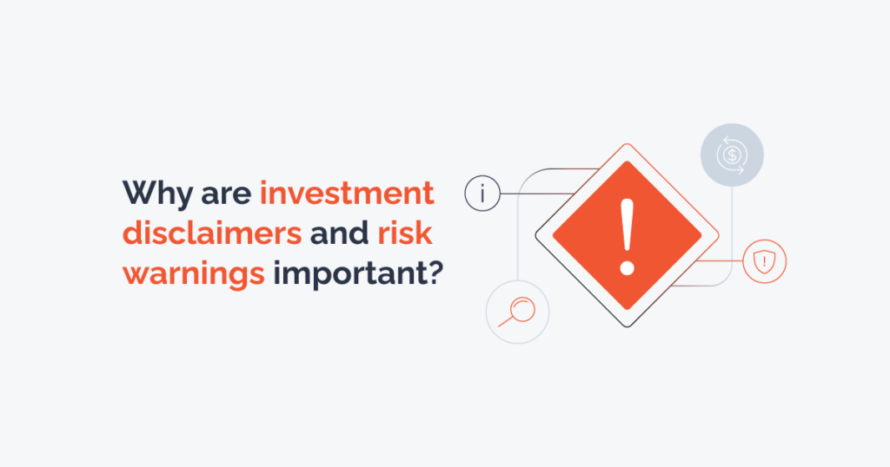

## Table of Contents

## What is an investment risk warning?

An investment risk warning is a message that tells people about the dangers of losing money when they invest. It is important because it helps people understand that investing is not always safe and that they could lose some or all of their money. Companies and financial advisors use these warnings to make sure that investors know the risks before they decide to invest.

These warnings are often required by law to protect investors. They explain different types of risks, like market risk, where the value of investments can go up and down, and credit risk, where the company you invest in might not be able to pay back the money they owe. By reading these warnings, investors can make better decisions and be more prepared for possible losses.

## Why are disclaimers important in investment?

Disclaimers are important in investment because they help people understand the risks involved. When someone invests money, there's always a chance they could lose it. Disclaimers tell investors about these risks so they can make better choices. They explain that past performance doesn't guarantee future results and that investments can go down in value as well as up.

These warnings are also required by law to protect investors. By including disclaimers, companies and financial advisors make sure everyone knows the potential dangers before they invest. This helps prevent misunderstandings and legal problems later on. It's all about being honest and clear so investors can decide if they're comfortable with the risks.

## What are the common types of investment risks?

Investment risks are the chances that you might lose money when you invest. One common type is market risk, which means the value of your investments can go up and down because of things happening in the economy or the world. Another type is credit risk, where the company or person you lend money to might not be able to pay you back. There's also [liquidity](/wiki/liquidity-risk-premium) risk, which is when you can't easily sell your investment to get your money back quickly.

Another risk is inflation risk, where the money you get back from your investment might not be worth as much because prices have gone up. Interest rate risk is also important, as changes in interest rates can affect the value of your investments, especially bonds. Finally, there's currency risk, where changes in the value of different currencies can impact your returns if you invest in foreign markets.

Understanding these risks can help you make better choices about where to put your money. Even though all investments have some level of risk, knowing what they are can help you prepare for possible losses and decide if an investment is right for you.

## How should a beginner interpret investment risk warnings?

When you see an investment risk warning, it's telling you that there's a chance you could lose money. It's like a big sign that says, "Be careful! Investing can be risky." The warning is there to help you understand that even though you might make money, you could also lose some or all of it. It's important to read these warnings carefully so you know what you're getting into before you decide to invest.

Think of these warnings as a friend giving you advice. They're pointing out the dangers so you can make a smart choice. For example, they might tell you about market risk, which means the value of your investment can go up and down. Or they might warn you about credit risk, which means the company you invest in might not be able to pay you back. By understanding these risks, you can decide if you're okay with them and if the investment is right for you.

## What legal requirements must be met when issuing investment risk warnings?

When a company or financial advisor wants to tell people about investments, they have to follow certain rules about giving risk warnings. These rules are set by governments and financial regulators to make sure that investors know about the dangers of losing money. For example, in many places, it's a must to clearly explain that past performance doesn't mean the same will happen in the future. They also need to tell people about different types of risks, like market risk or credit risk, in a way that's easy to understand.

These legal requirements are there to protect people who are thinking about investing. Companies have to make sure their risk warnings are clear and not hidden away in small print. They often need to use simple language so everyone can understand the risks, no matter how much they know about investing. By following these rules, companies help make sure that investors can make informed decisions and are aware of the potential for losses.

## Can you explain the difference between a disclaimer and a risk warning?

A disclaimer and a risk warning both help people understand the dangers of investing, but they do it in different ways. A disclaimer is a statement that says the company or person giving advice is not responsible if things go wrong. It's like saying, "We told you about the risks, so don't blame us if you lose money." Disclaimers are used to protect the company or advisor from being sued if an investment doesn't work out.

On the other hand, a risk warning is more about telling you what could go wrong with your investment. It explains the different types of risks, like market risk or credit risk, so you know what you might be getting into. Risk warnings are there to help you make a smart choice by understanding the chances of losing money. Both disclaimers and risk warnings are important, but they serve different purposes: disclaimers protect the company, while risk warnings help the investor.

## How do investment risk warnings vary across different financial products?

Investment risk warnings can be different depending on the type of financial product you're looking at. For example, if you're thinking about buying stocks, the risk warning might talk about market risk, which means the price of the stock can go up and down a lot. It might also mention company risk, where the business you invest in could do badly and lose value. On the other hand, if you're looking at bonds, the risk warning might focus more on credit risk, which is the chance that the company or government that issued the bond won't be able to pay you back.

For other types of investments like mutual funds or exchange-traded funds (ETFs), the risk warnings might talk about a mix of risks. They could mention market risk, but also liquidity risk, which is the chance that you might not be able to sell your investment quickly if you need to. If you're looking at something like a real estate investment trust (REIT), the risk warning might focus on property market risk and [interest rate](/wiki/interest-rate-trading-strategies) risk, which can affect the value of the properties and the cost of borrowing money. Each type of financial product has its own set of risks, and the warnings are there to help you understand what you might be getting into.

## What are best practices for drafting effective investment disclaimers?

When you write an investment disclaimer, it's important to use clear and simple language so everyone can understand it. You should explain that investing can be risky and that people might lose money. Make sure to say that past results don't mean the same will happen in the future. It's also good to list the different types of risks, like market risk or credit risk, so people know what they might be facing. Don't hide the disclaimer in small print; make it easy to see and read.

Another important thing is to be honest and not promise too much. You should say that the information you give is just for helping people make choices, but it's not a guarantee. It's also a good idea to tell people to talk to a financial advisor before they decide to invest. By following these tips, you can make sure your disclaimer helps people understand the risks and makes your company less likely to get into legal trouble.

## How can investors use risk warnings to make better investment decisions?

Investors can use risk warnings to make better choices by paying close attention to what they say. Risk warnings tell you about the different ways you could lose money, like if the market goes down or if the company you invest in can't pay you back. By understanding these risks, you can decide if you're okay with them. For example, if a risk warning says there's a big chance the value of the investment could drop a lot, you might choose to invest less money or look for a different investment that seems safer.

It's also helpful to think about how these risks fit with your own goals and how much risk you can handle. If you're saving for something important like buying a house or retiring, you might want to avoid investments with big risks. Risk warnings can help you match your investments with what you're trying to achieve. By reading and understanding these warnings, you can make smarter choices and be more prepared for what might happen with your money.

## What are the consequences of not providing adequate risk warnings?

If a company doesn't give good risk warnings, it can get into big trouble. People who invest might not know about the dangers of losing money. If they lose money because they didn't know about the risks, they could get very upset and sue the company. This can lead to the company having to pay a lot of money and getting a bad reputation. It might also get in trouble with the government or financial regulators who make sure companies follow the rules.

Not giving clear risk warnings can also hurt the investors. They might think an investment is safer than it really is and put in more money than they should. When they find out about the risks later, it can be too late, and they might lose a lot of money. This can make them not trust the company anymore and stop them from investing in the future. It's important for companies to be honest and clear about the risks so everyone can make good choices with their money.

## How do regulatory bodies monitor and enforce the use of risk warnings and disclaimers?

Regulatory bodies keep an eye on companies to make sure they are giving clear risk warnings and disclaimers. They do this by checking the information companies share with investors, like in ads, websites, and documents. If a company doesn't follow the rules, the regulatory body can step in. They might ask the company to fix the problem or they might fine them. Sometimes, they can even stop the company from selling investments until they do things the right way.

These regulatory bodies also make rules about what companies have to say in their risk warnings and disclaimers. They want to make sure that the information is easy to understand and that it tells people about all the important risks. By doing this, they help protect investors and make sure everyone knows what they might be getting into before they invest their money.

## What advanced strategies can financial institutions use to communicate complex investment risks?

Financial institutions can use storytelling to explain complex investment risks in a way that's easy to understand. Instead of just listing risks, they can create stories or scenarios that show what might happen if certain risks come true. For example, they might tell a story about how a sudden change in the economy could affect the value of an investment. By using real-life examples and simple language, they can help people see the risks more clearly and understand how they might impact their money.

Another strategy is to use visuals like charts, graphs, and infographics to show complex risks. These visuals can break down the information into smaller, easier-to-digest pieces. For instance, a graph might show how the value of an investment has changed over time, helping people see the ups and downs. By combining these visuals with clear explanations, financial institutions can make it easier for investors to understand the risks and make better decisions about where to put their money.

## References & Further Reading

[1]: Marcos Lopez de Prado. ["Advances in Financial Machine Learning"](https://www.amazon.com/Advances-Financial-Machine-Learning-Marcos/dp/1119482089). Wiley, 2018.

[2]: Ernest P. Chan. ["Quantitative Trading: How to Build Your Own Algorithmic Trading Business"](https://www.amazon.com/Quantitative-Trading-Build-Algorithmic-Business/dp/0470284889). Wiley, 2008.

[3]: John C. Hull. ["Risk Management and Financial Institutions"](https://www.amazon.com/Management-Financial-Institutions-Wiley-Finance/dp/1119932483). Wiley, 2018.

[4]: David Aronson. ["Evidence-Based Technical Analysis: Applying the Scientific Method and Statistical Inference to Trading Signals"](https://www.amazon.com/Evidence-Based-Technical-Analysis-Scientific-Statistical/dp/0470008741). Wiley, 2006.

[5]: Stefan Jansen. ["Machine Learning for Algorithmic Trading"](https://github.com/stefan-jansen/machine-learning-for-trading). Packt Publishing, 2020.

[6]: J. Bergstra, R. Bardenet, Y. Bengio, & B. Kégl. ["Algorithms for Hyper-Parameter Optimization."](https://dl.acm.org/doi/10.5555/2986459.2986743) Advances in Neural Information Processing Systems 24, 2011.