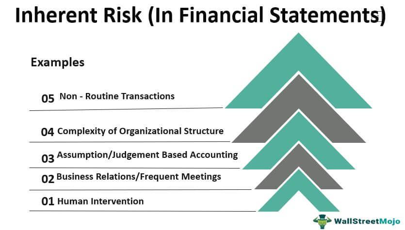

In today's financial landscape, understanding investment risk is crucial for both seasoned traders and novice investors. Investment risk fundamentally represents the possibility of losses or underperformance relative to an expected return, and it manifests in various forms, such as market risk, credit risk, and operational risk. These risks impact the stability and reliability of financial decisions, making it essential for investors to grasp the potential consequences thoroughly.

Financial terminology, including financial warnings, disclaimers, and algo trading, often intimidates with its complexity and jargon. Yet, deciphering these terms is vital for effective decision-making. Financial warnings and disclaimers, typically embedded in financial documents, are intended to inform investors about inherent risks. They provide transparency, highlighting the potential volatility and uncertainties of the investment environment.



Algorithmic trading, another significant advancement in the financial world, automates and optimizes trading decisions through computer programs, often executing trades at speeds beyond human capability. While this technology offers the possibility of substantial returns, it also introduces unique risks, such as market manipulation and technology failures. Understanding how algorithmic trading integrates with traditional investment practices can unveil new opportunities and challenges.

This article is designed to demystify these concepts, providing a clear understanding of their importance in investments. By exploring the scope of investment risk, the significance of financial warnings, and the dynamics of algorithmic trading, we aim to equip you with the knowledge required to navigate this complex ecosystem safely and effectively. Understanding these aspects is imperative for aligning your risk appetite with your financial goals, ultimately guiding you toward more informed and confident investment decisions.

## Table of Contents

## Understanding Investment Risk

Investment risk is a fundamental aspect of the financial world and is often misunderstood by investors. It refers to the possibility of losing some or all the original investment. Risk arises from various sources, and its assessment involves understanding both the potential for financial loss and the unpredictability of investment returns. Effective risk management is crucial for building a portfolio that matches an investor's financial goals and risk tolerance.

### Types of Investment Risks

Investment risks can be broadly categorized into market risk, credit risk, and operational risk:

1. **Market Risk**: This is the risk of losses due to factors that affect the entire market or asset class. Market risk is further divided into:
   - **Equity Risk**: The risk of loss because of a drop in the market price of shares.
   - **Interest Rate Risk**: This affects fixed-income investments like bonds. The value of a bond falls as interest rates rise.
   - **Currency Risk**: The potential for loss due to fluctuations in currency exchange rates, relevant for international investments.
   - **Commodity Risk**: The risk of losing money due to the change in commodity prices.

2. **Credit Risk**: This is the risk that a borrower will default on a loan or will not meet contractual obligations. It encompasses risks related to the creditworthiness of securities such as corporate bonds or credit default swaps.

3. **Operational Risk**: Arises from internal failures, such as management failures, fraud, or administrative errors. This is not directly linked to financial market changes but can lead to significant losses.

### Understanding and Managing Risk

To manage these risks, investors must understand the potential for financial loss and the unpredictability of returns. Calculating the standard deviation of returns or using Value at Risk (VaR) models can help in quantifying risk levels. Here's a simple Python example illustrating the calculation of standard deviation of returns:

```python
import numpy as np

def calculate_standard_deviation(returns):
    return np.std(returns)

investment_returns = [0.05, 0.02, -0.01, 0.04, 0.03]
std_dev = calculate_standard_deviation(investment_returns)
print(f"Standard Deviation of Returns: {std_dev:.4f}")
```

### Aligning with Financial Goals

Different investments come with varying levels of risk. High-risk investments might offer higher potential returns but also a higher chance of loss. Conversely, low-risk investments usually provide lower returns but greater security. It's crucial to align your investment strategy with your risk appetite and financial goals. For instance, a younger investor with a long-term horizon might afford to take on more risk compared to someone nearing retirement.

Evaluating risk is a continuous process, and investors should regularly assess whether their portfolio aligns with their risk profile and adjust accordingly. By understanding these various risks and using strategies such as diversification to mitigate them, investors can make more informed decisions to achieve their financial objectives.

## Financial Warnings and Disclaimers

Financial warnings and disclaimers are fundamental tools in the financial industry, serving the critical purpose of informing investors about the potential risks associated with various investment opportunities. These notices are an integral part of fostering transparency, providing a clearer picture of the uncertainties that could influence the financial outcomes of an investment.

Typically, financial warnings and disclaimers are located at the end of financial documents, reports, and websites. Despite their importance, they often go unnoticed by investors, resulting in a gap in understanding the associated risks. These disclaimers serve dual objectives: protecting investors by ensuring they are aware of potential financial losses, and shielding issuers from legal liabilities by clearly outlining the risks involved.

The financial landscape hosts a diverse range of disclaimers, each tailored to specific scenarios. Common examples include:

1. **Market Risk Warnings**: These disclaimers highlight the volatility of financial markets and the potential for loss due to market fluctuations. They often stress that past performance is not indicative of future results.

2. **Credit Risk Disclosures**: Focused on investments in debt instruments, these warnings inform investors about the possibility of a default by the issuer. They emphasize the importance of credit ratings and financial health assessments.

3. **Liquidity Risk Alerts**: Such disclaimers caution against the risks stemming from an investment's illiquidity, advising that assets may not be easily sold or may require a discount to sell quickly.

4. **Currency Risk Notices**: For investments involving foreign exchange, these disclaimers address the potential impact of exchange rate fluctuations on the investment's value.

5. **Regulatory and Compliance Disclaimers**: These documents inform about legal and regulatory risks, especially pertinent in investments that are subject to changing laws and regulations which could affect their viability or return.

Understanding these warnings requires careful interpretation. Investors should not only read these disclaimers thoroughly but also seek clarification or further information when necessary. It is advisable to maintain a proactive approach by aligning disclaimers with personal risk profiles and investment goals.

In practice, interpreting financial warnings can involve quantitative assessments of risk. For instance, statistical models such as Value at Risk (VaR) can quantify the potential loss in value of a portfolio with a given probability over a specified time frame. Simple Python code like the one below can simulate a basic VaR model:

```python
import numpy as np

# Assume a portfolio with mean return and standard deviation of returns
mean_return = 0.001  # hypothetical daily mean return
std_dev_return = 0.02  # hypothetical daily standard deviation

# Simulate daily returns for 1,000 days
np.random.seed(42)
daily_returns = np.random.normal(mean_return, std_dev_return, 1000)

# Calculate the VaR at 95% confidence level
confidence_level = 0.05
VaR = np.percentile(daily_returns, confidence_level * 100)
print("Value at Risk (VaR):", VaR)
```

Through such quantitative measures and by embracing the knowledge conveyed in financial warnings, investors can better safeguard their investments and take informed risks. Understanding the language and implications of financial disclaimers is not merely a regulatory formality but a quintessential part of prudent investment practices.

## Algorithmic Trading: Opportunities and Risks

Algorithmic trading, commonly referred to as algo trading, employs sophisticated computer algorithms to execute trades at high speeds and volumes, significantly faster than any human trader could achieve. This form of trading is predicated on complex mathematical models and uses pre-defined criteria like timing, price, or quantity to make decisions. The automation of trading provides the opportunity for potentially higher returns, as the algorithms can identify and exploit market inefficiencies almost instantaneously. Despite the efficiencies introduced, algo trading is not without risks, primarily technology failures and increased market [volatility](/wiki/volatility-trading-strategies).

### Opportunities

The primary advantage of [algorithmic trading](/wiki/algorithmic-trading) lies in its ability to process large volumes of data instantaneously, leading to rapid decision-making. This capability can create opportunities for traders to capitalize on fleeting market inefficiencies. Additionally, the lack of human emotion involved in trading decisions, which can often lead to suboptimal decision-making, is reduced through algorithmic approaches. Algo trading can also ensure more consistency in trading as orders are executed based on the algorithm set parameters without deviations due to emotional factors.

### Risks

However, the reliance on technology introduces significant risks. One such risk is a technology failure, which could be as simple as a computer crash or as complex as an algorithm behaving unexpectedly due to a programming error. Such failures can result in unintended trades, causing substantial financial losses. Additionally, algo trading can sometimes lead to market volatility, particularly if numerous algorithms react to the same market stimulus simultaneously. This scenario was evident during the Flash Crash of 2010 when automated sell orders triggered a sharp and rapid market decline.

### Balancing Automation and Human Oversight

To mitigate these risks, a balanced approach that includes human oversight is crucial. While the speed and efficiency of algorithmic trading provide opportunities, the role of human judgment remains indispensable, particularly in adapting to unexpected market conditions. For example, manual intervention may be necessary to modify or shut down an algorithmic strategy if it behaves unpredictably.

Given the complexity and speed of algorithmic trading environments, understanding the mechanics of these systems is vital for investors wanting to leverage their full benefits. Investors must maintain a clear strategy and incorporate risk management tools to safeguard against potential disruptions. These might include diversifying algorithms, implementing circuit breakers that automatically halt trading beyond predefined thresholds, and monitoring systems to provide alerts for irregular activity patterns. 

In conclusion, while algo trading offers significant advantages in terms of speed and data processing capabilities, it must be approached with caution and a thorough understanding to effectively balance its automation benefits against its inherent risks.

## The Role of Advisory and Quantification in Risk Management

Professional financial advisors play a crucial role in navigating the complexities of investment risk management. Their expertise helps individuals tailor risk management strategies according to specific financial circumstances and goals. Advisors evaluate various risk factors and guide investors in selecting investment portfolios that align with their risk tolerance and objectives. This personalized advice is invaluable, particularly as financial markets become increasingly complex.

Quantifying potential risks is fundamental in making well-informed investment decisions. It involves assessing the probability of adverse events and their potential impact on investment returns. Tools such as Value at Risk (VaR), Conditional Value at Risk (CVaR), and stress testing are commonly used to measure and analyze risks. For instance, VaR estimates the maximum expected loss over a specified period at a given confidence level. It's a critical step to ensure that investment strategies are resilient against market volatility and unforeseen events.

```python
import numpy as np

def calculate_var(returns, confidence_level=0.95):
    """
    Calculate the Value at Risk (VaR) of a portfolio.

    Parameters:
    returns (list or np.array): List of portfolio returns.
    confidence_level (float): The confidence level for VaR calculation.

    Returns:
    float: The calculated VaR.
    """
    mean_return = np.mean(returns)
    std_dev = np.std(returns)
    var = mean_return - std_dev * np.percentile(returns, (1-confidence_level)*100)
    return var

# Example usage
portfolio_returns = np.random.normal(0.01, 0.02, 1000)  # Simulated return data
var = calculate_var(portfolio_returns)
print(f"The estimated VaR at 95% confidence level is: {var}")
```

Continuous education is paramount for both investors and advisors to keep abreast of new financial products and risk management techniques. Financial markets are dynamic, and ongoing learning enables investors to adapt to innovations such as algorithmic trading and new asset classes. Advisors also benefit from professional development opportunities, equipping them with the latest tools and insights to guide clients effectively.

Investors should be proactive in seeking detailed explanations of financial products and their inherent risks. It's vital to engage in dialogues with advisors, asking questions until a comprehensive understanding is achieved. This approach not only empowers investors but also fosters a transparent client-advisor relationship, leading to better investment outcomes. Establishing a strong foundation of knowledge and maintaining open communication with financial professionals is essential for managing investment risks and achieving financial stability.

## Conclusion: Navigating the Investment Landscape

Navigating the investment landscape requires a comprehensive understanding of key financial warnings and investment disclaimers, playing a crucial role in safeguarding against potential losses. Recognizing that these communications serve as a form of investor protection helps prevent misunderstandings and misjudgments that may lead to financial detriment.

Algorithmic trading presents both opportunities and challenges. When harnessed with the proper expertise and vigilance, it can significantly enhance trading efficiency and profitability. However, it necessitates a cautious approach to manage inherent risks such as technical malfunctions and market fluctuations. The importance of technology in modern trading cannot be understated, but it must be balanced with thoughtful human oversight and strategic planning.

A prudent investment strategy should always align closely with one's risk tolerance and financial objectives. Understanding personal financial goals and the level of risk one is comfortable with is essential for making informed investment choices. For example, investors with a low risk tolerance might prefer more stable investment vehicles such as government bonds or dividend-paying stocks over volatile options like direct stock trading or highly leveraged instruments.

Moreover, when facing risk levels that exceed comfort thresholds, it is wise to consider lower-risk alternatives. Diversification often serves as a robust method for reducing overall portfolio risk. By spreading investments across different asset classes, sectors, or geographies, investors can mitigate the potential for significant losses. Assessing the risk-return tradeoff of each alternative can be simplified through tools and calculators available on financial platforms, thus aiding investors in making more sustainable choices.

Overall, successful navigation of the investment landscape is grounded in a thorough understanding of financial instruments, a careful assessment of personal risk tolerance, and the strategic implementation of technology when appropriate. Embracing these principles can lead to more resilient investment portfolios and more informed financial decision-making.

## References & Further Reading

[1]: Marcos Lopez de Prado. ["Advances in Financial Machine Learning"](https://www.amazon.com/Advances-Financial-Machine-Learning-Marcos/dp/1119482089). Wiley, 2018.

[2]: Ernest P. Chan. ["Quantitative Trading: How to Build Your Own Algorithmic Trading Business"](https://www.amazon.com/Quantitative-Trading-Build-Algorithmic-Business/dp/0470284889). Wiley, 2008.

[3]: John C. Hull. ["Risk Management and Financial Institutions"](https://www.amazon.com/Management-Financial-Institutions-Wiley-Finance/dp/1119932483). Wiley, 2018.

[4]: David Aronson. ["Evidence-Based Technical Analysis: Applying the Scientific Method and Statistical Inference to Trading Signals"](https://www.amazon.com/Evidence-Based-Technical-Analysis-Scientific-Statistical/dp/0470008741). Wiley, 2006.

[5]: Stefan Jansen. ["Machine Learning for Algorithmic Trading"](https://github.com/stefan-jansen/machine-learning-for-trading). Packt Publishing, 2020.

[6]: J. Bergstra, R. Bardenet, Y. Bengio, & B. Kégl. ["Algorithms for Hyper-Parameter Optimization."](https://dl.acm.org/doi/10.5555/2986459.2986743) Advances in Neural Information Processing Systems 24, 2011.