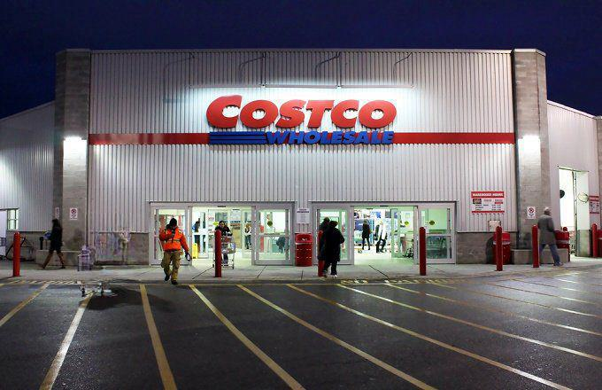

Investing in the stock market presents a unique combination of opportunities and risks that every investor must navigate. The potential for significant financial gain is available, yet it is accompanied by various risk factors that can affect investment outcomes. Understanding these risks is paramount for investors who aim to make informed decisions and optimize their investment strategies.

This article focuses on specific risks related to investing in Costco stock, the broader stock market, and the implications of algorithmic trading. Costco's business model, while strong, carries its own set of challenges, such as reliance on a membership structure and physical stores amid e-commerce trends. On a larger scale, stock market volatility and economic fluctuations pose additional risks. Furthermore, algorithmic trading has transformed market dynamics, offering advantages and creating new challenges in terms of market stability and manipulation.

In addition to outlining these risks, the article will also identify potential opportunities within these investment avenues. Costco's brand loyalty and consistent performance, alongside technological advancements in trading, present attractive prospects. By understanding the interaction between these elements, investors can enhance their ability to strategize effectively, aligning their investments with their financial goals.

## Table of Contents

## Understanding Investment Risks

Investment in the stock market is inherently risky due to several factors, including market volatility, economic influences, and company-specific events. Market volatility represents the fluctuation of stock prices over time, which can be caused by changes in investor sentiment, geopolitical events, or unexpected economic developments. For example, an unexpected [interest rate](/wiki/interest-rate-trading-strategies) hike by central banks can lead to market uncertainty, affecting investor confidence and stock prices.

Economic factors such as inflation rates, unemployment levels, and GDP growth also play a critical role. During periods of economic downturn, companies may face reduced consumer spending, impacting their revenues and, consequently, their stock prices. Conversely, a thriving economy can boost corporate performance and stock market valuations.

Company-specific events, such as changes in management, product recalls, or earnings announcements, directly impact the stock's performance. Investors must evaluate how these events affect not only the specific company but also the industry sector it belongs to. 

To mitigate these risks, investors widely adopt strategies like diversification—spreading investments across various asset classes, industries, or geographies to reduce exposure to any single asset's risk. For example, a portfolio composed of technology stocks, consumer goods, and bonds could better withstand market fluctuations than one concentrated in a single industry.

Thorough analysis is another critical strategy for mitigating investment risk. Investors should perform [fundamental analysis](/wiki/fundamental-analysis)—examining a company's financial statements, market position, and growth prospects—to determine an undervalued stock's intrinsic value. Technical analysis, which involves studying past market data and stock price charts, can also aid in predicting future movements.

Staying informed about market conditions is crucial for making timely and informed investment decisions. This includes tracking economic reports, following industry trends, and being aware of geopolitical developments. Investors who stay informed can better anticipate potential risks and adjust their portfolios accordingly.

In conclusion, while investment risks cannot be entirely eliminated, understanding and employing strategies like diversification, thorough analysis, and remaining informed about market conditions can significantly mitigate these risks and enhance the likelihood of favorable investment outcomes.

## Risks of Investing in Costco Stock

Costco Wholesale Corporation operates under a distinctive business model that utilizes membership sales and wholesale pricing to attract and retain customers. While this model has led to substantial growth and customer loyalty, it also introduces certain risks for investors considering Costco's stock.

One significant risk stems from the company's slower adoption of e-commerce strategies. Despite a strong physical presence with numerous warehouse stores, Costco lagged behind competitors in developing a robust online shopping infrastructure. This heavy reliance on physical stores becomes a strategic vulnerability as consumer behaviors shift increasingly towards online shopping. The risk is exacerbated during periods when physical store visits decrease, such as during health crises like the COVID-19 pandemic, which significantly altered consumer shopping habits [1].

Additionally, supply chain disruptions present another critical risk for Costco. The COVID-19 pandemic highlighted the vulnerabilities within global supply chains, causing delays and increased costs for retailers dependent on international suppliers. For Costco, which requires a consistent flow of goods to maintain its competitive pricing and inventory turnover, such disruptions can lead to inventory shortages and increased operational costs, adversely affecting profit margins [2].

Costco’s geographic reliance, particularly its heavy dependency on the California market, is a further risk [factor](/wiki/factor-investing). California is a significant consumer base for Costco, and regional economic downturns could have disproportionate impacts on the company's sales performance. Economic [volatility](/wiki/volatility-trading-strategies), regulatory changes, or natural disasters in California could affect consumer spending and, consequently, Costco's financial outcomes [3]. Such regional dependencies necessitate careful monitoring of economic and policy developments within key markets to mitigate localized risks.

By recognizing these risks, investors can better assess the potential volatility and challenges associated with investing in Costco’s stock. A thorough understanding of these factors is essential for making informed investment decisions.

**References:**

[1] Danziger, P. N. (2020). "Costco Shoppers Like Its ECommerce, But Target And Walmart Are Winning At Omnichannel." *Forbes*. Retrieved from https://www.forbes.com/

[2] Ivanov, D., & Dolgui, A. (2020). "Viability of intertwined supply networks: extending the supply chain resilience angles towards survivability." *International Journal of Production Research*, 58(10), 2904-2915.

[3] California Legislative Analyst's Office. (2020). "California's Economic Outlook." *LAO Publications*. Retrieved from https://lao.ca.gov/

## The Role of Algorithmic Trading in the Stock Market

Algorithmic trading, often referred to as algo trading, utilizes pre-programmed instructions and mathematical models to execute trades at high speed and [volume](/wiki/volume-trading-strategy). This approach has become increasingly prevalent in the stock market due to its ability to enhance trading efficiency and [liquidity](/wiki/liquidity-risk-premium). Algorithms analyze various market variables — such as price, timing, and volume — to make informed trading decisions without human intervention, often involving complex strategies like [arbitrage](/wiki/arbitrage), [market making](/wiki/market-making), or [statistical arbitrage](/wiki/statistical-arbitrage).

The benefits of [algorithmic trading](/wiki/algorithmic-trading) are considerable. Algorithms can process market data and execute trades much faster than humans, reducing transaction costs and responding quickly to minute market changes. This speed and efficiency contribute significantly to market liquidity, facilitating smoother transactions and more stable pricing mechanisms. The ability to rapidly execute trades also enables the exploitation of fleeting market opportunities, potentially increasing the profitability of trades.

However, algorithmic trading raises several concerns, particularly regarding market volatility and manipulation. High-frequency trading ([HFT](/wiki/high-frequency-trading-strategies)), a subset of algorithmic trading where computers perform a large number of orders at extremely high speeds, has been linked to increased market volatility. Events like the "Flash Crash" of May 6, 2010, where the U.S. stock market plunged and recovered rapidly within minutes, showcased how algorithmic trading could exacerbate market swings. The interlinked activities of trading algorithms across markets can lead to amplification of price movements and unintended feedback loops.

Moreover, algorithmic trading opens possibilities for market manipulation tactics such as spoofing, where traders use algorithms to place false orders with the intent to cancel them before execution to mislead other market participants about the demand or supply for a stock. These practices can undermine market integrity and investor confidence, prompting regulatory bodies to tighten scrutiny and enforce regulations to curb manipulative trading behaviors.

Investors must recognize the impact of algorithmic trading on stock prices and market dynamics. An understanding of how algorithms function and the potential risks involved can equip investors to navigate an increasingly complex trading environment. For example, they can incorporate strategies that consider potential algorithm-induced market fluctuations or leverage algorithmic trading themselves to enhance their trading practices. By staying knowledgeable about technological advancements and regulatory developments surrounding algorithmic trading, investors can better safeguard their investments and capitalize on emerging opportunities in the stock market.

## Opportunities in Costco and Algorithmic Trading

Costco Wholesale Corporation, with its robust membership-based business model, presents several growth opportunities. This model fosters strong customer loyalty, which has been instrumental in Costco's ability to generate consistent revenue streams. As a result, Costco can maintain competitive pricing, contributing to a steady increase in membership renewals and attracting new customers. The company’s emphasis on high-quality private label products further cements customer trust and engenders loyalty. Additionally, Costco's international expansion efforts are broadening its market reach, offering substantial growth potential in emerging markets.

The emergence of e-commerce as a dominant retail channel provides another opportunity for Costco. The company's recent advancements in e-commerce capabilities suggest a strategic shift to capture the expanding online consumer base. By enhancing its digital platforms and integrating in-store and online shopping experiences, Costco can capitalize on the increasing trend of online shopping, thereby driving further membership growth and sales.

On the other hand, algorithmic trading, which relies on using automated systems to execute trades at high speeds and frequency, presents several opportunities in the stock market. It offers the potential for faster order execution, precise timing, and systematic strategy implementation, which can enhance trading profitability. Algorithms can analyze extensive datasets in real time to identify trends and execute trades that capitalize on fleeting market opportunities. However, exploiting these opportunities requires a deep understanding of market dynamics and technological infrastructure.

To capitalize on the benefits of algorithmic trading, investors need to stay informed about current technological trends and continuously adapt their strategies. Leveraging [machine learning](/wiki/machine-learning) and [artificial intelligence](/wiki/ai-artificial-intelligence) can further enhance algorithmic trading systems, enabling the development of more sophisticated trading strategies that can predict price movements with a higher degree of accuracy. Nonetheless, the successful application of algorithmic trading demands rigorous [backtesting](/wiki/backtesting) of strategies and constant monitoring for robustness and adaptability to market changes.

In conclusion, the opportunities present in Costco's business model and advancements in algorithmic trading highlight the potential for growth and profitability. By remaining vigilant and informed, investors can strategically position themselves to harness these opportunities while navigating the inherent risks of the stock market.

## Conclusion

Investing in Costco stock requires careful consideration of inherent risks and rewards. The company’s business model, which emphasizes membership sales and competitive pricing, has proven successful but is not without vulnerabilities. Investors must be aware of the challenges posed by shifts in consumer behavior, such as the transition to online shopping, as well as operational risks like supply chain disruptions and regional economic dependencies, notably in California.

Algorithmic trading introduces additional complexities to stock market investments. While it can enhance market efficiency and offer new avenues for profit, it also poses risks related to market volatility and potential manipulation. Understanding these dynamics is crucial for investors looking to navigate the modern trading landscape.

By comprehensively analyzing the risks associated with Costco stock and recognizing the impacts of algorithmic trading, investors can develop strategies that suit their risk tolerances and financial objectives. This includes employing risk mitigation techniques such as diversification and maintaining an informed perspective on market trends. Ultimately, informed decision-making is key to achieving favorable investment outcomes in an ever-evolving market environment.

## References & Further Reading

[1]: Danziger, P. N. (2020). ["Costco Shoppers Like Its ECommerce, But Target And Walmart Are Winning At Omnichannel."](https://www.forbes.com/sites/pamdanziger/) Forbes.

[2]: Ivanov, D., & Dolgui, A. (2020). ["Viability of intertwined supply networks: extending the supply chain resilience angles towards survivability."](https://www.tandfonline.com/doi/full/10.1080/00207543.2020.1750727) International Journal of Production Research, 58(10), 2904-2915.

[3]: California Legislative Analyst's Office. (2020). ["California's Economic Outlook."](https://lao.ca.gov/reports/2020/4297/fiscal-outlook-111820.pdf) LAO Publications.

[4]: López de Prado, M. (2018). ["Advances in Financial Machine Learning."](https://www.amazon.com/Advances-Financial-Machine-Learning-Marcos/dp/1119482089) Wiley.

[5]: Aronson, D. R. (2007). ["Evidence-Based Technical Analysis: Applying the Scientific Method and Statistical Inference to Trading Signals."](https://onlinelibrary.wiley.com/doi/book/10.1002/9781118268315) Wiley.