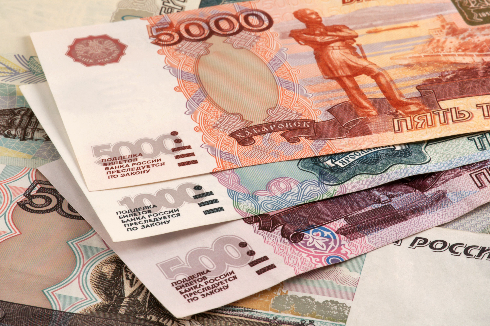

Investing in Russia offers a dual-edged sword of substantial opportunities and considerable risks, particularly when approached through algorithmic trading. Algorithmic trading leverages automated systems to execute trades based on complex algorithms and voluminous data sets. This method provides traders with enhanced speed and efficiency, critical in harnessing fleeting market opportunities. Yet, the risks associated with operating in volatile markets like Russia's should not be underestimated.

Russia's market landscape is marked by a combination of political and economic complexities. Political instability, highlighted by actions such as the annexation of Crimea, has resulted in economic sanctions that substantially influence market dynamics. These geopolitical factors introduce uncertainties that algorithmic trading strategies typically strive to minimize. Furthermore, Russia's economy is heavily reliant on its abundant natural resources, such as oil and gas, making it susceptible to global commodity price fluctuations. These fluctuations can create significant market volatility, posing challenges and opportunities for algorithmic traders seeking sizeable returns.



This article will explore how the various dimensions of Russia's market risks impact algorithmic trading strategies. A thorough understanding of the state of Russia's economy and its primary sectors will set the base. Market volatility, regulatory hurdles, and operational risks will be analyzed to comprehend the extensive investment landscape. This comprehensive approach aims to offer insights into navigating the intricate environment that Russia's financial markets present to algorithmic traders.

## Table of Contents

## Russia's Economic and Political Landscape

Russia's economy, abundant in natural resources like oil, gas, and minerals, offers significant opportunities for investment. These resources form the backbone of the Russian economy, contributing substantially to its GDP and export revenue. However, the economy's heavy reliance on commodities renders it susceptible to global price fluctuations. This sensitivity to international market dynamics presents both opportunities and challenges for algorithmic traders.

Political decisions have profoundly impacted Russia's economic landscape. Notably, the annexation of Crimea in 2014 and military involvement in Ukraine have led to a series of international sanctions imposed by Western nations. These sanctions have targeted various sectors, including finance, energy, and military, resulting in restricted access to international capital markets for Russian companies and increasing trade barriers. Consequently, these geopolitical developments have disrupted market dynamics, exacerbating economic volatility and uncertainty.

For algorithmic trading, which depends heavily on consistency and predictability, the volatility induced by geopolitical tensions and economic sanctions poses significant challenges. Traders must contend with sudden shifts in market conditions that can adversely affect algorithmic strategies designed for stable environments. The lack of predictability in policy and market reactions requires adjustments to traditional trading algorithms, often necessitating more dynamic and flexible models.

To navigate these political and economic challenges, traders can employ diversification and hedging strategies. Diversification involves spreading investments across different asset classes or geographical regions to mitigate risk. By not relying solely on Russia’s volatile sectors, traders can cushion their portfolios against adverse market movements. Hedging, on the other hand, uses financial instruments like options and futures to offset potential losses from market [volatility](/wiki/volatility-trading-strategies). These strategies can be particularly beneficial in managing risks associated with Russia’s unpredictable market landscape.

Algorithmic traders focusing on Russia need to constantly adapt their strategies to evolving geopolitical scenarios. By integrating real-time data analysis and maintaining a diverse range of trading models, traders can enhance their ability to respond to political and economic developments. This approach can help mitigate risks and leverage the opportunities that Russia’s resource-rich economy presents.

## Market Volatility and Its Impact on Algo Trading

Market volatility is a pivotal concern for algorithmic traders operating in Russia. The Russian stock market, characterized by its sensitivity to both domestic and international factors, exhibits pronounced volatility that can challenge trading systems built on predictable patterns. This volatility arises from abrupt shifts in commodity prices, geopolitical tensions, economic sanctions, and variations in global demand.

Commodities like oil and gas form the backbone of Russia's economy. Consequently, fluctuations in their prices, often triggered by geopolitical events or modifications in international supply chains, significantly affect market stability. For instance, geopolitical tensions such as the ongoing conflicts in Ukraine or new sanctions can create unpredictable spikes or dips in commodity prices, subsequently impacting the stock market.

To navigate these fluctuations, algo traders must employ robust risk management strategies. One effective approach is the implementation of stop-loss orders, which automatically execute a sale when a stock reaches a predetermined price. This helps limit potential losses by exiting a position before the market moves adversely further. Another strategy is scaling positions, where trades are adjusted incrementally rather than all at once, allowing traders to react more fluidly to market conditions.

Moreover, a comprehensive understanding of the Russian market—considering both economic indicators and geopolitical elements—is crucial. Traders need to analyze various factors contributing to volatility systematically to align their algorithmic strategies with the prevailing market environment. This might involve integrating real-time data feeds that capture economic news and price changes, enabling algorithms to adjust positions dynamically.

In essence, while Russia's market presents considerable challenges due to its inherent volatility, employing effective risk management tactics and maintaining a vigilant stance on market influencers can enable algorithmic traders to optimize their trading outcomes. By leveraging technology and strategic foresight, traders can transform potential volatility-driven setbacks into opportunities for profit.

## Operational and Regulatory Risks

Operational and regulatory risks are paramount concerns for algorithmic traders operating within Russia's financial markets. While technological advancements provide a competitive edge, they also introduce vulnerabilities that can disrupt trading activities. Technology failures, cybersecurity threats, and compliance issues form the triad of operational risks that must be managed meticulously.

**Technology Failures and IT Infrastructure**

Algorithmic trading platforms depend heavily on robust IT infrastructure to ensure seamless operation. Any disruptions, be it software glitches or hardware malfunctions, can result in significant financial losses. Maintaining a high standard of IT infrastructure is essential to prevent unexpected downtime. Regular system updates and checks are critical to identify and rectify potential vulnerabilities early on.

```python
# Example of a simple system check script in Python
import subprocess

def check_system_health():
    try:
        # Perform a simple health check by pinging a reliable server
        response = subprocess.run(['ping', '-c', '3', '8.8.8.8'], capture_output=True)
        if response.returncode == 0:
            print("System is stable")
        else:
            print("System check failed, review required")
    except Exception as e:
        print(f"Error occurred: {e}")

check_system_health()
```

**Cybersecurity Threats**

Cybersecurity forms the backbone of secure trading operations. Financial markets are prime targets for cyber attacks due to the high-value transactions involved. Protecting sensitive data and ensuring the integrity of trading algorithms against breaches is crucial. Implementing advanced encryption methods and utilizing firewalls are foundational practices to secure trading environments. Moreover, regular cybersecurity audits can help to identify and mitigate potential threats.

**Regulatory Compliance and Transparency**

Navigating Russia's regulatory environment poses distinct challenges due to varying degrees of transparency and frequent policy changes. Algorithmic traders must ensure compliance with both domestic regulations and international trading laws. This requires a thorough understanding of local financial policies and active engagement with regulatory bodies to stay updated on policy shifts.

The Russian financial market’s regulatory framework may often lack the transparency seen in other global markets, necessitating traders to be proactive in compliance. Utilizing compliance management systems can aid in tracking regulatory developments and ensuring adherence to legal requirements.

**Conclusion**

Operational and regulatory risks in Russia require a holistic approach focused on technological reliability, robust cybersecurity measures, and vigilant compliance management. By addressing these facets, algorithmic traders can better mitigate risks associated with the dynamic and often opaque Russian financial landscape, thereby enhancing their potential for successful trading outcomes.

## Corruption and Ethical Concerns

Corruption is a significant concern for foreign investors in Russia, posing substantial risks that can undermine the success of [algorithmic trading](/wiki/algorithmic-trading) operations. Transparency International's Corruption Perceptions Index consistently ranks Russia poorly, highlighting systemic issues that traders must navigate (Transparency International, 2023). The severity of these issues is compounded by occurrences of corporate fraud and government intervention, which can distort market conditions and create unpredictable trading environments.

For algorithmic traders, the ethical considerations in Russian markets are critical. Aligning trading operations with global ethical standards is not only a moral obligation but also a strategic necessity to maintain investor confidence and safeguard business interests. Ethical trading practices should encompass robust due diligence processes and transparency in operations, helping to mitigate risks associated with corrupt practices.

Integrating these ethical considerations into a comprehensive risk management framework is crucial. A well-structured approach might involve:

1. **Enhanced Due Diligence:** Perform thorough background checks on Russian business partners and entities to ensure compliance with international anti-corruption standards. This can involve researching company histories, financial stability, and any potential red flags in their past operations.

2. **Risk Assessment Tools:** Utilize advanced analytical tools to assess the risk levels associated with specific trades and partners. Machine learning algorithms can be employed to detect anomalies or patterns that may indicate corrupt practices. For instance, anomaly detection models can be implemented in Python to flag unusual transactions:

   ```python
   import pandas as pd
   from sklearn.ensemble import IsolationForest

   # Load trading data
   data = pd.read_csv('trading_data.csv')
   model = IsolationForest(contamination=0.1)
   data['anomaly'] = model.fit_predict(data[['transaction_value', 'partner_id']])

   anomalies = data[data['anomaly'] == -1]
   ```

3. **Regulatory Compliance:** Stay abreast of international and local regulations to ensure that trading activities comply with legal frameworks. Understanding the legal landscape helps in identifying areas where corruption is most likely to occur and adjusting strategies accordingly.

4. **Ethical Training Programs:** Implement training sessions for employees and trading partners to promote ethical behavior and awareness of corruption risks. These programs should emphasize the importance of transparency, honesty, and integrity in all business dealings.

5. **Transparent Reporting:** Foster a culture of transparency by maintaining open lines of communication with stakeholders and providing detailed reports on trading activities and financial performance. This approach can enhance trust and reduce the perception of corruption.

By embedding these practices within an algorithmic trading framework, traders can better manage the ethical risks associated with investing in Russia. This proactive stance not only aligns with global standards but also serves to enhance the overall resilience and effectiveness of trading strategies in a challenging market environment.

## Adapting Algorithmic Strategies to Russian Markets

Algorithmic trading in Russia requires a nuanced understanding of the market’s unique characteristics and environmental factors. Given the country’s economic and political landscape, a tailored approach can enhance the effectiveness of algorithmic strategies. 

### Portfolio Diversification and Real-Time Data Feeds

Portfolio diversification acts as a fundamental risk management tool, reducing exposure to market-specific risks associated with Russia’s volatile economy. By diversifying across different asset classes and geographical regions, traders can buffer the impact of adverse events that may affect specific sectors or companies within Russia. For example, a well-diversified portfolio might include assets in energy, finance, and technology sectors, potentially spanning markets beyond Russian borders.

Real-time data feeds are critical for algorithmic traders to make informed decisions. In volatile markets like Russia, where geopolitical events can rapidly alter market dynamics, access to timely and accurate data is indispensable. Utilizing advanced data analytics and [machine learning](/wiki/machine-learning), traders can process vast amounts of real-time data efficiently. Python, with libraries like Pandas and NumPy, can be used for data manipulation and analysis:

```python
import pandas as pd

# Example of loading and processing market data
data = pd.read_csv('market_data.csv')
data['Time'] = pd.to_datetime(data['Time'])
data = data.set_index('Time')

# Calculate moving averages
data['SMA_50'] = data['Price'].rolling(window=50).mean()
data['SMA_200'] = data['Price'].rolling(window=200).mean()

# Visualize moving averages
data[['Price', 'SMA_50', 'SMA_200']].plot(figsize=(10, 6))
```

### Agile Strategy Adjustments

Flexibility in strategy is essential due to the dynamic nature of Russian markets. Algorithmic systems must be designed to adapt to changing conditions quickly. Enabling the algorithmic model to switch between different strategies based on market conditions can enhance resilience. For instance, a trader might employ [momentum](/wiki/momentum)-based strategies during periods of stable growth but switch to mean-reversion techniques in more volatile periods.

Moreover, implementing stop-loss orders and leveraging trading algorithms with built-in [artificial intelligence](/wiki/ai-artificial-intelligence) capabilities can help mitigate risks. Such algorithms adjust their parameters in reaction to market signals, which can be pre-defined using machine learning techniques to predict market trends.

### Exploiting Market Inefficiencies

Russia's market, suffused with inefficiencies arising from regulatory challenges and geopolitical influences, presents opportunities for algorithmic traders. By identifying patterns or [arbitrage](/wiki/arbitrage) opportunities overlooked by human traders or less sophisticated algorithms, traders can exploit these inefficiencies for potential gains. Automating the identification and execution of trades further enhances the capability to act on these opportunities.

### Conclusion

Adapting algorithms to cater to the nuances of Russian markets requires strategic diversification, access to real-time data, and flexibility in trading models. By incorporating these adaptive measures, traders can effectively manage risks and leverage the unique opportunities available within Russia’s market landscape. Thus, a comprehensive and dynamic trading strategy is pivotal for navigating the complexities of algorithmic trading in Russia.

## Conclusion

Investing in Russia via algorithmic trading offers substantial yet intricate opportunities, characterized by heightened risks alongside the prospect of significant rewards. To navigate Russia's volatile and frequently unpredictable market environment, traders must adopt comprehensive risk management strategies. This involves a careful assessment and anticipation of market fluctuations, geopolitical tensions, regulatory changes, and the inherent operational risks within the Russian context.

Diligent preparation forms the cornerstone of successful algorithmic trading in Russia, requiring traders to develop robust systems capable of withstanding market anomalies and external shocks. This entails implementing cutting-edge technology solutions for real-time data analysis, robust cybersecurity measures to safeguard trading operations, and consistent evaluation and updating of trading algorithms to reflect current market dynamics.

An adaptive approach is essential, enabling traders to modify strategies in response to emerging trends and conditions in the Russian market. This necessitates a flexible framework that supports swift decision-making and strategic adjustments, balancing aggressiveness with caution as dictated by market signals.

Python, a favored language for algorithmic trading due to its powerful libraries and community support, can serve as a useful tool for developing these adaptive systems. For example, utilizing libraries such as pandas for data manipulation and PyAlgoTrade for building evidence-based strategies can enhance the ability to respond dynamically to market changes.

Ultimately, while the landscape poses numerous challenges, a well-executed and intelligently managed trading approach can harness the potential gains in Russia’s complex investment setting, turning obstacles into opportunities for growth.

## References & Further Reading

[1]: O’Rourke, A. D. (2020). ["The Rise of Algorithmic Trading in Russia."](https://www.taylorfrancis.com/books/mono/10.1201/9780203719091/world-apple-market-andrew-rourke) Russian Economic Monitor.

[2]: Transparency International. (2023). ["Corruption Perceptions Index."](https://www.transparency.org/en/cpi/2023) Transparency International.

[3]: Auty, R. M. (2001). ["Resource Abundance and Economic Development"](https://digitallibrary.un.org/record/540449) by Richard M. Auty.

[4]: López de Prado, M. (2018). ["Advances in Financial Machine Learning"](https://www.amazon.com/Advances-Financial-Machine-Learning-Marcos/dp/1119482089) Wiley.

[5]: Korzeb, Z., & Korzeb, M. (2021). ["Influence of Political Factors on Economic Sanctions in Russia."](https://www.researchgate.net/profile/Zbigniew-Korzeb-2) Eastern European Economics.

[6]: Chan, E. P. (2008). ["Quantitative Trading: How to Build Your Own Algorithmic Trading Business"](https://github.com/ftvision/quant_trading_echan_book) Wiley.

[7]: Jansen, S. (2020). ["Machine Learning for Algorithmic Trading: Predictive Models to Extract Signals from Market and Alternative Data for Systematic Trading Strategies."](https://www.amazon.com/Machine-Learning-Algorithmic-Trading-alternative/dp/1839217715) Packt Publishing.