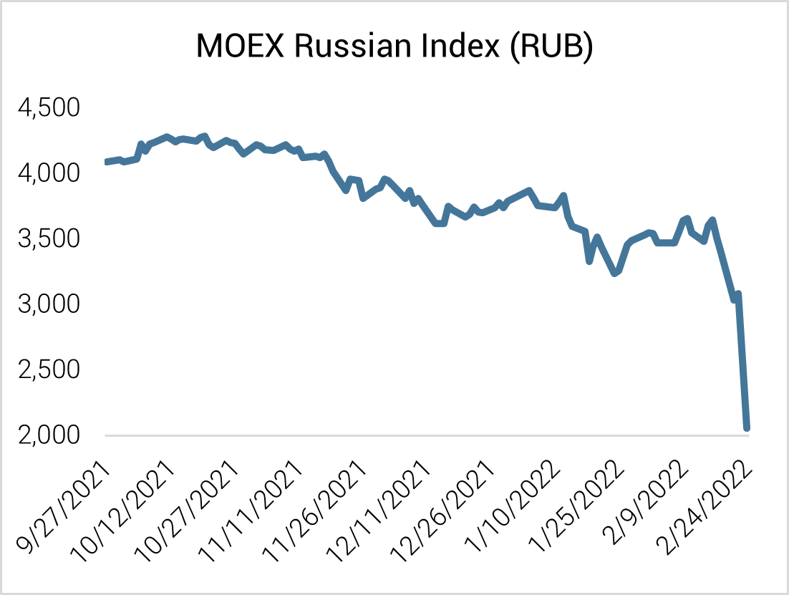

## Table of Contents

## What are the basic types of investment risks in Russia?

Investing in Russia comes with several types of risks that you should know about. One big risk is political risk. This means that changes in the government or laws can affect your investments. Russia has had some political instability in the past, which can make investing there risky. Another risk is economic risk. This happens when the economy of Russia goes up and down. If the economy does badly, your investments might lose value.

Another type of risk is currency risk. This is when the value of the Russian ruble changes compared to other currencies. If the ruble gets weaker, your investment might be worth less in your home currency. There's also market risk, which is when the stock market in Russia goes down. This can happen for many reasons, like global economic changes or local events.

Lastly, there's regulatory risk. This means that the rules for investing in Russia can change suddenly. The government might decide to put new rules in place that affect how you can invest or what you can invest in. All these risks together make investing in Russia something you need to think about carefully.

## How does political instability affect investments in Russia?

Political instability in Russia can make investing there risky. When the government changes or there are big political events, it can shake up the whole country. This can make businesses unsure about what will happen next. If businesses are unsure, they might not want to invest in new projects or expand. This can slow down the economy and make the value of your investments go down.

Also, political instability can lead to new laws or regulations that affect how you can invest. The government might suddenly change the rules about foreign investments or put new taxes in place. This can make it hard to predict what will happen to your money. If the political situation is unstable, it might be safer to wait and see what happens before putting your money into Russian investments.

## What are the economic factors that increase investment risks in Russia?

Economic factors can make investing in Russia risky. One big [factor](/wiki/factor-investing) is how the economy grows or shrinks. If the Russian economy is not doing well, businesses might struggle, and the value of your investments could go down. Another factor is inflation. When prices go up a lot in Russia, it can make money worth less over time. This can hurt the returns on your investments.

Another important factor is the global price of oil and gas. Russia's economy depends a lot on selling these resources. If the prices of oil and gas drop, it can hurt the whole country's economy. This can make your investments less valuable. Also, Russia sometimes has trouble with getting money from other countries. If other countries put limits on sending money to Russia, it can be hard to get your investment money back.

Lastly, the way Russia's economy is set up can add to the risks. The government has a big say in how businesses run, and this can lead to sudden changes in rules or taxes. If the government decides to change things quickly, it can be hard to know what will happen to your investments. All these economic factors together can make investing in Russia more uncertain.

## How do currency fluctuations impact investments in Russia?

Currency fluctuations can really affect your investments in Russia. When the value of the Russian ruble goes up and down compared to other currencies, it can change how much your investment is worth. If the ruble gets weaker, the value of your investment in your home currency could go down. This means that even if your investment is doing well in Russia, you might get less money when you change it back to your own currency.

On the other hand, if the ruble gets stronger, your investment could be worth more in your home currency. But, this can be hard to predict because currency values can change quickly because of things like the global economy or what the Russian government does. So, when you're thinking about investing in Russia, you need to keep an eye on what's happening with the ruble to understand how it might affect your money.

## What are the legal and regulatory risks for investors in Russia?

Legal and regulatory risks in Russia can be a big worry for investors. The government in Russia can change the rules about investing without much warning. This means that laws about taxes, how you can invest, or what you can invest in might change suddenly. If you're not ready for these changes, it can hurt your investments. For example, the government might decide to put new limits on foreign investors or change how much tax you have to pay on your earnings.

Another risk is that the legal system in Russia can be hard to understand and sometimes not very clear. If you have a problem with your investment, like a business deal that goes wrong, it can be tough to get help from the courts. The rules might not be the same everywhere in Russia, and sometimes the government can step in and change things. This can make it risky to invest because you might not be sure if the law will protect your money.

## How does corruption influence investment risks in Russia?

Corruption can make investing in Russia more risky. When people in power ask for bribes or use their position to help their friends instead of following the rules, it can make it hard to trust that your investment will be safe. If you need to pay bribes to get things done, it can cost you more money and make your investment less profitable. Also, corruption can mean that businesses that play by the rules might not do as well as those that don't, which can make the market unfair.

This kind of corruption can also make it hard to predict what will happen to your investment. If the government changes the rules to help certain people or businesses, it can hurt your investment without warning. For example, if a company you invested in loses a big contract because someone else paid a bribe, your investment could lose value. All these things together can make investing in Russia feel like a bigger gamble because corruption adds another layer of risk.

## What role does the Russian stock market play in investment risks?

The Russian stock market can make investing risky because it can go up and down a lot. This is called market risk. When the stock market in Russia drops, the value of your investments can go down too. This can happen because of many things, like problems in Russia's economy or big changes in the world. If you invest in Russian stocks, you need to be ready for these ups and downs and know that your money might not be as safe as in a more stable market.

Also, the Russian stock market can be affected by things like the government's rules and what's happening with oil and gas prices. If the government changes the rules suddenly, it can shake up the market. And because Russia makes a lot of money from oil and gas, if those prices go down, it can hurt the stock market. So, when you're thinking about investing in Russia, you need to keep an eye on these things to understand the risks better.

## How do international sanctions affect investment opportunities in Russia?

International sanctions can make it harder to invest in Russia. When other countries put sanctions on Russia, it can limit how much money can go in and out of the country. This means that if you want to invest in Russia, you might find it tough to send your money there. Also, if you want to take your money out later, the sanctions might make that harder too. This can make investing in Russia riskier because you might not be able to move your money around as easily as you'd like.

Sanctions can also affect the businesses you might want to invest in. If a company in Russia can't trade with certain countries because of sanctions, it might not do as well. This can make the value of your investment go down. Plus, sanctions can make the whole Russian economy weaker, which can lead to more ups and downs in the stock market. So, when you're thinking about investing in Russia, you need to think about how sanctions might change things and make your investment less safe.

## What are the specific risks associated with investing in Russian real estate?

Investing in Russian real estate can be risky because of the country's economy. If the economy is not doing well, it can be hard to find people who want to rent or buy your property. This means you might not make as much money from your investment. Also, if the value of the ruble goes down, your property might be worth less in your home currency. This can make it harder to sell your property for a good price if you decide to leave Russia.

Another risk is the legal system in Russia. The rules about owning property can be confusing and might change suddenly. If you have a problem with your property, like a disagreement with someone else who says they own it, it can be hard to get help from the courts. Corruption can also be a problem. If you need to pay bribes to get things done, it can cost you more money and make your investment less profitable. All these things together can make investing in Russian real estate feel like a bigger risk.

## How can investors mitigate risks when investing in Russian commodities?

When you invest in Russian commodities like oil and gas, you need to be careful because the prices can go up and down a lot. One way to lower the risk is to spread your money around. Instead of putting all your money into Russian commodities, you can invest in different types of commodities from other countries too. This way, if the price of Russian oil or gas drops, you might still make money from other investments. Another thing you can do is to keep an eye on what's happening with the global economy and the rules in Russia. If you know what might affect commodity prices, you can make better choices about when to buy or sell.

Also, it's a good idea to work with people who know a lot about the Russian market. They can help you understand the risks better and find good opportunities. Sometimes, using financial tools like futures contracts can help you protect your investment. These tools let you agree on a price for commodities in the future, so you know what you'll get even if the market changes. By being smart about how you invest and staying informed, you can lower the risks of investing in Russian commodities.

## What advanced strategies can be used to manage investment risks in Russia?

One advanced strategy to manage investment risks in Russia is to use hedging techniques. Hedging means you take steps to protect your investment from big changes in the market. For example, you can use financial tools like options or futures contracts to lock in prices for commodities like oil or gas. This way, if the price of these commodities goes down, you won't lose as much money. Another way to hedge is by investing in currencies. If you think the ruble might get weaker, you can buy other currencies to balance out the risk. By using these tools, you can make your investments safer even when the market is unpredictable.

Another strategy is to diversify your investments not just within Russia but also globally. Instead of putting all your money into Russian stocks or real estate, you can spread it out across different countries and types of investments. This way, if something bad happens in Russia, like a sudden change in laws or a drop in the economy, your other investments might still do well. You can also invest in different sectors within Russia, like technology or agriculture, to reduce the risk of being too focused on one area. By spreading your money around, you can lower the chance that one problem will hurt all your investments.

Lastly, staying informed and working with experts can help you manage risks better. Keep an eye on what's happening in Russia's economy, politics, and international relations. This can help you predict changes that might affect your investments. Working with local experts or financial advisors who know the Russian market well can give you valuable advice and help you make smarter choices. They can guide you through the complex rules and help you find the best opportunities while avoiding the biggest risks. By combining these strategies, you can better protect your investments in Russia.

## How do geopolitical tensions impact long-term investment strategies in Russia?

Geopolitical tensions can make long-term investing in Russia risky. When countries don't get along, they might put sanctions on Russia. This can make it hard to move money in and out of the country. If you want to invest in Russia for a long time, you need to think about how these tensions might change things. For example, if Russia has problems with other big countries, it can hurt the economy and make your investments less valuable. So, you need to be ready for these ups and downs and think about how to protect your money.

One way to deal with these risks is to spread your investments around. Instead of putting all your money into Russia, you can invest in other countries too. This way, if something bad happens because of geopolitical tensions, your other investments might still do well. Another thing you can do is to keep learning about what's happening in the world. If you know about the tensions between countries, you can make better choices about when to buy or sell your investments. By being smart and staying informed, you can make your long-term investments in Russia safer.

## References & Further Reading

[1]: O’Rourke, A. D. (2020). ["The Rise of Algorithmic Trading in Russia."](https://www.taylorfrancis.com/books/mono/10.1201/9780203719091/world-apple-market-andrew-rourke) Russian Economic Monitor.

[2]: Transparency International. (2023). ["Corruption Perceptions Index."](https://www.transparency.org/en/cpi/2023) Transparency International.

[3]: Auty, R. M. (2001). ["Resource Abundance and Economic Development"](https://digitallibrary.un.org/record/540449) by Richard M. Auty.

[4]: López de Prado, M. (2018). ["Advances in Financial Machine Learning"](https://www.amazon.com/Advances-Financial-Machine-Learning-Marcos/dp/1119482089) Wiley.

[5]: Korzeb, Z., & Korzeb, M. (2021). ["Influence of Political Factors on Economic Sanctions in Russia."](https://www.researchgate.net/profile/Zbigniew-Korzeb-2) Eastern European Economics.

[6]: Chan, E. P. (2008). ["Quantitative Trading: How to Build Your Own Algorithmic Trading Business"](https://github.com/ftvision/quant_trading_echan_book) Wiley.

[7]: Jansen, S. (2020). ["Machine Learning for Algorithmic Trading: Predictive Models to Extract Signals from Market and Alternative Data for Systematic Trading Strategies."](https://www.amazon.com/Machine-Learning-Algorithmic-Trading-alternative/dp/1839217715) Packt Publishing.