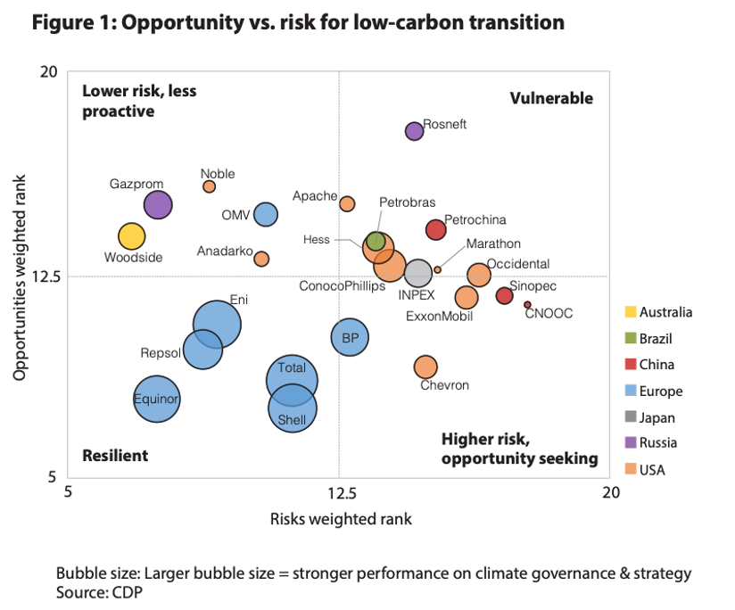

## Table of Contents

## What are the basic types of risks associated with investing in oil and gas companies?

Investing in oil and gas companies can be risky because of several factors. One major risk is the fluctuation in oil and gas prices. When prices go down, these companies can lose a lot of money, which can affect their stock prices and the returns on your investment. Another risk comes from the costs of exploring and drilling for new oil and gas. These activities can be very expensive and there's no guarantee that they will find enough oil or gas to make a profit.

There are also environmental and regulatory risks. Oil and gas companies can face big fines and legal problems if they harm the environment. Governments can also change laws and regulations, which can make it harder and more expensive for these companies to operate. This can lead to lower profits and impact the value of your investment.

Lastly, geopolitical risks can affect oil and gas investments. Many oil and gas reserves are located in politically unstable regions. Conflicts or changes in government policies in these areas can disrupt the supply of oil and gas, causing prices to go up and down unpredictably. This can make investing in these companies even riskier.

## How do oil price fluctuations impact the financial stability of oil and gas companies?

Oil price fluctuations can really shake up the financial stability of oil and gas companies. When oil prices drop, these companies make less money from selling their oil. This can make it hard for them to pay for all their costs like drilling new wells or keeping their old ones running. If prices stay low for a long time, companies might have to borrow money or even sell assets to keep going. This can make their financial situation very unstable and risky.

On the other hand, when oil prices go up, oil and gas companies can make more money. They can use this extra money to pay off debts, invest in new projects, or give more money back to their shareholders. But high prices can also bring problems. If prices go up too fast, it might encourage too much drilling and lead to a future drop in prices. Plus, if companies start spending a lot when prices are high, they might be in trouble if prices fall again. So, oil price fluctuations can make it hard for these companies to plan and stay financially stable.

## What are the geopolitical risks that can affect oil and gas investments?

Geopolitical risks can really shake up oil and gas investments. These risks come from political problems in countries that have a lot of oil and gas. For example, if there's a war or a big change in government in these countries, it can mess up the supply of oil and gas. This can make prices go up and down a lot, which is bad for investors. Also, some countries might decide to cut back on how much oil they sell to other countries, which can cause big problems for oil and gas companies that rely on those supplies.

Another big geopolitical risk is sanctions. Sometimes, countries put sanctions on other countries that produce oil and gas. This means they can't buy oil from those places anymore, or it becomes much harder and more expensive. When this happens, it can cause a big drop in the amount of oil available, which can make prices go up a lot. This can hurt oil and gas companies that were counting on that oil, and it can make their stock prices go down, affecting investors' returns.

Overall, geopolitical risks can make it hard for oil and gas companies to plan and stay stable. Investors need to keep an eye on what's happening around the world because these risks can change quickly and have a big impact on their investments.

## How does environmental regulation impact the operations and profitability of oil and gas companies?

Environmental regulations can make it harder and more expensive for oil and gas companies to do their work. These rules are made to protect the environment, but they can mean that companies have to spend a lot of money on things like cleaning up pollution or making sure their operations don't harm nature. For example, they might need to use special equipment or follow strict rules about how they drill for oil. All of this can add up to big costs, which can eat into the company's profits. If the costs get too high, it might even make some projects not worth doing at all.

On top of the direct costs, environmental regulations can also lead to fines and legal problems if a company breaks the rules. If an oil spill happens or if a company is found to be polluting, they could face big fines from the government. This can hurt their finances a lot and make it harder for them to make money. Plus, if people start to think a company is bad for the environment, it can hurt their reputation. This might make it harder for them to get money from investors or sell their products, which can also affect their profitability.

## What role does technological advancement play in reducing or increasing investment risks in the oil and gas sector?

Technological advancements can help lower the risks of investing in oil and gas companies. New technology can make it easier and cheaper to find and get oil and gas out of the ground. For example, better drilling tools and ways to see underground can help companies find more oil and gas without spending as much money. This can make their projects more likely to succeed and make more money, which is good for investors. Also, new technology can help oil and gas companies be kinder to the environment. Things like better ways to clean up pollution or use less energy can help them follow environmental rules without spending too much money. This can make their operations more stable and less risky for investors.

But technology can also increase risks in the oil and gas sector. When new technology comes out, it can be expensive and might not work as well as expected. Companies might spend a lot of money on new tools or ways of doing things, but if they don't work, it can hurt their finances. Also, if a lot of companies start using new technology at the same time, it can lead to too much oil and gas being produced. This can make prices go down, which can hurt the profits of oil and gas companies and make investing in them riskier. So, while technology can help, it can also make things more uncertain for investors.

## How can investors assess the financial health of an oil and gas company?

Investors can assess the financial health of an oil and gas company by looking at a few key things. First, they should check the company's financial statements, like the income statement, balance sheet, and cash flow statement. These documents show how much money the company is making, how much debt it has, and whether it's spending more money than it's bringing in. A healthy company usually has more money coming in than going out and not too much debt. Investors should also look at ratios like the debt-to-equity ratio, which shows how much the company is borrowing compared to what it owns, and the price-to-earnings ratio, which can help them see if the stock is a good deal.

Another important thing to consider is the company's reserves. Oil and gas companies need to have enough oil and gas in the ground to keep making money in the future. Investors should look at the company's reserve replacement ratio, which shows if they are finding new oil and gas as fast as they are using up the old stuff. A ratio above one means they are doing well. Also, it's good to see if the company is spending money wisely on finding new reserves and if they have a good plan for the future. By looking at all these things, investors can get a better idea of whether an oil and gas company is financially healthy and a good place to put their money.

## What are the specific risks associated with exploration and production in the oil and gas industry?

Exploration and production in the oil and gas industry come with a lot of risks. One big risk is that it can be very expensive to look for new oil and gas. Companies have to spend a lot of money on things like drilling and using special tools to see what's underground. But there's no guarantee they will find enough oil or gas to make it worth the cost. If they don't find anything, they lose all the money they spent, which can hurt their finances a lot.

Another risk is that drilling can be dangerous. There can be accidents like oil spills or blowouts, which can harm the environment and cost a lot of money to clean up. These accidents can also lead to big fines from the government and hurt the company's reputation. Plus, the more a company drills, the more it has to spend on keeping everything safe and following the rules, which can eat into their profits.

Lastly, the success of exploration and production depends a lot on where the company is working. Some places are harder to drill in because they are far away or in tough conditions like deep water or the Arctic. These places can be more expensive and risky to work in. Also, if a company is working in a country with a lot of political problems, there's a risk that the government could change the rules or even take over the company's operations. All these things can make exploration and production in the oil and gas industry very risky.

## How do reserve replacement ratios influence the long-term viability of oil and gas investments?

The reserve replacement ratio is really important for figuring out if an oil and gas company will be able to keep making money in the future. This ratio tells us if a company is finding new oil and gas as fast as it's using up the old stuff. If the ratio is more than one, it means the company is doing well because it's replacing what it's using and even finding more. This is good news for investors because it means the company can keep making money for a long time. But if the ratio is less than one, it's a warning sign. It means the company isn't finding enough new oil and gas, so it might run out in the future. This can make the company's stock less valuable and make it riskier for investors.

Investors need to pay attention to the reserve replacement ratio because it gives them a clue about how the company is doing in the long run. If a company keeps a good ratio, it shows they are good at finding new oil and gas and planning for the future. This makes them a safer bet for investors who want to keep their money in the company for a long time. But if the ratio starts to go down, it might be time for investors to think about pulling their money out. A low reserve replacement ratio can mean the company will have trouble making money in the future, which can hurt the value of the investment. So, keeping an eye on this ratio helps investors make smart choices about where to put their money.

## What are the implications of debt levels and financing strategies for oil and gas companies?

Debt levels and financing strategies are really important for oil and gas companies. If a company has a lot of debt, it can be risky. They have to pay back the money they borrowed, and if oil prices go down or they have trouble finding new oil, it can be hard to make those payments. High debt can also make it harder for a company to get more money if they need it. They might have to pay higher interest rates or give up part of their company to get new loans. So, a company with a lot of debt might be riskier for investors because there's a bigger chance they could run into money problems.

On the other hand, how a company chooses to finance its operations can also affect its health. If they use a lot of their own money instead of borrowing, they might be safer because they don't have to worry about paying back loans. But they might not be able to grow as fast because they don't have as much money to spend on new projects. Some companies might use a mix of their own money and borrowed money to try to balance the risks and rewards. Investors need to look at how a company is financing its operations to see if it's a good investment. A smart financing strategy can help a company stay stable and grow, which is good for investors.

## How do mergers and acquisitions in the oil and gas sector affect investment risks?

Mergers and acquisitions in the oil and gas sector can change the risks for investors. When two companies join together or one buys another, it can help them become stronger and more able to handle tough times like when oil prices go down. They might be able to save money by working together, find more oil and gas, or get into new places to do business. This can make the new, bigger company a safer bet for investors because it might be more stable and have a better chance of making money in the future.

But mergers and acquisitions can also make things riskier. Sometimes, companies pay too much for the other company or have trouble making the two companies work well together. This can lead to big costs and problems that hurt the new company's finances. Also, if a company takes on a lot of debt to buy another company, it can be hard to pay back that debt if things don't go as planned. So, investors need to be careful and look closely at how a merger or acquisition might change the risks of their investment.

## What are the emerging risks related to the global shift towards renewable energy sources?

The move towards renewable energy sources like solar and wind power is changing the risks for oil and gas companies. As more people and governments choose to use clean energy, the demand for oil and gas might go down. This can make prices drop, which can hurt the profits of oil and gas companies. Investors might worry that their money in these companies won't be worth as much in the future if oil and gas become less important. Also, new rules and laws to help renewable energy can make it harder and more expensive for oil and gas companies to do their work. This can add to the risks for investors because it might be harder for these companies to make money.

Another risk comes from how quickly the world is changing. If renewable energy grows faster than expected, oil and gas companies might have to close down some of their operations or change how they do business. This can be expensive and risky because they might lose money or have to spend a lot to switch to new ways of making energy. Investors need to think about how these changes could affect the companies they invest in. If a company can't adapt well to the shift towards renewable energy, it might not be a good investment anymore. So, keeping an eye on how fast renewable energy is growing and how oil and gas companies are responding is important for managing investment risks.

## How can advanced risk management strategies be applied to mitigate investment risks in oil and gas companies?

Advanced risk management strategies can help investors lower the risks of putting money into oil and gas companies. One way to do this is by diversifying investments. Instead of putting all their money into one company, investors can spread it out across different companies and even different types of energy, like renewable energy. This way, if one company has problems because of low oil prices or a big accident, the investor's whole investment won't be in trouble. Another strategy is to use hedging. This means buying things like futures contracts that can help protect against big changes in oil prices. If oil prices drop, the value of these contracts might go up, which can help balance out the losses from the oil and gas investment.

Another important part of risk management is keeping a close eye on the company's financial health and the world around it. Investors should look at things like the company's debt levels, how much oil and gas they have in the ground, and how well they are doing at finding new reserves. They should also pay attention to what's happening in the world, like changes in oil prices, new environmental laws, and the move towards renewable energy. By understanding these things, investors can make smarter choices about when to buy or sell their investments. This can help them avoid big losses and make the most of their money in the oil and gas sector.

## References & Further Reading

[1]: Lee, K., & Ni, Y. N. (2002). ["Oil and Gas Price Volatility: Causes and Consequences."](https://www.cfr.org/report/oil-price-volatility-causes-effects-and-policy-implications) Journal of Energy Finance and Development, 6(1).

[2]: "Algorithmic Trading: Basics and Best Practices." Investopedia. [https://www.investopedia.com/terms/a/algorithmictrading.asp](https://www.investopedia.com/terms/a/algorithmictrading.asp)

[3]: Bhattacharya, U., & Weller, P. A. (2009). ["The Advantages and Risks of Algorithmic Trading."](https://www.sciencedirect.com/science/article/pii/S0304393297000196) Journal of Applied Finance, 19(1/2).

[4]: "The Deepwater Horizon Oil Spill." National Oceanic and Atmospheric Administration (NOAA). [https://response.restoration.noaa.gov/oil-and-chemical-spills/significant-incidents/deepwater-horizon-oil-spill](https://response.restoration.noaa.gov/oil-and-chemical-spills/significant-incidents/deepwater-horizon-oil-spill)

[5]: Gomber, P., Arndt, B., Lutat, M., & Uhle, T. (2011). ["High-Frequency Trading."](https://papers.ssrn.com/sol3/papers.cfm?abstract_id=1858626) Business & Information Systems Engineering, 3(2).