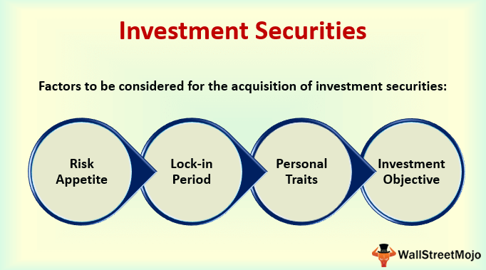

Investment securities play a crucial role in financial markets by providing mechanisms for capital growth and enabling businesses and governments to raise necessary funds. These securities serve as fundamental instruments for investors aiming to diversify their portfolios and achieve long-term financial objectives. By understanding how securities function and the variety of options available, investors can make informed decisions tailored to their risk tolerance and investment goals.

This article examines the nature and structure of investment securities, with an emphasis on how they operate within the broader financial ecosystem. It delineates the different types of securities, such as equities, debt instruments, and money market securities, and how they can be utilized to meet specific investment needs.



Emerging within this landscape is the field of algorithmic trading, a technological advancement that has transformed the execution of trades. Algorithmic trading utilizes computer algorithms to automatically execute trades, offering efficiencies in speed and precision but posing new challenges as well, such as the potential for market instability due to technology failures or systemic risks. This innovative form of trading opens new avenues for generating returns while necessitating careful consideration of the risks involved.

By examining these themes, the article aims to blend theoretical concepts with practical insights, guiding investors through the intricacies of these critical areas in modern finance. Whether you are a novice or a seasoned investor, understanding the evolving dynamics of investment securities and algorithmic trading is essential for navigating today's complex financial markets.

## Table of Contents

## What Are Investment Securities?

Investment securities are financial instruments acquired with the purpose of holding them for investment rather than immediate resale. These instruments are integral to capital markets, functioning as vehicles through which individuals, institutions, and governments can either pursue capital growth or maintain liquidity while generating potential returns. The main rationale for purchasing these securities is often tied to long-term investment strategies rather than short-term speculation. 

These securities differ from those bought for trading by their intended holding period and the expectation of accruing capital gains and income over time, as opposed to seeking profit through quick turnover. Investment securities typically categorize into equities, debt securities, and a variety of financial derivatives, each providing distinct risk and return profiles.

Investment securities are subject to comprehensive regulatory frameworks. Regulations are crucial in maintaining market integrity, protecting investors, and ensuring transparency. For example, in the United States, the Securities and Exchange Commission (SEC) oversees and enforces the compliance of these securities with the established financial laws and guidelines.

Furthermore, investment securities are commonly utilized as collateral in various financial transactions, thereby providing [liquidity](/wiki/liquidity-risk-premium). For instance, banks often hold U.S. Treasury securities as a reserve because these are considered highly liquid and secure. The liquidity characteristic of investment securities implies their ease of conversion to cash without significant loss of value, which proves essential during times of economic uncertainty.

Financial portfolios often incorporate a mix of investment securities, optimizing the balance between risk and return. Equities are known for their potential for appreciation and dividend income, yet they bear higher risk compared to fixed-income instruments like bonds, which offer more stable returns albeit typically lower in potential growth. A well-diversified portfolio mitigates risks inherent in financial markets and enhances the possibility of achieving targeted financial objectives.

In essence, investment securities form the backbone of investment portfolios, offering diverse opportunities for income generation and wealth accumulation. Their structured nature and regulatory backing provide investors both a safeguard and a means to engage prudently and strategically in financial markets.

## Understanding How Securities Work

Securities are financial instruments that serve as tradable assets, facilitating the exchange of ownership stakes or debt obligations between investors. They play a vital role in the investment landscape for both individual and institutional entities, allowing them to participate in and benefit from capital markets. By acquiring these assets, investors can strategically allocate their resources with an aim toward long-term financial goals.

At their core, securities provide a framework that supports investment initiatives by offering a combination of income and capital growth potential. Income is often generated through dividends, in the case of equity securities, or interest, in the case of debt securities such as bonds. These income streams present opportunities for investors to enhance their portfolios while maintaining a focus on sustainable growth.

Trading in securities occurs across various financial markets, both primary and secondary. Primary markets involve the issuance of new securities, enabling issuers, typically corporations or governments, to raise capital. In contrast, secondary markets facilitate the buy-and-sell transactions of existing securities, providing liquidity to the market. This liquidity is crucial as it ensures that investors can readily convert their securities into cash, often at market prices, thereby reducing the risk associated with holding these financial instruments.

The value and performance of securities can be significantly influenced by a broad spectrum of factors, including prevailing economic conditions, market sentiment, and fiscal policies. Economic indicators such as GDP growth rates, inflation, and employment data can impact investor confidence and, consequently, the demand and pricing of securities. Market sentiment, often shaped by investor psychology and expectations, can lead to fluctuations in the pricing of securities, reflecting the collective attitude of market participants towards risk and opportunities.

Fiscal policies, including taxation and government spending, also have the potential to affect securities markets. These policies can alter disposable income levels or corporate profitability, thereby influencing investment decisions at both the macro and microeconomic levels. Consequently, understanding these factors is vital for investors to make informed decisions and optimally manage their investment portfolios. 

In summary, securities are crucial financial tools that enable wealth creation and risk management across different market conditions. Their functionality as tradable assets provides investors with access to income and growth opportunities, while their valuation is subject to a myriad of external economic and policy influences.

## Types of Investment Securities

Investment securities are broadly categorized into three major types: equities, debt securities, and money market securities. Each type has distinct characteristics and investment purposes, tailored to different risk appetites and financial goals.

**Equities**

Equities, often referred to as stocks or shares, represent ownership stakes in a company. When investors purchase equities, they acquire a portion of the company, making them part-owners. This ownership entitles them to a share of the company's profits, usually distributed as dividends. The potential for capital appreciation is another significant benefit of equities; if the company performs well, the value of its shares may increase, allowing investors to sell them at a profit. The performance of equities is closely tied to the company's operational success and broader market conditions, thus presenting both growth opportunities and risks. Historically, equities have provided higher returns compared to other securities, but they also come with increased [volatility](/wiki/volatility-trading-strategies).

**Debt Securities**

Debt securities, such as bonds, involve lending money to an entity—either government or corporate—in exchange for periodic interest payments and the return of the principal amount at maturity. Bonds are generally considered to be less risky than equities because they offer fixed returns over a specified period. The regular interest payments, known as coupon payments, provide a steady income stream to investors. Additionally, bonds have a defined maturity date, at which point the principal is repaid. The risk associated with bonds varies depending on the issuer's creditworthiness; government bonds (especially U.S. Treasuries) are typically seen as safe, whereas corporate bonds [carry](/wiki/carry-trading) higher risks but offer potentially higher returns.

**Money Market Securities**

Money market securities are debt instruments that provide high liquidity and are used primarily for short-term investment needs. These instruments have maturities of one year or less and include products like commercial paper, treasury bills, and certificates of deposit. Money market securities are used by investors seeking a safe place to park cash temporarily, offering lower returns in exchange for lower risk and high liquidity. They are an essential component of the financial ecosystem, facilitating the efficient movement of funds between investors and borrowers.

Each type of investment security caters to different investor needs, balancing risk, return, and liquidity. Understanding these categories is crucial for constructing a diversified investment portfolio that aligns with one's financial objectives and risk tolerance.

 to Algorithmic Trading

Algorithmic trading, often referred to as algo trading, employs computer algorithms to execute trades in financial markets based on predetermined criteria. This method eliminates the need for human direction during trade execution, allowing for precise and rapid transactions. Algo trading leverages technological advancements to minimize the lag and human emotional bias that often accompany manual trading. By implementing rigorous algorithms, trading strategies are executed with a level of accuracy and speed unattainable through human effort alone.

These algorithms process market data and make trading decisions at lightning speed, facilitating functions such as order execution and price discovery. These systems can be programmed to follow predefined instructions such as timing, price, or quantity, making them ideal for capturing [arbitrage](/wiki/arbitrage) opportunities and improving liquidity in the markets.

In modern financial markets, [algorithmic trading](/wiki/algorithmic-trading) has become ubiquitous. It enables traders to handle massive volumes of trades simultaneously across different markets. A significant portion of trading volumes in equity markets, for instance, are now conducted through algorithmic methods. This transformation echoes the shift toward data-driven decision-making in finance, where algorithms are used to analyze financial patterns and execute trades far more efficiently and effectively than traditional methods. 

As an example, consider a simple algorithm that executes a buy order for a stock when its 50-day moving average crosses above the 200-day moving average, a common signal in technical analysis. Here is a basic Python implementation of this strategy using historical stock data:

```python
import pandas as pd

# Load historical stock data
data = pd.read_csv('historical_stock_data.csv')

# Calculate the moving averages
data['50_MA'] = data['Close'].rolling(window=50).mean()
data['200_MA'] = data['Close'].rolling(window=200).mean()

# Generate signals for when the 50-MA crosses above the 200-MA
data['Signal'] = 0  # No position initially
data['Signal'][50:] = np.where(data['50_MA'][50:] > data['200_MA'][50:], 1, 0)

# Execute trades based on the signals
for i in range(1, len(data)):
    if data['Signal'][i] > data['Signal'][i-1]:
        # Buy signal
        print(f"Buy order executed for date: {data['Date'][i]}")
    elif data['Signal'][i] < data['Signal'][i-1]:
        # Sell signal
        print(f"Sell order executed for date: {data['Date'][i]}")
```

This script illustrates a straightforward implementation of an algorithmic trading strategy based on moving average crossovers, capturing signals and executing trades autonomously. With the continuous evolution of financial markets, algorithmic trading remains at the forefront, driving significant advancements and reshaping how trading is conducted.

## How Algorithmic Trading Works

Algorithmic trading, often referred to as algo trading, employs sophisticated algorithms to automate and optimize trading decisions in financial markets. These algorithms are designed using intricate mathematical models that analyze a vast array of market data to identify potential trading opportunities.

### Strategies in Algorithmic Trading

1. **Trend-Following Strategies**: 
   - These strategies focus on identifying and capitalizing on market trends. They rely on technical indicators such as moving averages and breakouts to initiate trades that align with the current market direction. The logic behind trend-following is that markets exhibit momentum, and positioning trades in the direction of an established trend can yield profits.

   Example:
   ```python
   # Python code to implement a simple moving average crossover strategy
   def moving_average(prices, period):
       return sum(prices[-period:]) / period

   def moving_average_crossover(prices, short_period, long_period):
       short_ma = moving_average(prices, short_period)
       long_ma = moving_average(prices, long_period)
       return short_ma - long_ma

   prices = [10, 11, 12, 11, 13, 14, 15]  # Example price data
   signal = moving_average_crossover(prices, 3, 5)
   if signal > 0:
       print("Buy Signal")
   elif signal < 0:
       print("Sell Signal")
   ```

2. **Arbitrage Strategies**:
   - Arbitrage exploits price discrepancies of the same or similar financial instruments across different markets or in derivative forms. These strategies seek to buy low in one market and sell high in another, capitalizing on price differences that theoretically should not exist in an efficient market.

   Example:
   ```python
   # Hypothetical example: spotting arbitrage opportunities in price data
   exchange_a_price = 100.0
   exchange_b_price = 101.0

   if exchange_b_price > exchange_a_price + 0.5:  # Threshold for profit
       print("Arbitrage Opportunity: Sell at Exchange B, Buy at Exchange A")
   ```

3. **Statistical Models**: 
   - These models use complex statistical analyses to identify patterns and relationships in historical data that might not be evident to the naked eye. Techniques such as mean reversion, where prices tend to revert to a historical average, are commonly applied. Quantitative models are often employed to predict price movements based on statistical correlations.

   Formula: $\text{Mean Reversion Entry} = \text{Price} - (\text{Price} - \text{Mean Price} \times \text{Strength})$

### High-Frequency Trading (HFT)

High-frequency trading is a subset of algorithmic trading characterized by executing a large number of orders at extremely high speeds. HFTs often leverage colocation services near exchange servers to gain advantages in latency, trading on time scales measured in microseconds to milliseconds. [HFT](/wiki/high-frequency-trading-strategies) strategies typically focus on [earning](/wiki/earning-announcement) small profits on large volumes and depend on sophisticated technology infrastructure.

Overall, algorithmic trading strategies harness advanced computation to improve trading execution efficiency and maximize profits by exploiting small and fleeting market inefficiencies. However, the reliance on speed, data processing, and mathematical prowess necessitates a robust technological setup and in-depth market understanding.

## Pros and Cons of Algorithmic Trading

Algorithmic trading has become a fundamental component of modern financial markets, offering both advantages and challenges to traders and investors. This form of trading utilizes computer algorithms to automatically execute trades based on predetermined criteria, which can result in significant improvements in trading efficiency and effectiveness.

One of the primary advantages of algorithmic trading is the reduction in transaction costs. By automating the process, algorithms can execute trades at the most opportune moments, capitalizing on even minor price discrepancies that human traders might miss. This efficiency not only reduces the time required to execute trades but also minimizes bid-ask spreads and other costs associated with manual trading.

Another benefit is improved accuracy in trading decisions. Algorithms operate based on a set of algorithms and historical data, which helps eliminate human errors and emotional biases that can impact decision-making. This leads to more consistent and disciplined trading strategies, which can be particularly useful in volatile markets.

Algorithmic trading also enables the handling of large trading volumes across multiple markets simultaneously. This scalability allows traders to diversify their portfolios, execute orders in different geographical markets, and manage complex trading strategies that would be difficult to achieve manually.

However, algorithmic trading is not without its challenges. A significant reliance on technology means that any glitches or failures in software or hardware can have adverse effects on trading outcomes. Moreover, while algorithms can execute trades at high speeds, they are also susceptible to systemic risks if many traders are using similar strategies, which may lead to unexpected market behaviors.

The potential for market instability is another concern. Sudden market movements can be exacerbated by algorithms that react to the same market conditions in similar ways, leading to flash crashes or liquidity shortages.

Traders and investors need to thoroughly understand these advantages and challenges when considering algorithmic trading strategies. This understanding is crucial for mitigating risks and ensuring that algorithmic trading contributes positively to portfolio performance.

## The Future of Securities and Algorithmic Trading

The landscape of investment securities and algorithmic trading is undergoing significant transformation, driven by rapid technological advancements and evolving regulatory frameworks. As financial markets become increasingly automated, the role of algorithmic trading, or algo trading, is expected to expand, presenting both opportunities and challenges for investors and market participants.

Technological progress, particularly in [artificial intelligence](/wiki/ai-artificial-intelligence) (AI) and [machine learning](/wiki/machine-learning), is likely to enhance the sophistication of algorithmic trading systems. These technologies can process vast amounts of data quickly, identify patterns, and make decisions with greater precision and speed than traditional methods. For example, machine learning algorithms can dynamically adapt to market conditions, improving the accuracy of trading strategies over time.

Additionally, the proliferation of cloud computing and edge technology allows trading firms to deploy their algorithms closer to financial infrastructure, thereby reducing latency—a critical [factor](/wiki/factor-investing) in high-frequency trading. This technological evolution not only optimizes the execution of trades but also increases the liquidity and efficiency of financial markets.

However, the growth of algorithmic trading brings about systemic risks that necessitate careful oversight. The sheer [volume](/wiki/volume-trading-strategy) and speed at which trades are executed can amplify market volatility, potentially leading to events like the Flash Crash of 2010. Moreover, the widespread adoption of similar algorithms by multiple market participants can result in homogeneous trading strategies, further destabilizing markets during periods of stress.

Regulatory bodies worldwide are responding to these challenges by implementing rules designed to enhance transparency and reduce the potential for market manipulation. For instance, the European Union's Markets in Financial Instruments Directive II (MiFID II) imposes stringent requirements on firms engaged in algorithmic trading, including the obligation to test and monitor algorithms to mitigate risks.

Investors need to stay informed about both technological trends and regulatory changes to effectively navigate the evolving securities landscape. By understanding these developments, investors can better assess the risks and opportunities presented by algorithmic trading. Engaging in continuous learning and adapting investment strategies accordingly will be vital for capitalizing on advancements while safeguarding against potential threats to market stability.

Ultimately, the future of securities and algorithmic trading will be shaped by the interplay between innovation and regulation. As markets continue to evolve, striking a balance between leveraging technological advances and maintaining robust regulatory oversight will be key to ensuring that these sophisticated trading practices contribute to, rather than detract from, the resilience and integrity of financial markets.

## Conclusion

Investment securities and algorithmic trading are pivotal to modern financial markets, providing a framework for capital generation and efficient trade execution. The depth of knowledge concerning these two facets empowers investors to execute well-informed decisions and develop strategies tailored for achieving long-term financial goals. Investment securities are foundational in enabling liquidity and diversity within a portfolio, mitigating risks while maximizing potential returns through instruments like equities, bonds, and money markets.

As technology continuously evolves, so does the landscape of investment and trading. Algorithmic trading stands as a testament to technological advancement, streamlining trade processes and minimization of emotional interference. Its potential to enhance market efficiency by executing trades based on predefined criteria not only offers ample opportunities but also presents challenges that investors must navigate. The deployment of complex algorithms and high-frequency trading operations demands a keen understanding of both market dynamics and technological capabilities.

Market participants must recognize the importance of staying informed about innovations and regulatory adjustments affecting these components. Continuous learning becomes imperative to adapt to the rapidly changing economic landscapes and technological advancements that characterize today's financial markets.

Ultimately, investment success hinges on the ability to judiciously merge theoretical understanding with practical application. As such, embracing the evolving nature of securities and algorithmic trading allows investors to harness new possibilities, adeptly manage risks, and thrive in an increasingly dynamic investment environment.

## References & Further Reading

[1]: Bergstra, J., Bardenet, R., Bengio, Y., & Kégl, B. (2011). ["Algorithms for Hyper-Parameter Optimization."](https://dl.acm.org/doi/10.5555/2986459.2986743) Advances in Neural Information Processing Systems 24.

[2]: ["Advances in Financial Machine Learning"](https://www.amazon.com/Advances-Financial-Machine-Learning-Marcos/dp/1119482089) by Marcos Lopez de Prado

[3]: ["Evidence-Based Technical Analysis: Applying the Scientific Method and Statistical Inference to Trading Signals"](https://www.amazon.com/Evidence-Based-Technical-Analysis-Scientific-Statistical/dp/0470008741) by David Aronson

[4]: ["Machine Learning for Algorithmic Trading"](https://github.com/stefan-jansen/machine-learning-for-trading) by Stefan Jansen

[5]: ["Quantitative Trading: How to Build Your Own Algorithmic Trading Business"](https://www.amazon.com/Quantitative-Trading-Build-Algorithmic-Business/dp/1119800064) by Ernest P. Chan