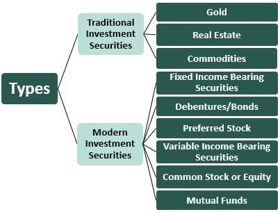

## Table of Contents

## What are investment securities?

Investment securities are financial instruments that people and organizations buy to earn money over time. These can include stocks, bonds, and mutual funds. When you buy a stock, you're buying a small piece of a company. If the company does well, the value of your stock might go up, and you could make money. Bonds are like loans you give to a company or government, and they pay you back with interest. Mutual funds are a mix of stocks and bonds managed by professionals.

People invest in securities to grow their money. They might want to save for retirement, buy a house, or just have more money in the future. The value of these securities can go up and down, which is called risk. Higher risk can mean higher rewards, but it can also mean losing money. That's why it's important to understand the securities you're buying and maybe talk to a financial advisor to make smart choices.

## What are the main types of investment securities?

The main types of investment securities are stocks, bonds, and mutual funds. Stocks are pieces of a company that you can buy. When you own a stock, you own a little bit of that company. If the company does well, the price of the stock can go up, and you can make money. But if the company does badly, the stock price can go down, and you might lose money. Bonds are like loans you give to a company or the government. They promise to pay you back with interest over time. Bonds are usually safer than stocks but don't grow as much.

Mutual funds are a mix of stocks and bonds. When you buy a mutual fund, you're buying a piece of a big pool of different investments. This helps spread out the risk because your money is not all in one place. A professional manages the mutual fund, deciding which stocks and bonds to buy and sell. This can be a good choice if you don't want to pick individual stocks and bonds yourself. Each type of security has its own risks and rewards, so it's important to think about what fits best with your goals and how much risk you're okay with taking.

## How do stocks function as investment securities?

Stocks are pieces of a company that you can buy. When you buy a stock, you become a part-owner of that company. If the company does well, the value of the stock can go up. This means you can sell the stock for more money than you paid for it, making a profit. Companies can also pay dividends, which are like little bonuses they give to shareholders from their profits. So, you can make money from stocks in two ways: by selling them for more than you paid or by getting dividends.

But stocks can also lose value. If the company doesn't do well, the stock price can go down. This means if you sell the stock, you might get less money than you paid for it, losing money. Because of this, stocks are considered riskier than some other types of investments. But they also have the potential for bigger rewards. That's why people often say that stocks are good for long-term investing, like saving for retirement, because over many years, the stock market tends to grow.

## What are bonds and how do they work as investment securities?

Bonds are like loans that you give to a company or the government. When you buy a bond, you're lending them money. They promise to pay you back the full amount you lent them, called the principal, on a specific date in the future. Until that date, they also pay you interest, which is like a thank you for lending them the money. This interest is usually paid to you every six months or once a year.

Bonds are often seen as safer than stocks because you know when you'll get your money back and how much interest you'll earn. But they can still have risks. If the company or government can't pay you back, you might lose your money. Also, if interest rates go up after you buy a bond, the value of your bond might go down if you want to sell it before it matures. Still, many people like bonds because they can provide a steady income and help balance out the riskier parts of their investment portfolio.

## What role do mutual funds play in investment securities?

Mutual funds are a way for people to invest in a mix of stocks, bonds, and other securities without having to pick each one themselves. When you buy into a mutual fund, you're buying a piece of a big pool of different investments. This helps spread out the risk because your money isn't all in one place. A professional manager runs the mutual fund, deciding which stocks and bonds to buy and sell. This can be a good choice if you don't want to pick individual stocks and bonds yourself.

Mutual funds can be a good fit for people who want to grow their money over time but don't want to spend a lot of time managing their investments. They come in different types, like those that focus on growth or those that aim to provide steady income. The value of a mutual fund can go up and down, just like individual stocks and bonds. But because they're diversified, they can be less risky than putting all your money into just one stock or bond. This makes mutual funds a popular choice for many investors looking to build a balanced investment portfolio.

## How can exchange-traded funds (ETFs) be used as investment securities?

Exchange-traded funds, or ETFs, are another way to invest in a mix of stocks, bonds, or other assets. They work a lot like mutual funds but with a key difference: you can buy and sell ETFs on a stock exchange, just like you would with individual stocks. This means you can trade them throughout the day at the current market price, which can be handy if you want to react quickly to changes in the market. ETFs often track an index, like the S&P 500, which means they try to match the performance of that index by holding the same stocks in the same proportions.

ETFs can be a good choice for people who want to diversify their investments without [picking](/wiki/asset-class-picking) each stock or bond themselves. Because they're traded like stocks, they can be more flexible than mutual funds. You can buy and sell them whenever the market is open, and they often have lower fees than mutual funds. This makes them attractive for investors looking to keep costs down while still getting a broad exposure to the market. Just like any investment, ETFs come with risks, but they can be a useful tool for building a balanced investment portfolio.

## What are derivatives and how are they used in investment?

Derivatives are financial instruments that get their value from something else, like a stock, bond, commodity, or even an index. They are called "derivatives" because their value is derived from the performance of these other assets. Common types of derivatives include futures, options, and swaps. For example, a futures contract is an agreement to buy or sell an asset at a future date for a price agreed upon today. This can be useful for someone who wants to lock in a price now to avoid future price changes.

People use derivatives for different reasons. Some use them to hedge, which means to protect against risks. For instance, a farmer might use futures contracts to lock in a price for their crops, protecting against price drops. Others use derivatives to speculate, hoping to make money from price changes. For example, someone might buy an option, which gives them the right, but not the obligation, to buy a stock at a set price, hoping the stock's price will go up. Derivatives can be complex and risky, so it's important for anyone using them to understand how they work and the risks involved.

## How do investment securities help in diversifying a portfolio?

Investment securities help in diversifying a portfolio by spreading your money across different types of investments. When you put your money in different places, like stocks, bonds, and mutual funds, you're not putting all your eggs in one basket. If one investment doesn't do well, the others might still be okay. This can help lower the risk of losing a lot of money all at once. For example, if you only have stocks and the stock market goes down, you could lose a lot. But if you also have bonds, which are usually safer, they might help balance out the losses from the stocks.

Diversification can also help you take advantage of different opportunities in the market. Different types of investments can grow at different times. When stocks are doing well, they might help your portfolio grow. When the stock market is down, bonds might help keep your portfolio stable. By having a mix of investment securities, you can aim for steady growth over time. It's like having a team where everyone has a different skill; together, they can help you reach your financial goals more smoothly.

## What are the risks associated with different types of investment securities?

Different types of investment securities come with their own risks. Stocks are generally riskier because their value can go up and down a lot. If the company you invest in does badly, the stock price can drop, and you might lose money. Stocks don't guarantee you'll get your money back, and there's always a chance you could lose everything you put in. Also, if the whole stock market goes down, like during a recession, all your stocks might lose value at the same time.

Bonds are usually seen as safer than stocks, but they still have risks. If the company or government you lend money to can't pay you back, you might not get your money. This is called default risk. Also, if interest rates go up after you buy a bond, the value of your bond might go down if you want to sell it before it matures. This is called [interest rate](/wiki/interest-rate-trading-strategies) risk. Bonds might not grow as much as stocks, so there's also the risk that your money won't grow as fast as you need it to.

Mutual funds and ETFs help spread out risk by holding a mix of different investments. But they still go up and down with the market. If the market does badly, your mutual fund or [ETF](/wiki/etf-trading-strategies) might lose value. Also, these funds have fees, which can eat into your returns over time. While they can be less risky than individual stocks, they still come with the risk of losing money if the market goes down.

## How does liquidity affect the choice of investment securities?

Liquidity is how easily you can turn an investment into cash without losing much money. When choosing investment securities, [liquidity](/wiki/liquidity-risk-premium) can be a big deal. Stocks and ETFs are usually very liquid because you can buy and sell them on the stock market during the day. This means if you need money quickly, you can sell your stocks or ETFs without waiting long. Mutual funds, on the other hand, are less liquid because you can only buy or sell them at the end of the trading day. If you need money right away, you might have to wait until the market closes.

Bonds can be less liquid than stocks, especially if they're not well-known or if they're from a smaller company. You might have to wait to find someone who wants to buy your bond, and you might not get as much money as you hoped. This can make bonds less appealing if you think you might need your money soon. When picking investment securities, think about how soon you might need your money back. If you need it quickly, go for more liquid options like stocks or ETFs. If you can wait, less liquid investments like bonds or mutual funds might be okay.

## What are the tax implications of investing in various securities?

When you invest in securities like stocks, bonds, and mutual funds, you need to think about taxes. If you make money from selling stocks or getting dividends, you'll have to pay taxes on that. The tax rate can be different depending on how long you held the stock. If you held it for more than a year, it's called a long-term capital gain, and the tax rate is usually lower. If you held it for less than a year, it's a short-term capital gain, and you'll pay your regular income tax rate on it. Dividends from stocks can also be taxed, but qualified dividends might get a lower tax rate.

Bonds have their own tax rules. The interest you get from bonds is usually taxed as regular income. But if you buy municipal bonds, the interest might be tax-free at the federal level, and sometimes at the state level too. This can make them a good choice if you're in a high tax bracket. Mutual funds and ETFs can be a bit more complicated because they hold lots of different investments. When you sell them, you'll pay capital gains tax on any profit. Plus, if the fund sells investments inside it and makes money, you might have to pay taxes on those gains even if you didn't sell your shares in the fund. It's a good idea to talk to a tax advisor to understand how these taxes will affect your investments.

## How do macroeconomic factors influence the performance of investment securities?

Macroeconomic factors like interest rates, inflation, and economic growth can really change how well investment securities do. When interest rates go up, it can make borrowing money more expensive for companies. This might slow down their growth and make their stocks go down. Also, when interest rates rise, bonds that were bought when rates were lower might lose value because new bonds will pay more interest. Inflation can also mess with investments. If prices are going up fast, the money you make from your investments might not be worth as much. But some investments, like stocks, can do better when there's a bit of inflation because companies can charge more for their stuff.

Economic growth is another big deal. When the economy is doing well, people have more money to spend, and companies can make more profit. This can make stocks go up. But if the economy slows down or goes into a recession, people might spend less, and companies might not do as well. This can make stocks and other investments lose value. Things like unemployment rates and government policies can also affect how the economy is doing, which in turn affects your investments. Keeping an eye on these big economic factors can help you make better choices about where to put your money.

## References & Further Reading

[1]: Bergstra, J., Bardenet, R., Bengio, Y., & Kégl, B. (2011). ["Algorithms for Hyper-Parameter Optimization."](https://dl.acm.org/doi/10.5555/2986459.2986743) Advances in Neural Information Processing Systems 24.

[2]: ["Advances in Financial Machine Learning"](https://www.amazon.com/Advances-Financial-Machine-Learning-Marcos/dp/1119482089) by Marcos Lopez de Prado

[3]: ["Evidence-Based Technical Analysis: Applying the Scientific Method and Statistical Inference to Trading Signals"](https://www.amazon.com/Evidence-Based-Technical-Analysis-Scientific-Statistical/dp/0470008741) by David Aronson

[4]: ["Machine Learning for Algorithmic Trading"](https://github.com/stefan-jansen/machine-learning-for-trading) by Stefan Jansen

[5]: ["Quantitative Trading: How to Build Your Own Algorithmic Trading Business"](https://www.amazon.com/Quantitative-Trading-Build-Algorithmic-Business/dp/1119800064) by Ernest P. Chan